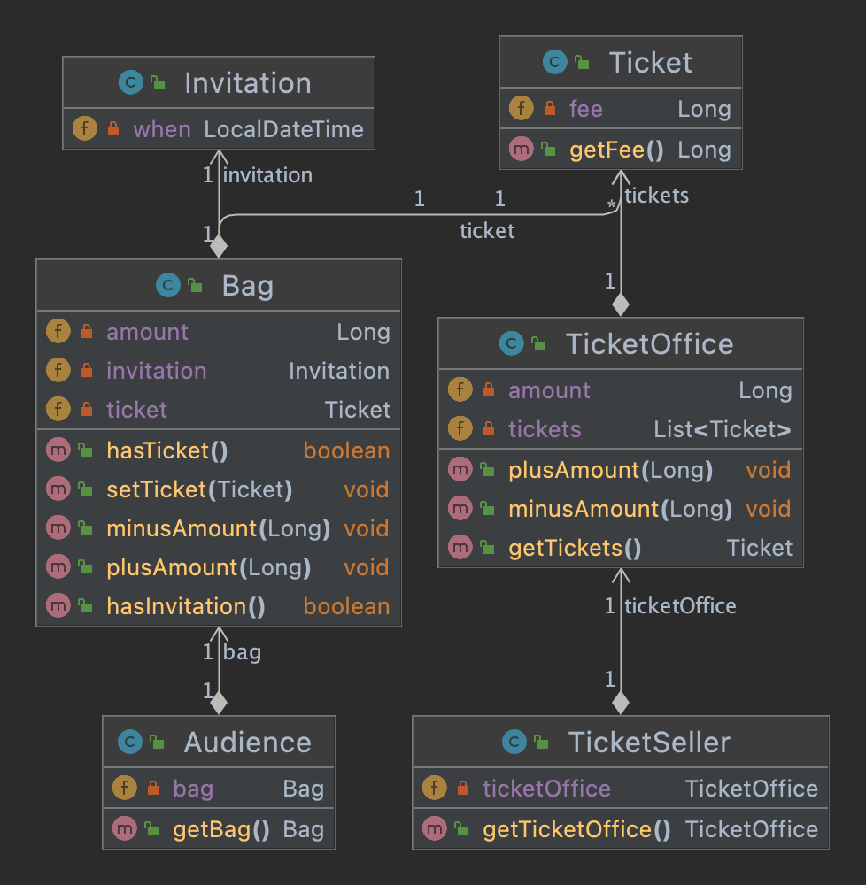

# CHAPTER 01. 객체, 설계

**TL;DR**

- 소프트웨어 모듈 목적은 '제대로된 실행 동작', '변경 용이성', '코드를 읽는 사람과의 의사소통' 이다.
- 객체는 자신의 데이터를 스스로 처리하는 자율적인 존재여야 한다.
- 객체는 캡슐화를 이용해 의존성을 적절히 관리하여 결합도를 낮추는 것이다.
- 설계는 여러 방법이 될 수 있는, 트레이드오프의 산물이다.
- 훌륭한 객체지향 설계는 모든 객체들이 자율적으로 행동하며, 내일의 변경을 매끄럽게 수용할 수 있는 설계이다.

### 이론 vs. 설계

**이론이 먼저일까, 실무가 먼저일까?**

- 소프트웨어 설계와 유지보수에 중점을 두려면 이론이 아닌 **실무**에 초점을 맞추는 것이 효과적
- 설계 분야에서는 이론(개념 및 용어 등)을 중심에 두는 것보다 실무, 즉 '코드'가 가장 유용
- 따라서, 본 책(Objects)은 실무를 우선 실행

## 01. 티켓 판매 애플리케이션 구현하기

#### Specification

<pre>
<b>📌 소극장 티켓 판매 애플리케이션</b>

고려사항:
- 추첨을 통해 일부 관람객에게 무료 관람권 증정
- 이벤트 당첨 관람객  : 무료 입장   
- 이벤트 미당첨 관람객 : 티켓 구매 필수 
</pre>

**이벤트 당첨자에게 발송되는 초대장:** 

[Invitation.java](./demo/src/com/gngsn/chapter1/v1/Invitation.java)

**공연을 관람하기 위한 티켓:**

[Ticket.java](./demo/src/com/gngsn/chapter1/v1/Ticket.java)

<small>이벤트 당첨자의 초대장은 티켓으로 교환된다.</small>

**관람객이 가지고 올 수 있는 소지품 - 초대장, 현금, 티켓:**

[Bag.java](./demo/src/com/gngsn/chapter1/v1/Bag.java)

**소지품을 보관하기 위한 관람객의 가방:**

[Audience.java](./demo/src/com/gngsn/chapter1/v1/Audience.java)

**관람객이 소극장에 입장하기 위한 매표소 - 티켓 교환 or 구매:**

[Audience.java](./demo/src/com/gngsn/chapter1/v1/TicketOffice.java)


**매표소에서 초대장을 티켓으로 교환 or 판매하는 판매원**

[TicketSeller.java](./demo/src/com/gngsn/chapter1/v1/TicketSeller.java)

Class Diagram:



**소극장**

[Theater.java](./demo/src/com/gngsn/chapter1/v1/Theater.java)


## 02. 무엇이 문제인가

<pre>
<b>소프트웨어 모듈의 세가지 목적</b>
첫 번째. 실행 중 제대로 동작
두 번째. 변경을 위해 존재: 간단한 작업만으로도 변경 가능해야 함 
세 번째. 코드를 읽는 사람과의 의사소통

- ≪클린 소프트웨어: 애자일 원칙과 패턴, 그리고 실천 방법≫
</pre> 

위의 코드(version1)은 동작은 제대로 하지만, 나머지 두 개 -변경 용이성, 코드를 읽는 사람과의 의사소통- 을 만족하지 못한다.


### 예상을 빗나가는 코드

**문제점1.** 예상과 빗나가는 코드

이해 가능한 코드: 우리가 예상하는 방식으로 동작하는 코드 
- 예상: 관람객이 초대장이나 돈을 지불하여 티켓을 얻음
- 코드: Theather의 enter method는 '소극장'이 관람객의 가방을 확인
- 예상과 다른 방식이기 때문에 코드를 읽는 사람이 제대로 의사소통하지 못함

```java
public void enter(Audience audience) {
    if (audience.getBag().hasInvitation()) {
        Ticket ticket = ticketSeller.getTicketOffice().getTickets();
        audience.getBag().setTicket(ticket);
    } else {
        Ticket ticket = ticketSeller.getTicketOffice().getTickets();
        audience.getBag().minusAmount(ticket.getFee());
        ticketSeller.getTicketOffice().plusAmount(ticket.getFee());
        audience.getBag().setTicket(ticket);
    }
}
```

**문제점 2.** Theater의 enter 코드를 이해하기 위해서는, 여러 세부 사항을 한꺼번에 기억해야 함

Theater의 enter를 이해하기 위해 알아야 하는 사실

- audience가 bag을 가지고 있음
- audience의 bag에는 현금과 티켓이 있음
- ticketSeller가 ticketOffice에서 일을 함
- ticketOffice에는 돈과 티켓이 보관되어 있음


### 변경에 취약한 코드

**문제점 3.** 변경에 취약한 코드

- Audience와 TicketSeller를 변경할 경우 Theater도 함께 변경해야 한다는 사실
- 수많은 발생 가능한 변경 사항
  - 고객이 현금말고 카드를 사용하면? 판매원이 판매소 밖에서 티켓을 판매한다면?

=> Dependency, 객체의 의존성 문제

**📌 의존성**

- 의존성은 변경과 관련돼 있고, 변경에 대한 영향을 암시
- "의존성"은 어떤 객체가 변경될 때 그 객체에게 의존하는 다른 객체도 함께 변경될 수 있다는 사실이 내포됨
- 객체 사이의 의존성을 완전히 없애는 것만이 정답은 아님
- 객체 지향 설계는 서로 의존하면서 협력하는 객체들의 공동체를 구축하는 것

**📌 결합도**

- 객체 사이의 의존성이 강한 경우: 결합도가 높다.
- 객체들이 합리적인 수준으로 의존할 경우: 결합도가 낮다.
- 결합도가 높을수록 서로 변경 시 영향도가 크기 때문에 변경이 어려움  

**✔️ 목표: 애플리케이션의 기능을 구현하는 데 필요한 최소한의 의존성만 유지하고 불필요한 의존성 제거 => 결합도를 낮춰 변경이 용이한 설계를 만드는 것**


## 03. 설계 개선하기

**개선 사항**: 관람객과 판매원을 자율적인 존재로 만들자
- Theater가 원하는 것은 관람객이 소극장에 입장하는 것뿐
- Audience와 TicketSeller의 내부를 알지 못하게 차단

### 개선 1. TicketSeller 캡슐화


### 캡슐화

<pre>
<b> 📌 캡슐화(encapsulation)</b>
물리적으로 객체 내부의 세부적인 사항을 감추는 것

목적: 변경하기 쉬운 객체를 만드는 것
효과: 캡슐화로 접근 제한 시, 객체 사이의 결합도를 낮춰 설계 변경이 용이
</pre>


**Theater**

```java
public class Theater {
    // ...
    public void enter(Audience audience) {
        ticketSeller.sellTo(audience);
    }
}
```
**TicketSeller**
```java
public class TicketSeller {
    //... 

    // ✔️ 외부에서 알 필요 없음 - 접근 차단
    // public TicketOffice getTicketOffice() {
    //     return ticketOffice;
    // }
  
    public void sellTo(Audience audience) {
        if (audience.getBag().hasInvitation()) {
            Ticket ticket = ticketOffice.getTickets();
            audience.getBag().setTicket(ticket);
        } else {
            Ticket ticket = ticketOffice.getTickets();
            audience.getBag().minusAmount(ticket.getFee());
            ticketOffice.plusAmount(ticket.getFee());
            audience.getBag().setTicket(ticket);
        }
    }
}
```

- Theater는 TicketSeller의 Interface에만 의존
  - Theater는 ticketOffice가 TicketSeller 내부에 존재함을 모름
  - TicketSeller 내부에 ticketOffice 존재 -> Implementation(구현) 영역


### 개선 2. Audience 캡슐화

TicketSellerㅇ는 Audience의 getBag() 호출해 Bag에 접근 -> 높은 결합도

**Audience**

```java 
public class Audience {
    // ...
    
    // ✔️ 외부에서 알 필요 없음 - 접근 차단
    // public Bag getBag() {
    //     return bag;
    // } 

    public Long buy(Ticket ticket) {
        if (bag.hasInvitation()) {
            bag.setTicket(ticket);
            return 0L;
        } else {
            bag.setTicket(ticket);
            bag.minusAmount(ticket.getFee());
            return ticket.getFee();
        }
    }
}
```

**TicketSeller**

```java 
public class TicketSeller {
    // ...
    public void sellTo(Audience audience) {
        ticketOffice.plusAmount(audience.buy(ticketOffice.getTickets()));
    }
}
```

**개선 사항** 
: 자신의 문제를 스스로 해결하도록 만듦
 
- Theater는 Audience나 TicketSeller의 내부에 직접하지 않음
- Audience는 Bag 내부의 내용물을 직접 확인하지 않음


### 절차 지향과 객체 지향

**✔️ 캡슐화와 응집도**

> 객체는 자신의 데이터를 스스로 처리하는 자율적인 존재여야 함
- 캡슐화로 객체 간에 오직 메시지를 통해서만 상호작용
- 밀접하게 연관된 작업만을 수행하고 연관성 없는 작업은 다른 객체에게 위임 -> 높은 응집도

**✔️ 객체지향 프로그래밍(Object-Oriented Programming)**
- 데이터와 프로세스가 동일한 모듈 내부에 위치하도록 프로그래밍하는 방식 

**✔️ The Key of 객체지향 설계**
- 캡슐화를 이용해 의존성을 적절히 관리하여 결합도를 낮추는 것
- 책임의 이동(shift of responsibility): 각 객체가 자신이 맡은 일을 스스로 처리하도록 책임이 개별 객체로 이동 


### 더 개선할 수 있다 (v3)


**1/ Audience 클래스 내의 Bag의 응집도 높은 자율 객체로 변경**

```java

public class Bag { 
  // ...
  public Long hold(Ticket ticket) {
    if (hasInvitation()) {
      setTicket(ticket);
      return 0L;
    } else {
      setTicket(ticket);
      minusAmount(ticket.getFee());
      return ticket.getFee();
    }
  }
  
  // change to private
  private boolean hasInvitation() {
    return invitation != null;
  }

  // change to private
  private void setTicket(Ticket ticket) {
    this.ticket = ticket;
  }

  // change to private
  private void minusAmount(Long amount) {
    this.amount -= amount;
  }
}

```

```java
public class Audience {
    //...
    public Long buy(Ticket ticket) {
        return bag.hold(ticket);
    }
}
```

**2/ TicketOffice를 자율 객체로 변경**

```java
public class TicketOffice { 
  // ...
  public void sellTicketTo(Audience audience) {
    plusAmount(audience.buy(getTickets()));
  }
  // change to private
  private void plusAmount(Long amount) {
    this.amount += amount;
  }
}
```

```java
public class TicketSeller {
    // ...
    public void sellTo(Audience audience) {
        ticketOffice.sellTicketTo(audience);
    }
}
```

하지만, TicketOffice와 Audience의 의존성이 추가됨

**두 가지 사실** 
1. 어떤 기능 설계 방법은 한 가지 이상일 수 있다.
2. 동일한 기능을 한 가지 이상의 방법으로 설계할 수 있기 때문에 결국 **설계는 트레이드오프의 산물**이다.


> 설계는 균형의 예술이다.

의인화(anthropomorphism)
: 현실에서 수동적인 존재가 객체지향 세계에서는 **능동적이고 자율적인 존재**로 다루는 소프트웨어 객체 설계 원칙

> 의인화의 관점에서 소프트웨어를 생물로 생각하자. 모든 생물처럼 소프트웨어는 태어나고, 삶을 영위하고, 그리고 죽는다[Wirfs-Brock90].


훌륭한 객체지향 설계: 소프트웨어를 구성하는 모든 객체들이 자율적으로 행동하는 설계


## 04. 객체지향 설계

좋은 설계란 무엇인가? 

- 요구하는 기능을 구현하는 코드를 짜는 동시에, **내일 쉽게 변경할 수 있는 코드**를 짜야 한다. 
- 오늘 요구하는 기능을 온전히 수행하면서 **내일의 변경을 매끄럽게 수용할 수 있는 설계**다.

즉, 변경에 유연하게 대응할 수 있는 코드

