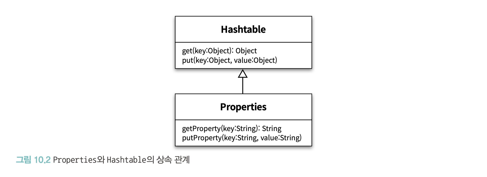
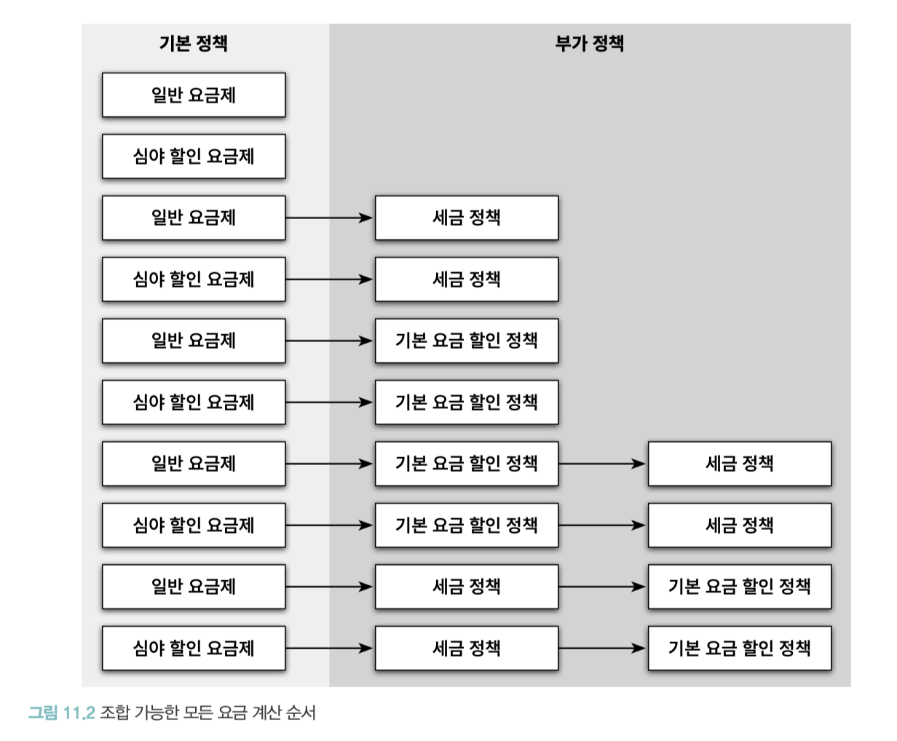
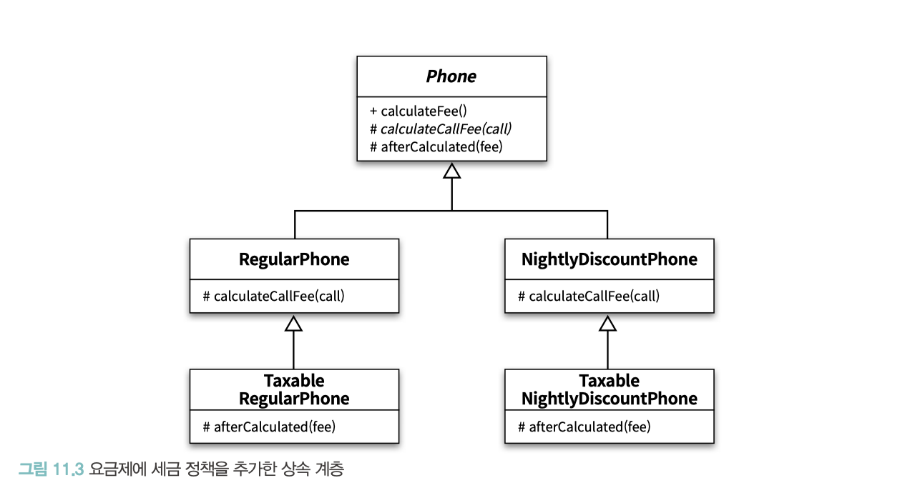
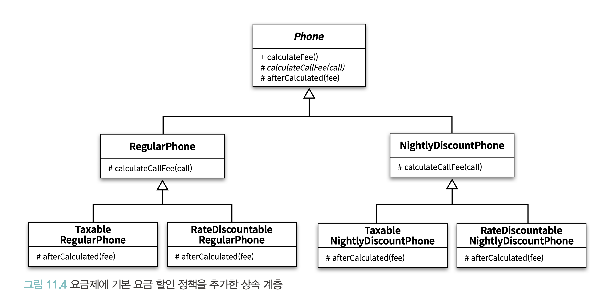
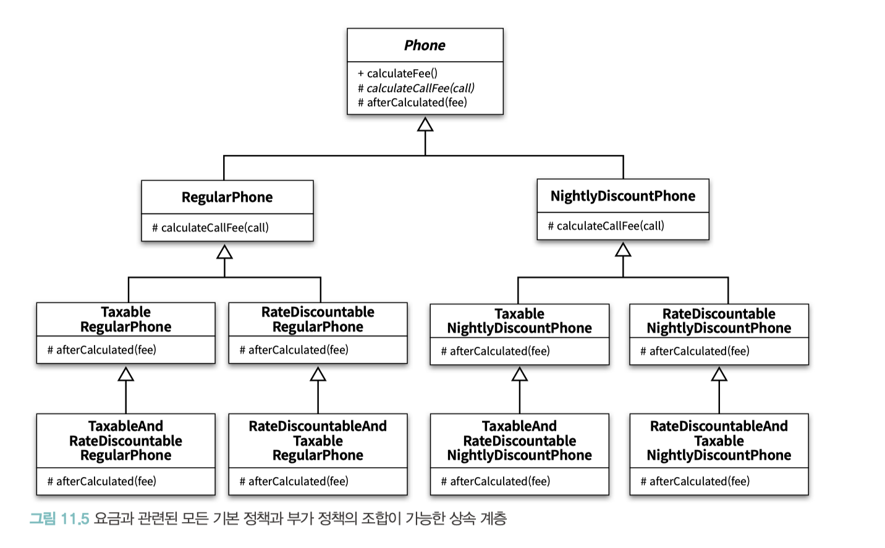
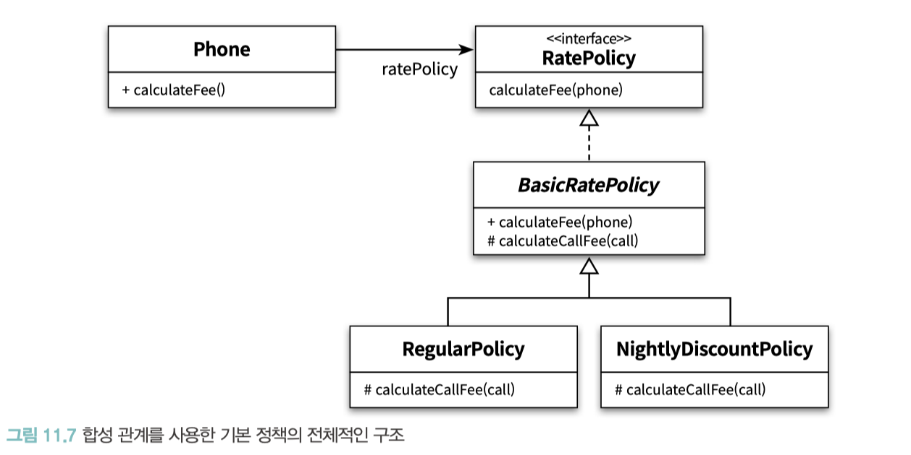

# CHAPTER 11. 합성과 유연한 설계

**TL;DR**

- **상속**: is-a 관계. 부모 클래스와 자식 클래스 사이의 의존성이 **컴파일타임**에 해결
- **합성**: has-a 관계. 부모 클래스와 자식 클래스 사이의 의존성이 **런타임**에 해결
- **상속의 단점**: ① 불필요한 인터페이스 상속 ② 메서드 오버라이딩의 오작용 ③ 부모 클래스와 자식 클래스의 동시 수정 필요
- **'상속 → 합성'** 변경 방법: 자식 클래스에 선언된 상속 관계를 제거, 부모 클래스의 인스턴스를 자식 클래스의 인스턴스 변수로 선언
- **포워딩 메서드 (forwarding method)**: 동일한 메서드를 호출하기 위해 추가된 메서드
- **몽키 패치(Monkey Patch)**: 현재 실행 중인 환경에만 영향을 미치도록 지역적으로 코드를 수정하거나 확장하는 것
- **훅 메서드(hook method)**: 추상 메서드와 동일하게 자식 클래스에서 오버라이딩할 의도로 메서드를 추가했지만 편의를 위해 기본 구현을 제공하는 메서드
- **클래스 폭발(class explosion)**: 상속의 남용으로 하나의 기능을 추가하기 위해 필요 이상으로 많은 수의 클래스를 추가 해야 하는 경우


<br/>

##  

상속에서 부모 클래스와 자식 클래스 사이의 의존성은 컴파일타임에 해결되지만, 합성에서 두 객체 사이의 의존성은 런타임에 해결 됨

### 상속

- 자식 클래스의 정의에 부모 클래스의 이름을 붙여 부모 클래스의 코드 재사용 (코드 추가 혹은 재정의로 쉽게 확장 가능)
- 자식 클래스와 부모 클래스 사이의 결합도가 높아질 수밖에 없음: 부모 클래스의 내부 구현을 상세히 알아야 하기 때문
- 결과적으로 재사용엔 용이하지만 우아한 방법은 아님

### 합성

- 구현에 의존하지 않음
- 내부에 포함되는 객체의 구현이 아닌 퍼블릭 인터페이스에 의존

| 상속                                               | 합성                                                                |
|--------------------------------------------------|-------------------------------------------------------------------|
| is-a 관계                                          | has-a 관계                                                            |
| 클래스 사이의 정적인 관계 <br/>코드 작성 시점에 결정한 상속 관계는 변경이 불가능 | 객체 사이의 동적인 관계 <br/>실행 시점에 동적으로 변경할 수 있음                           |
| 클래스 안에 구현된 코드 자체를 재사용                            | 포함되는 객체의 퍼블릭 인터페이스를 재사용  → 클래스 사이의 높은 결합도를 객체 사이의 낮은 결합도로 대체할 수 있음 |

<br/>

## 01. 상속을 합성으로 변경하기

**상속의 3가지 단점**

1. 불필요한 인터페이스 상속 문제
2. 메서드 오버라이딩의 오작용 문제
3. 부모 클래스와 자식 클래스의 동시 수정 문제

<br/>

**'상속 → 합성' 변경 방법**

- 자식 클래스에 선언된 상속 관계를 제거, 부모 클래스의 인스턴스를 자식 클래스의 인스턴스 변수로 선언

<br/>

### 불필요한 인터페이스 상속 문제: java.util.Properties와 java.util.Stack

<table>
<tr><th>상속 (10장)</th><th>상속 → 합성</th></tr>
<tr>
<td>



```java
Properties properties=new Properties();
        properties.setProperty("Bjarne Stroustrup","C++");
        properties.setProperty("James Gosling","Java");
        properties.put("Dennis Ritchie",67);

        assertEquals("C",properties.getProperty("Dennis Ritchie")); // 에러!
```

- HashTable의 `put()` method로 인터페이스 혼란

</td><td>

```java
public class Properties {
    private Hashtable<String, String> properties = new Hashtable<>();

    public String setProperty(String key, String value) {
        return properties.put(key, value);
    }

    public String getProperty(String key) {
        return properties.get(key);
    }

}
```

- 더 이상 불필요한 Hashtable 오퍼레이션들이 Properties 클래스의 퍼블릭 인터페이스를 오염시키지 않음
- 오직 Properties 에서 정의한 오퍼레이션만 사용

</td>
</tr>
<tr><td> <b>상속</b>: 내부 구현에 밀접하게 결합</td><td> <b>합성</b>: 변경한 Properties 는 Hashtable 의 내부 구현에 관해 알지 못함</td></tr>
</table>

<br/>

### 메서드 오버라이딩의 오작용 문제: InstrumentedHashSet

HashSet이 제공하는 퍼블릭 인터페이스를 그대로 제공

```java
public class InstrumentedHashSet<E> {
    private int addCount = 0;
    private Set<E> set;

    public InstrumentedHashSet(Set<E> set) {
        this.set = set;
    }

    public boolean add(E e) {
        addCount++;
        return set.add(e);
    }

    public boolean addAll(Collection<? extends E> c) {
        addCount += c.size();
        return set.addAll(c);
    }

    public int getAddCount() {
        return addCount;
    }
}
```

HashSet에 대한 구현 결합도는 제거하면서도 퍼블릭 인터페이스는 그대로 상속받을 수 있는 방법

**포워딩(forwarding)**

- 동일한 메서드를 호출하기 위해 추가된 메서드를 포워딩 메서드 (forwarding method)
- 포워딩은 기존 클래스의 인터페이스를 그대로 외부에 제공하면서 구현에 대한 결합 없이 일부 작동 방식을 변경하고 싶은 경우에 사용
- `InstrumentedHashSet`가 `Set` 의 오퍼레이션을 오버라이딩한 인스턴스 메서드에서 내부의 HashSet 인스턴스에게 동일한 메서드 호출을 그대로 전달

### 부모 클래스와 자식 클래스의 동시 수정 문제: PersonalPlaylist

```java
public class PersonalPlaylist {
    private Playlist playlist = new Playlist();

    public void append(Song song) {
        playlist.append(song);
    }

    public void remove(Song song) {
        playlist.getTracks().remove(song);
        playlist.getSingers().remove(song.getSinger());
    }
}
```
<pre>
<h3>몽키 패치(Monkey Patch)</h3>
현재 실행 중인 환경에만 영향을 미치도록 지역적으로 코드를 수정하거나 확장하는 것.


<b>루비의 열린 클래스(Open Class)</b>
동적 타입 언어로, 이미 완성된 클래스에도 기능을 추가 가능.

<b>C#의 확장 메서드(Extension Method)</b>
스칼라의 암시적 변환(implicit conversion) 

<b>자바</b>
언어 차원에서 몽키 패치를 지원하지 않음. 
바이트코드를 직접 변환하거나 AOP(Aspect-Oriented Programming)를 이용해 구현하고 있음.
</pre>

<br/><br/>

## 02. 상속으로 인한 조합의 폭발적인 증가

### 기본 정책과 부가 정책 조합하기

**Hand-On: 핸드폰 과금 시스템에 새로운 요구사항을 추가**

- 현재 시스템
  - 기본 정책: 통화 정보를 기반으로, 가입자의 한달 통화량을 기준으로 부과할 요금을 계산
  - '일반 요금제, 심야 할인 요금제'는 **기본 정책**
- **요구사항**
  - 두 요금제에 부가 정책을 추가
  - **부가 정책**: 통화량과 무관. 기본 정책에 선택적으로 추가할 수 있는 요금 방식
    1. 세금 정책: 세금을 부과하는 정책
    2. 기본 요금 할인 정책: 최종 계산된 요금에서 일정 금액을 할인
  - **조건**
    - 기본 정책의 계산 결과에 적용
    - 선택적으로 적용 가능
    - 조합 가능: 기본 정책 + ① 세금 정책 / ② 기본 요금 할인 정책 / ③ 세금 정책 + 기본 요금 할인 정책 
    - 부가 정책은 임의의 순서로 적용 가능

**기본 정책과 부가 정책의 조합 가능한 수가 매우 많아 다양한 조합을 수용할 수 있도 록 유연해야 함**




<br/>

### 상속을 이용해서 기본 정책 구현하기

### 기본 정책에 세금 정책 조합하기

- 자신이 정의한 추상 메서드를 호출하고 자식 클래스가 이 메서드를 오버라이딩해서 부모 클래스가 원하는 로직을 제공하도록 수정

**super 호출보다 결합도를 낮추는 방식 → 부모 클래스에 추상 메서드를 제공**
- 자식 클래스에게 전체 요금을 계산한 후에 수행할 로직을 추가할 수 있는 기회를 제공
  - `protected abstract Money afterCalculated(Money fee);`


**문제점**
- 모든 추상 메서드의 구현이 동일
- 부모 클래스에 추상 메서드를 추가하면 모든 자식 클래스들이 추상 메서드를 오버라이딩해야 하는 문제가 발생


**훅 메서드(hook method)**: 추상 메서드와 동일하게 자식 클래스에서 오버라이딩할 의도로 메서드를 추가했지만 편의를 위해 기본 구현을 제공하는 메서드



- **문제점**: TaxableRegularPhone 사이에 코드 중복

<br/>

### 기본 정책에 기본 요금 할인 정책 조합하기

- 일반 요금제와 기본 요금 할인 정책을 조합하고 싶다면 RegularPhone 을 상속받는 RateDiscountableRegularPhone 클래스를 추가



- **문제점**: 이번에도 중복 코드를 추가

<br/>

### 중복 코드의 덫에 걸리다

일반 요금제의 계산 결과에 세금 정책을 조합한 후 기본 요금 할인 정책 추가



**문제점**
- 복잡성
- 새로운 정책을 추가하기가 어려움

<br/>

#### 클래스 폭발(class explosion)
:: 상속의 남용으로 하나의 기능을 추가하기 위해 필요 이상으로 많은 수의 클래스를 추가 해야 하는 경우 
= 조합의 폭발 (combinational explosion) 문제

<br/>

## 03. 합성 관계로 변경하기

#### 합성
- 컴파일타임 관계를 런타임 관계로 변경
- 합성 관계는 런타임에 동적으로 변경할 수 있음
- 컴파일타임 의존성과 런타임 의존성의 거리가 멀면 멀수록 설계의 복잡도가 상승하기 때문에 코드를 이해하기 어려워지는 것 역시 사실
- 하지만, 설계는 변경과 유지보수를 위해 존재

### 기본 정책 합성하기

기본 정책과 부가 정책을 포괄하는 RatePolicy 인터페이스 추가

_v2 코드 작성_




```java
Phone phone = new Phone(new RegularPolicy(Money.wons(10), Duration.ofSeconds(10)));
```

```java
Phone phone = new Phone(new NightlyDiscountPolicy(Money.wons(5),
                    Money.wons(10), Duration.ofSeconds(10)));
```

<br/>

### 부가 정책 적용하기

- 부가 정책은 기본 정책에 대한 계산이 끝난 후에 적용

**두 가지 제약에 따라 부가 정책을 구현**

- 부가 정책은 기본 정책이나 다른 부가 정책의 인스턴스를 참조할 수 있어야 함 (부가 정책의 인스턴스는 어떤 종류의 정책과도 합성될 수 있어야 함)
- Phone의 입장에서는 자신이 기본 정책의 인스턴스에게 메시지를 전송하고 있는지, 부가 정책의 인스턴스에게 메시지를 전송하고 있는지를 몰라야 한다. 
  - 기본 정책과 부가 정책은 협력 안에서 동일한 ‘역할’을 수행해야 함.
  - 이것은 부가 정책이 기본 정책과 동일한 RatePolicy 인터페이스를 구현해야 한다는 것을 의미


_v2/ratepolicy code 추가_


### 기본 정책과 부가 정책 합성하기

```java
// 일반 요금제 + 세금 정책
Phone phone = new Phone(
        new TaxablePolicy(0.05, new RegularPolicy(Money.wons(10), Duration.ofSeconds(5))));

// ( 일반 요금제 + 기본 요금 할인 정책 ) + 세금 정책
        Phone phone2 = new Phone(
        new TaxablePolicy(0.05, new RateDiscountablePolicy(Money.wons(1000),
        new RegularPolicy(Money.wons(10), Duration.ofSeconds(5)))));


// 일반 요금제 + 기본 요금 할인 정책 + 세금 정책, 세금 정책과 기본 요금 할인 정책이 적용되는 순서 변경
        Phone phone3 = new Phone(
        new RateDiscountablePolicy(Money.wons(1000),
        new TaxablePolicy(0.05, new RegularPolicy(Money.wons(10), Duration.ofSeconds(5)))));

// 심야 할인 요금제
        Phone phone4 = new Phone(
        new RateDiscountablePolicy(Money.wons(1000),
        new TaxablePolicy(0.05,
        new NightlyDiscountPolicy(Money.wons(15), Money.wons(10), Duration.ofSeconds(5)))));
```

👉🏻 객체를 조합하고 사용하는 방식이 상속을 사용한 방식보다 더 예측 가능하고 일관성이 있음

<br/>

### 새로운 정책 추가하기

- 오직 하나의 클래스만 추가하고 런타임에 필요한 정책들을 조합해서 원하는 기능을 얻을 수 있음
- 요구사항을 변경할 때 오직 하나의 클래스만 수정해도 된다는 것

- v1 code: 세금 정책을 다루는 코드가 상속 계층 여기저기에 중복돼 있기 때문에, 세금 정책을 변경하기 위해서는 한번에 여러 클래스를 수정해야 함 
- v2 code: 오직 TaxablePolicy 클래스 하나만 변경하면 됨 → **단일 책임 원칙을 준수하고 있는 것**

<br/>

### 객체 합성이 클래스 상속보다 더 좋은 방법이다

- 상속은 부모 클래스의 세부적인 구현에 자식 클래스를 강하게 결합 시키기 때문에 코드의 진화를 방해함
- 코드를 재사용하면서도 건전한 결합도를 유지할 수 있는 더 좋은 방법은 합성을 이용하는 것
- 상속이 구현을 재사용하는 데 비해 합성은 객체의 인터페이스를 재사용

<br/>

## 04. 믹스인

- 상속과 클래스를 기반으로 하는 재사용 방법 → 변경하기 어려운 코드 (클래스의 확장과 수정을 일관성 있게 표현할 수 있는 추상화의 부족)
- 코드를 재사용하면서도 낮은 결합도를 유지할 수 있는 유일한 방법 → 재사용에 적합한 추상화를 도입

<br/>

믹스인(mixin)
: 객체를 생성할 때 코드 일부를 클래스 안에 섞어 넣어 재사용하는 기법

- 합성: 실행 시점에 객체를 조합하는 재사용 방법
- 믹스인: 컴파일 시점에 필요한 코드 조각을 조합하는 재사용 방법, 코드를 다른 코드 안에 유연하게 섞어 넣을 수 있다면 믹스인

<br/>

### 기본 정책 구현하기


```scala
abstract class BasicRatePolicy {
    def calculateFee(phone: Phone): Money =
        phone.calls.map(calculateCallFee(_)).reduce(_ + _)
    protected def calculateCallFee(call: Call): Money;
}
```

```scala
class RegularPolicy(val amount: Money, val seconds: Duration) extends BasicRatePolicy {
    override protected def calculateCallFee(call: Call): Money =
        amount * (call.duration.getSeconds / seconds.getSeconds)
}
```

```scala
class NightlyDiscountPolicy(
    val nightlyAmount: Money,
    val regularAmount: Money,
    val seconds: Duration) extends BasicRatePolicy {
    
    override protected def calculateCallFee(call: Call): Money =
        if (call.from.getHour >= NightltDiscountPolicy.LateNightHour) {
        nightlyAmount * (call.duration.getSeconds / seconds.getSeconds)
    } else {
        regularAmount * (call.duration.getSeconds / seconds.getSeconds)
    }
}

object NightltDiscountPolicy {
    val LateNightHour: Integer = 22
}
```

<br/>

### 트레이트로 부가 정책 구현하기

트레이트 조합( trait composition )
: 믹스인하려는 대상 클래스의 부모 클래스가 존재하는 경우, **부모 클래스**는 extends를 이용해 상속받고 **트레이트**는 with 를 이용해 믹스인해야 함

- 클래스 폭발 문제의 단점은 클래스가 늘어난다는 것이 아니라 클래스가 늘어날수록 **중복 코드도 함께 기하급수적으로 늘어난다**는 점
- → 믹스인에는 이런 문제가 발생하지 않음
- 믹스인을 추상 서브클래스( abstract subclass )라고 부르기도 함

> **쌓을 수 있는 변경 (stackable modification)**
> 
> 믹스인을 사용하면 특정한 클래스에 대한 변경 또는 확장을 독립적으로 구현한 후 필요한 시점에 차례 대로 추가할 수 있음.
> 
> - super 호출을 정적으로 바인딩하지만, 트레이트에서는 동적으로 바인딩
> - 호출할 메서드의 구현은 트레이트를 클래스 구현에 믹스인할 때마다 (클래스에 따라) 새로 정해짐
> 
> → 트레이트를 이용해 변경 위에 변경을 쌓아 올리는 쌓을 수 있는 변경이 가능해짐
> 
> _- 마틴 오더스키(Martin Odersky)_


<br/>

---

<br/>

### Mixin vs. AOP

Mixin & AOP(Aspect-Oriented Programming)
: 모두 코드 모듈성과 재사용성을 향상시키는 것을 목표로 하는 소프트웨어 개발 개념. 약간의 유사점이 있지만, 뚜렷한 차이점이 존재

<br/>

<table>
<tr>
<th colspan="2"></th><th>Mixin</th><th>AOP</th>
</tr>
<tr>
<th rowspan="2">공통점</th>
<th>Modularity</th>
<td colspan="2">
관심사(concern)를 분리하고 독립적인 구성 요소를 결합 혹은 구성하는 modular code를 지향.
</td>
</tr>
<tr>
<th>Code Reusability</th>
<td colspan="2">
코드 재사용을 장려.
</td>
</tr>
<tr>
<th rowspan="4">차이점</th>
<th>Conceptual Approach <small><br/>개념적 접근 방식의 차이</small></th>
<td>
구성(composition)을 통한 코드 재사용이 목표
</td>
<td>
핵심 로직으로 부터 교차 관심사(cross-cutting)를 분리하는 것을 목표
</td>
</tr>
<tr>
<th>Granularity <small><br/>세분화</small></th>
<td>
더 작은 수준의 세분화. 개별 클래스 또는 구성 요소의 동작을 늘리거나 확장하는 데 사용되는 경우가 많음
</td>
<td>
더 높은 수준의 세분화. 여러 클래스 또는 모듈에 걸쳐 있는 교차 문제를 해결
</td>
</tr>
<tr>
<th>Composition vs. Interception</th>
<td>
여러 클래스 또는 모듈을 함께 "구성"하여 코드 재사용
</td>
<td>
"가로채기"를 통해 코드 재사용. Aspects는 코드 실행에서 특정 지점(join point)을 가로채고 대상 개체 또는 메서드의 동작을 수정하거나 향상.
</td>
</tr>
<tr>
<th>Time of Application</th>
<td>
일반적으로 컴파일 시간 또는 클래스 상속 중에 적용
</td>
<td>
런타임에 동적으로 aspect를 적용
</td>
</tr>
</table>

<br/>


