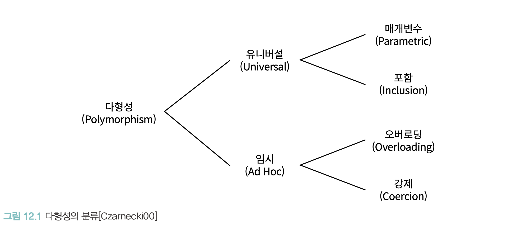
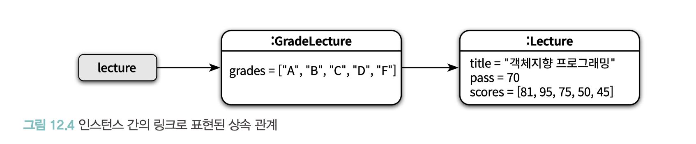
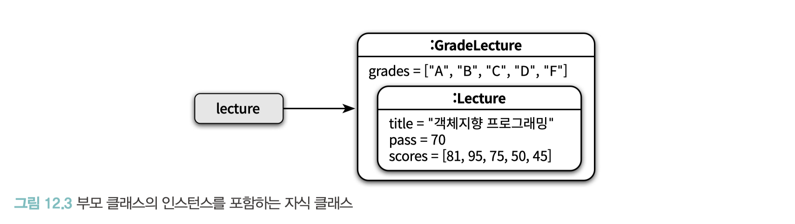

# CHAPTER 12. 다형성

**TL;DR**

- **다형성(Polymorphism)**: 그리스어의 'poly(많은)'와 'morph(형태)'의 합성어로 '많은 형태를 가질 수 있는 능력'.
  - **임시 다형성** _Ad Hoc Polymorphism_
    - **오버로딩 다형성** _Overloading Polymorphism_: 하나의 클래스 안에 동일한 이름의 메서드가 존재하는 경우
    - **강제 다형성** _Coercion Polymorphism_: **동일한 연산자를 다양한 타입에 사용**할 수 있는 방식 (ex. `+` 연산자)
  - **유니버설 다형성** _Universal Polymorphism_
    - **매개변수 다형성** _Parametric Polymorphism_: 사용하는 시점에 구체적인 타입을 지정하는 방식.  (ex. 제네릭 프로그래밍)
    - **포함 다형성** _Inclustion Polymorphism_: 흔히 '다형성' 라고 지칭되는 개념. 메시지가 동일하더라도 수신한 객체의 타입에 따라 실제로 수행되는 행동이 달라지는 능력
- **상속의 목적**: 코드 재사용이 아니라 다형성을 위한 **서브타입 계층을 구축**하는 것
  - **데이터 관점**의 상속: 자식 클래스의 인스턴스 안에 부모 클래스의 인스턴스를 포함하는 개념
  - **행동 관점**의 상속: 부모 클래스가 정의한 일부 메서드를 자식 클래스의 메서드로 포함시키는 개념
- **업캐스팅** _upcasting_: 부모 클래스 타입으로 선언된 변수에 자식 클래스의 인스턴스를 할당하는 것이 가능.
- **동적 바인딩** _dynamic binding_: 선언된 변수의 타입이 아니라 메시지를 수신하는 객체의 타입에 따라 실행되는 메서드가 결정. (메시지 처리 메서드를 컴파일 시점이 아니라 실행 시점에 결정하기 때문에 가능)
- **다운캐스팅** _downcasting_: 반대로 부모 클래스의 인스턴스를 자식 클래스 타입으로 변환하기 위해서는 명시적인 타입 캐스팅
- **프로토타입** _prototype_: 클래스가 아닌 객체를 이용해서도 상속을 흉내 낼 수 있음
- 중요한 것은 **클래스 기반의 상속**과 **객체 기반의 위임** 사이에 **기본 개념과 메커니즘을 공유한다는 점**


<br/>

## 01. 다형성

**다형성(Polymorphism)**
  - 그리스어의 'poly(많은)'와 'morph(형태)'의 합성어로 '많은 형태를 가질 수 있는 능력'
  - 하나의 추상 인터페이스에 대해 코드를 작성하고 이 추상 인터페이스에 대해 서로 다른 구현을 연결할 수 있는 능력

<br/>



- 임시 다형성 _Ad Hoc Polymorphism_
  - 오버로딩 다형성 _Overloading Polymorphism_
  - 강제 다형성 _Coercion Polymorphism_
- 유니버설 다형성 _Universal Polymorphism_
  - 매개변수 다형성 _Parametric Polymorphism_
  - 포함 다형성 _Inclustion Polymorphism_

<br/>

<table>
<tr>
<th rowspan="2">임시 다형성<small><i><br/>Ad Hoc Polymorphism</i></small></th>
<th>오버로딩 다형성 <small><i><br/>Overloading Polymorphism</i></small></th>

<td>
: 하나의 클래스 안에 동일한 이름의 메서드가 존재하는 경우

```java
public class Money {
    public Money plus(Money amount) { ... }
    public Money plus(BigDecimal amount) { ... }
    public Money plus(long amount) { ... }
}
```

- **메서드 오버로딩**을 사용하면 `plus_money` , `plus_bigdecimal` , `plus_long` 같은 개별 명명 필요 없이, plus 라는 하나의 이름만 기억하면 됨.

</td>
</tr>

<tr>
<th>강제 다형성 <small><i><br/>Coercion Polymorphism</i></small></th>
<td>

: **동일한 연산자를 다양한 타입에 사용**할 수 있는 방식

- 언어가 지원하는 *자동 **타입 변환***이나 사용자가 *직접 구현한 **타입 변환*** 이용

- 자바의 '+'
  - 피연산자가 모두 정수일 경우: 정수에 대한 덧셈 연산자로 동작
  - 피연산자가 정수형과 문자열일 경우: 연결 연산자로 동작 → 이때 정수형 피연산자는 문자열 타입으로 강제 형변환

- '오버로딩 다형성'과 '강제 다형성' 함께 사용 시, 모호해질 가능성 높음 (어떤 메서드가 호출될지를 판단하기가 어려워지기 때문)

</td>
</tr>

<tr>
<th rowspan="2">유니버설 다형성<small><i><br/>Universal Polymorphism</i></small></th>
<th>매개변수 다형성 <small><i><br/>Parametric Polymorphism</i></small></th>
<td>

: 사용하는 시점에 구체적인 타입을 지정하는 방식. **제네릭 프로그래밍**과 관련이 높음.

- 클래스의 인스턴스 변수나 메서드의 매개변수 타입을 임의의 타입으로 선언 후, 사용하는 시점에 구체적인 타입을 지정
- e.g. 자바의 List 인터페이스는 컬렉션에 보관할 요소의 타입을 임의의 타입 T 로 지정하며, 실제 인스턴스를 생성하는 시점에 T를 구체적인 타입으로 지정할 수 있음.

</td>
</tr>

<tr>
<th>포함 다형성 <small><i><br/>Inclustion Polymorphism</i></small></th>
<td>

: 메시지가 동일하더라도 수신한 객체의 타입에 따라 실제로 수행되는 행동이 달라지는 능력

- 흔히 '다형성'이라고 할 때는 '포함 다형성'을 의미. OOP에서 가장 널리 알려진 형태의 다형성이기 때문.
- 서브타입 다형성(Subtype Polymorphism)이라고도 부름
- 포함 다형성을 위해 상속을 사용하는 가장 큰 이유는 상속이 클래스들을 계층으로 쌓아 올린 후 상황에 따라 적절한 메서드를 선택할 수 있는 메커니즘을 제공하기 때문

<br/>

```java
public class Movie {

  private DiscountPolicy discountPolicy;

  public Money calculateMovieFee(Screening screening) {
    return fee.minus(discountPolicy.calculateDiscountAmount(screening));
  }
}
```

- **상속의 진정한 목적은 코드 재사용이 아니라 다형성을 위한 서브타입 계층을 구축하는 것**

</td>
</tr>
</table>

<br/>

## 02. 상속의 양면성

- **데이터 관점의 상속**
  - 부모 클래스에서 정의한 **모든 데이터**를 자식 클래스의 인스턴스에 자동으로 포함시킬 수 있음
- **행동 관점의 상속**
  - **데이터뿐만 아니라** 부모 클래스에서 정의한 **일부 메서드**를 자동으로 자식 클래스에 포함시킬 수 있음


#### **상속의 목적** 
  - ❌ 코드 재사용
  - ⭕️ 타입 계층 구축 (프로그램을 구성하는 개념들을 기반으로 다형성을 가능하게 함)

<br/>

#### Problem!

타입 계층에 대한 고민 없이 코드를 재사용하기 위해 상속을 사용하면, 이해하기 어렵고 유지보수하기 버거운 코드가 만들어질 확률이 높음

👉🏻 해결법: 상속이 무엇이고 언제 사용해야 하는지를 이해하는 것 


**상속의 메커니즘을 이해하는데 필요한 개념**

: 업캐스팅, 동적 메서드 탐색, 동적 바인딩, self 참조, super 참조

<br/>

### 상속을 사용한 강의 평가

목표: 수강생들의 성적 계산 후 아래의 형식으로 성적 통계를 출력

```bash
Pass:3 Fail:2, A:1 B:1 C:1 D:0 F:2
```

- Lecture 클래스가 이미 정의, 아래와 같은 이수/낙제 결과 출력.

```bash
Pass:3 Fail:2
```

<br/>

**_v1 code 참고_**

- GradeLecture 와 Lecture 에 구현된 두 evaluate 메서드의 시그니처가 완전히 동일
- 메서드 오버라이딩
  - 자식 클래스 안에 상속받은 메서드와 동일한 시그니처의 메서드를 재정의하여, 부모 클래스의 구현을 새로운 구현으로 대체

<br/>

### 데이터 관점의 상속

```java
Lecture lecture = new Lecture("객체지향 프로그래밍",
        70,
        Arrays.asList(81, 95, 75, 50, 45));
```

- 인스턴스 변수 title , pass , scores 를 저장할 수 있는 메모리 공간을 할당하고 
- 생성자의 매개변수를 이용해 값을 설정한 후 생성된 인스턴스의 주소를 lecture 라는 이름의 변수에 대입

```java
Lecture lecture = new GradeLecture("객체지향 프로그래밍",
        70,
        Arrays.asList(new Grade("A",100, 95),
        new Grade("B",94, 80),
        new Grade("C",79, 70),
        new Grade("D",69, 50),
        new Grade("F",49, 0)),
        Arrays.asList(81, 95, 75, 50, 45));
```

- 개념적으로 자식 클래스의 인스턴스 안에 부모 클래스의 인스턴스가 포함된 것으로 생각하는 것이 유용

<table>
<tr>
<th>부모 클래스의 인스턴스를 포함하는 자식 클래스</th>
<th>인스턴스 간의 링크로 표현된 상속 관계</th>
</tr>
<tr>
<td></td>
<td></td>
</tr>
</table>

<br />

### 행동 관점의 상속

행동 관점의 상속: 부모 클래스가 정의한 일부 메서드를 자식 클래스의 메서드로 포함시키는 개념

<br />

## 03. 업캐스팅과 동적 바인딩

### 같은 메시지, 다른 메서드

- 성적 계산 프로그램 ← + 각 교수별로 강의에 대한 성적 통계를 계산하는 기능 추가

<br />

_v2 code 참고_

👉🏻 Lecture 클래스 대신 자식 클래스인 GradeLecture 인스턴스 전달

- 코드 내 선언된 참조 타입과 무관하게, 실제 수신하는 객체의 타입에 따라 실행되는 메서드가 달라질 수 있는 것은 **업캐스팅**과 **동적 바인딩** 메커니즘이 작용하기 때문.
  - 업캐스팅: Upcasting. 부모 클래스 타입으로 선언된 변수에 자식 클래스의 인스턴스를 할당하는 것이 가능.
  - 동적 바인딩: Dynamic Binding. 선언된 변수의 타입이 아니라 메시지를 수신하는 객체의 타입에 따라 실행되는 메서드가 결정. (메시지 처리 메서드를 컴파일 시점이 아니라 실행 시점에 결정하기 때문에 가능)
  - 다운캐스팅: Downcasting. 반대로 부모 클래스의 인스턴스를 자식 클래스 타입으로 변환하기 위해서는 명시적인 타입 캐스팅

<br />

### 동적 바인딩 

- 컴파일타임에 호출할 함수를 결정하는 방식: **정적 바인딩(static binding)**, **초기 바인딩(early binding)**, 또는 **컴파일타임 바인딩(compile-time binding)**
- 런타임에 실행될 메서드를 결정하는 방식: **동적 바인딩(dynamic binding)** 또는 **지연 바인딩(late binding)**

<br />

## 04. 동적 메서드 탐색과 다형성

- 객체가 메시지를 수신하면 컴파일러는 **`self` 참조**라는 임시 변수를 자동으로 생성한 후 메시지를 수신한 객체를 가리키도록 설정
  - 시스템은 메시지를 처리할 메서드를 탐색하기 위해 self 참조가 가리키는 메모리로 이동. 
  - 이 메모리에는 객체의 현재 상태를 표현하는 **데이터와 객체의 클래스를 가리키는 class 포인터가 존재**

동적 메서드 탐색은 두 가지 원리로 구성
1. 자동적인 메시지 위임: 자신이 이해할 수 없는 메시지를 전송받은 경우 상속 계층을 따라 부모 클래스에게 처리를 위임. 프로그래머의 개입 없이 상속 계층을 따라 자동으로 이뤄짐
2. 동적인 문맥을 사용: 컴파일 시점이 아닌 실행 시점에 이뤄지며, 메서드를 탐색 하는 경로는 `self` 참조를 이용해서 결정 

<br />

### 자동적인 메시지 위임

#### 메서드 오버라이딩

```java
Lecture lecture = new Lecture(/* ... */);
lecture.evaluate();
```

```java
Lecture lecture = new GradeLecture(/* ... */);
lecture.evaluate();
```

- Lecture 에 정의된 메서드가 아닌 실제 객체를 생성한 클래스인  GradeLecture 에 정의된 메서드가 실행

<br />

#### 메서드 오버로딩

```java
GradeLecture lecture = new GradeLecture(/* ... */);
lecture.average("A");
```

```java
Lecture lecture = new GradeLecture(/* ... */);
lecture.average();

```
- `average()` 메서드와 `average(String grade)` 메서드는 이름은 같지만 시그니처가 다름
- 메서드 오버라이딩은 메서드를 감추지만 메서드 오버로딩은 사이좋게 공존


**이름 숨기기(name hiding)**
  - C++는 상속 계층 안에서 동일한 이름을 가진 메서드가 공존해서 발생하는 혼란을 방지하기 위해, 부모 클래스에 선언된 이름이 **동일한 메서드 전체를 숨겨**서 **클라이언트가 호출하지 못하도록 막음**.
  - 해결법: 부모 클래스에 정의된 모든 메서드를 자식 클래스에서 오버로딩


```C++
class GradeLecture: public Lecture {
public:
    virtual int average();
    virtual int average(std::string grade);
    virtual int average(std::string, int base);
    virtual int average(char grade);
};
```
```cplusplus
class GradeLecture: public Lecture {
public:
    using Lecture::average;
    virtual int average(char grade);
};
```

- 부모 클래스에 정의된 average 라는 이름을 자식 클래스의 네임스페이스에 합칠 수도 있음

<br />

### 동적인 문맥

- self 참조가 가리키는 객체의 타입을 변경함으로써 객체가 실행 될 문맥을 동적으로 바꿀 수 있음 
- 동적 문맥을 결정은 실행될 메서드를 예상하기 어렵게 만듦
  - 대표 예시) self 전송(self send): 자신에게 다시 메시지를 전송하는 방식

```java
public class Lecture {
    public String stats() {
      /*
            자신의 getEvaluationMethod 메서드를 호출 
       */
      return String.format("Title: %s, Evaluation Method: %s", title, getEvaluationMethod());
    }

    public String getEvaluationMethod() {
        return "Pass or Fail";
    }
}
```

- ❌ 현재 **클래스의 메서드**를 호출
- ⭕️ 현재 **객체**에게 **메시지를 전송**하는 것

<br />

### 이해할 수 없는 메시지

상속 계층의 정상에 오고 나서야 자신이 메시지를 처리할 수 없다는 사실을 알게 됐다면?

- 정적 타입 언어와 이해할 수 없는 메시지: 컴파일할 때 상속 계층 안의 클래스들이 메시지를 이해할 수 있는지 여부 판단
- 동적 타입 언어와 이해할 수 없는 메시지: 실제로 코드를 실행해보기 전에는 메시지 처리 가능 여부를 판단할 수 없음

👉🏻 두 타입 모두 예외를 던짐

- 동적 타입 언어는 예외를 던지는 것 외 방법이 하나 더 있음
- Ex) Ruby: doesNotUnderstand 나 method_missing 메시지에 응답할 수 있는 메서드를 구현
  - 객체는 자신의 인터페이스에 정의되지 않은 메시지를 처리하는 것이 가능
- 동적 타입 언어는 이해할 수 없는 메시지를 처리할 수 있는 능력을 가짐으로써, 메시지가 선언된 인터페이스와 메서드가 정의된 구현을 분리할 수 있음.
- 메시지 전송자는 자신이 원하는 메시지를 전송하고 메시지 수신자는 스스로의 판단에 따라 메시지를 처리

<br />

### self 대 super
- `super` 참조의 정 확한 의도는 "지금 이 클래스의 부모 클래스에서부터 메서드 탐색을 시작하세요"
- 부모 클래스의 인스턴스에게 메시지를 전송하 는 것처럼 보이기 때문에 이를 **super 전송(super send)**이라고 부름

<br />

## 05. 상속 대 위임

### 위임과 self 참조

- GradeLecture 인스턴스의 입장에서 self 참조 👉🏻 **GradeLecture 인스턴스**
- GradeLecture 인스턴스에 포함된 Lecture 인스턴스의 입장에서 self 참조 👉🏻 **GradeLecture 인스턴스**
- 메서드 탐색 중에는 자식 클래스의 인스턴스와 부모 클래스의 인스턴스가 동일한 self 참조를 공유하는 것으로 봐도 무방

**포워딩 vs 위임**
- 처리를 요청할 때 self 참조를 전달하지 않는 경우 👉🏻 포워딩
- self 참조를 전달하는 경우 👉🏻 위임

<br />

### 프로토타입 기반의 객체지향 언어

- 프로토타입(prototype): 클래스가 아닌 객체를 이용해서도 상속을 흉내 낼 수 있음

- 자바스크립트의 모든 객체들은 다른 객체를 가리키는 용도로 사용되는 prototype 이라는 이름의 링크를 가짐
- prototype 은 앞에서 위임을 직접 구현했던 예제에서 부모 객체를 가리키기 위해 사용했던 인스턴스 변수 @parent 와 동일한 것으로 봐도 무방


**중요한 것은 클래스 기반의 상속과 객체 기반의 위임 사이에 기본 개념과 메커니즘을 공유한다는 점**


