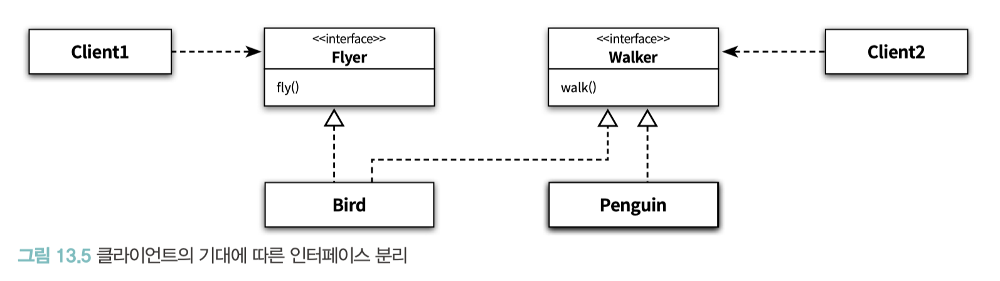
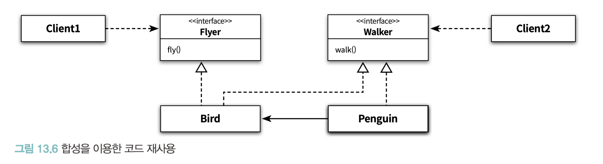

# CHAPTER 13. 서브클래싱과 서브타이핑

**TL;DR**
- 상속의 목적: ① 타입 계층을 구현하는 것, ② 코드 재사용
- 상속을 사용하는 일차적인 목표는 코드 재사용이 아니라 타입 계층을 구현하는 것이어야 함
- 타입의 구성
  - **심볼(symbol)**: 타입에 이름을 붙인 것
  - **내연(intension)**: 타입의 정의로서 타입에 속하는 **객체들이 가지는 공통적인 속성이나 행동**
  - **외연(extension)**: 타입에 속하는 객체들의 집합
- 상속을 사용할 2가지 조건
  1. is-a 관계를 모델링하는 상속 관계 : **"타입 S는 타입 T다(S is-a T)"** 를 만족할 때 적용 가능
  2. 클라이언트 입장에서 부모 클래스의 타입으로 자식 클래스를 사용 가능할 때
- **행동 호환성**: 타입의 이름 사이에 개념적으로 어떤 연관성이 있다고 하더라도 **행동에 연관성이 없다면 is-a 관계를 사용하지 말아야 함**
- **인터페이스 분리 원칙 (Interface Segregation Principle, ISP)**: 인터페이스를 클라이언트의 기대에 따라 분리함으로써 변경에 의해 영향을 제어하는 설계 원칙
- **서브클래싱 & 서브타이핑**
  - **서브클래싱(subclassing)**: 다른 클래스의 코드를 재사용할 목적으로 상속을 사용하는 경우
  - **서브타이핑(subtyping)**: 타입 계층을 구성하기 위해 상속을 사용하는 경우
- **클래스 상속 vs 인터페이스 상속**
  - **클래스 상속**: 객체의 구현을 정의할 때 이미 정의된 객체의 구현을 바탕으로 함. 코드 공유의 방법
  - **인터페이스 상속**: 서브 타이핑. 객체가 다른 곳에서 사용될 수 있음을 의미
- is-a 관계로 표현된 문장을 볼 때마다 문장 앞에 "**클라이언트 입장에서**"라는 말을 붙여서 생각하라.

<br/><br/><br/>

상속의 첫 번째 용도
: 타입 계층을 구현하는 것

- 부모 클래스는 일반적인 개념을 구현하고 자식 클래스는 특수한 개념을 구현.
- 타입 계층의 관점에서 **부모 클래스**는 **자식 클래스의 일반화(generalization)**, **자식 클래스**는 부모 클래스의 **특수화(specialization)**

<br/>

상속의 두 번째 용도
: 코드 재사용

- 점진적으로 애플리케이션의 기능을 확장 가능
- 부모 클래스와 자식 클래스가 강하게 결합 → 변경하기 어려운 코드를 얻게 될 확률이 높음

<br/>

✔️ 상속을 사용하는 일차적인 목표는 코드 재사용이 아니라 타입 계층을 구현하는 것이어야 함

<br/><br/>

## 01. 타입

- 개념 관점에서 타입: 공통의 특징을 공유하는 대상들의 분류
- 프로그래밍 언어 관점에서 타입: 동일한 오퍼레이션을 적용할 수 있는 인스턴스들의 집합


### 개념 관점의 타입

- 사람이 인지하는 세상의 사물의 종류를 의미
- 타입은 사물을 분류하기 위한 틀로 사용
- 어떤 대상이 타입으로 분류될 때 그 대상을 타입의 인스턴스(instance)라고 함

#### 타입의 구성

- **심볼(symbol)**: 타입에 이름을 붙인 것
- **내연(intension)**: 타입의 정의로서 타입에 속하는 **객체들이 가지는 공통적인 속성이나 행동**
- **외연(extension)**: 타입에 속하는 객체들의 집합

**Example.**

> 프로그래밍 언어            ...① 심볼(symbol)
> 
> : 컴퓨터에게 특정한 작업을 지시하기 위한 어휘와 문법적 규칙의 집합 ...② 내연(intension)
> 
> ex) 자바, 루비, 자바스크립트, C 등 ...③ 외연(extension)

<br/>

### 타입의 두 가지 목적

1. 타입의 유효 오퍼레이션 정의
  - 모든 객체지향 언어들은 객체의 타입에 따라 적용 가능한 연산자의 종류를 제한 → 프로그래머의 실수를 막음
  - Ex. `+` 연산자는 숫자 타입과  문자열에서만 사용 가능
2. 타입에 수행되는 오퍼레이션에 대해 미리 약속된 문맥을 제공
  - Ex. 숫자 타입의 `+` 연산자: 두 수를 더함
  - Ex. 문자열 타입의 `+` 연산자: 문자열로 합침

<br/>

### 객체지향 패러다임 관점의 타입

객체지향 프로그래밍 관점에서 타입의 정의

> 객체의 퍼블릭 인터페이스가 객체의 타입을 결정한다.
> 따라서 동일한 퍼블릭 인터페이스를 제공하는 객체들은 동일한 타입으로 분류된다.

- 퍼블릭 인터페이스: 객체가 수신할 수 있는 메시지의 집합

- 객체에게 중요한 것은 속성이 아니라 행동
- 객체를 바라볼 때는 항상 객체가 외부에 **제공하는 행동**에 초점을 맞춰야 함
- 객체의 타입을 결정하는 것은 내부의 속성이 아니라 **객체가 외부에 제공하는 행동**임

<br/><br/>

## 02. 타입 계층

- 슈퍼타입(supertype): 타입 계층을 구성하는 두 타입 간의 관계에서 더 일반적인 타입
- 서브타입(subtype): 더 특수한 타입


- **일반화**: 다른 타입을 **완전히 포함하거나 내포**하는 타입을 식별하는 행위 또는 그 행위의 결과
- **특수화**: 다른 타입 안에 **전체적으로 포함되거나 완전히 내포되는 타입**을 식별하는 행위 또는 그 행위의 결과

| 관점 \ 정의 | 일반 타입 정의                            | 특수 타입 정의                                                            |
|---------|-------------------------------------|---------------------------------------------------------------------|
| 내연 관점   | - 어떤 타입의 정의를 좀 더 보편적이고 추상적으로 만드는 과정 | - 일반적인 타입의 정의를 좀 더 구체화한 것<br/>- 어떤 타입의 정의를 좀 더 구체적이고 문맥 종속적으로 만드는 과정 |
| 외연 관점   | - 특수한 타입의 인스턴스 집합을 포함하는 슈퍼셋(superset)   | - 일반적인 타입의 인스턴스 집합에 포함된 서브셋 (subset)                                |


- 슈퍼셋(superset): 외연의 관점에서 일반적인 타입의 인스턴스 집합은 특수한 타입의 인스턴스 집합을 포함
- 서브셋(subset): 특수한 타입의 인스턴스 집합은 일반적인 타입의 인스턴스 집 합에 포함

<i><small>'슈퍼타입'과 '서브타입' 용어는 '슈퍼셋'과 '서브셋'으로부터 유래한</small></i>

**슈퍼타입**
- 집합이 다른 집합의 모든 멤버를 포함
- 타입 정의가 다른 타입보다 좀 더 일반적

**서브타입**
- 집합에 포함되는 인스턴스들이 더 큰 집합에 포함 됨
- 타입 정의가 다른 타입보다 좀 더 구체적

<br/>

### 객체지향 프로그래밍과 타입 계층

**퍼블릭 인터페이스의 관점의 슈퍼타입과 서브타입**

- 슈퍼타입: 서브타입이 정의한 퍼블릭 인터페이스를 일반화시켜 **상대적으로 범용적이고 넓은 의미로 정의 한 것**
- 서브타입: 슈퍼타입이 정의한 퍼블릭 인터페이스를 특수화시켜 **상대적으로 구체적이고 좁은 의미로 정의 한 것**

<br/>

> 서브타입의 인스턴스는 슈퍼타입의 인스턴스로 간주될 수 있다. 

<small>이번 장의 핵심이자, 상속과 다형성의 관계를 이해하기 위한 출발점</small>

<br/><br/>

## 03. 서브클래싱과 서브타이핑

- 타입 구현의 일반적인 방법: 클래스를 이용하는 것 
- 타입 계층 구현의 일반적인 방법: 상속을 이용하는 것

### 상속을 사용할 2가지 조건

#### 1. is-a 관계를 모델링하는 상속 관계

**"타입 S는 타입 T다(S is-a T)"** 를 만족할 때 적용 가능

<br/>

> <b>Example.</b>
> 1. 펭귄은 새다 
> 2. 새는 날 수 있다
>
>```java
>public class Bird {
>  public void fly() { ... }
>    ...
>}
>
>public class Penguin extends Bird {
>  ...
>}
>```

- 어휘적인 정의가 아니라 **기대되는 행동에 따라 타입 계층을 구성**해야 함 
- 슈퍼타입과 서브타입 관계에서는 is-a 보다 **행동 호환성이 더 중요**

#### 2. 클라이언트 입장에서 부모 클래스의 타입으로 자식 클래스를 사용 가능

- (자식 클래스와 부모 클래스 사이의) **행동 호환성**: 상속 계층을 사용하는 클라이언트의 입장에서 부모 클래스와 자식 클래스의 차이점을 몰라야 함 

<br/>

### 행동 호환성

- 타입의 이름 사이에 개념적으로 어떤 연관성이 있다고 하더라도 **행동에 연관성이 없다면 is-a 관계를 사용하지 말아야 함**
- 행동 호환 여부를 판단하는 기준 = 클라이언트의 관점
  - 클라이언트가 두 타입이 동일하게 행동할 것이라고 기대한다면, 두 타입을 타입 계층으로 묶을 수 있음
  - 클라이언트가 두 타입이 동일하게 행동하지 않을 것이라고 기대한다면, 두 타입을 타입 계층으로 묶어서는 안됨


> Example.
> 클라이언트가 날 수 있는 새만을 원한다고 가정
> ```java
> public void flyBird(Bird bird) {
>   // 인자로 전달된 모든 bird는 날 수 있어야 한다
>   bird.fly();
> }
> ```
> 
> "펭귄이 새다" 는 사실이지만, 날 수 없기 때문에 Bird 클래스에 위의 메서드를 추가하면 안됨 
> 
> 위의 문제를 상속 관계를 유지하면서 해결하기 위해 흔히 하는 실수하는 세 가지 방법
> 1. fly 메서드를 오버라이딩해서 내부 구현을 비워둠 
>   - 어떤 행동도 수행하지 않음 → 모든 bird 가 난다는 클라이언트의 기대 불만족
> 2. Penguin 의 fly 메서드를 오버라이딩한 후 예외를 던지게 하는 것
>   - 해당 메서드의 결과로 예외가 던져질 것이라고는 기대하지 않았을 것 → 클라이언트의 관점에서 Bird 와 Penguin 의 행동이 호환되지 않음
> 3. 분기 처리를 통해 Penguin 이 아닐 경우에만 fly 메시지를 전송하도록 하는 것
>   - 또 다른 새가 상속 계층에 추가되면 확장성 떨어짐

<br/>

### 클라이언트의 기대에 따라 계층 분리하기


```java
public class Bird {
    // ...
}

public class FlyingBird extends Bird {
  public void fly() { ... }
    // ...
}

public class Penguin extends Bird {
    // ...
}
```

- FlyingBird 타입의 인스턴스만이 fly 메시지를 수신할 수 있음

<br/>

#### 또 다른 방법. 클라이언트에 따라 인터페이스를 분리하는 것



- 문제: Penguin이 Bird 의 코드를 재사용하고 싶을 때 Flyer의 코드가 함께 포함됨
- 해결: 합성 사용



- Flyer 의 인터페이스가 변경되어도 그 영향은 Bird 에서 끝남
- Client2 는 Flyer 나 Bird 에 대해 전혀 알지 못하기 때문에 영향을 받지 않음 


**인터페이스 분리 원칙(Interface Segregation Principle, ISP)**: 인터페이스를 클라이언트의 기대에 따라 분리함으로써 변경에 의해 영향을 제어하는 설계 원칙

<br/>

### 서브클래싱과 서브타이핑

**상속의 두 가지 목적에 따른 이름**

- **서브클래싱(subclassing)**: 다른 클래스의 코드를 재사용할 목적으로 상속을 사용하는 경우
  - = _구현 상속(implementation inheritance)_ or _클래스 상속(class inheritance)_
  - 자식 클래스와 부모 클래스의 행동이 호환 ❌: 자식 클래스의 인스턴스가 부모 클래스의 인스턴스를 대체할 수 없음 
- **서브타이핑(subtyping)**: 타입 계층을 구성하기 위해 상속을 사용하는 경우
  - = _인터페이스 상속(interface inheritance)_
  - 영화 예매 시스템에서 구현한 DiscountPolicy 상속 계층이 서브타이핑에 해당
  - 자식 클래스와 부모 클래스의 행동이 호환 ⭕️: 자식 클래스의 인스턴스가 부모 클래스의 인스턴스를 대체할 수 있음
  - 부모 클래스는 자식 클래스의 **슈퍼타입**, 자식 클래스는 부모 클래스의 **서브타입**.

<br/>

**클래스 상속 vs 인터페이스 상속**
- **클래스 상속**: 객체의 구현을 정의할 때 이미 정의된 객체의 구현을 바탕으로 함. 코드 공유의 방법 
- **인터페이스 상속**: 서브 타이핑. 객체가 다른 곳에서 사용될 수 있음을 의미

<small>대부분의 프로그래밍 언어들은 인터페이스와 구현 상속을 구분하고 있지 않지만, 프로그래머들은 실제로 구분해서 사용하고 있음.</small>

<br/>

**서브 타이핑**
- 서브타입이 슈퍼타입이 하는 모든 행동을 동일하게 할 수 있어야 함
- **행동 호환성(behavioral substitution)** 을 만족시켜야 함
- 부모 클래스에 대한 자식 클래스의 대체 가능성(substitutability)을 포함

<br/>

### 04. 리스코프 치환 원칙


> **Liskov Substitution Principle**
> 
> S형의 각 객체 o1에 대해 T형의 객체 o2가 하나 있고, 
> T에 의해 정의된 모든 프로그램 P에서 T가 S로 치환될 때, 
> P의 동작이 변하지 않으면 S는 T의 서브타입이다.
> 
> _- Barbara Liskov_

리스코프 치환 원칙을 한마디로 정의하면 아래와 같다.

> 서브타입은 그것의 기반 타입에 대해 대체 가능해야 한다 
> _- Martin_


> 클라이언트가 "차이점을 인식하지 못한 채 기반 클래스의 인터페이스를 통해 서브클래스를 사용할 수 있어야 한다" 
> _- Hunt_


<br/>

#### “정사각형은 직사각형이다(Square is-a Rectangle)”

- 정사각형은 직사각형이 아닐 수 있음
- 리스코프 치환 원칙을 위반하는 고전적인 사례 중 하나


```java
public class Rectangle {
    private int x, y, width, height;

    public Rectangle(int x, int y, int width, int height) {
        this.x = x;
        this.y = y;
        this.width = width;
        this.height = height;
    }

    public int getWidth() {
        return width;
    }

    public void setWidth(int width) {
        this.width = width;
    }

    public int getHeight() {
        return height;
    }
}
```

- 개념적으로 정사각형은 직사각형의 특수한 경우 
- 정사각형과 직사각형 사이에 어휘적으로 is-a 관계가 성립


```java
public class Square extends Rectangle {
    public Square(int x, int y, int size) {
        super(x, y, size, size);
    }

    @Override
    public void setWidth(int width) {
    }
}
```

<br/>

#### 문제점 

```java
public void resize(Rectangle rectangle, int width, int height) {
    rectangle.setWidth(width);
    rectangle.setHeight(height);
    assert rectangle.getWidth() == width && rectangle.getHeight() == height;
}
```

- resize 메서드의 인자로 Rectangle 대신 Square 를 전달한다고 가정하면 `width != height` 이 성립

<br/>

### 클라이언트와 대체 가능성

> 클라이언트와 격리한 채로 본 모델은 의미 있게 검증하는 것이 불가능하다 
> _- Martin_

- 어떤 모델의 유효성은 **클라이언트의 관점에서만 검증 가능**하다는 것

<br/>

### is-a 관계 다시 살펴보기

**상속이 적합한지를 판단하기 위해 마틴 오더스키가 제안한 두 질문** 
- 상속 관계가 어휘적으로 is-a 관계를 모델링한 것인가?
- 클라이언트 입장에서 부모 클래스 대신 자식 클래스를 사용 할 수 있는가?

<br/>

is-a 관계로 표현된 문장을 볼 때마다 문장 앞에 “클라이언트 입장에서”라는 말이 빠져 있다고 생각하라. 
"클라이언트"를 배제한 is-a 관계는 혼란으로 몰아갈 가능성이 높음

**Example.**
- (클라이언트 입장에서) 정사각형은 직사각형이다.
- (클라이언트 입장에서) 펭귄은 새다. 

<br/>

**핵심은 구현 방법과 무관하게 클라이언트의 관점에서 슈퍼타입에 대해 기대하는 모든 것이 서브타입에게도 적용돼야 한다는 것**

<br/>

## 05. 계약에 의한 설계와 서브타이핑

#### 계약에 의한 설계(Design By Contract, DBC)

- 클라이언트와 서버 사이의 협력을 의무(obligation)와 이익(benefit)으로 구성된 계약의 관점에서 표현하는 것
- 세 가지 구성 요소: **사전조건**, **사후조건**, **클래스 불변식**
  - **사전조건(precondition)**: 클라이언트가 정상적으로 메서드를 실행하기 위해 만족시켜야 함
  - **사후조건(postcondition)**: 메서드가 실행된 후에 서버가 클라이언트에게 보장해야 함
  - **클래스 불변식(class invariant)**: 메서드 실행 전과 실행 후에 인스턴스가 만족시켜야 함

<br/>

리스코프 치환 원칙과 계약에 의한 설계 사이의 관계
: 서브타입이 리스코프 치환 원칙을 만족시키기 위해서는 **클라이언트와 슈퍼타입 간에 체결된 ‘계약’을 준수**해야 한다.

- **코드 재사용을 위해 상속을 사용** + **클라이언트의 관점에서 자식 클래스가 부모 클래스를 대체할 수 없음** → 서브타입이라고 할 수 없음

### 서브타입과 계약

서브타입에 더 강력한 사전조건을 정의할 수 없다.

<table>
<tr>
<th>BrokenDiscountPolicy에 DiscountPolicy 보다 더 강화된 사전조건을 정의</th>
<th>DiscountPolicy의 사전조건을 제거해서 약화</th>
<th>사후조건을 강화</th>
</tr>
<tr>
<td>

```java
public class BrokenDiscountPolicy extends DiscountPolicy {
    public BrokenDiscountPolicy(DiscountCondition ... conditions) {
        super(conditions);
    }
    
    @Override
    public Money calculateDiscountAmount(Screening screening) {
        checkPrecondition(screening);            // 기존의 사전조건
        checkStrongerPrecondition(screening);    // 더 강력한 사전조건
      
        Money amount = screening.getMovieFee();
        checkPostcondition(amount);              // 기존의 사후조건
        return amount;
    }
    
    private void checkStrongerPrecondition(Screening screening) {
        assert screening.getEndTime().toLocalTime().isBefore(LocalTime.MIDNIGHT);
    }
    
    @Override
    protected Money getDiscountAmount(Screening screening) {
        return Money.ZERO;
    }
}
```

</td>
<td>

```java
public class BrokenDiscountPolicy extends DiscountPolicy {
    // ...
    @Override
    public Money calculateDiscountAmount(Screening screening) {
        // checkPrecondition(screening);          // 기존의 사전조건 제거
        Money amount = screening.getMovieFee();
        checkPostcondition(amount);               // 기존의 사후조건
        return amount;
    }
    // ...
}
```

</td>
<td>

```java
public class BrokenDiscountPolicy extends DiscountPolicy {
    // ...
    @Override
    public Money calculateDiscountAmount(Screening screening) {
        checkPrecondition(screening);           // 기존의 사전조건
        Money amount = screening.getMovieFee();
        checkPostcondition(amount);             // 기존의 사후조건
        
        checkStrongerPostcondition(amount);     // 더 강력한 사후조건
        return amount;
    }
    
    private void checkStrongerPostcondition(Money amount) {
        assert amount.isGreaterThanOrEqual(Money.wons(1000));
    }
}
```

</td>
</tr>
</table>

---

### 참고

`assert` 키워드:  https://www.herongyang.com/Java/Assertion-JVM-ea-and-da-Options.html


