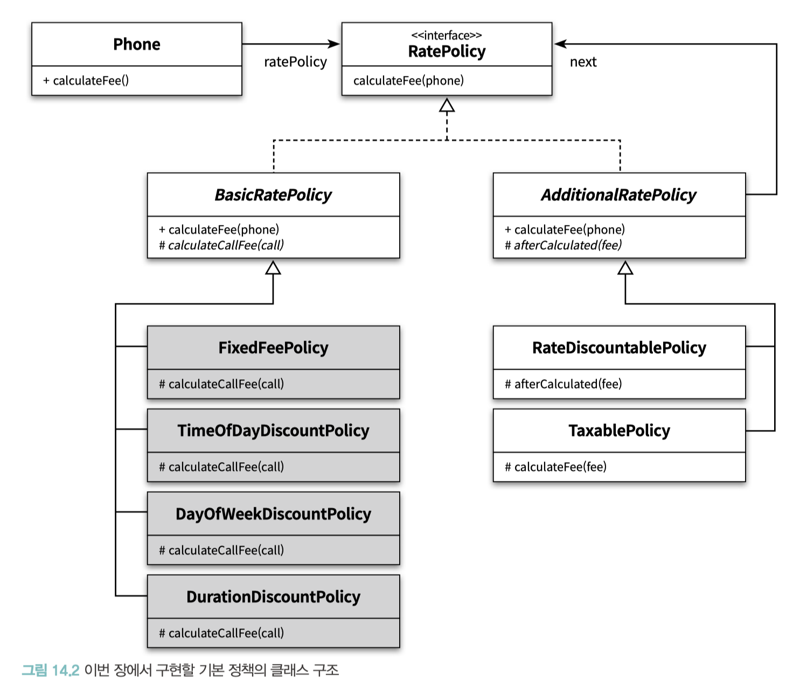
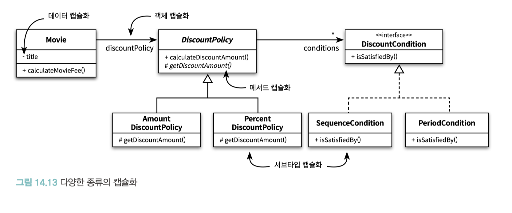
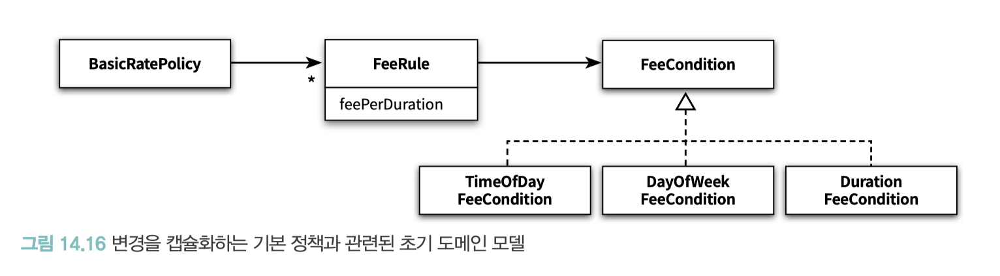
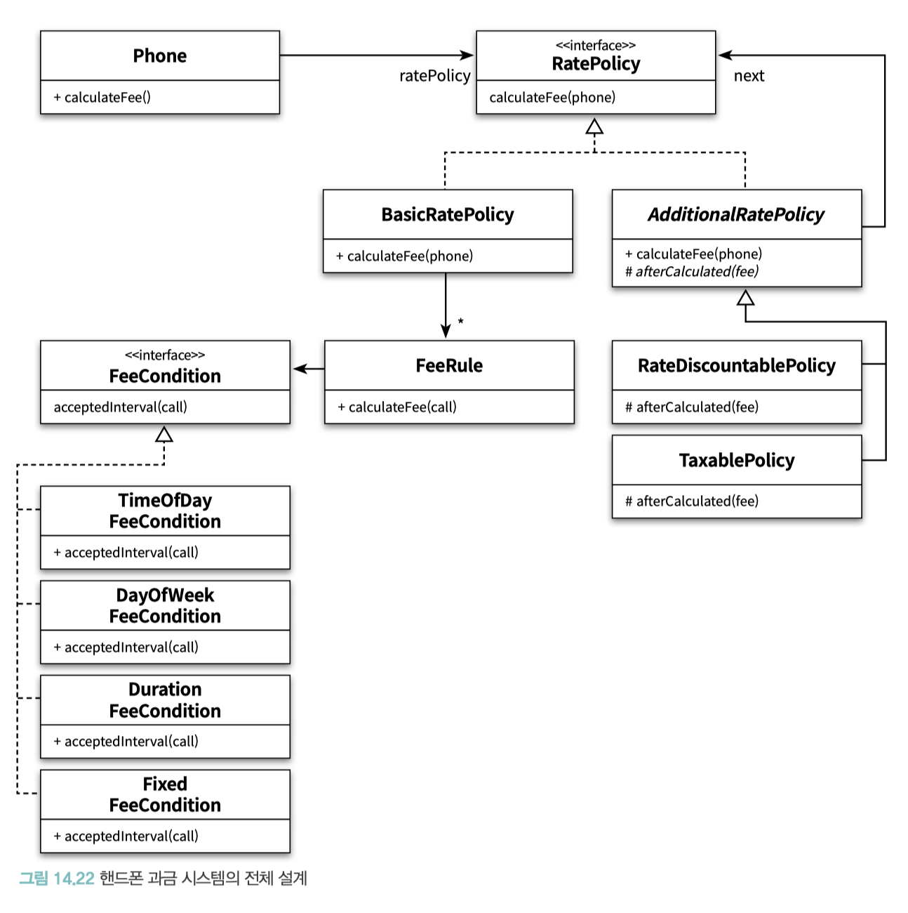

# CHAPTER 14. 일관성 있는 협력

**TL;DR**
- 일관성 있는 개발은 **설계 비용을 감소**시키고 **이해하기 쉬운 코드**를 이끌어 냄
- 비일관성은 **새로운 구현을 추가**하거나, **기존의 구현을 이해해야 하는 상황**에서 어려움을 겪게 함
- **일관성 있는 설계를 만드는 방법**
  1. 다양한 설계 경험을 익히는 것
  2. 널리 알려진 디자인 패턴을 학습하고 변경이라는 문맥 안에서 디자인 패턴을 적용해 보는 것
  3. 기본 지침을 따르는 것 (변하는 개념을 변하지 않는 개념으로부터 분리하라, 변하는 개념을 캡슐화하라)
- 클래스는 단일 책임 원칙에 따라 명확히 단 하나의 이유에 의해서만 변경돼야 하고 클래스 안의 모든 코드는 함께 변경돼야 함
  - 큰 메서드 안에 뭉쳐있던 조건 로직들을 **변경의 압력에 맞춰** 작은 클래스들로 분리하고 나면, 인스턴스들 사이의 협력 패턴에 일관성을 부여하기가 더 쉬워짐
  - **유사한 행동을 수행하는 작은 클래스**들이 역할이라는 추상화로 묶이고, 역할 사이에서 이뤄지는 **협력 방식이 전체 설계의 일관성을 유지**할 수 있기 때문
- 캡슐화란 단지 데이터 은닉을 의미하는 것이 아니라, **코드 수정으로 인한 파급효과를 제어할 수 있는 모든 기법**이 캡슐화의 일종
- 캡슐화의 다양한 종류
  - **데이터 캡슐화**: 내부에 관리하는 데이터를 캡슐화
  - **메서드 캡슐화**: 클래스의 내부 행동을 캡슐화
  - **객체 캡슐화**: 객체와 객체 사이의 관계를 캡슐화 (객체 캡슐화는 합성을 의미)
  - **서브타입 캡슐화**: 서브타입의 종류를 캡슐화 (서브타입 캡슐화는 다형성 기반)
- **일관성 있는 협력을 위한 캡슐화 방법**
  1. 변하는 부분을 분리해서 타입 계층을 만든다
  2. 변하지 않는 부분의 일부로 타입 계층을 합성한다
- 개념적 무결성(Conceptual Integrity): 협력을 설계하고 있다면 항상 기존의 협력 패턴을 따를 수는 없는지 고민하라.
  - 유사한 기능에 대해 유사한 협력 패턴을 적용하는 것은 객체지향 시스템에서 **개념적 무결성(Conceptual Integrity)** 을 유지할 수 있는 가장 효과적인 방법
- 유사한 기능에 대한 변경이 지속적으로 발생하고 있다면 패턴을 찾아라
  - 변경을 캡슐화할 수 있는 적절한 추상화를 찾은 후, 이 추상화에 변하지 않는 공통적인 책임을 할당하라.
  - 현재의 구조가 변경을 캡슐화하기에 적합하지 않다면 코드를 수정하지 않고도 원하는 변경을 수용할 수 있도록 **협력과 코드를 리팩터링하라**.


<br/><br/><br/>

**일관성이 주는 이점**

- 설계 비용을 감소시킴
    - 동일한 해결법을 반복적으로 사용해서 유사한 기능을 구현하는 데 드는 시간과 노력을 줄임
- 이해하기 쉬워짐
    - 유사한 방법으로 해결하고 있다는 사실로 코드의 구조를 예상할 수 있게 됨

<br/>

## 01. 핸드폰 과금 시스템 변경하기

### 기본 정책 확장

- **고정요금 방식** FixedFeePolicy
    - 일정 시간 단위로 동일한 요금을 부과하는 방식. ‘일반 요금제’와 동일
- **시간대별 방식** TimeOfDayDiscountPolicy
    - 하루 24시간을 특정한 시간 구간으로 나눈 후 각 구간별로 서로 다른 요금을 부과하는 방식.
    - ex) 기존의 ‘심야 할인 요금제’는 밤 10시를 기준으로 요금을 부과한 시간대별 방식.
- **요일별 방식** DayOfWeekDiscountPolicy
    - 요일별로 요금을 차등 부과하는 방식.
- **구간별 방식** DurationDiscountPolicy
    - 전체 통화 시간을 일정한 통화 시간에 따라 나누고 각 구간별로 요금을 차등 부과하는 방식.

<br/><br/>

<br/><br/>

#### 고정요금 방식 구현하기

일반요금제와 동일 → 기존의 `RegularPolicy` 클래스의 이름을 `FixedFeePolicy`로 수정

<br/>

#### 시간대별 방식

- 시간대별 방식에 따라 요금을 계산
    - 통화 기간을 정해진 시간대별로 나눈 후, 각 시간대별 로 서로 다른 계산 규칙을 적용
- 통화가 여러 날에 걸쳐있다면
    - 규칙에 정의된 구간별로 통화를 구분, 통화 구간을 분리한 후 각 구간에 대해 개별적으로 계산된 요금을 합해야 함

✔️ **DateTimeInterval**

- 기간을 편하게 관리할 수 있는 `DateTimeInterval` 클래스를 추가
- 시작 시간(from)과 종료 시간(to) 변수 포함
- 객체 생성을 위한 정적 메서드인 `of`, `toMidnight`, `fromMidnight`, `during` 을 제공

- 두 단계 요금 계산 로직
    - 첫 번째 단계. 통화 기간을 일자별로 분리
        - 통화 기간에 대한 정보 전문가 (`Call`) → 통화 기간을 일자 단위로 나누는 책임 정보 전문가 (`DateTimeInterval`)
    - 두 번째 단계. 일자별로 분리된 기간을 **시간대별 규칙에 따라 분리**한 후 각 기간에 대해 **요금을 계산**
        - 시간대별로 분할하는 작업의 정보 전문가 (`TimeOfDayDiscountPolicy`)

<br/>

#### 요일별 방식 구현하기

- 요일별 방식은 요일별로 요금 규칙을 다르게 설정

<br/>

#### 구간별 방식 구현하기

v1) 기존 방법과는 전혀 다른 새로운 방법으로 구간별 방식을 구현했을 때

- 요일별 방식의 경우처럼 규칙을 정의하는 새로운 클래스를 추가하기로 결정
- 요일별 방식과 다른 점은 코드를 재사용하기 위해 FixedFeePolicy 클래스를 상속

<br/>

### 현재 구현의 문제점

→ 개념적으로는 연관돼 있지만 구현 방식이 완전히 제각각 (일관성이 없음)

**비일관성은 두 가지 상황에서 어려움을 겪게 함**

- 새로운 구현을 추가해야 하는 상황
- 기존의 구현을 이해해야 하는 상황

<br/>

## 02. 설계에 일관성 부여하기

**일관성 있는 설계를 만드는 방법**

- 다양한 설계 경험을 익히는 것
- 널리 알려진 디자인 패턴을 학습하고 변경이라는 문맥 안에서 디자인 패턴을 적용해 보는 것
- 기본 지침을 따르는 것
    - 변하는 개념을 변하지 않는 개념으로부터 분리하라
    - 변하는 개념을 캡슐화하라

<br/>

### 조건 로직 대 객체 탐색

- 4장에서 절차적인 방식으로 구현했던 `ReservationAgency` 의 기본 구조 살펴보기

```java
public class ReservationAgency {
    
    public Reservation reserve(Screening screening, Customer customer, int audienceCount) {
        for (DiscountCondition condition : movie.getDiscountConditions()) {
            if (condition.getType() == DiscountConditionType.PERIOD) {
                // 기간 조건인 경우
            } else {
                // 회차 조건인 경우
            }
        }
        
        if (discountable) {
            switch (movie.getMovieType()) {
                case AMOUNT_DISCOUNT:
                    // 금액 할인 정책인 경우
                case PERCENT_DISCOUNT:
                    // 비율 할인 정책인 경우
                case NONE_DISCOUNT:
                    // 할인 정책이 없는 경우
            }
        } else {
            // 할인 적용이 불가능한 경우
        }
    }
}
```

- 위 설계가 나쁜 이유
  - 변경의 주기가 서로 다른 코드가 한 클래스 안에 뭉쳐있기 때문
  - 새로운 할인 정책이나 할인 조건을 추가하기 위해, 기존 코드의 내부를 수정해야 함

- '조건 로직 → 객체 사이의 이동' 을 위해 클래스를 작은 클래스들로 분리해야 함
- 클래스를 분리하기 위한 가장 중요한 기준 : **변경의 이유**와 **주기**
  - 클래스는 명확히 단 하나의 이유에 의해서만 변경돼야 하고 클래스 안의 모든 코드는 함께 변경돼야 함
  - 즉, 단일 책임 원칙을 따르도록 클래스를 분리해야 한다는 것 
  - 큰 메서드 안에 뭉쳐있던 조건 로직들을 **변경의 압력에 맞춰** 작은 클래스들로 분리하고 나면, 인스턴스들 사이의 협력 패턴에 일관성을 부여하기가 더 쉬워짐
  - **유사한 행동을 수행하는 작은 클래스**들이 역할이라는 추상화로 묶이고, 역할 사이에서 이뤄지는 **협력 방식이 전체 설계의 일관성을 유지**할 수 있기 때문

<br/>

> **일관성 있는 협력을 위한 지침**
> 
> 1. 변하는 개념을 변하지 않는 개념으로부터 분리하라.
> 2. 변하는 개념을 캡슐화하라.

> GOF에 의하면 인터페이스에 대해 설계해야 한다고 조언하는데, 
> 이것은 결합도가 느슨해질 수 있도록 엔티티 사이의 관계가 추상적인 수준에서 정해져야 한다는 사실을 다르게 표현한 것이다. 
> 이 특성이 패턴들의 공통적인 경향이라는 것을 알게 될 것이다. 
> 패턴은 **매우 빈번하게 요소들이 관계를 맺을 수 있는 대상을 추상적인 기반 타입으로 제한**한다.
> 
> _- Bain_

<br/>

### 캡슐화 다시 살펴보기

캡슐화란 
- 단순히 데이터를 감추는 것이 아니라, 소프트웨어 안에서 변할 수 있는 어떤 ‘개념’이라도 감추는 것
- 단지 데이터 은닉을 의미하는 것이 아니라, **코드 수정으로 인한 파급효과를 제어할 수 있는 모든 기법**이 캡슐화의 일종

> **일관성 있는 협력을 위한 지침**
>
> 1. 변하는 개념을 변하지 않는 개념으로부터 분리하라.
> 2. 변하는 개념을 캡슐화하라.

<br/><br/>

<br/><br/>

- 데이터 캡슐화
  - 클래스 내의 private 가시성은 외부에서 직접 접근할 수 없으며, 접근할 수 있는 유일한 방법은 메서드를 이용하는 것뿐. 
  - 즉, 클래스는 내부에 관리하는 데이터를 캡슐화
- 메서드 캡슐화
  - 클래스 내의 protected 가시성은 클래스의 외부에서는 직접 접근할 수 없고 클래스 내부와 서브클래스에서만 접근이 가능
  - 즉, 클래스의 내부 행동을 캡슐화
- 객체 캡슐화
  - 객체 A는 인스턴스 변수로 객체 B를 포함 → 객체 A와 객체 B 사이의 관계를 변경하더라도 외부에는 영향을 미치지 않음
    - ex. `Movie` 클래스는 private 가시성의 `DiscountPolicy` 타입 인스턴스 변수 `discountPolicy` 를 포함
  - 즉, 객체와 객체 사이의 관계를 캡슐화 (객체 캡슐화는 합성을 의미)
- 서브타입 캡슐화
  - 객체 A는 추상형 객체 타입을 변수로 가지며, 구현된 객체에 대해 알지 못함 → 하지만 실제 실행 시점에는 이 클래스들의 인스턴스와 협력할 수 있음
    - ex. Movie 는 DiscountPolicy 에 대해서는 알고 있지만 AmountDiscountPolicy 와 PercentDiscountPolicy 에 대해서는 알지 못함
    - 기반 클래스인 DiscountPolicy 와의 추상적인 관계가 AmountDiscountPolicy 와 PercentDiscountPolicy 의 존재를 감추고 있기 때문
  - 즉, 서브타입의 종류를 캡슐화 (서브타입 캡슐화는 다형성 기반)

<br/>

**일관성 있는 협력을 위한 캡슐화 방법** 
- 서브타입 캡슐화와 객체 캡슐화를 조합하는 것
   1. **변하는 부분을 분리해서 타입 계층을 만든다**
      - 변하는 부분들의 공통적인 행동을 추상 클래스나 인터페이스로 추상화
      - 변하는 부분들이 이 추상 클래스나 인터페이스를 상속받게 함
      - _변하는 부분은 변하지 않는 부분의 서브타입_
  2. **변하지 않는 부분의 일부로 타입 계층을 합성한다**
     - 의존성 주입과 같이 결합도를 느슨하게 유지할 수 있는 방법을 이용해 오직 추상화에만 의존하게 만든다. 
     - 변하지 않는 부분은 변하는 부분의 구체적인 종류에 대해서는 알지 못할 것 (변경이 캡슐화된 것)


<br/>

### 03. 일관성 있는 기본 정책 구현하기

<br/><br/>

<br/><br/>

### 추상화 수준에서 협력 패턴 구현하기

먼저 ‘적용조건’을 표현하는 추상화인 FeeCondition


### 구체적인 협력 구현하기

- v2
  - 시간대별 정책: TimeOfDayFeeCondition
  - 요일별 정책: DayOfWeekFeeCondition
  - 구간별 정책: DurationFeeCondition


✔️ 유사한 기능에 대해 유사한 협력 패턴을 적용하는 것은 객체지향 시스템에서 **개념적 무결성(Conceptual Integrity)** 을 유지할 수 있는 가장 효과적인 방법

✔️ 협력을 설계하고 있다면 항상 기존의 협력 패턴을 따를 수는 없는지 고민하라.

✔️ 개념적 무결성 ≒ 일관성

> 개념적 무결성(Conceptual Integrity)이 시스템 설계에서 가장 중요하다고 감히 주장한다. 
> 좋은 기능들이긴 하지만 서로 독립적이고 조화되지 못한 아이디어들을 담고 있는 시스템보다는,
> 여러 가지 다양한 기능이나 갱신된 내용은 비록 빠졌더라도 **하나로 통합된 일련의 설계 아이디어를 반영하는 시스템이 훨씬 좋다** 
> 
> _- Brooks_

<br/>

### 협력 패턴에 맞추기

**v2. FixedFeeCondition**
- 개념적 무결성을 무너뜨리는 것보다는 약간의 부조화를 수용하는 편이 더 낫다

<br/><br/>

<br/><br/>

### 패턴을 찾아라

- 유사한 기능에 대한 변경이 지속적으로 발생하고 있다면 
  - 변경을 캡슐화할 수 있는 적절한 추상화를 찾은 후, 이 추상화에 변하지 않는 공통적인 책임을 할당하라. 
  - 현재의 구조가 변경을 캡슐화하기에 적합하지 않다면 코드를 수정하지 않고도 원하는 변경을 수용할 수 있도록 **협력과 코드를 리팩터링하라**. 
  - 변경을 수용할 수 있는 적절한 역할과 책임을 찾다 보면 협력의 일관성이 서서히 윤곽을 드러낼 것이다.

<br/>

