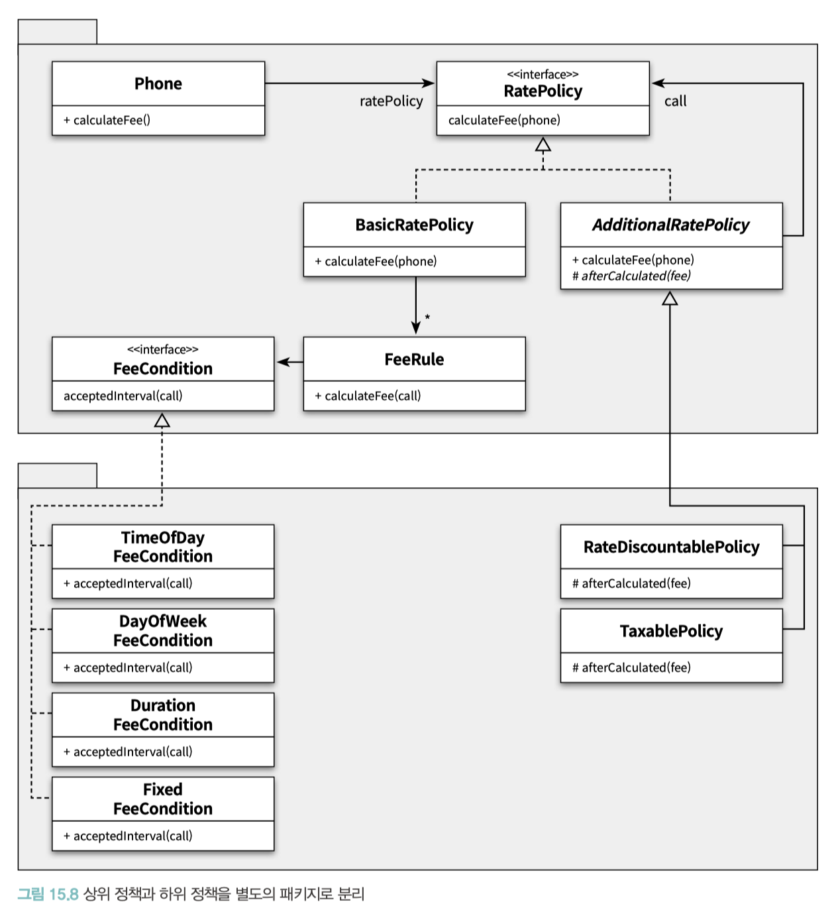

# CHAPTER 15. 디자인 패턴과 프레임워크

**TL;DR**

- **패턴**
  - 공통으로 사용할 수 있는 역할, 책임, 협력의 템플릿
  - 패턴은 출발점이다: 특정한 설계 이슈를 해결하기 위해 적절한 디자인 패턴을 이용해 설계를 시작하지만, **패턴이 설계의 목표가 돼서는 안 됨**
- **패턴 종류**
  - **아키텍처 패턴 ( Architecture Pattern )**
    - 미리 정의된 서브시스템들을 제공하고, 각 서브시스템들의 책임을 정의 하며, 서브시스템들 사이의 관계를 조직화하는 규칙과 가이드라인을 포함
  - **분석 패턴 ( Analysis Pattern )**
    - 도메인 내 개념적인 문제를 해결하는 데 초점을 두며, 업무 모델링 시에 발견되는 공통적인 구조를 표현하는 개념들의 집합 _- Fowler_
  - **디자인 패턴( Design Pattern )**
    - 다양한 변경을 다루기 위해 반복적으로 재사용할 수 있는 설계의 묶음
  - **이디엄( Idiom )**
    - 특정 언어의 기능을 사용해 컴포넌트, 혹은 컴포넌트 간의 특정 측면을 구현하는 방법을 서술 _- Buschman_
- **패턴 만능주의**: 패턴을 익힌 후에는 모든 설계 문제를 패턴으로 해결하려고 시도하곤 한다. _- 조슈아 케리에브스키, Kerievsky_
  - 패턴 구조를 맹목적으로 따르려 하면 불필요하게 복잡하고, 난해하며, 유지보수하기 어려운 시스템을 낳음
- **프레임워크**
  - 추상 클래스나 인터페이스를 정의하고 인스턴스 사이의 상호작용을 통해 시스템 전체 혹은 일부를 구현해 놓은 재사용 가능한 설계
  - 애플리케이션 개발자가 현재의 요구사항에 맞게 커스터마이징할 수 있는 애플리케이션의 골격 (skeleton)
- **제어 역전 (Inversion of Control) 원리**
  - 할리우드(Hollywood) 원리, 프레임워크가 애플리케이션에 속하는 서브클래스의 메서드를 호출
- 훅 (hook)
  - 프레임워크에서는 일반적인 해결책만 제공하고 애플리케이션에 따라 달라질 수 있는 특정한 동작은 비워두는데, 그리고 이렇게 완성되지 않은 채로 남겨진 동작

   

- 디자인 패턴
  - 다양한 변경을 다루기 위해 반복적으로 재사용할 수 있는 설계의 묶음
  - 소프트웨어 설계에서 반복적으로 발생하는 문제에 대해 반복적으로 적용할 수 있는 해결 방법
  - 목적: 설계를 재사용하는 것 → 변경의 방향과 주기를 이해하는 것만으로도 필요한 역할과 책임, 역할들의 협력 방식을 순간적으로 떠올릴 수 있게 함

- 프레임워크
  - 설계와 코드를 함께 재사용하기 위한 것
  - 다양한 환경에서 테스트를 거친 견고한 구현 코드를 쉽고 빠르 게 재사용할 수 있음

 

## 01. 디자인 패턴과 설계 재사용

### 소프트웨어 패턴 

**패턴이란**

> 내가 사용하는 패턴 정의는 하나의 실무 컨텍스트(practical context)에서 유용하게 사용해 왔고 다른 실무 컨텍스트에서도 유용할 것이라고 예상되는 아이디어(idea)다.
> 
> 아이디어라는 용어를 사용하는 이유는 어떤 것도 패턴이 될 수 있기 때문이다. 패턴은 “GOF”에서 이야기하는 것처럼 협력하는 객체 그룹일 수도 있고, 코플리엔(Coplien)의 프로젝트 조직 원리일 수도 있다. 
> 
> 실무 컨텍스트라는 용어는 패턴이 실제 프로젝트의 실무 경험에서 비롯됐다는 사실을 반영한다. 
> 흔히 패턴을 ‘발명했다’고 하지 않고 ‘발견했다’고 말한다.
> 
> 모델의 유용 성이 널리 받아들여지는 경우에만 패턴으로 인정할 수 있기 때문에 이 말은 타당하다. 
> 실무 프로젝트가 패턴보다 먼저지만 그렇다고 해서 실무 프로젝트의 모든 아이디어가 패턴인 것은 아니다: 패턴은 개발자들이 다른 컨 텍스트에서도 유용할 것이라고 생각하는 어떤 것이다
> 
> _- Fowler_

 

✔️ 패턴은 홀로 존재하지 않는다. 

- > 특정 패턴 내에 포함된 컴포넌트와 컴포넌트 간의 관계는 더 작은 패턴에 의해 서술될 수 있으며, 패턴들을 포함하는 더 큰 패턴 내에 통합될 수 있다 _- Buschman_ 
- > 연관된 패턴들의 집합들이 모여 하나의 패턴 언어(Pattern Language)를 구성한다. _- 크리스 토퍼 알렉산더_
- > 패턴 언어라는 용어가 지닌 제약 조건을 완화하기 위해 패턴 시스템(Pattern System) 이라는 용어 제안 _- POSA1, Buschman_

 

### 패턴 분류 

- **아키텍처 패턴 ( Architecture Pattern )**
  - 미리 정의된 서브시스템들을 제공하고, 각 서브시스템들의 책임을 정의 하며, 서브시스템들 사이의 관계를 조직화하는 규칙과 가이드라인을 포함한다 _- Buschman_
  - 소프트웨어의 전체적인 구조를 결정하기 위해 사용
  - 구체적인 소프트웨어 아키텍처를 위한 템플릿을 제공, 디자인 패턴과 마찬가지로 프로그래밍 언어나 프로그래밍 패러다임에 독립적
- **분석 패턴 ( Analysis Pattern )**
  - 업무 모델링 시에 발견되는 공통적인 구조를 표현하는 개념들의 집합 _- Fowler_
  - 도메인 내 개념적인 문제를 해결하는 데 초점
- **디자인 패턴( Design Pattern )**
- **이디엄( Idiom )**
  - 특정 프로그래밍 언어에만 국한된 하위 레벨 패턴
  - 주어진 언어의 기능을 사용해 컴포넌트, 혹은 컴포넌트 간의 특정 측면을 구현하는 방법을 서술 _- Buschman_
  - 언어에 종속적이기 때문에 특정 언어의 이디엄이 다른 언어에서는 무용지물이 될 수 있음

 

### 패턴과 책임-주도 설계

- 객체지향 설계에서 가장 중요한 일은 **올바른 책임을 올바른 객체에게 할당하고 객체 간의 유연한 협력 관계를 구축하는 것**

- 패턴은 공통으로 사용할 수 있는 역할, 책임, 협력의 템플릿
  - 반복적으로 발생하는 문제를 해결하기 위해 사용할 수 있는 공통적인 역할과 책임, 협력의 훌륭한 예제를 제공
  - 패턴을 따르면 특정한 상황에 적용할 수 있는 설계를 쉽고 빠르게 떠올릴 수 있음

 

### 패턴은 출발점이다

- 특정한 설계 이슈를 해결하기 위해 적절한 디자인 패턴을 이용해 설계를 시작하지만, **패턴이 설계의 목표가 돼서는 안 됨**

- **패턴 만능주의**: 패턴을 익힌 후에는 모든 설계 문제를 패턴으로 해결하려고 시도하곤 한다. _- 조슈아 케리에브스키, Kerievsky_
  - 패턴 구조를 맹목적으로 따르려 하면 불필요하게 복잡하고, 난해하며, 유지보수하기 어려운 시스템을 낳음
- 패턴은 복잡성의 가치가 단순성을 넘어설 때만 정당화돼야 하며, 항상 설계를 좀 더 단순하고 명확하게 만들 수 있는 방법이 없는지를 고민해야 함
- 코드를 공유하는 모든 사람들이 적용된 패턴을 알고 있어야 함
- **패턴을 가장 효과적으로 적용하는 방법은 패턴을 지향하거나 패턴을 목표로 리팩터링하는 것** _- 조슈아 케리에브스키_

 

## 02. 프레임워크와 코드 재사용

### 코드 재사용 대 설계 재사용

- 재사용 관점에서 설계 재사용보다 더 좋은 방법은 코드 재사용
- 가장 이상적인 형태의 재사용 방법은 설계 재사용과 코드 재사용을 적절한 수준으로 조합하는 것

설계를 재사용하면서도 유사한 코드를 반 복적으로 구현하는 문제 해결 방법 → 프레임워크

#### 프레임워크
- 구조적인 측면에 초점을 맞춘 정의: 추상 클래스나 인터페이스를 정의하고 인스턴스 사이의 상호작용을 통해 시스템 전체 혹은 일부를 구현해 놓은 재사용 가능한 설계
- 설계의 재사용에 초점을 맞춘 정의: 애플리케이션 개발자가 현재의 요구사항에 맞게 커스터마이징할 수 있는 애플리케이션의 골격(skeleton)

 

### 상위 정책과 하위 정책으로 패키지 분리하기

- 의존성 역전 원칙의 관점에서 세부 사항은 '변경'을 의미
- 동일한 역할을 수행하는 객체들 사이의 협력 구조를 다양한 애플리케이션 안에서 재사용하는 것이 핵심
- 이를 위해서는 변하는 것과 변하지 않는 것을 서로 분리

 

- 중요한 것은 패키지 사이의 의존성 방향
  - 의존성 역전 원리에 따라 추상화에만 의존하도록 의존성의 방향을 조정하고, 추상화를 경계로 패키지를 분리했기 때문에 세부 사항을 구현한 패키지는 항상 상위 정책을 구현한 패키지에 의존해야 함
- 상위 정책 패키지와 하위 정책 패키지를 물리적으로 분리하고 나면, 상위 정책 패키지를 여러 애플리케이션에서 재사용할 수 있는 기반이 마련된 것
- _재사용 가능한 요금 계산 로직을 구현한 프레임워크가 만들어진 것_

 

### 제어 역전 원리

- 의존성 역전은 의존성의 방향뿐 만 아니라 제어 흐름의 주체 역시 역전시킨다.

#### 제어 역전 (Inversion of Control) 원리
- 할리우드(Hollywood) 원리
- 프레임워크가 애플리케이션에 속하는 서브클래스의 메서드를 호출
- 프레임워크를 사용할 경우 개별 애플리케이션에서 프레임워크로 제어 흐름의 주체가 이동

#### 훅 (hook)
- 프레임워크에서는 일반적인 해결책만 제공하고 애플리케이션에 따라 달라질 수 있는 특정한 동작은 비워두는데, 그리고 이렇게 완성되지 않은 채로 남겨진 동작
- 훅의 구현 방식은 애플리케이션의 컨텍스트에 따라 달라진다 _Wirfs - Brock_

 