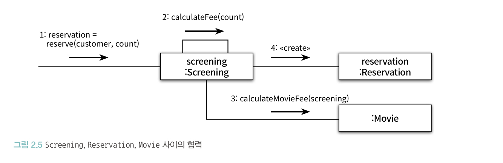
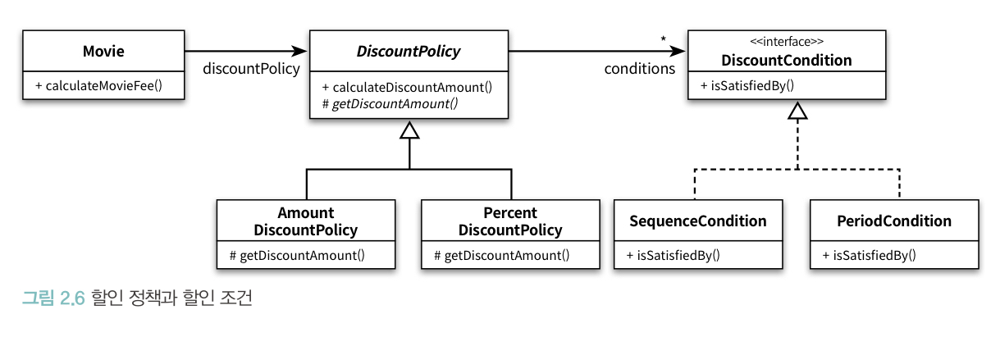

# CHAPTER 02. 객체지향 프로그래밍

**TL;DR**
- 객체지향 패러다임 특징: 요구사항과 프로그램을 객체를 동일한 관점에서 바라볼 수 있기 때문에 도메인 개념이 프로그램 객체와 클래스로 매끄럽게 연결될 수 있음
- 프로그래머의 역할을 클래스 작성자 (class creator)와 클라이언트 프로그래머 (client programmer)로 구분 
  - 클라이언트 프로그래머: 필요한 클래스들을 엮어서 애플리케이션을 빠르고 안정적으로 구축
  - 클래스 작성자: 구현 은닉 - 클라이언트 프로그래머가 내부에게 필요한 부분만을 공개
- 객체지향 프로그램을 작성할 때는 협력의 관점에서 어떤 객체가 필요한지 결정하고, 객체들의 공통 상태와 행위를 구현하기 위해 클래스를 작성
- 객체가 다른 객체와 상호작용할 수 있는 유일한 방법은 **객체 간 메시지 전송** 뿐
- **유연한 설계**와 **이해하기 쉬운 코드 및 디버깅**은 트레이드오프 관계: 항상 유연성과 가독성 사이에서 고민해야 함
- 추상화는 요구사항의 정책을 높은 수준에서 서술할 수 있고, 상위 정책을 쉽고 간단하게 표현함으로써 더 유연한 설계를 하게 해줌


## 01. 영화 예매 시스템

**요구사항**

- 영화 한 편은 특정 할인을 받을 수 있음
  - **할인 조건 discount condition**
    - 순서 조건 sequence discount condition: 상영 순번을 이용해 할인 여부 결정
    - 기간 조건 period discount condition: 영화 상영 시작 시간을 이용해 할인 여부를 결정
  - **할인 정책 discount policy**: 할인 요금 결정
    - 금액 할인 정책 amount discount policy: 예매 요금에서 일정 금액 할인
    - 비율 할인 정책 percent discount policy: 정가에서 일정 비율의 요금을 할인
    - *<small>영화 별로 할인 정책은 없거나 한 가지를 가질 수 있음</small>


## 02. 객체지향 프로그래밍을 향해

도메인: 문제 해결을 위해 사용자가 프로그램을 사용하는 분야

<pre>
<b>📌 객체 지향 패러다임 특징</b> 
: 요구사항을 분석하는 초기 단계부터 프로그램을 구현하는 마지막 단계까지 객체라는 동일한 추상화 기법을 사용할 수 있음
요구사항과 프로그램을 객체라는 동일한 관점에서 바라볼 수 있기 때문에 도메인을 구성하는 개념들이 프로그램의 객체와 클래스로 매끄럽게 연결될 수 있음 
</pre>

#### 자율적인 객체

> **✔️ 객체의 특징**
> - 상태(state)와 행동(behavior)을 가지는 복합적인 존재
> - 스스로 판단하고 행동하는 자율적인 존재

- 접근 제어: 객체의 변경을 관리할 수 있는 기법으로, 변경될 가능성이 있는 세부적인 구현 내용을 private 영역 내로 감춤 
- 인터페이스와 구현의 분리(separation of interface and implementation) 원칙을 기억하자

#### 프로그래머의 자유

- 프로그래머의 역할을 **클래스 작성자 (class creator)** / **클라이언트 프로그래머 (client programmer)**로 구분하는 것이 좋음

<pre>
<b>✔ 클라이언트 프로그래머 (client programmer)</b>
- 목표: 필요한 클래스들을 엮어서 애플리케이션을 빠르고 안정적으로 구축

<b>✔ 클래스 작성자 (class creator)</b>
- 목표: 구현 은닉. 클라이언트 프로그래머가 내부에게 필요한 부분만을 공개 
</pre>


### Collaboration

객체지향 프로그램을 작성할 때는 먼저
**1. 협력의 관점에서 어떤 객체가 필요한지를 결정**하고, **2. 객체들의 공통 상태와 행위를 구현하기 위해 클래스를 작성**해야 한다




**객체 간 메시지 전송**
- 객체가 다른 객체와 상호작용할 수 있는 유일한 방법 
- 다른 객체에게 요청이 도착할 때 해당 객체가 메시지를 수신
- 메서드: **수신된 메시지를 처리**하기 위한 특정된 해당 객체만의 방식


## 03. 할인요금 구하기


- DiscountPolicy는 **1. 인스턴스를 생성할 필요가 없기 때문에 추상 클래스로 구현**하며 **2. 중복 코드**를 둔다
  1. AmountDiscountPolicy와 PercentDiscountPolicy가 DiscountPolicy 추상 클래스를 구현하는 상속 관계를 가짐
  2. 중복 코드는 공통으로 사용되는 메소드 혹은 추상 메서드(abstract method)로 구현된다

- **Template Method Pattern**: 부모 클래스에 기본적인 알고리즘의 흐름을 구현하고 중간에 필요한 처리를 자식 클래스엑 위임하는 디자인 패턴 


- 부모 클래스에 기본적인 알고리즘의 흐름을 구현하고 중간에 필요한 처리를 자식 클래스에게 위임하는 디자인 패턴을 **Template Method**라고 부른다.





## 04. 상속과 다형성

#### 컴파일 시간 의존성과 실행 시간 의존성

- **코드의 의존성**과 **실행 시점의 의존성**은 서로 다를 수 있다
  - 유연하고, 쉽게 재사용할 수 있으며, 확장 가능한 객체지향 설계가 가지는 특징
  - 하지만, 코드의 의존성과 실행 시점의 의존성이 달라질 수록 **코드는 이해하기 어려워진다** 

#### 설계 유연 ⬆ <=> 코드 이해 및 디버깅 ⬇

- 훌륭한 객체지향 설계자가 되려면: 항상 유연성과 가독성 사이에서 고민해야 한다
- 무조건 유연한 설계도, 무조건 읽기 쉬운 코드도 정답이 아니다


### 차이에 의한 프로그래밍 (programming by difference)
: 부모 클래스와 다른 부분만을 추가해서 새로운 클래스를 쉽고 빠르게 만드는 방법

### 다형성

```java
public class Movie {
    // ...
    public Money calculateMovieFee(Screening screening) {
        return fee.minus(defaultDiscountPolicy.calculateDiscountAmount(screening));
    }
}
```

- Movie의 calculateMovieFee 실행 
- 추상 클래스로 정의된 discountPolicy의 calculateDiscountAmount를 호출
- Movie의 calculateMovieFee 메서드는 항상 동일한 메시지를 전달
- 하지만, **실제로 어떤 메서드가 실행될 것인지는 메시지를 수신하는 객체의 클래스가 무엇이냐에 따라 달라짐** => 다형성


## 05. 추상화와 유연성

추상화의 두가지 장점
- 추상화의 계층만 따로 떼어 놓고 살펴보면 요구사항의 정책을 높은 수준에서 서술할 수 있음
- 설계가 좀 더 유연해짐: 상위 정책을 쉽고 간단하게 표현할 수 있음

<br/>

- 상위 정책을 기술한다는 것 = 기본적인 애플리케이션의 협력 흐름을 기술
- 추상화를 이용해 상위 정책을 표현하면 기존 구조를 수정하지 않고도 새로운 기능을 쉽게 추가하고 확장할 수 있음


### 유연한 설계

할인 정책이 없는 영화라면 아래와 같은 코드를 추가해야 할까?

<pre><code lang="java">
public class Movie {
    // ...
    public Money calculateMovieFee(Screening screening) {<b>
        if (defaultDiscountPolicy == null) {
            return fee;
        }</b>

        return fee.minus(defaultDiscountPolicy.calculateDiscountAmount(screening));
    }
}
</code></pre>

- 문제점: 할인 정책이 없는 경우를 예외 케이스로 취급
  - 책임의 위치를 결정하기 위해 조건문을 사용하는 것은 협력의 설계 측면에서 대부분의 경우 좋지 않은 선택

일관된 설계를 위해서는 아래와 같은 NoneDiscountPolicy를 추가하자.

```java 
public class NoneDiscountPolicy extends DiscountPolicy {

    @Override
    protected Money getDiscountAmount(Screening screening) {
        return Money.ZERO;
    }
}
```

📌 Movie와 DiscountPolicy 수정없이 NoneDiscountPolicy라는 새로운 클래스를 추가하는 것만으로 애플리케이션의 기능을 확장

```java
Movie starWars = new Movie("스타워즈",
     Duration.ofMinutes(210),
     Money.wons(10_000),
     new NoneDiscountPolicy()
);
```

=> 유연성이 필요한 곳에 추상화를 사용하라


### 추상 클래스와 인터페이스 트레이드 오프 (v2)

NoneDiscountPolicy의 getDiscountAmount는 호출되지 않는다. DiscountPolicy의 `List<DiscountCondition> conditions` 속성이 빈 값이기 때문에 항상 0원을 반환할 것이다.

-> 문제 해결: Interface로 변경

- 이상적으로는 인터페이스를 사용하도록 변경한 설계가 더 좋을 것
- 현실적으로는 NoneDiscountPolicy만을 위한 인터페이스 추가가 과하다는 생각이 들 수도 있음

-> 구현과 관련된 모든 것들이 트레이드오프의 대상이 될 수 있다


#### 상속 vs. 합성 (inheritance vs. composition)

**상속의 단점**
- 캡슐화를 위반
  - 자식 클래스가 부모 클래스의 내부 구조를 잘 알고 있어야 한다
  - 자식 클래스가 부모 클래스에 강하게 결합되도록 만들기 때문에 부모 클래스를 변경할 때 함께 변경될 가능성이 크다
- 설계를 유연하지 못하게 만든다
  - 부모와 자식 관계를 컴파일 시점에 결정 -> 실행 시점의 객체의 종류를 변경하는 것이 불가능

```java

public class Movie {
    // ...
    public void changeDiscountPolicy(DiscountPolicy discountPolicy) {
        this.discountPolicy = discountPolicy;
    }
}
```

**합성**
인터페이스에 정의된 메시지를 통해서만 코드를 재사용하는 방법

