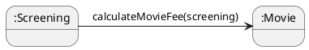
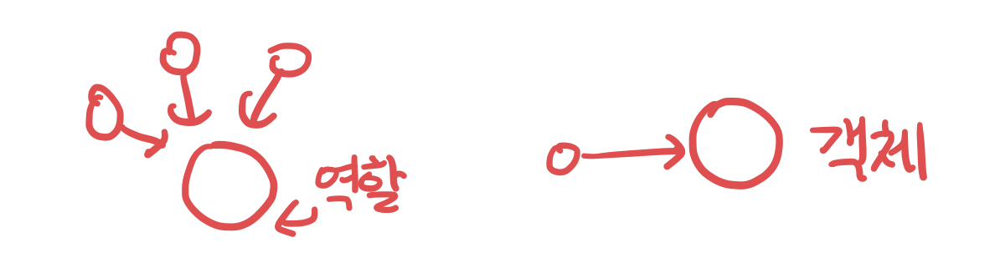

# CHAPTER 03. 역할, 책임, 협력

**TL;DR**
- 객체지향 패러다임의 관점에서 핵심: 역할(role), 책임(responsibility), 협력(collaboration)
- 메시지 전송: 객체 사이의 협력을 위해 사용할 수 있는 유일한 커뮤니케이션 수단
- 협력 > 행동 > 상태: 협력은 객체 설계의 문맥(context)을 제공하며 행동, 상태를 결정
- CRC 카드 활용: 역할 식별, 책임 할당, 협력을 명시적이고 구체적인 실용적인 설계 기법
- Information Expert (정보 전문가) 패턴: 책임을 수행하는 데 필요한 정보를 가장 잘 알고 있는 전문가에게 그 책임을 할당하는 것
- 역할 / 객체: 객체가 항상 하나의 역할을 수행한다면 둘은 동일한 것, 하지만 협력에서 **하나 이상의 객체가 동일한 책임을 수행**할 수 있으면 **역할**(서로 다른 방법으로 실행할 수 있는 책임의 집합)
- 협력 (Collaboration) -- _reference_ → 역할 (Role) -- _select from_ → 객체 (Object) -- _instance of_ → 클래스 (Class)

---

객체지향 패러다임의 관점에서 핵심: 역할(role), 책임(responsibility), 협력(collaboration)
- 협력: 객체들이 애플리케이션의 기능을 구현하기 위해 수행하는 상호작용
- 책임: 객체가 협력에 참여하기 위해 수행하는 로직
- 역할: 객체들이 협력 안에서 수행하는 책임들이 모여 객체가 수행

⚠️ 애플리케이션의 기능을 구현하기 위해 어떤 협력이 필요하고, 협력을 위해 어떤 역할과 책임이 필요한지를 고민하지 않은 채 너무 이른 시기에 구현에 초점을 맞추는 것은 변경하기 어렵고 유연하지 못한 코드를 낳는 원인이 됨

  

## 01. 협력

- 메시지 전송 (message sending): 객체 사이의 협력을 위해 사용할 수 있는 유일한 커뮤니케이션 수단

> 협력이란 어떤 객체가 다른 객체에게 무엇인가를 요청하는 것이다. 한 객체는 어떤 것이 필요할 때 다른 객체에게 전적으로 위임하거나 서로 협력한다.즉,두 객체가 상호작용을 통해 더 큰 책임을 수행하는 것이다. 객체 사이의 협력을 설계할 때는 객체를 서로 분리된 인스턴스가 아닌 협력하는 파트너로 인식해야 한다.

- 자신이 할 수 없는 일을 다른 객체에게 위임하면 협력에 참여하는 객체들의 전체적인 자율성을 향상시킬 수 있음
- Screening이 Movie에게 요금을 계산하도록 위임하는 이유: Movie가 자율적인 존재가 되기 위해서 자신이 알고 있는 정보를 이용해 직접 요금을 계산해야 함 

 

### 협력이 설계를 위한 문맥을 결정한다

> 어떤 객체도 섬이 아니다.

- 애플리케이션 안에 어떤 객체가 필요하다면, 그 객체가 어떤 협력에 참여하고 있기 때문
- 객체가 협력에 참여할 수 있는 이유는 협력에 필요한 적절한 행동을 보유하고 있기 때문

- 협력이라는 문맥을 고려하지 않고 Movie의 행동을 결정하는 것은 아무런 의미가 없음. 협력이 존재하기 때문에 객체가 존재하는 것
- 협력 > 행동 > 상태: 협력은 객체 설계의 문맥(context)을 제공

  

## 02. 책임

: 협력에 참여하기 위해 객체가 수행하는 행동

- 객체에 의해 정의되는 응집도 있는 집합

> 객체지향 개발에서 가장 중요한 능력은 책임을 능숙하게 소프트웨어 객체에 할당하는 것
> - Laman

 

<pre>
<b>📌 CRC Card</b>: Candidate, Responsibility, Collaborator
하나의 CRC 카드는 협력에 참여하는 하나의 <b>후보</b>를 표현

✔️ 카드 한쪽 면: 후보가 외부에 제공해야 하는 서비스를 하나의 문장으로 표현한 목적 기술
✔️ 카드 다른 면: 3개의 구획으로 나뉜 면 - Candidate, Responsibility, Collaborator
    1. Candidate: 후보 이름
    2. Responsibility: 목적을 세분화해서, 무엇을 알고 무엇을 해야하는지에 대한 책임을 차례대로 적음
    3. Collaborator: 협력자들 기술, 후보가 자신의 책임을 완수하기 위해 정보나 기능을 요청할 대상 후보를 의미

효과적으로 일하는 사람들은 추상적이고 가상적인 것보다는 구체적이고 실재적인 것을 사용하는 경향이 있다.
CRC 카드는, 역할을 식별하고, 책임을 할당하며, 협력을 명시적으로 표현하는 구체적이면서도 실용적인 설계 기법이다. 
</pre>
  

### 책임 할당

- Information Expert (정보 전문가) 패턴: 책임을 수행하는 데 필요한 정보를 가장 잘 알고 있는 전문가에게 그 책임을 할당하는 것

 

<pre>
<b>📌 영화 예매 시스템으로 확인하는 정보 전문가 책임 할당 방법</b>

1. 사용자에게 제공할 '영화 예매' 기능을 제공할 책임 할당: "예매하라" 메시지 생성
   <small>객체가 책임을 수행하게 하는 유일한 방법 -> 메시지를 전송하는 것이기 때문</small>
2. 메시지를 처리할 정보 전문가에게 해당 책임을 할당: "Screening" 객체에 "예매하라" 메시지 전송
3. Screening객체는 '영화 가격'의 정보 전문가가 아니기 때문에 새로운 메시지 생성: "가격을 계산하라" 메시지 생성
4. 가격 계산 정보를 가장 많이 알고 있는 정보 전문가: "Movie" 객체에게 가격을 계산할 책임 할당
5. Movie는 요금을 계산하는 데 필요한 요청을 외부에 전송해야 함: "할인 요금을 계산하라" 메시지 생성
6. ...
</pre>

=> 경우에 따라 **응집도**와 **결합도의 관점**에서 **정보 전문가가 아닌 다른 객체에게 책임을 할당하는 것이 더 적절한 경우도 있음**

=> 기본적인 전략은 **책임을 수행할 정보 전문가를 찾아 책임을 할당**하는 것

→ 상태와 행동을 함께 가지는 자율적인 객체를 만들 가능성이 높아지기 때문 

 

### 책임 주도 설계
: Responsibility-Driven Design. RDD.

- 책임을 찾고 책임을 수행할 적절한 객체를 찾아 책임을 할당하는 방식으로 협력을 설계하는 방법

<pre>
<b>📌 책임 주도 설계 방법</b>
1. 시스템이 사용자에게 제공해야 하는 기능인 시스템 책임을 파악
2. 시스템 책임을 더 작은 책임으로 분할
3. 분할된 책임을 수행할 수 있는 적절한 객체 또는 역할을 찾아 책임을 할당
4. 객체가 책임을 수행하는 도중, 다른 객체의 도움이 필요한 경우 이를 책임질 적절한 객체 또는 역할을 찾음
5. 해당 객체 또는 역할에게 책임을 할당함으로써 두 객체가 협력하도록 설계
</pre>

 

### 메시지가 객체를 결정한다

객체에게 책임 할당 시 중요한 건 -> 메시지를 먼저 식별하는 것

이유 1. 최소한의 인터페이스를 가질 수 있게 만든다.
이유 2. 객체는 충분히 추상적인 인터페이스를 가질 수 있게 된다.

 

### 행동이 상태를 결정한다.

행동이 아닌 상태에 초점을 맞추게 되면, 상태에 맞춰 행동을 결정하게 된다.
_→ Data-Driven Design [레베카 워프스브록]_

하지만 이는 객체의 내부 구현이 객체의 퍼블릭 인터페이스에 노출되도록 만들기 때문에 캡슐화를 저해한다.

 

**중요한 건, 상태가 아니라 행동이다.**

캡슐화를 위반하지 않기 위해서는 협력을 우선하여 생각해야 하고, 협력에 초점을 맞춰야만 응집도가 높고 결합도가 낮은 객체들을 창조할 수 있으며 훌륭한 책임을 수확할 수 있다.
그러니, 상태가 우선이 아니라 행동이 우선이다.

  

## 03. 역할

### 유연하고 재사용 가능한 협력

역할: 메시지에 응답할 수 있는 대표자를 생각할 때, 대표자를 협력 안에서 두 종류의 객체를 교대로 바꿔 끼울 수 있는 일종의 슬롯으로 생각할 수 있는데, 이 슬롯 바로 역할이다.

> 역할은 다른 것으로 교체할 수 있는 책임의 집합이다.
> 
> _- Wirfs-Brock_

 

### 객체 vs. 역할

협력에 참여하는 후보가 여러 종류의 객체에 의해 수행될 필요가 있다면 그 후보는 역할이 되지만 단지 한 종류의 객체만이 협력에 참여할 필요가 있다면 후보는 객체가 된다.

> 객체에 관해 생각할 때 "이 객체가 무슨 역할을 수행해야 하는가?"라고 자문하는 것이 도움이 된다. 
> 이 질문은 객체가 어떤 형태를 띠어야 하는지, 그리고 어떤 동작을 해야 하는지에 집중할 수 있게 도와준다.

 

- 객체: 적합한 책임을 수행하는 대상이 한 종류일 때
- 역할: 여러 종류의 객체들이 참여할 수 있을 때

만약 동일한 종류의 객체가 하나의 역할을 항상 수행한다면 둘은 동일한 것.

하지만 어떤 협력에서 **하나 이상의 객체가 동일한 책임을 수행**할 수 있다면, 역할은 서로 다른 방법으로 실행할 수 있는 책임의 집합이 된다.

✔️ 협력 (Collaboration) -- _reference_ → 역할 (Role) -- _select from_ → 객체 (Object) -- _instance of_ → 클래스 (Class)

글쓴이의 견해: 설계 초반에는 적절한 책임과 협력의 큰 그림을 탐색하는 것이 가장 중요한 목표여야 하고, 역할과 객체를 명확하게 구분하는 것은 그렇게 중요하지는 않다.

