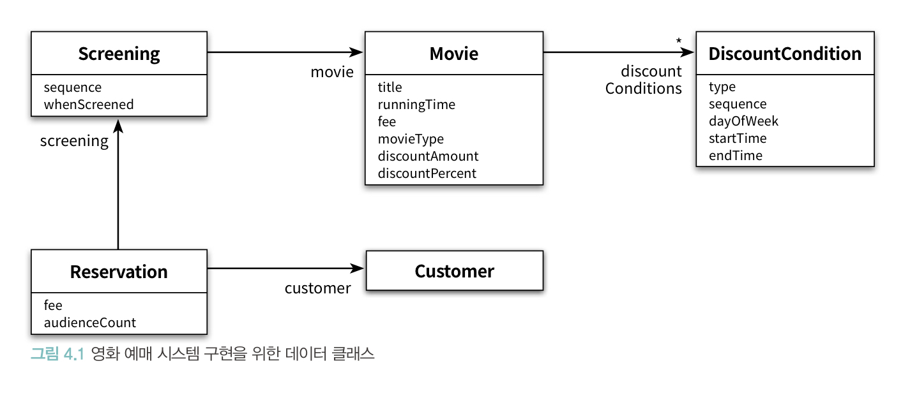
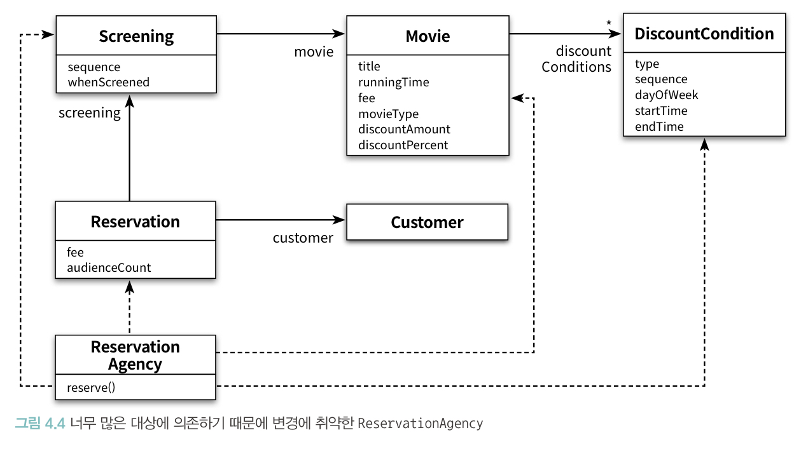
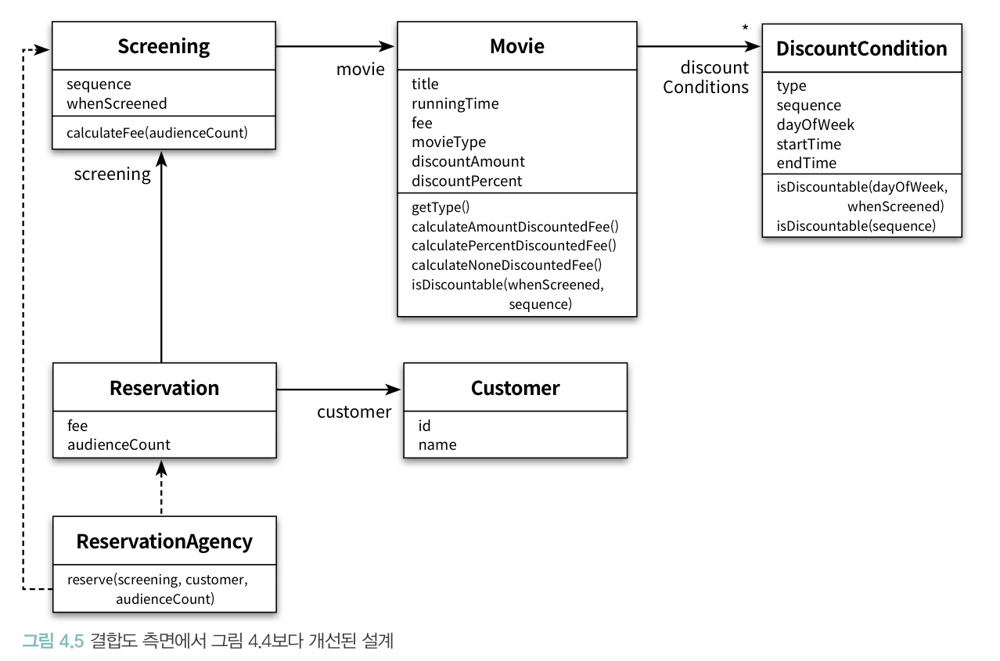

# CHAPTER 04. 설계 품질과 트레이드오프

**TL;DR**
- 좋은 설계란 오늘의 기능을 수행하면서 내일의 변경을 수용할 수 있는 설계이다.
- 객체지향 프로그램을 통해 전반적으로 얻을 수 있는 장점은 오직 설계 과정 동안 캡슐화를 목표로 인식할 때만 달성될 수 있다.
- 추측의 의한 설계 전략은 접근자와 수정자에 과도하게 의존하게 하는 설계 방식이다.
- 결론: 데이터 중심의 설계는 **너무 이른 시기에 데이터에 대해 고민**하기 때문에 **캡슐화에 실패**
- 객체의 구현을 먼저 결정하고 협력을 고민하기 때문에 이미 구현된 객체의 인터페이스를 억지로 끼워맞출 수 밖에 없다.

**객체지향 설계의 두 가지 방법 :**

1. 상태를 중심으로 분할: 데이터 중심 관점. 
   - _데이터가 무엇인가_
   - 객체 내부에 저장되는 데이터를 기반으로 시스템을 분할하는 방법
   - 자신이 포함하는 데이터를 조작하는 데 필요한 오퍼레이션을 정의
2. 책임을 중심으로 분할 
   - _책임이 무엇인가_
   - 다른 객체가 요청할 수 있는 오퍼레이션을 위해 필요한 상태를 보관

<br/>

## 01. 데이터 중심의 영화 예매 시스템

### Movie

<table><tr><th>책임 중심</th><th>데이터 중심</th></tr><tr><td>

```java
public class Movie {
    private String title;
    private Duration runningTime;
    private Money fee;
    protected DiscountPolicy discountPolicy;
}
```

</td><td>

```java
public class Movie {
    private String title;
    private Duration runningTime;
    private Money fee;
    private DiscountPolicy discountPolicy;

    private MovieType movieType;
    private Money discountAmount;
    private double discountPercent;
}
```

</td></tr></table>

<br/>

### DiscountCondition

할인 조건을 구현하는 데 필요한 데이터는 무엇인가? _DiscountConditionType Enum_

```java
public enum DiscountConditionType {
    SEQUENCE,   // 순번 조건
    PERIOD      // 기간 조건
}
```

<br/>

- **책임 중심**: DiscountCondition, PeriodCondition, SequenceCondition
- **데이터 중심**: DiscountConditionType, DiscountCondition

<table><tr><th>책임 중심</th><th>데이터 중심</th></tr><tr><td>

```java
public interface DiscountCondition {
   boolean isSatisfiedBy(Screening screening);
}

public class PeriodCondition implements DiscountCondition {
   private DayOfWeek dayOfWeek;
   private LocalTime startTime;
   private LocalTime endTime;
}

public class SequenceCondition implements DiscountCondition {
    private int sequence;
}
```

</td><td>

```java
public class DiscountCondition {
    private DiscountConditionType type;
    private int sequence;

    private DayOfWeek dayOfWeek;
    private LocalTime startTime;
    private LocalTime endTime;
}
```

</td></tr></table>

### ERD




### ReservationAgency

데이터 클래스들을 조합해서 영화 예매 절차 구현: <code>reserve()</code> 

[ReservationAgency.java](./demo/src/main/java/com/gngsn/chapter4/dataIntensive/ReservationAgency.java)

_크게 두 부분으로 분할:_
1. DiscountCondition 순회하며 할인 가능 여부 확인
2. 할인 가능 여부 체크 후 적절한 예매 요금 계산

<br/>

## 02. 설계 트레이드오프

### 캡슐화
- 캡슐화가 중요한 이유는 불안정한 부분과 안정적인 부분을 분리해서 변경의 영향을 통제할 수 있기 때문
- > 객체지향 프로그램을 통해 전반적으로 얻을 수 있는 장점은 오직 설계 과정 동안 캡슐화를 목표로 인식할 때만 달성될 수 있다. - Wirfs-Brock
- 변경될 가능성이 높은 부분을 **구현**이라고 부르고, 상대적으로 안정적인 부분을 **인터페이스**라고 부름

### 응집도
- 모듈에 포함된 내부 요소들이 연관돼 있는 정도
- 변경의 관점에서 응집도: 변경이 발생할 때 모듈 내부에서 발생하는 변경의 정도

### 결합도
- 의존성의 정도
- 변경의 관점에서 결합도: 한 모듈이 변경되기 위해 다른 모듈의 변경을 요구하는 정도
- 인터페이스에 의존하도록 코드를 작성해야 낮은 결합도를 얻음
  - > 인터페이스에 대해 프로그래밍하라 - GoF

좋은 설계; 오늘의 기능을 수행하면서 내일의 변경을 수용할 수 있는 설계

<br/>

## 03. 데이터 중신의 영화 예매 시스템의 문제점





1. 캡슐화 위반
   - Movie의 <code>fee</code>는 접근자 제한을 하지만, <code>getFee</code>와 <code>setFee</code>로 변수의 존재를 명시
2. 높은 결합도
   - 클라이언트가 객체 구현에 강하게 결합됨 (캡슐화가 약하기 때문)
   - 하나의 제어 객체가 다수의 데이터 객체에 강하게 결합 (ReservationAgency는 모든 의존성이 모이는 결합도의 집결지)
3. 낮은 응집도
   - 아무 상관없는 코드들이 영향을 받음

<br/>

### 추측의 의한 설계 전략(design-by-guessing strategy)
- 객체가 다양한 상황에서 사용될 수 있을 것이라는 막연한 추측을 기반으로 설계
- 접근자와 수정자에 과도하게 의존하는 설계 방식

<br/>

## 04. 자율적인 객체를 향해

### 캡슐화를 지켜라

[Rectangle.java](./demo/src/main/java/com/gngsn/chapter4/rectangle/Rectangle.java)

#1. 높은 코드 중복 가능성
: 가형, 사각형의 너비와 높이를 증가시키는 코드가 팔요하다면 -> getRight, getBottom 호출 후 ... 

#2. 변경에 취약
: legth와 height으로 사각형을 포함한다고 하면 접근자 메서드의 수정을 야기


#### 📌 Rectangle Class 캡슐화 강화

```java
public class Rectangle {
    public void enlarge(int multiple) {
        right *= multiple;
        bottim *= multiple;
    }
}
```

- Rectangle 변경 주체를 외부 객체에서 Rectangle 내부로 이동

**👉🏻 책임을 객체 내부로 이동**

<br/>

### 자신의 데이터를 책임지는 객체

데이터를 유지하는 방식
> "이 객체가 어떤 데이터를 포함해야 하는가?"

위 질문은 아래 두 사항을 살펴봐야 한다.
1. 객체가 어떤 데이터를 포함해야 하는지
2. 객체가 데이터에 대해 수행해야 하는 오퍼레이션은 무엇인지 

**v2 => 아래 메서드를 추가 / 수정하자**
- **DiscountCondition**: isDiscountable()
- **Movie**: isDiscountable(), calculateAmountDiscountFee(), calculatePercentDiscountFee(), calculateNoneDiscountFee()
- **Screening**: calculateFee()
- **ReservationAgency**: reserve()

#### 수정 후 ERD



<br/>

## 05. 하지만 여전히 부족하다

04장에서 수정한 코드는 캡슐화 관점에서 향상된 것은 맞지만, 아직 부족하다.

<br/>

### 캡슐화 위반

```java
class DiscountCondition {
   public boolean isDiscountable(DayOfWeek dayOfWeek, LocalTime time) {...}
   public boolean isDiscountable(int sequence) {...}    
}
```

- 위 두 메소드는 객체 내부에 <code>DayOfWeek</code> 타입의 <code>dayOfWeek</code>, <code>LocalTime</code> 타입의 <code>time</code>, 그리고 <code>int</code> 형의 <code>sequence</code> 변수가 포함된다는 것을 내포한다.
내부 구현이 외부에 노출되면서 - _캡슐화 부족_ - 파급 효과(ripple effect)를 발생시킨다.
- Movie 객체도 <code>calculateAmountDiscountFee, calculatePercentDiscountFee, calculateNoneDiscountFee</code> 메소드로 어떤 할인 정책을 외부에 노출시키고 있다.

<br/>

### 높은 결합도

결합도가 높을 경우 **한 객체의 구현을 변경할 때 다른 객체에게 변경의 영향이 전파될 확률이 높아진다는 사실을 기억**하라.

DiscountCondition이 변경될 때 Movie를 변경해야만 한다. 
- 할인 조건 추가/변경/삭제
- 할인 조건 만족 여부를 수정할 때 (<code>isDiscountable</code> 변경 필요)

### 낮은 응집도 

할인 조건의 종류를 변경하기 위해서는 DiscountCondition, Movie 뿐만 아니라, Movie를 사용하는 Screening도 수정해야 한다.

<br/>

## 06. 데이터 중심 설계의 문제점

- 너무 이른 시기에 데이터에 관해 결정하도록 강요
- 협력이라는 문맥을 고려 X, 객체를 고립시킨 채 오퍼레이션을 결정

<br/>

### 데이터 중심 설계: 객체의 행동보다는 상태에 초점

- 첫 번째 설계가 실패한 이유: 데이터와 기능을 분리하는 절차적 프로그래밍 방식을 따른다
  - 상태와 행동을 하나의 단위로 캡슐화하는 객체지향 패러다임에 반하는 것
- 두 번째 설계가 실패한 이유: 데이터를 먼저 결정하고 데이터 처리 오퍼레이션을 나중에 결정하는 방식은 데이터에 관한 지식이 객체의 인터페이스에 노출

-> 결론: 데이터 중심의 설계는 **너무 이른 시기에 데이터에 대해 고민**하기 때문에 **캡슐화에 실패**

<br/>

### 데이터 중심 설계: 객체를 고립시킨 채 오퍼레이션을 정의

데이터 중심 설계에서 초점은 객체의 외부가 아니라 내부로 향한다.
- 객체의 구현이 이미 결정된 상태에서 다른 객체와의 협력 방법을 고민 -> 이미 구현된 객체의 인터페이스를 억지로 끼워맞출 수밖에 없음
- 두 번째 설계가 실패한 이유: 객체의 인터페이스에 구현이 노출 -> 협력이 구현 세부사항에 종속 => 객체의 내부 구현이 변경됐을 때 협력하는 객체 모두가 영향


