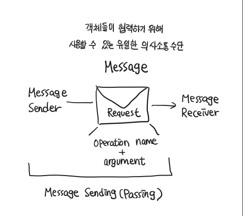

# CHAPTER 06. 메시지와 인터페이스

**TL;DR**
- **Law of Demeter**: 디미터 법칙. 객체의 내부 구조에 강하게 결합되지 않도록 **협력 경로를 제한**하라
  - Use only one dot.
  - 특정 조건의 클래스에게만 메시지 전송: **① 메서드의 인자**로 전달된 클래스, **② 해당 메서드를 가진 클래스** 자체, **③ 해당 메서드를 가진 클래스의 인스턴스 변수 클래스**
  - Shy Code: 부끄럼타는 코드, 디미터 법칙에서 보이는 패턴, 불필요한 어떤 것도 다른 객체에게 보여주지 않으며, 다른 객체의 구현에 의존하지 않는 코드
  - Train Wreck: 기차 충돌, 디미터 법칙 위반 패턴, 여러 대의 기차가 한 줄로 늘어진 것처럼 보이는 코드로 내부 구현이 외부로 노출됐을 때 나타나는 전형적인 형태. 
- **Tell, Don't Ask**: 묻지 말고 시켜라. **객체의 내부 구조를 묻는 메시지**가 아니라 **수신자에게 무언가를 시키는 메시지**를 강조하는 법칙
- **의도를 드러내는 선택자(Intention Revealing Selector)**: 무엇을 하느냐에 따라 메서드의 이름을 짓는 패턴
- **명령-쿼리 분리**
  - Command: 객체의 **상태를 수정**하는 오퍼레이션
  - Query: 객체와 관련된 **정보를 반환**하는 오퍼레이션
- 원칙을 맹신하지 마라, **원칙이 적절한 상황과 부적절한 상황을 판단할 수 있는 안목을 길러라.**
- Design By Contract: 계약에 의한 설계. 협력을 위해 클라이언트와 서버가 준수해야 하는 제약을 코드 상에 명시적으 로 표현하고 강제할 수 있는 방법

<br/>

## 01. 협력과 메시지

### 클라이언트-서버 모델

- Client: 메시지를 전송하는 객체
- Server: 메시지를 수신하는 객체
- 협력: 클라이언트가 서버의 서비스를 요청하는 단방향 상호작용

<br/>

#### 용어 정리

- 메시지: 객체가 다른 객체와 협력하기 위해 사용하는 의사소통 메커니즘
  - 
- 오퍼레이션: 객체가 다른 객체에게 제공하는 추상적인 서비스. 메시지 전송자는 고려하지 않은 채 메시지 수신 객체의 인터페이스만을 강조
- 메서드: 메시지에 응답하기 위해 실행되는 코드 블록.
  - 오퍼레이션의 구현체: 오퍼레이션과 메서드의 구분은 다형성의 개념과 연결
- 퍼블릭 인터페이스: 객체가 협력에 참여하기 위해 외부에서 수신할 수 있는 메시지의 묶음
- 시그니처: 오퍼레이션이나 메서드의 명세를 나타낸 것. 오페레이션 이름 + 파라미터 목록

<br/>

## 02. 인터페이스와 설계 품질

<small>

- Law of Demeter, 디미터 법칙
- Tell, Don't Ask, 묻지 말고 시켜라
- 의도를 드러내는 인터페이스
- 명령-쿼리 분리

</small>

<br/>

### Law of Demeter, 디미터 법칙
_: 객체의 내부 구조에 강하게 결합되지 않도록 **협력 경로를 제한**하라_

- 낯선 자에게 말하지 말라 ( don't talk to strangers )
- 오직 인접한 이웃하고만 말하라 ( only talk to your immediate neighbors )
- 오직 하나의 도트만 사용하라 ( use only one dot )

디미터 법칙 가이드: 클래스가 해당 **① 메서드의 인자**로 전달된 클래스이거나, **② 해당 메서드를 가진 클래스** 자체이거나, **③ 해당 메서드를 가진 클래스의 인스턴스 변수 클래스**에게만 메시지를 전송해야한다.

**즉 아래와 같은 경우라고 한정지을 수 있음**

- this 객체
- 메서드의 매개변수
- 메서드 내에서 생성된 지역 객체
- this의 속성
- this의 속성인 컬렉션의 요소


<table>
<tr>
<th>Before</th>
<th>After</th>
</tr><tr>
<td>
<small>Chapter4 ReservationAgency (v1)</small>

``` java
public class ReservationAgency {
    public Reservation reserve(Screening screening, Customer customer, int audienceCount) {
        Movie movie = screening.getMovie();

        boolean discountable = false;
        for (DiscountCondition condition : movie.getDiscountConditions()) {
            if (condition.getType() == DiscountConditionType.PERIOD) {
                discountable = screening.getWhenScreened().getDayOfWeek().equals(condition.getDayOfWeek()) &&
                        !condition.getStartTime().isAfter(screening.getWhenScreened().toLocalTime()) &&
                        !condition.getEndTime().isBefore(screening.getWhenScreened().toLocalTime());
            } else {
                discountable = condition.getSequence() == screening.getSequence();
            }

            if (discountable) {
                break;
            }
        }
        // ...
    }
}
```

</td>
<td>

``` java
public class ReservationAgency {
    public Reservation reserve(Screening screening, Customer customer, int audienceCount) {
        Money fee = screening.calculateFee(audienceCount);
        return new Reservation(customer, screening, fee, audienceCount);
    }
}
```

ReservationAgency는 메서드의 인자로 전달된 Screening 인스턴스에게만 메시지를 전송하며, Screening 내부에 대한 어떤 정보도 알지 못함

</td></tr></table>

- 디미터 법칙을 따르면 shy code를 작성할 수 있음

<br/>

#### ✔️ 부끄럼타는 코드 ( Shy Code )
불필요한 어떤 것도 다른 객체에게 보여주지 않으며, 다른 객체의 구현에 의존하지 않는 코드

<br/>

#### ✔️ 기차 충돌 ( train wreck )

```java
// 전형적인 디미터 법칙 위반 코드
screening.getMovie().getDiscountConditions();
```
- 여러 대의 기차가 한 줄로 늘어서 충돌한 것처럼 보이는 코드
- 내부 구현이 외부로 노출됐을 때 나타나는 전형적인 형태
- 메시지 전송자가 메시지 수신자의 내부 정보를 자세히 알아야 함
  - 수신자의 캡슐화 저하
  - 전송자가 수신자의 내부 구현에 강하게 결합


<br/>
<pre>
<b>📌 디미터 법칙과 캡슐화</b>
<i>디미터 법칙은 캡슐화를 다른 관점에서 표현한 것</i>

- 캡슐화 원칙: 클래스 내부의 구현을 감춰야 한다는 사실을 강조 
- 디미터 법칙: 협력하는 클래스의 캡슐화를 지키기 위해 **접근해야 하는 요소를 제한**
  - 클래스의 캡슐화를 위한 <b>구체적인 지침을 제공</b>
  - 협력과 구현의 두 가지 문맥을 하나의 유기적인 개념으로 통합
  - 클래스의 내부 구현을 채워가는 동시에 현재 협력하고 있는 클래스에 관해서도 고민하도록 주의를 환기
</pre>

<br/>

### Tell, Don't Ask, 묻지 말고 시켜라

디미터 법칙에서 **객체의 내부 구조를 묻는 메시지**가 아니라 **수신자에게 무언가를 시키는 메시지**를 강조하는 법칙

> 절차적인 코드는 정보를 얻은 후에 결정한다. 
> 
> 객체지향 코드는 객체에게 그것을 하도록 시킨다.
> 
> _- Sharp_


<br/>

- 내부의 상태를 묻는 오퍼레이션을 인터페이스에 포함시키고 있다면 더 나은 방법은 없는지 고민해 보라

> 호출하는 객체는 이웃 객체가 수행하는 역할을 사용해 무엇을 원하는지를 서술해야 하고, 호출되는 객체가 어떻게 해야 하는지를 스스로 결정하게 해야 한다.
> 
> 이는 "묻지 말고 시켜라(Tell, Don’t Ask)", 혹은 “디미터 법칙(Law of Demeter)”으로 알려져 있다.
> 이 스타일을 따르지 않을 경우 "기차 충돌(train wreck)"로 알려진, 일련의 getter들이 기차의 객차처럼 상호 연결되어 보이는 코드가 만들어지고 만다
> 
> _- Freeman_

<br/>

### 의도를 드러내는 인터페이스

Kent Beck은 《Smalltalk Best Practice Patterns》에서 메서드 명명법 두 가지를 설명:

<table>
<tr>
<th>METHOD 1. 메서드가 작업을 어떻게 수행하는지를 나타내도록 짓는 것</th>
<th>METHOD 2. '어떻게'가 아니라 '무엇'을 하는지를 드러내는 것</th>
</tr>
<tr>
<td>

첫 번째 방법에 따라 명명한 코드는 아래와 같음
``` java
public class PeriodCondition {
  public boolean isSatisfiedByPeriod(Screening screening) { ... }
}
public class SequenceCondition {
  public boolean isSatisfiedBySequence(Screening screening) { ... }
}
```

하지만, 위의 코드가 좋지 않은 이유:
- 동일한 작업을 수행하지만, 메서드의 이름이 다르기 때문에 동일한 작업을 수행한다는 사실을 알아채기 어려움
- 메서드 수준에서 캡슐화를 위반, 협력하는 객체의 종류를 알도록 강요: 메서드 이름을 변경하려면 클라이언트 코드도 함께 변경

</td>
<td>

- **의도를 드러내는 선택자(Intention Revealing Selector)**: 무엇을 하느냐에 따라 메서드의 이름을 짓는 패턴
- **객체가 협력 안에서 수행해야 하는 책임에 관해 고민**하도록 만듦
  - 외부의 객체가 메시지를 전송하는 목적을 먼저 생각하도록 만듦
  - 결과적으로 협력하는 클라이언트의 의도에 부합하도록 메서드의 이름을 짓게 된다.

``` java
public class PeriodCondition {
  public boolean isSatisfiedBy(Screening screening) { ... }
}
public class SequenceCondition {
  public boolean isSatisfiedBy(Screening screening) { ... }
}
```

클라이언트가 두 메서드를 가진 객체를 동일한 타입으로 간주할 수 있도록 동일한 타입 계층으로 묶어야 함

``` java
public interface DiscountCondition {
  boolean isSatisfiedBy(Screening screening);
}
```

</td>
</tr>
</table>

의도를 드러낼 수 있는 이름을 붙이기 위한 훈련 방법:

> Here’s a simple exercise that will help you generalize names of messages with a single implementation. Imagine a second, very different implementation. Then, ask yourself if you’d give that method the same name. If so, you’ve probably abstracted the name as much as you know how to at the moment.
> 
> _- Kent Beck_
>
> 매우 다른 두번 째 구현을 상상하라. 그러고는 해당 메서드에 동일한 이름을 붙인다고 상상해보라.

<small> ❓ 매우 다른 두번째 구현이 뭘까 ... </small>

> 결과와 목적만을 포함하도록 클래스와 오퍼레이션의 이름을 부여하라
> 방정식을 푸는 방법을 제시하지 말고 이를 공식으로 표현하라. 문제를 내라. 하지만 문제를 푸는 방법을 표현해서는 안된다


<br/>

### 함께 모으기

``` java
public class Theater {
    private TicketSeller ticketSeller;

    public Theater(TicketSeller ticketSeller) {
        this.ticketSeller = ticketSeller;
    }

    public void enter(Audience audience) {
        if (audience.getBag().hasInvitation()) {  
            // TicketSeller가 getTicketOffice 메시지를 수신할 수 있다는 사실을 알아야 함
            // + 내부에 Tickets를 포함하고 있다는 사실도 알고 있어야 함
            Ticket ticket = ticketSeller.getTicketOffice().getTickets();
            audience.getBag().setTicket(ticket);
        } else {
            Ticket ticket = ticketSeller.getTicketOffice().getTickets();
            // train wreck
            audience.getBag().minusAmount(ticket.getFee());
            ticketSeller.getTicketOffice().plusAmount(ticket.getFee());
            audience.getBag().setTicket(ticket);
        }
    }
}
```

<small>Chapter1 Theater (v1)</small>

디미터 법칙을 위반한 코드를 수정하는 일반적인 방법
: Audience와 TicketSeller의 내부 구조를 묻는 대신, 각각이 **직접 자신의 책임을 수행하도록 시키는 것**

<br/>

#### "묻지 말고 시켜라" 적용

**STEP1. Theater가 TicketSeller에게 자신이 원하는 일을 시키도록 수정하자**
- TicketSeller에 setTicket() 추가

```java
public class Theater {
    public void enter(Audience audience) {
        ticketSeller.setTicket(audience);
    }
}
```
```java
public class TicketSeller {
    public void setTicket(Audience audience) {
        if (audience.getBag().hasInvitation()) {
            Ticket ticket = ticketOffice.getTicket();
            audience.getBag().setTicket(ticket);
        } else {
            Ticket ticket = ticketOffice.getTicket();
            audience.getBag().minusAmount(ticket.getFee());
            ticketOffice.plusAmount(ticket.getFee());
            audience.getBag().setTicket(ticket);
        }
    }
}
```
<br/>


**STEP2. Audience가 스스로 티켓을 가지도록 만들자**
- Audience에 setTicket() 추가

```java
public class Audience {
    public Long setTicket(Ticket ticket) {
        if (bag.hasInvitation()) {
            bag.setTicket(ticket);
            return 0L;
        } else {
            bag.setTicket(ticket);
            bag.minusAmount(ticket.getFee());
            return ticket.getFee();
        }
    }
}
```

```java
public class TicketSeller {
    public void setTicket(Audience audience) {
      ticketOffice.plusAmount(audience.setTicket(ticketOffice.getTicket()));
    }
}
```

<br/>

하지만, Audience가 Bag에게 원하는 일을 시키기 전 (setTicket), hasInvitation 메서드를 이용해 초대권을 가지고 있는지를 묻고 있음

**STEP 3. Audience의 setTicket 메서드 구현을 Bag으로 이동시키자**

```java
public class Bag {
    public Long setTicket(Ticket ticket) {
        if (hasInvitation()) {
            this.ticket = ticket;
            return 0L;
        } else {
            this.ticket = ticket;
            minusAmount(ticket.getFee());
            return ticket.getFee();
        }
    }
    
    private boolean hasInvitation() {
        return invitation != null;
    }
    
    private void minusAmount(Long amount) {
        this.amount -= amount;
    }

}
```
``` java
public class Audience {
    public Long setTicket(Ticket ticket) {
        return bag.setTicket(ticket);
    }
}
```

<br/>

#### 인터페이스에 의도를 드러내자

현재는 변경한 세 메서드의 의도가 다르다. 각각의 의도를 파악해보자.

1. Theater -- setTicket → TicketSeller? Audience 에게 티켓을 판매하는 것.
  - setTicket → sellTo 

2. TicketSeller -- setTicket → Audience? Audience가 티켓을 사도록 만드는 것. 
   - setTicket → buy 

3. Audience -- setTicket →  Bag? 티켓 보관하도록 만드는 것.
   - setTicket → hold

<br/>

## 03. 원칙의 함정

디미터 법칙 = "오직 하나의 도트만을 사용하라" ?
- NO. 디미터 법칙은 하나의 도트(.)를 강제하는 규칙이 아니다.

```java
IntStream.of (1, 15, 20, 3, 9).filter(x -> x > 10).distinct().count();
```

**위 코드가 디미터 법칙을 위반하지 않는 이유**
- 디미터 법칙은 결합도와 관련된 것
- `of`, `filter`, `distinct` 메서드는 `IntStream`의 인스턴스를 또 다른 `IntStream`의 인스턴스로 변환

<br/>

### 결합도와 응집도의 충돌

<table>
<tr>
<th>Before</th>
<th>After</th>
</tr><tr>
<td>

<small>Chapter1 Theater (v1)</small>

``` java
public class Theater {
    public void enter(Audience audience) {
        // 1. Bag에 대해 질문 후
        if (audience.getBag().hasInvitation()) {
            Ticket ticket = ticketSeller.getTicketOffice().getTickets();
            // 2. Bag 상태 변경
            audience.getBag().setTicket(ticket);
        } else {
            Ticket ticket = ticketSeller.getTicketOffice().getTickets();
            audience.getBag().minusAmount(ticket.getFee());
            ticketSeller.getTicketOffice().plusAmount(ticket.getFee());
            audience.getBag().setTicket(ticket);
        }
    }
}
```

Ticket을 가방에서 꺼내 계산을 하는 건 Audience에게 적절한 책임이니, Audience에게 위임하자.

</td>
<td>

```java
public class Audience {
    private Bag bag;

    public Long buy(Ticket ticket) {
        if (bag.hasInvitation()) {
            bag.setTicket(ticket);
            return 0L;
        } else {
            bag.setTicket(ticket);
            bag.minusAmount(ticket.getFee());
            return ticket.getFee();
        }
    }
}
```

</td></tr></table>

**항상 묻지 말고 시켜라와 디미터 법칙이 긍정적인 결과를 불러오진 않음**

- 모든 상황에 맹목적으로 **위임 메서드를 추가하면** → 어울리지 않는 오퍼레이션들이 공존하게 됨
- 결과적으로 상관없는 책임들로 구성되어 응집도가 낮아짐

<br/>

<table>
<tr>
<th>Before</th>
<th>After</th>
</tr><tr>
<td>

```java
public class PeriodCondition implements DiscountCondition {
    public boolean isSatisfiedBy(Screening screening) {
        return screening.getStartTime().getDayOfWeek().equals(dayOfWeek) &&
            startTime.compareTo(screening.getStartTime().toLocalTime()) <= 0 &&
            endTime.compareTo(screening.getStartTime().toLocalTime()) >= 0;
    }
}
```
Screening 의 내부 상태를 가져와서 사용하기 때문에 캡슐화를 위반한 것으로 보일 수 있는 코드

</td>
<td>

```java
public class Screening {
    public boolean isDiscountable(DayOfWeek dayOfWeek, LocalTime startTime, LocalTime endTime) {
        return whenScreened.getDayOfWeek().equals(dayOfWeek) &&
        startTime.compareTo(whenScreened.toLocalTime()) <= 0 &&
        endTime.compareTo(whenScreened.toLocalTime()) >= 0;
    }
}
```
```java
public class PeriodCondition implements DiscountCondition {
  public boolean isSatisfiedBy(Screening screening) {
    return screening.isDiscountable(dayOfWeek, startTime, endTime);
  }
}
```

</td></tr></table>

- Screening이 담당해야 하는 본질적인 책임이 아님
- PeriodCondition 의 입장에서는 할인 조건을 판단하는 책임이 본질적 

<br/>

**✔️ 가끔씩은 묻는 것 외에는 다른 방법이 존재하지 않는 경우도 존재**

```java
for (Movie each : movies) {
    total += each.getFee();
}
```

<br/>

**✔️원칙을 맹신하지 마라.**

> 소프트웨어 설계에 법칙이란 존재하지 않는다는 것이다. 원칙을 맹신하지 마라.
> 
> **원칙이 적절한 상황과 부적절한 상황을 판단할 수 있는 안목을 길러라.** 
> 
> 설계는 트레이드오프의 산물이다. 
> 소프트웨어 설계에 존재하는 몇 안 되는 법칙 중 하나는 "경우에 따라 다르다"라는 사실을 명심하라.

<br/>

## 04. 명령-쿼리 분리 원칙

<table>
<tr><td colspan="2" style="text-align: center;"><b>루틴 ( routine )</b> <br/> <small>어떤 절차를 묶어 호출 가능하도록 이름을 부여한 기능 모듈</small></td></tr>
<tr><th>Procedure</th><th>Function</th></tr>
<tr>
<td>
정해진 절차에 따라 내부의 상태를 변경하는 루틴의 한 종류
</td>
<td>
어떤 절차에 따라 필요한 값을 계산해서 반환하는 루틴의 한 종류
</td>
</tr>
<tr>
<td>
프로시저는 부수효과를 발생시킬 수 있지만 값을 반환할 수 없다.
</td>
<td>
함수는 값을 반환할 수 있지만 부수효과를 발생시킬 수 없다.
</td>
</tr>
<tr>
  <th>명령 ( Command )</th><th>쿼리 ( Query )</th>
</tr>
<tr>
<td>

- 객체의 인터페이스 측면에서 프로시저를 부르는 또 다른 이름
- 객체의 **상태를 수정**하는 오퍼레이션

</td>
<td>

- 객체의 인터페이스 측면에서 함수를 부르는 또 다른 이름
- 객체와 관련된 **정보를 반환**하는 오퍼레이션
</td>
</tr>
</table>

- 어떤 오퍼레이션도 명령인 동시에 쿼리여서는 안 된다.

<br/>

<h4>명령-쿼리 인터페이스( Command-Query Interface )</h4>
: 명령-쿼리 분리 원칙에 따라 작성된 객체의 인터페이스

- 객체: 블랙박스 
- 객체의 인터페이스: 객체의 상태를 보기 위한 디스플레이 + 객체의 상태를 변경하기 위해 누를 수 있는 버튼의 집합

<br/>

### 반복 일정의 명령과 쿼리 분리하기

[Event](./demo/src/commandQuery/v1/Event.java) 의 isSatisfied() 는 아래와 같은 문제가 있다.

```java
public class Event {
    public boolean isSatisfied(RecurringSchedule schedule) {
        if (from.getDayOfWeek() != schedule.getDayOfWeek() ||
                !from.toLocalTime().equals(schedule.getFrom()) ||
                !duration.equals(schedule.getDuration())) {
            reschedule(schedule);
            return false;
        }
        return true;
    }

    private void reschedule(RecurringSchedule schedule) {
        from = LocalDateTime.of(from.toLocalDate().plusDays(daysDistance(schedule)), schedule.getFrom());
        duration = schedule.getDuration();
    }
}
```

**Command와 Query를 동시에 갖는 isSatisfied**
- 개념적인 Query Method: Event가 RecurringSchedule의 조건에 부합하는지를 판단
- 부수효과를 가지는 Command Method: Event가 RecurringSchedule의 조건에 부합하지 않을 경우, Event 상태를 조건에 부합하도록 변경

<br/>

**Command와 Query를 분리하자**

```java
public class Event {
    public boolean isSatisfied(RecurringSchedule schedule) {
        if (from.getDayOfWeek() != schedule.getDayOfWeek() ||
                !from.toLocalTime().equals(schedule.getFrom()) ||
                !duration.equals(schedule.getDuration())) {
            return false;
        }
        return true;
    }

    private void reschedule(RecurringSchedule schedule) {
        from = LocalDateTime.of(from.toLocalDate().plusDays(daysDistance(schedule)), schedule.getFrom());
        duration = schedule.getDuration();
    }
}
```

<br/>

### 명령-쿼리 분리와 참조 투명성

명령과 쿼리를 분리 → '명령형 언어의 틀 안에서 참조 투명성'의 장점을 얻음

- 참조 투명성( referential transparency ): 어떤 표현식 e가 있을 때, e의 값으로 e가 나타나는 모든 위치를 교체하더라도 결과가 달라지지 않는 특성 
  - 이미 알고 있는 결괏값을 갖는 모든 함수 → 식을 쉽게 계산 
  - 모든 곳에서 함수의 결괏값이 동일 → 식의 순서를 변경하더라도 각 식의 결과는 달라지지 않음
- 불변성( immutability ): 어떤 값이 변하지 않는 성질, 불변한다 = 부수효과가 발생하지 않는다
- 부수효과( side effect )

<br/>

### 책임에 초점을 맞춰라

- **메시지를 먼저 선택하고 그 후에 메시지를 처리할 객체를 선택**할 때의 장점
  - 디미터 법칙: 메시지가 객체를 선택하게 함으로써 의도적으로 디미터 법칙을 위반할 위험을 최소화
  - 묻지 말고 시켜라: 묻지 말고 시켜라 스타일에 따라 협력을 구조화하게 됨 
  - 의도를 드러내는 인터페이스: 클라이언트의 관점에서 메시지의 이름을 정하기 때문에 클라이언트가 무엇을 원하는지, 그 의도가 분명하게 드러날 수밖에 없음 
  - 명령-쿼리 분리 원칙: 예측 가능한 협력을 만들기 위해 명령과 쿼리를 분리하도록 이끔


<h4>계약에 의한 설계( Design By Contract )</h4>
: 협력을 위해 클라이언트와 서버가 준수해야 하는 제약을 코드 상에 명시적으 로 표현하고 강제할 수 있는 방법

