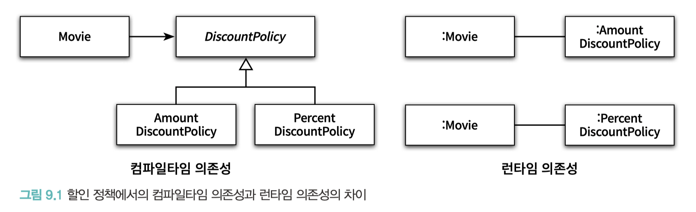
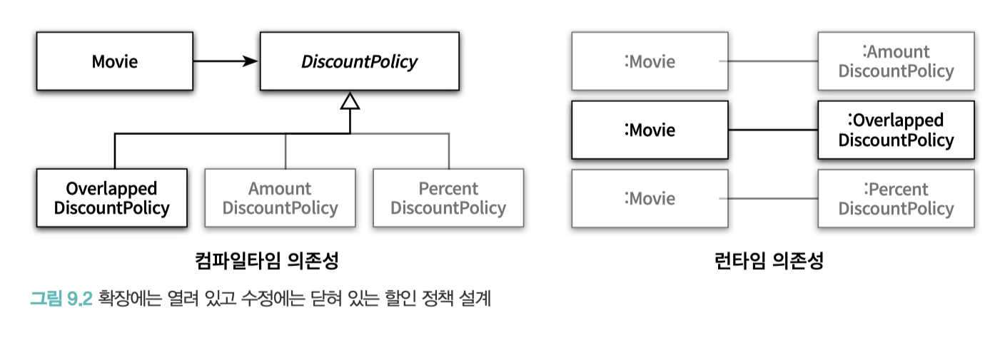
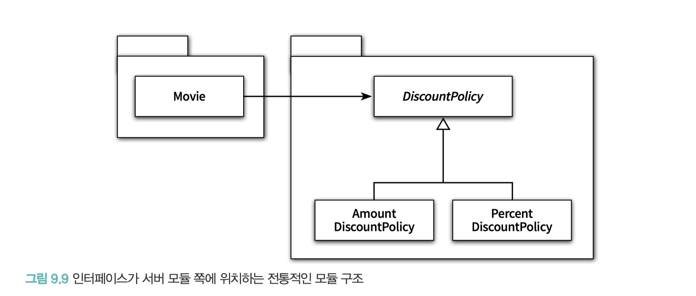
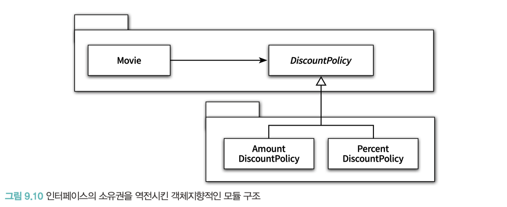

# CHAPTER 09. 유연한 설계

**TL;DR**

- **개방-폐쇄 원칙**
  - 정의: 소프트웨어 개체는 확장에 대해 열려 있어야 하고, 수정에 대해서는 닫혀 있어야 한다.
  - 개방-폐쇄 원칙을 따르는 설계: **컴파일타임 의존성은 유지**하면서, **런타임 의존성의 가능성을 확장하고 수정할 수 있는 구조**.
- 생성과 사용을 분리하라 (separating use from creation)
- **FACTORY**: 생성과 사용을 분리하기 위해 객체 생성에 특화된 객체.
- 추가하려는 행동을 책임질만한 도메인 개념이 존재하지 않는다면, PURE FABRICATION을 추가하고 책임을 할당하라.
  - **PURE FABRICATION**: 순수한 가공물. 책임을 할당하기 위해 창조되는 **도메인과 무관한 인공적인 객체**.
  - 도메인 개념의 객체와 순수하게 창조된 가공의 객체들이 모여 자신의 역할과 책임을 다하고 조화롭게 협력하는 애플리케이션을 설계하는 것이 목표여야 한다.
- **SERVICE LOCATOR 패턴**: 의존성을 해결할 객체들을 보관하는 저장소. SERVICE LOCATOR 에게 의존성을 해결해줄 것을 요청. (의존성을 감춘다는 큰 단점, 글쓴이의 지양 패턴)
- **SEPARATED INTERFACE 패턴**: 인터페이스와 그 구현을 별개의 패키지에 위치시키는 패턴.
- 잘 설계된 객체지향 애플리케이션에서는 **인터페이스의 소유권을 서버가 아닌 클라이언트에 위치**시킨다.


<br/>

## 01. 개방-폐쇄 원칙

> 소프트웨어 개체(클래스, 모듈, 함수 등등)는 ①<b><i> 확장에 대해 열려 있어야 하고</i></b>, ②<b><i> 수정에 대해서는 닫혀 있어야 한다</i></b>.

① 확장에 대해 열려 있다: 요구 사항이 변경될 때 새로운 '동작'을 추가해서 애플리케이션의 기능을 확장할 수 있다.

② 수정에 대해 닫혀 있다: 기존의 '코드'를 수정하지 않고도 애플리케이션의 동작을 추가하거나 변경할 수 있다.

→ 변경이 요구될 때, 동작의 **추가** 혹은 **수정 없는 변경** 만으로 기능을 확장할 수 있어야 한다.


<br/>

### 컴파일타임 의존성을 고정시키고 런타임 의존성을 변경하라

- 런타임 의존성: 실행 시에 협력에 참여하는 객체들 사이의 관계
- 컴파일타임 의존성: 코드에서 드러나는 클래스들 사이의 관계


<br/>



- NoneDiscountPolicy 의 추가 시, 기존 클래스는 전혀 수정하지 않은 채 애플리케이션의 동작을 확장
  - → 확장에 대해 서는 열려 있음
- 현재의 설계는 기존 코드를 수정할 필요 없이 새로운 클래스를 추가하는 것만으로 새 로운 할인 정책을 확장할 수 있다.
  - → 수정에 대해서는 닫혀 있음

<br/>



:: **개방-폐쇄 원칙을 따르는 설계**: 컴파일타임 의존성은 유지하면서, 런타임 의존성의 가능성을 확장하고 수정할 수 있는 구조

<br/><br/>

### 추상화가 핵심이다

개방-폐쇄 원칙의 핵심은 추상화에 의존하는 것

```java
public abstract class DiscountPolicy {
    private List<DiscountCondition> conditions = new ArrayList<>();

    public DiscountPolicy(DiscountCondition ...conditions) {
        this.conditions = Arrays.asList(conditions);
    }

    public Money calculateDiscountAmount(Screening screening) {
        for (DiscountCondition each: conditions) {
            if (each.isSatisfiedBy(screening)) {
                return getDiscountAmount(screening);
            }
        }

        return screening.getMovieFee();
    }

    abstract protected Money getDiscountAmount(Screening screening);
}
```

**추상화 예시: DiscountPolicy**
- 추상화 과정을 통해 생략된 부분은 할인 요금을 계산하는 방법
- 상속을 통해 생략된 부분을 구체화함으로써 할인 정책을 확장할 수 있는 것

<br/>

```java
public class Movie {
    // ...
    private DiscountPolicy discountPolicy;

    public Movie(String title, Duration runningTime, Money fee, DiscountPolicy discountPolicy) {
        // ...
        this.discountPolicy = discountPolicy;
    }

    public Money calculateMovieFee(Screening screening) {
        return fee.minus(discountPolicy.calculateDiscountAmount(screening));
    }
}
```

**Movie**
- 할인 정책을 추상화한 DiscountPolicy 에 대해서만 의존

> DiscountPolicy 추상화가 수정에 대해 닫혀 있을 수 있는 이유는,
> 
> 변경되지 않을 부분을 신중하게 결정하고 올바른 추상화를 주의 깊게 선택했기 때문

<br/><br/>

## 02. 생성 사용 분리

<br/>

**개방-폐쇄 원칙을 위반하는 코드**

```java
public class Movie {
    // ...
    private DiscountPolicy discountPolicy;

    public Movie(String title, Duration runningTime, Money fee) {
        // ...
        this.discountPolicy = new AmountDiscountPolicy(/*...*/);
    }

    public Money calculateMovieFee(Screening screening) {
        return fee.minus(discountPolicy.calculateDiscountAmount(screening));
    }
}
```

- 객체 생성을 피할 수는 없으며, 어딘가에서는 반드시 객체를 생성해야 함.
- 문제는 객체 생성이 아니라, **부적절한 곳에서 객체를 생성한다는 것**

**문제점**
- 메시지를 전송하지 않고 객체를 생성하기만 한다면 / 또는 객체를 생성하지 않고 메시지를 전송하기만 했다면 괜찮았을 것 
- 동일한 클래스 안에서 **객체 생성**과 **사용**이라는 두 가지 이질적인 목적을 가진 코드가 공존하는 것이 문제


<br/>

생성과 사용을 분리 (separating use from creation)
: 유연하고 재사용 가능한 설계를 위해서는, 객체와 관련된 두 가지 책임을 서로 다른 객체로 분리해야 함


### FACTORY 추가하기

FACTORY: 생성과 사용을 분리하기 위해 객체 생성에 특화된 객체

```java
public class Factory {
    public Movie createAvatarMovie() {
        return new Movie("아바타", 
            Duration.ofMinutes(120),
            Money.wons(10000),
            new AmountDiscountPolicy(/*...*/));
    }
}
```

```java
public class Client {
  private Factory factory;

  public Client(Factory factory) {
    this.factory = factory;
  }

  public Money getAvatarFee() {
    Movie avatar = factory.createAvatarMovie();
    return avatar.getFee();
  }
}
```

- Client는 Factory를 사용해서 생성된 Movie의 인스턴스를 반환받아 사용
- Factory를 통해 Movie와 AmountDiscountPolicy의 생성 책임을 FACTORY로 이동

<br/>

### 순수한 가공물에게 책임 할당하기

- 도메인 모델은 INFORMATION EXPERT 를 찾기 위해 참조할 수 있는 일차적인 재료
- FACTORY 를 추가한 이유는 순수하게 기술적인 결정
- 도메인 개념과는 아무런 상관이 없는 가공의 객체로 이동시킨 것

> 시스템을 객체로 분해하는 데는 크게 두 가지 방식이 존재한다. 
> 
> 하나는 표현적 분해(representational decomposition)이고,
> 다른 하나는 행위적 분해(behavioral decomposition)다
> _- 크레이그 라만_

표현적 분해
: 도메인에 존재하는 사물 또는 개념을 표현하는 객체들을 이용해 시스템을 분해. 도메인 모델에 담겨 있는 개념과 관계를 따르며 **도메인과 소프트웨어 사이의 표현적 차이를 최소화를 목적**으로 함

- 도메인 모델은 설계를 위한 중요한 출발점이지만 단지 출발점임
- 도메인 개념들을 초월하는 기계적인 개념들을 필요로 할 수 있음

> **PURE FABRICATION**
> 
> : 순수한 가공물. 책임을 할당하기 위해 창조되는 도메인과 무관한 인공적인 객체 
> 
>  _- 크레이그 라만_


**- 추가하려는 행동을 책임질만한 도메인 개념이 존재하지 않는다면, PURE FABRICATION을 추가하고 책임을 할당하라.**
- PURE FABRICATION은 표현적 분해보다는 행위적 분해에 의해 생성되는 것이 일반적

: 도메인 개념을 표현하는 객체와 순수하게 창조된 가공의 객체들이 모여 자신의 역할과 책임을 다하고 조화롭게 협력하는 애플리케이션을 설계하는 것이 목표여야 한다.

<br/><br/>

## 03. 의존성 주입

- Constructor Injection: 객체를 생성하는 시점에 생성자를 통한 의존성 해결
- Setter Injection: 객체 생성 후 setter 메서드를 통한 의존성 해결
- Method Injection: 메서드 실행 시 인자를 이용한 의존성 해결

<br/>

### 숨겨진 의존성은 나쁘다


**SERVICE LOCATOR 패턴**
: 의존성을 해결할 객체들을 보관하는 일종의 저장소.
외부에서 객체에게 의존성을 전달하는 의존성 주입과 달리, SERVICE LOCATOR 에게 의존성을 해결해줄 것을 요청

> SERVICE LOCATOR 패턴은 서비스를 사용하는 코드로부터 서비스가 누구인지(서비스를 구현한 구체 클래스의 타입이 무엇인지), 
> 어디에 있는지(클래스 인스턴스를 어떻게 얻을지)를 몰라도 되게 해준다.

<br/>

```java
public class ServiceLocator {
    private static ServiceLocator soleInstance = new ServiceLocator();

    private DiscountPolicy discountPolicy;

    public static DiscountPolicy discountPolicy() {
        return soleInstance.discountPolicy;
    }

    public static void provide(DiscountPolicy discountPolicy) {
        soleInstance.discountPolicy = discountPolicy;
    }

    private ServiceLocator() {
    }
}
```

→ DiscountPolicy의 인스턴스를 등록하기 위한 provide 메서드와 인스턴스를 반환하는 discountPolicy 메서드를 구현

```java
ServiceLocator.provide(new AmountDiscountPolicy(/*...*/));
Movie avatar = new Movie("아바타",
                          Duration.ofMinutes(120),
                          Money.wons(10000));
```

- SERVICE LOCATOR 패턴의 가장 큰 단점은 의존성을 감춘다는 것.
- Movie는 DiscountPolicy 에 의존하고 있지만 해당 의존성에 대한 정보가 표시돼 있지 않음
- 문제점을 발견할 수 있는 시점을 코드 작성 시점이 아니라 실행 시점으로 미루는 단점
- 의존성을 이해하기 위해 코드의 내부 구현을 이해할 것을 강요

**결론**
- **가급적 의존성을 객체의 퍼블릭 인터페이스에 노출하라.**
- 의존성을 구현 내부에 숨기면 숨길수록 코드를 이해하기도, 수정하기도 어려워진다

<br/><br/>

## 04. 의존성 역전 원칙

### 추상화와 의존성 역전

- 상위 수준의 모듈은 하위 수준의 모듈에 의존해서는 안된다. 둘 모두 추상화에 의존해야 한다.
- 추상화는 구체적인 사항에 의존해서는 안된다. 구체적인 사항은 추상화에 의존해야 한다.

**의존성 역전 원칙(Dependency Inversion Principle, DIP)**

<pre>
'역전(inversion)’이라는 단어를 사용한 이유: 
의존성 역전 원칙을 따르는 설계는 의존성의 방향이 전통적인 절차형 프로그래밍과는 반대 방향으로 나타나기 때문
- 로버트 마틴, 위 단어 최초 사용자
</pre>

<br/>

### 의존성 역전 원칙과 패키지

<table>
<tr>
<th>Traditional</th><th>Inversion</th>
</tr>
<tr>
<td>


- 같은 패키지에 포함된 AmountDiscountPolicy 클래스와 PercentDiscountPolicy 클래스도 함께 존재해야 함
- 코드의 컴파일이 성공하기 위해 함께 존재해야 하는 코드를 정의하는 것이 바로 컴파일타임 의존성


</td>
<td>


- 의존성 역전 원칙에 따라 상위 수준의 협력 흐름을 재사용하기 위해서는 추상화가 제공하는 인터페이스의 소유권 역시 역전시켜야 함
- 불필요한 AmountDiscountPolicy 클래스와 PercentDiscountPolicy 클래스를 함께 배포할 필요가 없음.
- 잘 설계된 객체지향 애플리케이션에서는 **인터페이스의 소유권을 서버가 아닌 클라이언트에 위치**시킨다.

</td>
</tr></table>

- 추상화를 별도의 독립적인 패키지가 아니라 클라이언트가 속한 패키지에 포함시켜야 함  ← **SEPARATED INTERFACE 패턴** (마틴 파울러)
- 유연하고 재사용 가능하며 컨텍스트에 독립적인 설계는 전통적인 패러다임이 고수하는 의존성의 방향을 역전


<br/><br/>

## 유연성에 대한 조언

### 유연한 설계는 유연성이 필요할 때만 옳다

- 설계의 미덕은 단순함과 명확함으로부터 나온다.
- 변경은 예상이 아니라 현실이어야 한다. 미래에 변경이 일어날지도 모른다는 막연한 불안감은 불필요하게 복잡한 설계를 낳는다. **아직 일어나지 않은 변경은 변경이 아니다.**

<br/>

### 협력과 책임이 중요하다

- 설계를 유연하게 만들기 위해서는 먼저 역할, 책임, 협력에 초점을 맞춰야 한다.


<br/><br/>

### 느낀점

> 이름을 가진 설계 원칙을 통해 기법들을 정리하는 것은 장황하게 설명된 개념과 메커니즘을 또렷하게 정리할 수 있게 도와줄뿐만 아니라 설계를 논의할 때 사용할 수 있는 공통의 어휘 를 익힌다는 점에서도 가치가 있을 것

특정 기법의 이름을 과하게 정의 내려서 내용을 정의한다는 느낌을 받았는데, 글쓴이가 개념을 명확하게 하고자 하는 의도였다.  


