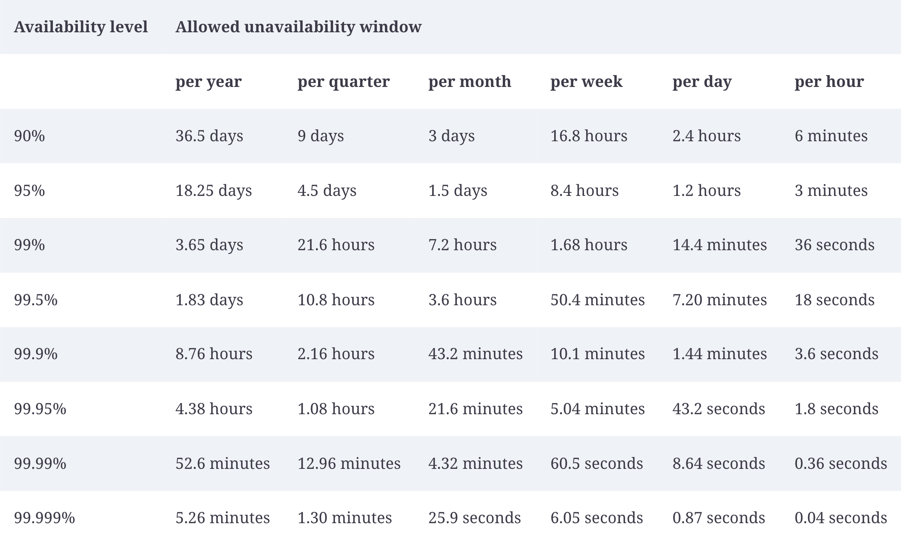

# Appendix A. 가용성표

가용성: 보통 서비스가 특정기간 내에 얼마나 오래 사용 불가능한 상태로 존재하는지를 계산

  

예상 다운타임이 없다는 가정 하에, 각 가용성 수준 별로 어느정도의 다운타임을 허용할 수 있는지를 보여줌

하지만, 부하가 일정하지 않고 매일 혹은 매주 변화하는 서비스, 즉:

- 여러개의 복제본
- 서비스의 일부만이 사용 불가능한 상태가되어 부분적으로 사용할 수 있는 서비스

이런 경우는 집계된 '사용 불가능성(unavailability) 지표'를 사용하는 것이 더 유용할 수 있는데,

중단시간에 초점을 맞추는 것보다는 '전체 운영 시간의 X% 에 해당 하는 장애'를 산정한 지표를 들 수 있음.

