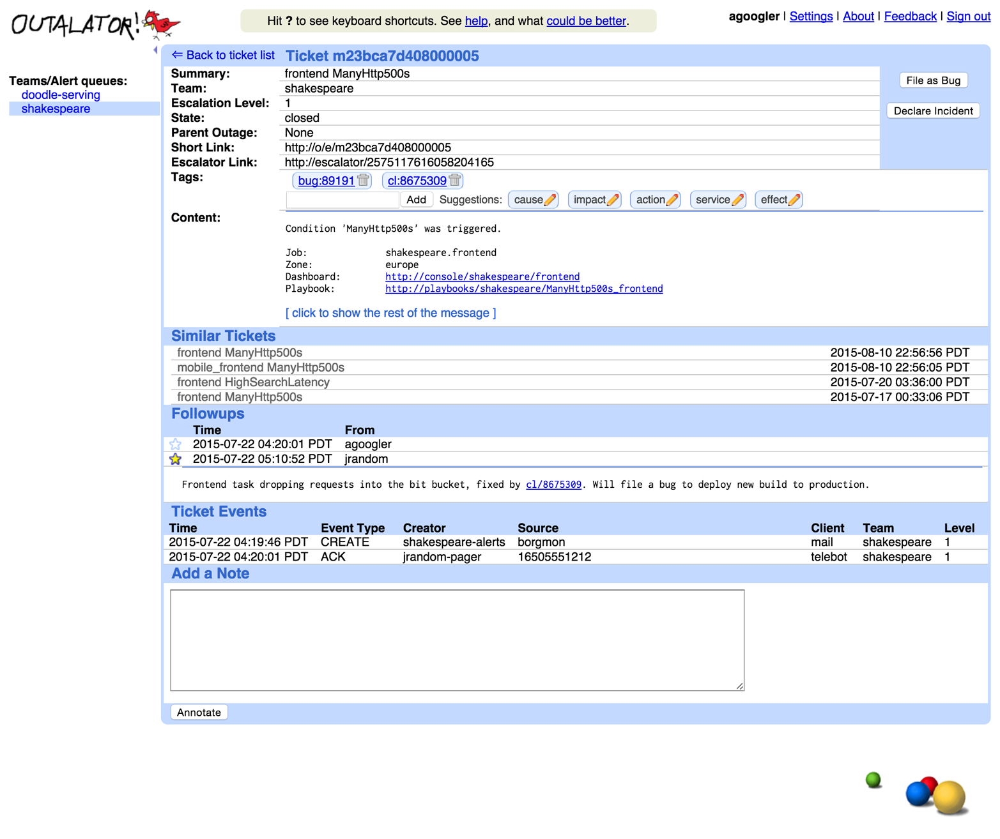

# CHAPTER 16. Tracking Outages

<small><i>시스템 중단 추적하기</i></small>

지속적인 신뢰성 개선은 기준을 명확히 하고 절차를 추적할 수 있을 때만 가능.

→ 아우터레이터(Outalator)

: 서비스 중단 현상 추적 도구.

모니터링 시스템이 발송하는 모든 알림을 수동으로 수신.

또한, 데이터를 해석, 그룹화 및 분석하기 위한 시스템.

 

## Escalator

: 비상 대기 엔지니어에게 전달된 이메일의 복사본을 수신하는 투명한 도구로 기획된 시스템.

구글에서는 SRE를 위한 모든 알림을 사람이 수신했는지 여부를 추적하는 중앙 응답 시스템을 공유하는데,

설정된 시간이 지나도 아무도 수신을 확인하지 않으면 시스템은 다음 단계로 알림을 격상함.

(예: 비상 대기자에서 차선 비상 대기자로 전환).

 

## Outalator

개별적인 알림의 격상뿐만 아니라 그다음 단계의 추상화, 
즉 시스템 중단 장애(outage)까지 처리할 수 있는 시스템.

아우터레이터의 사용자는 여러 큐에 보관된 알림을 시간별로 한 번에 확인할 수 있음.

보통 SRE 팀이 여러 서비스의 최우선 연락 포인트 (이후 각 서비스의 개발팀이 차선 연락 포인트로 에스컬레이션) 이기 때문에,
여러 큐를 직접 전환하며 확인하지 않아도 되는 편의성 제공.

 
 
<small>아우터레이터가 여러 큐의 내용을 보여주는 모습</small>
 

아우터레이터는 장애의 내용을 확인할 수 있도록 원본 알림의 복사본 저장.

- 모든 이메일 회신의 복사본 또한 수신.
- 회신 내용에 중요한 언급이 있는 경우에는 `중요` 표시 추가.
- 만일 특정 언급에 '중요' 표시가 있으면 메시지의 나머지 내용은 인터페이스 상에서 숨김.
- 장애를 언급할 땐, 이메일 스레드에 분산된 내용보다 더 상세한 문맥을 제공.

 

### Aggregation

  

하나의 장애로 인해 여러 개의 알림이 발송될 수 있음.

하나의 장애로 발송되는 알림 수를 최소화하는 것이 이상적이나, 정확한 판단을 위해 피할 수 없는 경우가 많음.

**반복된 알림 피하기**

- 여러 개의 알림을 하나의 장애로 합침.
- 중복 알림에는 중복 사실을 명시.  
  - ex. "사전 발신 메일과 동일한 원인" 혹은 "모두 동일한 장애로 보고된 증상"라는 정보 포함

 

### Tagging

모든 알림이 하나의 장애를 의미하지 않음.

알림 메타데이터 관리를 위해 **태깅(tagging) 지원**.

_ex. `cause:network`, `cause:network:switch`, `customer:132456`._

 

활용: 태그를 활용해 의미 있는 **링크 생성 가능**.

_ex. `bug:76543` 형식을 사용해서, 버그 추적 시스템의 상세 페이지로 리다이렉트._

 

### Analysis

장애 발생 시 기존 사례를 참조하는 것이 분석의 출발점이 되지만, 더 큰 문제를 야기할 가능성 존재.

기본적인 분석 계층은 보고서를 위한 산술, 통계, 집계 기능 포함.

_ex. 주/월/분기별 장애 수, 장애별 알림 수 등의 정보._

알림 빈도를 분석해 위험 수준 정의 가능.  

_ex. "이번 주에만 세 번째 알림"이 발송된 경우, 해당 알림이 "원래 하루에 다섯 번씩 발생하던 것인지", 아니면 "한 달에 다섯 번 발생하던 것인지"를 비교._

 

#### Reporting and communication

SRE들을 좀 더 즉각적으로 활용할 수 있는 방법은,

비상 대기 업무 전환 시, 최신 상태를 공유하는 정보 전달 시스템 필요.

→ 제목, 태그, '주요' 주석을 '잘' 정리해, 다음 차례의 비상대기 엔지니어 및 필요한 참조자에게 전달.

 

### Unexpected Benefits

**시스템 중단 장애와 함께 발송되는 알림**의 다양한 장점:

- 확실한 진단 속도 향상.
- 알림을 통해 장애가 발생했음을 증명.
- 다른 팀이 장애를 인지하는 과정에서의 부담을 줄임
- 에러 뿐 아니라, Dummy escalator configurations 설정  
  - 아우터레이터가 알림을 수신하게 하고, 태그, 주석을 추가하고 리뷰할 수 있도록 만듦.
- 작업 실행 기록 및 자동 주석 추가
  - 멱등성을 보장하지 못할 수 있는 작업 실행 기록과 주석 자동화.
  - 가령, '버전 관리 시스템'과 '데이터베이스 시스템' 간 스키마 변경 사항을 자동으로 적용하는 애플리케이션 사용.
