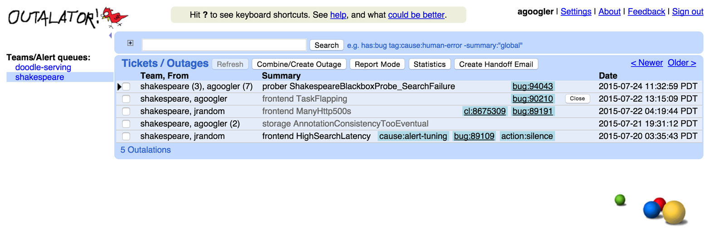

# CHAPTER 16. Tracking Outages

<small><i>시스템 중단 추적하기</i></small>

지속적인 신뢰성 개선은 기준을 명확히 하고 절차를 추적할 수 있을 때만 가능함.

아우터레이터(Outalator)라는 서비스 중단 현상 추적 도구를 사용함.
이 도구는 모니터링 시스템이 발송하는 모든 알림을 수동으로 수신하고, 데이터를 해석, 그룹화 및 분석하기 위한 시스템임.

 

## Escalator

: 비상 대기 엔지니어에게 전달된 이메일의 복사본을 수신하는 투명한 도구로 기획된 시스템.

구글에서는 SRE를 위한 모든 알림을 사람이 수신했는지 여부를 추적하는 중앙 응답 시스템을 공유하는데,

설정된 시간이 지나도 아무도 수신을 확인하지 않으면 시스템은 다음 단계로 알림을 격상함.

(예: 비상 대기자에서 차선 비상 대기자로 전환).

## Outalator

개별적인 알림의 격상뿐만 아니라 그다음 단계의 추상화, 
즉 시스템 중단 장애(outage)까지 처리할 수 있는 시스템.

아우터레이터의 사용자는 여러 큐에 보관된 알림을 시간별로 한 번에 확인할 수 있음.

보통 SRE 팀이 여러 서비스의 최우선 연락 포인트 (이후 각 서비스의 개발팀이 차선 연락 포인트로 에스컬레이션) 이기 때문에,
여러 큐를 직접 전환하며 확인하지 않아도 되는 편의성 제공.

 
아우터레이터가 여러 큐의 내용을 보여주는 모습.
 

- 아우터레이터는 장애의 내용을 확인할 수 있도록 원본 알림의 복사본 저장.
- 모든 이메일 회신의 복사본 역시 수신.
- 회신 내용에 중요한 언급이 있는 경우에는 '중요' 표시를 추가.
- 만일 특정 언급에 '중요' 표시가 있으면 메시지의 나머지 내용은 인터페이스 상에서 숨김.
- 장애를 언급할 때엔, 이메일 스레드에 분산된 내용보다 더 상세한 문맥을 제공.

