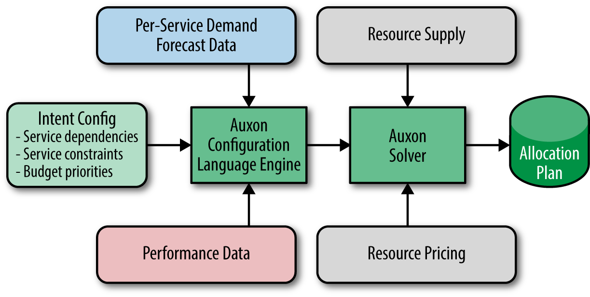

# CHAPTER 18. Software Engineering in SRE

<small><i>SRE 조직의 소프트웨어 엔지니어링</i></small>

SRE는 복잡한 프로덕션 환경을 직접 경험하고 이를 활용하여 내부 문제를 해결할 도구를 개발하며, 
프로덕션 환경을 지속적이고 안정적으로 운영할 수 있는 다양한 활용 사례를 창출함.

- 업타임 관리 및 지연 응답 최소화 목적.
- 바이너리 배포 메커니즘, 모니터링 시스템, 동적 서버 조합(dynamic server composition) 기반 개발 환경 구축 등 기능 수행.

 

---

## Why Is Software Engineering Within SRE Important?

<small><i>SRE 조직의 소프트웨어 엔지니어링 역량이 중요한 이유</i></small>

SRE가 내부 소프트웨어를 효율적으로 개발할 수 있는 이유:

1. **폭넓고 깊은 지식**
   - 엔지니어들이 확장성, 장애 발생 시 자연스러운 종료 처리, 인프라 도구 활용 능력을 통해 소프트웨어를 설계하고 개발할 수 있음.

2. **중요 사안 참여**
   - SRE들이 모든 주요 사안에 참여하기 때문에, 개발 도구의 목적과 요구사항을 쉽게 파악 가능.

3. **직접적인 사용자 피드백**
   - 개발된 도구를 사용할 사용자(다른 SRE들)와의 직접적인 관계를 통해 솔직하고 신속한 피드백 제공 가능.

 
   
#### "팀의 규모는 서비스의 성장률과 직접적으로 비례해서는 안 된다."

_SRE 원칙 중 하나_

성장하는 서비스에도 SRE 조직의 규모를 선형적으로 유지하려면, 아래 요소 등이 필요:

- 지속적인 **자동화 작업**와 **효율적인 도구** 개발.
- **운영 절차 개선**.
- 일상적인 운영 업무의 비효율성을 새로운 시각.

 

SRE 입장에서 소프트웨어 개발은:

- 경력 개발의 기회.
- 코딩 능력 유지.
- 장기 프로젝트 작업을 통해 인터럽트와 온콜 업무의 균형 제공.
- 소프트웨어 엔지니어링과 시스템 엔지니어링 간의 균형을 원하는 엔지니어에게 높은 직업 만족도 제공.

 

---

## Auxon Case Study: Project Background and Problem Space

<small><i>Auxon 사례 연구: 프로젝트 배경 및 문제 영역</i></small>

### Traditional Capacity Planning

전통적인 수용량 계획 과정은 다음과 같음:

1. **수요 예측 수집**
   - 얼마나 많은 자원이 필요하고, 언제, 어디서 이 자원을 활용하는가?

2. **빌드 및 할당 계획 수립**
   - 수집된 예상 수요를 바탕으로 요구를 충족하기 위해 추가 자원을 제공해야 하는가? 있다면 어느 지역에 얼마나 추가해야 하는가?

3. **리뷰 및 계획 승인**
   - 예측된 수요가 적절한가? 계획이 예산을 초과하지 않고, 제품 및 기술적 요소를 모두 고려했는가?

4. **배포 및 자원 설정**
   - 최종적으로 자원이 도착하면 해당 자원을 어느 서비스에 할당할 것인가? CPU, 디스크 등 저수준 자원을 어떻게 적절히 활용할 것인가?

**✅ 수용량 계획은 끝나지 않는 작업.**

- 계획은 지속적으로 수정될 수밖에 없음.
- 계획 수정 시, 각 분기에 미치는 영향도 고려해야 함.

 

### ✔️ Brittle by nature

_본질적으로 불안정하다_

- 계획을 재검토하여 여전히 실현 가능한지 확인 필요.
- 이전 분기의 수용량 계획 결과에 기초한 재계획은 이후 분기의 전체 계획에 영향을 미침.

### ✔️ Laborious and imprecise

_노동집약적이며 모호하다_ 

- 수요 예측을 위한 데이터 수집 과정은 느리고 오류 발생 가능성이 높음.
- 자원 할당 과정도 느림.
- 상자 채우기 문제(bin packing problem)는 인간이 직접 계산하기 매우 어려운 **NP-hard 문제**에 해당.

 

### Our Solution: Intent-Based Capacity Planning

_구현이 아닌 '요구사항'을 명확히 하자_

**의도 기반 수용량 계획(Intent-Based Capacity Planning)**  
: 서비스 의존성과 수요를 프로그래밍적으로 인코딩하여, 클러스터와 서비스의 자원 할당 계획을 **자동으로 생성하는 방식**.

- 서비스의 실제 요구사항과 유연성을 확보함으로써 변화에 빠르게 대응 가능한 수용량 계획 수립.
- 최대한 많은 매개변수를 만족시키는 최적의 해결책 마련.
- 컴퓨터를 이용한 최적화로 높은 정확도 실현 및 조직 운영 비용 절감.
- 하지만, 여전히 NP-hard 문제로 인한 계산의 어려움 존재.

 

---

## Intent-Based Capacity Planning

**의도 (Intent)**: 서비스 담당자가 해당 서비스를 운영하고자 하는 목적과 요구사항을 의미.

현실적인 자원 수요를 바탕으로 수용량 계획 의도를 이끌어내기 위해 여러 단계의 추상화가 필요.

1. **"I want 50 cores in clusters X, Y, and Z for service Foo."**
   - _"Foo 서비스를 위해 X, Y, Z 클러스터에 50개의 코어가 필요합니다."_
   - 명시적인 자원 요청.
   - 특정 클러스터와 자원이 필요한 이유에 대한 설명 부족.

2. **"I want a 50-core footprint in any 3 clusters in geographic region YYY for service Foo."**
   - _"Foo 서비스를 위해 YYY 지역의 클러스터 중 세 개에서 50개의 코어가 필요합니다."_
   - 조금 덜 구체적인 요청으로 지원이 용이.
   - 여전히 요구사항 정의에 대한 설명 부족.

3. **"I want to meet service Foo’s demand in each geographic region, and have N + 2 redundancy."**
   - _"Foo 서비스에 대한 각 지역별 수요를 충당하길 원하며 N+2의 다중화를 원합니다."_
   - 자유도가 높아짐.
   - 자원이 부족할 경우 발생할 문제에 대한 이해가 쉬워짐.
   - 하지만, 왜 N+2개의 서비스가 필요한지에 대한 설명 부족.

4. **"I want to run service Foo at 5 nines of reliability."**
   - _"Foo 서비스에 99.999%의 가용성을 보장하길 원합니다."_
   - 가장 추상화된 요구사항.
   - 요구사항 충족 실패 시의 결과(신뢰성 저하)가 명확하게 드러남.

✅ **3단계 추상화**가 가장 효과적.
 - 유연성이 뛰어나며, 결과를 높은 수준의 이해 가능한 용어로 제공.
 - 서비스의 요구사항을 명확히 정의하고 이해하기 쉬움.

- 아주 정교한 서비스의 경우 **4단계 추상화**가 더 적합할 수 있음.

 

---

## Fostering Software Engineering in SRE

의도 기반 수용량 계획을 위한 필수 정보? **의존성, 성능 지표, 우선순위 결정.**

 

### 1. Dependencies

_의존성_

의존성은 서비스의 위치 결정에 중요한 영향을 미침.  

특히 프로덕션 환경에서의 의존성은 중첩되는 경우가 많음.

#### **Example.**

- **사용자 서비스 Foo가 인프라 저장소 서비스 Bar에 의존하는 경우**
  - Foo 서비스는 Bar 서비스가 네트워크 지연 시간이 30밀리초 이내인 위치에서 제공되어야 한다는 요구사항을 명시 가능.

- **Bar 서비스가 저수준 분산 저장소 서비스 Baz와 애플리케이션 관리 서비스 Qux에 의존하는 경우**
  - Foo 서비스는 Bar, Baz, Qux 서비스를 지원할 수 있는 위치에서만 운영 가능.

 

### 2. Performance metrics

_성능 지표_

- 한 서비스의 수요는 다른 서비스의 수요에 영향을 미침.
- 예상 자원 사용량에 대한 더 세부적인 정보가 필요.
- 성능 지표는 의존성간의 연결 고리
  - 한 서비스에 대한 수요는 하나 혹은 그 이상의 다른 서비스들에 대한 수요에 조금씩 영향을 미침
- 적절한 성능 지표 확보 하려면, **부하 테스트**와 **자원 활용 모니터링** 필요

 

---

## 3. Prioritization 

_우선순위 결정_

자원 제약으로 인해 필연적으로 **트레이드 오프**와 어려운 결정을 내려야 하는 상황이 발생함.  

의도 기반 계획은 **투명**하고 **공개적**이며 **일관성**있게 내리는 것에 초점을 맞춤.

의도 기반 수용량 계획을 통해, 우선순위 결정을 세밀하게 또는 굵직하게 조정할 수 있음.

 

---

## Introduction to Auxon

Auxon은 구글이 보유한 수백만 달러 규모의 머신들을 효과적으로 활용하기 위한 수용량 계획을 지원하는 도구로, 여러 주요 부서에서 활용 중인 핵심 컴포넌트.

Auxon은 사용자의 설정 언어 또는 프로그래밍 API를 통해 수집한 후, 사람의 의도를 기계가 이해할 수 있는 제약 조건으로 변환함.

 

---

## Auxon의 주요 컴포넌트

  

✔️ **성능 데이터(performance data)**
: 서비스의 규모를 의미.

✔️ **서비스별 수요 예측 데이터(per-service demand forecast data)**
: 예측된 수요 신호의 사용 궤적을 기반으로 미래 사용량을 계산함.

   - 대륙별로 나누어 본 초당 쿼리 수에 대한 예상치를 바탕으로 계산하며, 모든 서비스가 수요 예측 데이터를 보유하고 있는 것은 아님.
   - 일부 서비스는 자신에게 의존하는 다른 서비스들을 바탕으로 수요를 예측함 (e.g. Colossus와 같은 저장소 서비스).

✔️ **자원 공급(resource supply)**
: 기본적인 자원의 가용성에 대한 데이터

  - 허용된 서비스 조합을 위한 의도 기반 명세로 활용하면 좋음.

✔️ **자원 가격(resource pricing)**
: 자원을 확보하기 위한 비용 데이터.

✔️ **의도 설정(intent config)**
: 서비스 구성 방식과 다른 서비스와의 관계를 표현. Auxon에 의도 기반 정보를 전달하기 위한 핵심 정보

✔️ **Auxon 설정 언어 엔진(Auxon configuration language engine)**
: 의도 설정 정보를 바탕으로 동작.

  - 기계가 해석할 수 있는 최적화된 요청을 공식화.
  - 설정에 대한 안전성 검사를 수행.

✔️ **Auxon 해법 엔진(Auxon Solver)**
: Auxon의 핵심 컴포넌트. 
  - 병렬 처리를 통해 수백 대에서 수천 대의 머신에서 실행 가능.
  - 고도로 확장성있게 디자인 .

✔️ **할당 계획(allocation plan)**
: Auxon 해법 엔진의 출력 결과. 어떤 자원을 어떤 서비스에 어느 지역에 위치시킬지를 표현. 수용량 계획 문제의 요구사항을 구체화함.

### Requirements and Implementation: Successes and Lessons Learned

_요구사항과 실제구현: 성공 사례와 그로부터 배운 것들_

구현 과정에서 제품 개발에 직접 참여하지 않던 SRE 팀이 프로덕션 환경에 깊이 관여함으로써 **안정적인 운영을 확보**함.

SRE 팀은 사용자와 개발자 역할을 동시에 수행.

프로덕션 환경을 강화.

#### Approximation

_미완성된 제품_

완벽하면서도 깔끔한 해결책에 집착해서는 안됨 (특히 문제의 범위가 잘 알려져 있지 않다면)

일단 뭔가를 해보고 반복적하는 것이 좋음.

 

### Raising Awareness and Driving Adoption

소프트웨어 도입을 유도하기 위해선:

- **활용성**과 **성능**
- 구글의 **프로덕션 환경 신뢰성 목표**
- **SRE 삶의 질 향상**

제품을 홍보하는 과정과 이를 받아들이도록 유도하는 과정이 중요.

중요한 점은 사용자의 관점에서 제품이 유용한지 여부를 고려해야 함.

사용하기 어렵거나 헷갈리면 사용자가 직접 도구를 개발하려 할 가능성이 있음.

 

#### Set expectations

_기대치 설정_

최소 기능 제품(Minimum Viable Product, MVP)을 구분하는 것이 중요.

꾸준히 제품을 선보이고,
작은 릴리즈를 통해 지속적으로 개선하면 팀의 자신감을 높이고 유용한 소프트웨어를 제공할 수 있음.

 

#### Identify appropriate customers

_적절한 사용자층 정의하기_

Auxon의 성공은 팀들이 제품의 유용함을 증명해주고, 고객들이 스스로 제품을 지지해주었기 때문임.

\+ 제품의 유용성을 정량적으로 측정하여 보여주는 것도 중요함.

 

#### Customer service

_고객 서비스_

혁신적인 소프트웨어는 사용자들이 학습해야 할 부분이 존재함.

제품을 조기에 사용하고자 하는 고객들이 적절히 활용할 수 있도록 지원을 아끼지 말아야 함.

 

#### Designing at the right level

_적절한 수준의 디자인_

불가지론(agnosticism, 대량의 데이터를 입력으로 사용하는 일반화된 소프트웨어 개발)은 Auxon 디자인 원칙의 핵심.

특정 대형 고객만을 위한 과도한 커스터마이징에 얽매이지 않았기 때문에, 
조직 전체에 걸쳐 폭넓은 사용자층을 확보하고, 
새로운 서비스 도입 장벽을 낮출 수 있었음.

 

### Team Dynamics

_팀의 원동력_

SRE 조직 내 소프트웨어 제품 개발을 위한 엔지니어 선정 시,
폭넓은 지식과 경험을 가진 엔지니어와 다양한 기술을 빠르게 익힐 수 있는 엔지니어로 구성된 **시드 팀(sed 팀)**을 만드는 것이 효과적임.

다양한 경험은 팀의 맹점을 보완하고, 모든 팀의 활용 사례가 동일할 것이라는 위험한 가정을 피할 수 있도록 도움.

**전문가 투입 시점?**
- 프로젝트가 어느 정도 성공적으로 진행되고 보여줄 만한 수준이 되었을 때가 적절함.
- 즉, 기존 팀의 스킬이 추가 투입된 전문가와 함께 성장할 수 있는 시점.

 

---

## Fostering Software Engineering in SRE

#### 완전한 기능의 소프트웨어 엔지니어링 프로젝트가 되기 위한 조건?

프로젝트가 일회성이 아닌 완전한 기능을 갖춘 소프트웨어 엔지니어링 프로젝트로 발전하기 위해서는 다음과 같은 조건을 충족해야 함.

- 관련된 영역에 대한 직접적인 경험이 풍부하며 프로젝트에 참여할 의사가 있는 엔지니어들이 필요함.
- 기술 숙련도가 높은 대상 사용자들이 초기 개발 단계에서 고급 수준의 버그 보고를 제공할 수 있는 상황이 이상적임.
- 프로젝트가 SRE의 노고를 덜어주거나, 기존 인프라스트럭처의 일부를 개선하거나, 복잡한 프로세스를 능률적으로 수행할 수 있도록 충분한 혜택을 제공해야 함.

 

#### 프로젝트가 완전한 기능의 소프트웨어 엔지니어링 프로젝트가 되지 못하는 경우?

- 너무 많은 부분이 변경되어야 하는 경우.
- 소프트웨어가 지속적으로 개발될 수 없는 '모아니면 도' 식의 디자인을 채택하고 있는 경우.

 

### Successfully Building a Software Engineering Culture in SRE: Staffing and Development Time

_SRE 조직에 소프트웨어 엔지니어링 문화를 성공적으로 정착시키기: 인력 수급과 개발 시간_

깊이 있는 학습보다는 폭넓은 학습이 요구되며, 남들보다 큰 그림을 이해하는 능력이 중요함.

프로젝트 개발 시간은 보장받아야 함, 
추후 정식 프로젝트로 승격할 수 있도록 적절한 소프트웨어 개발 지원이 필요함.

개발 노력에 참여한 모든 SRE는 풀타임 개발자가 아닌 SRE로 남아야 함.

SRE가 제품 생산의 세계에 참여하는 것은 개발 업무를 수행하는 데 있어 소중한 시각을 얻을 기회가 됨. 

이는 자신들이 직접 제품의 생산자이자 소비자가 되기 때문임.

 

### Getting There

SRE 조직에 소프트웨어 개발 모델을 도입할까?

기술적인 도전이므로 그 만큼 조직의 변화를 수반한다는 점을 인지해야 함.

소프트웨어 개발을 통해 얻고자 하는 것이 무엇인지 명확히 정의해야 함.

단지 팀에 더 나은 소프트웨어 개발 문화를 도입하기를 원하는 것인가, 
아니면 여러팀이 사용할 수 있고 나아가 조직의 표준이될 소프트웨어의 개발에 관심이 있는 것인가?

 

#### ✔️ Create and communicate a clear message

_명확한 메시지로 소통하라_

- 전략과 계획, 그리고 SRE에게 어떤 장점이 있는지를 명확하게 정의하고 소통해야 함.
- 일관적이고 충분한 지원을 받은 소프트웨어 솔루션은 신입 SRE들이 업무에 더 빠르게 적응하는 데 도움을 줌.
- 작업 수행 방법을 몇 가지로 줄이면, 전체 부서가 한 팀이 개발한 기술의 혜택을 받을 수 있음. 
   - 결론적으로, 지식과 인적 자원이 여러팀으로 옮겨다니기가 쉬워짐.

SRE들이 그 전략을 따라야 하는지를 묻는 것이 아니라, 그 전략을 어떻게 도입할 것인지를 묻는 것이 중요함.

 

#### ✔️ Evaluate your organization’s capabilities

_조직의 역량을 평가하라_

SRE 조직에 그동안 요구되지 않았던 역할과 기술이 필요할 수 있음.

→ 이미 확보한 기술을 이용하여 이러한 차이점을 채워나가야 함.

애자일 방법론을 전파하고 코치해 달라고 제품 개발팀에 부탁하거나, 
우선순위 결정 시 제품 관리자에게 조언을 구하는 방식이 유효함.

 

#### ✔️ Launch and iterate

_출시하고 반복하라_

적절한 시간 내에 어느 정도 가치가 있는 제품을 출시하고, 신뢰성을 확보하는 것이 중요함.

- 첫 번째 릴리즈는 직관적이고 달성 가능한 목표를 추구해야 함.
- 논쟁의 여지가 없고 기존 솔루션이 없는 문제를 해결해야 함.
- 제품 업데이트 주기를 6개월 정도로 설정하고, 지속적으로 새로운 기능을 추가함으로써 성공 가능성을 높일 수 있음.

구글의 일부 팀은 초기 버전을 출시한 후, 더 빠른 릴리즈와 피드백을 위해 '푸시-온-그린(push-on-green)' 모델을 채택하기도 함.

 

#### ✔️ Don’t lower your standards

_자신의 표준을 낮추지마라_

지름길을 택하고 싶은 충동을 억제해야 함.

- 스스로에게 질문해 보기: 만약 이 제품을 다른 개발 팀이 만들었다면, 이 제품을 도입할 것인가?
- 안정성이 가장 중요함. 코드 리뷰, 종단 간 테스트(end-to-end test), 통합 테스트 등을 수행하고, 다른 팀에게 피드백을 요청해야 함.

해당 제품이 널리 활용될 경우, 이는 SRE들이 자신들의 업무를 성공적으로 수행하기 위한 중요한 도구가 될 수 있음.

 

---

## Conclusions

SRE가 개발한 소프트웨어는 비효율적인 절차를 능률적으로 바꾸거나 반복적인 작업을 자동화하는 경우가 많음.

따라서 이러한 프로젝트들이 증가하더라도 SRE 팀의 규모가 그에 따라 선형적으로 증가하는 일은 없음.

