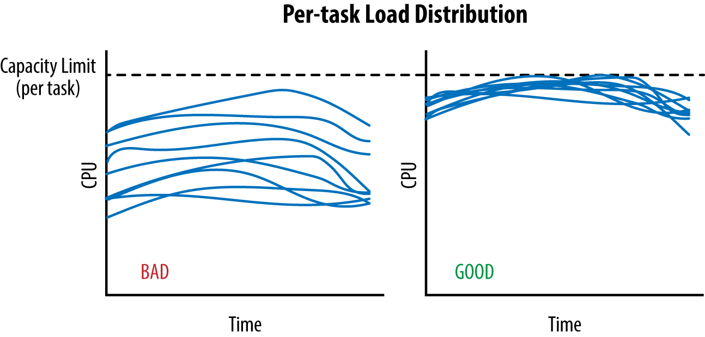
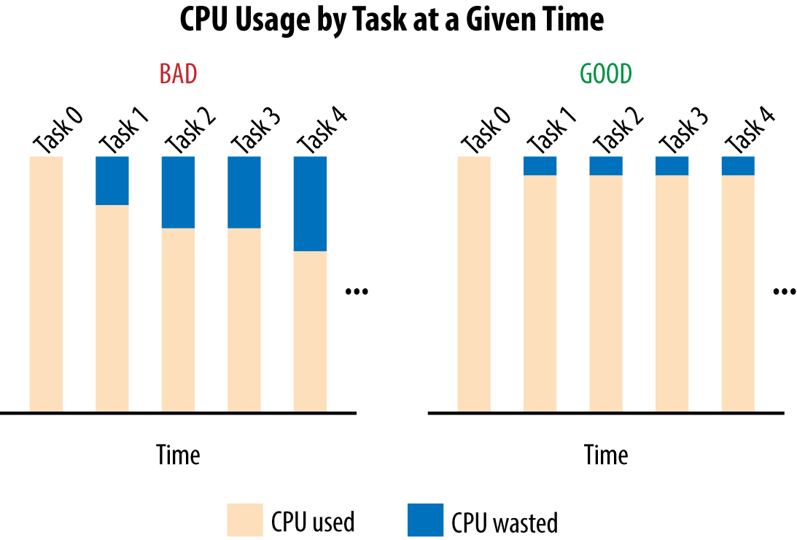
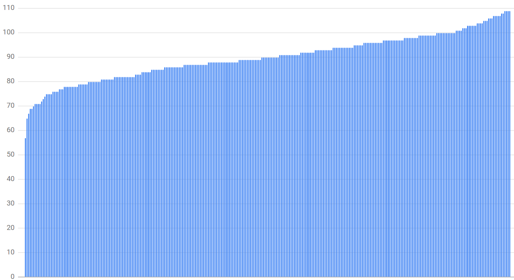
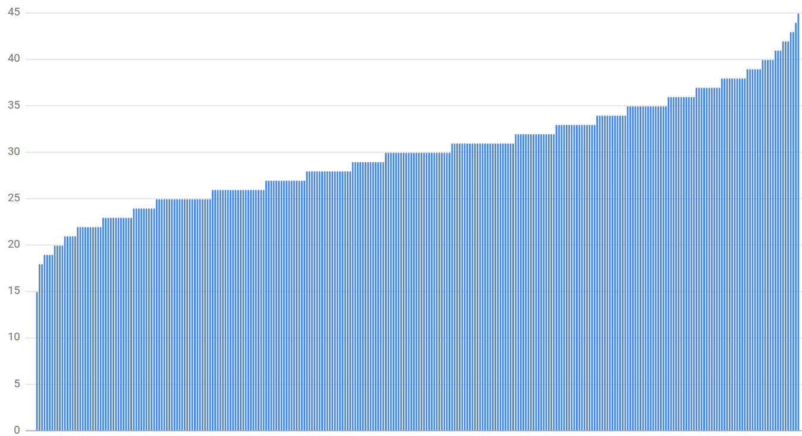
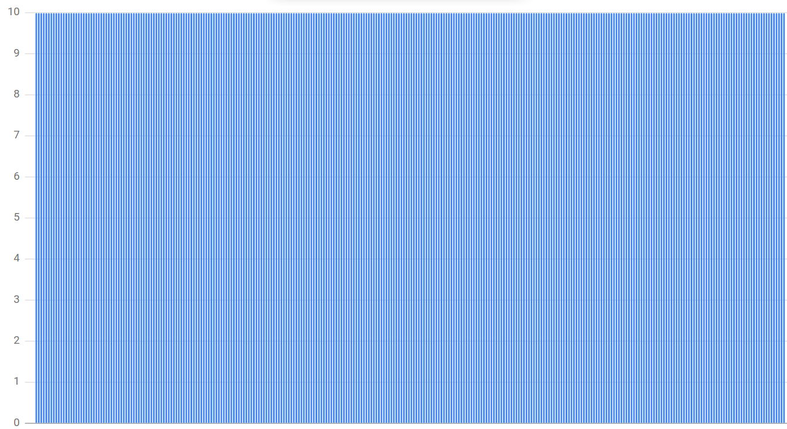
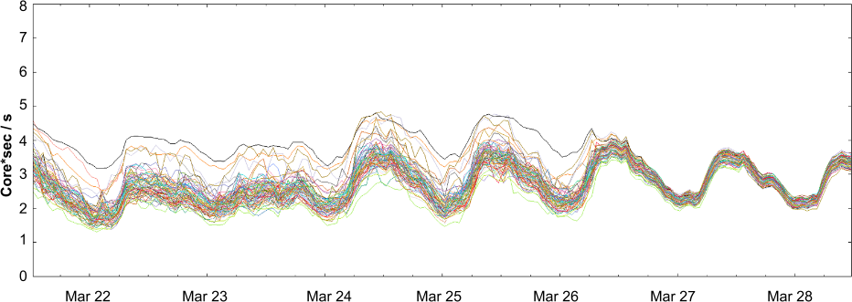

# Chapter 20. Load Balancing in the Datacenter

<i><small>데이터센터의 로드밸런싱</small></i>

## The Ideal Case

**이상적인 경우?**

서비스의 부하가 백엔드에 완벽하게 퍼져서, 특정 한 시점에 '가장 적은 부하를 처리할 때'와 '가장 많은 부하를 처리할 때'의 백엔드 태스크의 CPU 사용률이 완전히 일치

<br><br>

위 그래프는 어느 특정 시간 범위 내에서 실행 중이던 두 태스크의 상태 

이 시간 동안 데이터센터 로드밸런싱 알고리즘은 이 데이터센터에 추가 트래픽을 전달하면 안됨

어느 한 태스크의 부하가 한계를 넘어서기 때문

<br><br>

위 그래프의 왼쪽 그래프를 보면 상당한 양의 수용량이 낭비되고 있음

가장 부하가 높은 태스크를 제외하면 나머지 태스크들에서는 수용량이 낭비되고 있음

#### Example.

작업 `0` 가 가장 많은 부하를 처리 중인 작업이고,
`CPU[i]`는 특정 시점의 작업 `i` 의 CPU 사용률이라고 가정하자.

그래프에서 전반적으로 '다른 태스크들이 사용 중인 CPU 와 `CPU[0]`와의 차이'를 모두 합한 것만큼의 CPU를 낭비 중임.

즉, 태스크 `0` 를 제외한 태스크 `i` 로부터 (`CPU[0] - CPU[i]`) 를 계산한 값의 합이 낭비되고 있는 것

여기서 '낭비'란, CPU 사용이 예약되어 있지만 전혀 사용되고 있지 않음을 의미

<br>

> 이는 데이터 센터 내 로드 밸런싱을 인위적으로 조정하는 것이 얼마나 비효율적인지를 보여줌
>
> 특정 데이터 센터에서 서비스가 1,000개의 CPU를 사용할 것으로 예상했지만, 700개 이상은 사용하지 않고 방치하고 있을 수도 있다는 뜻

<br>

## Identifying Bad Tasks: Flow Control and Lame Ducks

<i><small>양호하지 않은 태스크를 식별하는 확실한 방법: 레임덕 상태</small></i>

<br>

### A Simple Approach to Unhealthy Tasks: Flow Control

<i><small>양호하지 않은 태스크를 식별하는 간단한 방법: 흐름 제어</small></i>


**간단한 흐름 제어 - 간단한 로드밸런싱**

<i><small>각 백엔드 태스크에 대한 연결별로 몇 개의 활성화된 요청을 보냈는지를 추적할 수 있다고 가정</small></i>

- 어느 한 백엔드 태스크에 과부하가 걸리면 이후의 요청은 대기 상태로 놓이고, 클라이언트는 해당 백엔드를 제외한 나머지 백엔드 태스크들에 작업 부하를 분산
- 활성화된 요청의 개수가 **설정된 한계값**을 넘어서는 경우, 클라이언트는 해당 백엔드가 양호하지 않은 상태로 간주하고 더 이상 요청을 전달하지 않음
  - 백엔드의 적절한 한계값은 100개 정도
  - 일반적인 운영환경에서 평균 요청 처리는 굉장히 빨리 처리되므로 이 한계값을 넘어서는 경우는 매우 드뭄.

**한계점:**
- 매우 높은 수준의 과부하 상태에서 백엔드 태스크만 보호
- 이 한계값에 도달하기 전에 이미 백엔드가 과부하 상태에 놓이기 쉬움
  - 활성화된 요청의 한계값을 증가시켜 이 현상을 피할 수는 있지만, 태스크가 실제로 양호하지 않은 상태인지 아니면 단지 응답이 느린 것인지를 식별할 수 없음
  - 백엔드 자원이 충분함에도, 클라이언트가 한계값에 도달하는 경우 발생 (가령, 일부 백엔드가 요청 처리 시간이 길어 빠른 응답이 불가능해지는 경우)
    - 실제로, 이 한계값이 오히려 클라이언트에 영향을 미쳐 모든 백엔드 태스크가 접근 불가능해지고 타임아웃이나 실패가 발생하기 전까지 클라이언트의 요청이 블록되는 현상 발생

<br>

### A Robust Approach to Unhealthy Tasks: Lame Duck State

<i><small>양호하지 않은 태스크를 식별하는 확실한 방법: 레임덕 상태</small></i>

클라이언트 관점에서 **특정 백엔드 태스크 상태**

- **Healthy** (양호): 백엔드 태스크가 적절하게 초기화되어 요청 처리 중인 상태
- **Refusing connections** (연결 거부): 백엔드 태스크가 응답이 불가능한 상태. 태스크가 시작 중, 셧다운 중이거나 백엔드가 정상적이지 않은(셧다운이 되지 않았으나 포트 리스닝을 중단한) 상태이기 때문
- **Lame duck** (레임덕): 백엔드 태스크가 포트를 리스닝 중이며 서비스를 제공할 수 있지만, 명시적으로 클라이언트에게 요청 전달을 중단할 것을 요구하는 상태

<br>

태스크가 레임덕 상태에 놓이면, 이 태스크는 해당 사실을 모든 활성화된 클라이언트에게 알림

<br>
<pre><b>활성화되지 않은 클라이언트?</b>
구글의 RPC 구현의 경우, 비활성화된 클라이언트(ex. 활성화된 TCP 연결이 없는 클라이언트)는 주기적으로 UDP 기반의 상태 체크 요청을 전송함.
따라서 레임덕 정보가 모든 클라이언트에 신속하게(1~2 RTT 내) 전파됨
</pre>

**레임덕 상태 장점**
- 셧다운 과정을 깔끔하게 처리 가능
- 셧다운 중인 백엔드 태스크에서 처리 중인 요청들에 에러 전달 가능
  - 요청 에러를 전달하지 않고 백엔드 태스크를 종료하면, 코드 푸시, 유지보수 내역, 머신 장애 등의 상황에서 관련된 모든 작업을 다시 시작해야 함
   
**태스크의 셧다운 절차 (보통의 경우):**
1. 잡 스케줄러가 SIGTERM 신호를 백엔드 태스크에 전달
2. 백엔드 태스크는 레임덕 상태로 전환하고 클라이언트에게 요청을 다른 백엔드 태스크로 전달할 것을 알림. (SIGTERM 신호를 처리하는 핸들러가 RPC를 기반으로 한 API를 명시적으로 호출)
3. 레임덕 상태로 전환되기 전에 처리 중인 요청들(또는 레임덕 상태 전환 전에 클라이언트가 보낸 요청들)은 정상적으로 실행
4. 클라이언트에 응답을 전달하면, 해당 백엔드에 남은 활성화된 요청의 수가 0으로 줄어듦
5. 일정 시간 기다린 후 백엔드 태스크가 깔끔하게 종료되거나 잡 스케줄러가 태스크를 종료. 모든 요청이 완료될 때까지 기다리는 시간은 서비스별로 다르지만 보통 10초에서 150초 사이

- 백엔드가 초기화 과정 중에도 클라이언트가 연결 수립 가능
    - 백엔드 태스크가 초기화를 완전히 마친 후 연결 리스닝 가능하지만, 연결 수립이 불필요하게 지연될 수 있음

<br>

## Limiting the Connections Pool with Subsetting

<i><small>서브셋을 이용한 연결 풀 제한</small></i>

#### Subsetting (서브셋)

- 클라이언트 태스크가 상호작용할 백엔드 태스크의 풀을 제한하는 것
- 상태 관리와 로드밸런싱에서 고려해야 할 중요한 요소

- **구글의 RPC 시스템 내의 각 클라이언트 연결 관리 방식**
  - **오래 지속되는 연결 풀(long-lived connection pool):**
    - 각 클라이언트는 백엔드에 새로운 요청을 전달하기 위해 연결을 유지
    - 클라이언트 시작 시 미리 확보되고, 종료 시까지 주로 열린 채 유지
  - **요청마다 새로운 연결:**
    - 각 요청 시 새로운 연결을 수립하고, 요청 처리가 완료되면 이를 닫는 방식
    - 자원을 많이 소모하고 지연 응답 가능성이 큼

- **비활성화 모드**
  - 연결이 오랫동안 유휴 상태로 유지되면 RPC 시스템은 이 연결을 '비활성화 모드'로 전환함
  - 가령, '상태 점검 빈도 감소'시키거나 'TCP 연결을 UDP로 대체'

- **서브셋 특징**
  - 모든 연결은 메모리와 CPU 소모함. 연결 오버헤드 작지만, 여러 대라면 금새 커져감
  - 이를 위해 서브셋은 클라이언트가 많은 백엔드 태스크에 연결되거나, 백엔드 태스크가 많은 수의 클라이언트 태스크 연결을 수용하는 방법을 제공
  - 자원을 많이 사용하지만 시간이 짧음

<br>

### Picking the Right Subset

적절한 서브셋을 선택하려면 각 클라이언트가 얼마나 많은 백엔드 태스크에 연결할지를 결정해야 함

→ **선택 알고리즘 (selection algorithm) 구현 필요**

**큰 서브셋 규모가 필요한 경우**
1. 클라이언트 수가 백엔드 수보다 훨씬 적을 때
  - 클라이언트당 많은 백엔드 수를 통해 백엔드 태스크가 트래픽을 받지 못하는 상황 방지할 수 있음
2. 클라이언트의 작업 내에서 부하의 불일치가 빈번하게 발생하는 경우
  - 한 클라이언트 태스크가 다른 태스크에 비해 많은 요청 처리 시: 현재 사용자의 모든 팔로워들 정보 읽기 등

<br>

**클라이언트 선택 알고리즘**

- 최적의 프로비저닝을 위해 백엔드의 균일한 할당 필요
  - 가령, 서브셋을 통해 한 백엔드의 부하가 10%가 되었다면, 전체 백엔드는 10배로 초과 프로비저닝되어야 함
- 재시작이나 장애로 인해 가용한 백엔드에 변화가 발생할 경우 이를 부드럽고 안정적으로 처리해야 함
  - 백엔드 태스크가 사용 불가능한 상태가 되면 해당 태스크의 클라이언트는 일시적으로 다른 백엔드를 선택해야 함
  - 대체 연결된 백엔드는 새로운 TCP 연결을 맺는데, 추가적인 오버헤드 발생
  - 클라이언트 태스크가 재시작되면 필요한 모든 백엔드에 대한 연결을 재설정해야 함
- 알고리즘은 클라이언트 및 백엔드 수가 변경되는 상황도 처리할 수 있어야 함
  - 변경될 클라이언트나 백엔드 수를 사전에 알지 못해도, 최소한의 연결을 유지하면서 동작해야 함

<br>

### 1. A Subset Selection Algorithm: Random Subsetting

<i><small>서브셋 선택 알고리즘: 랜덤 서브셋</small></i>

서브셋 선택 알고리즘을 적당히 구현하는 방법:

각 클라이언트가 백엔드의 목록을 임의로 섞은 후, 그 중 접근이 가능하고 양호한 상태의 벡앤드를 선택해서 서브셋을 구축

고려 대상이 될 백엔드의 수를 명시적으로 제한할 수 있으므로 재시작과 장애 상황을 안정적으로 처리할 수 있음

(가령, 상대적으로 적은 수의 연결을 유지하면서) 

하지만, 부하가 균등하게 분산되지 않기 때문에 대부분의 경우에 원하는 대로 동작하지 않는다는 것을 경험

<br>

#### 예시

**랜덤 서브셋을 구현하고 다양한 경우의 수에 대한 예상 부하를 계산 - 당시 고려했던 예상 수치:**

- 300개의 클라이언트
- 300개의 백엔드

<table>
<tr>
<td>

30% 크기의 서브셋 (각 클라이언트가 90개의 백엔드에 연결)

<small>대부분의 경우 30%의 서브셋 크기는 실전에서 사용하기에 이미 충분한 크기.</small>

<br><br>


→ 부하가 가장 적은 백엔드는 평균 부하가 63% 정도 (평균 90개 연결 대비 57개의 연결 사용)이며, 
가장 부하가 큰 백엔드는 121% (109개 연결) 를 차지.

부하 분산의 예상치는 시뮬레이션을 실행할 때마다 달라졌지만 동일한 패턴을 보임.

</td>
<td>

더 작은 크기의 서브셋을 사용할 경우 불균형이 더 심해지는 현상이 나타남

서브셋의 크기를 10% (클라이언트당 백엔드 30개)로 줄인 상황의 그래프

<br><br>

가장 적은 백엔드는 평균 부하의 50%에 해당하는 부하를 담당하며, 가장 부하가 심한 경우에는 150% (45개 연결)에 달함.

</td>
</tr>
</table>

→ 결론: 랜덤 서브셋을 이용해 가용한 태스크들을 상대적으로 균형 있게 처리하려면 서브셋의 크기는 대략 75% 정도가 되어야 함.

문제는 서브셋을 그 정도로 크게 설정하면 효율이 크게 떨어짐.

클라이언트 수의 변동 폭이 너무 커서 대용량 환경에서 적절한 랜덤 서브셋을 선택하는 적절한 정책을 수립하기 어려움.

<br>

### 2. A Subset Selection Algorithm: Deterministic Subsetting

<i><small>서브셋 선택 알고리즘: 결정적 서브셋</small></i>

랜덤 서브셋의 제한을 해결하기 위한 구글의 해결책: 결정적 서브셋

```python
def Subset(backends, client_id, subset_size):
    subset_count = len(backends) / subset_size
    
    # 클라이언트가 속할 그룹을 선택. 각 라운드마다 동일한 방법으로 백엔드 목록을 섞는데 사용.
    round = client_id / subset_count
    random.seed(round)
    random.shuffle(backends)
    
    # 현재 클라이언트를 기준으로 서브셋의 id를 결정.
    # 서브셋의 id는 현재 클라이언트에 대응.
    subset_id = client_id % subset_count
    
    start = subset_id * subset_size
    
    return backends[start:start + subset_size]
```

<br>

위 코드는 클라이언트 태스크들을 라운드로 나누어 사용.

예를 들어 라운드 1은 태스크 `subset_count * i`로 시작하며, 연속된 클라이언트 태스크들의 `subset_count`로 구성됨.

`subset_count`는 서브셋의 수, 즉, 원하는 서브셋의 크기로 나눈 백엔드 태스크들의 수

매 라운드에서 각 백엔드는 정확히 하나의 클라이언트에 할당됨

<pre><b>Example, 12개의 백엔드 태스크와 원하는 서브셋의 크기가 3이라면?</b>

각 4개의 클라이언트가 할당된 세 개의 라운드를 정의함.

- 라운드 0: [0, 6, 3, 5, 1, 7, 11, 9, 2, 4, 8, 10]
- 라운드 1: [8, 11, 4, 0, 5, 6, 10, 3, 2, 7, 9, 1]
- 라운드 2: [8, 3, 7, 2, 1, 4, 9, 10, 6, 5, 0, 11]
</pre>
<br>

핵심은 각 라운드마다 각 백엔드를 클라이언트의 전체 목록 중 한 클라이언트에만 할당한다는 점

각 백엔드는 정확히 두 개 혹은 세 개의 클라이언트에만 할당됨

<br>

**중요한 점:**

- **백엔드의 목록은 반드시 섞여야 함**
    - 그렇지 않으면 클라이언트가 할당된 연속적인 백엔드 스크의 그룹에 공교롭게도 현재 사용 가능한 백엔드가 존재하지 않을 수 있음
    - 예시: 백엔드 작업이 처음부터 마지막 태스크 순서로 순차적으로 업데이트되는 경우.
- 각 라운드는 목록을 혼합할 때 각기 다른 시드값을 사용
    - 그렇지 않으면 백엔드가 실패했을 때 해당 백엔드의 부하는 서브셋에 남아있는 백엔드 중 하나가 부담해야 함.
    - 만약 서브셋 내의 다른 백엔드마저 실패한다면 그 영향이 더해져 상황이 빠르게 악화될 수 있음.
    - 예시: 어느 서브셋에 포함된 백엔드 `N`이 다운된다면, 그에 상응하는 부하가 남은 `(subset_size - N)` 백엔드로 퍼져나가게 됨.

<br>

**더 나은 방법**: 이 부하를 각 라운드마다 매번 목록을 다르게 뒤섞어 남아있는 백엔드 전체에 부하를 분산하는 것.

각 라운드마다 서로 다른 값으로 목록을 뒤섞으면, 같은 라운드의 클라이언트는 동일한 목록과 함께 시작되지만,
여러 라운드에 걸쳐 동작하는 클라이언트는 각기 다른 목록의 백엔드를 사용하게 됨

이 시점에서 알고리즘은 백엔드 목록과 원하는 서브셋 크기를 바탕으로 서브셋을 정의함.

`shuffled_backend`는 각 클라이언트가 생성한 백엔드의 목록.

서브셋을 클라이언트 태스크에 할당할 때는 해당 클라이언트가 속한 라운드

(예: 4개의 서브셋 중 client[1]이 위치한 라운드 (`1 % 4`) 내의 위치에 대응하는 서브셋을 선택하면 됨

- client[0], client[4], client[8] → subset[0] 사용
- client[1], client[5], client[9] → subset[1] 사용
- client[2], client[6], client[10] → subset[2] 사용
- client[3], client[7], client[11] → subset[3] 사용

<br>

클라이언트가 300개이고 각 클라이언트를 300개 중 10개의 백엔드에 할당하면, 
앞서 예제의 실행 결과가 훨씬 더 좋아진다는 것을 알 수 있음.

<br><br>

각 백엔드는 정확히 동일한 수의 연결을 처리.

<br>

## Load Balancing Policies

<i><small>로드밸런싱 정책</small></i>

로드밸런싱 정책은 클라이언트 태스크들이 자신의 서브셋 내에서 요청을 처리할 백엔드를 선택하기 위해 사용하는 메커니즘

<br>

**백엔드의 상태에 따른 방법**
- 어떤 정보도 필요하지 않은 매우 간단한 방법: **라운드 로빈 방식** (Simple Round Robin)
- 백엔드에 대한 더 자세한 정보를 필요로 하는 방법: **최소 부하 라운드 로빈** (Least-loaded Round Robin) 혹은 **가중 라운드 로빈** (Weighted Round Robin) 등 

<br>

### 1. Simple Round Robin

<i><small>간단한 라운드 로빈</small></i>

가장 보편적인 방법이면서 가장 간단한 방식.

자신의 서브셋에 해당하는 각 백엔드 태스크에 요청을 보내는 방법.

성공적으로 연결이 맺어져 있으며 레임덕 상태에 있지 않은 백엔드를 선택해야 함

하지만 실제 다양한 요인에 의해 부하가 가장 적은 태스크와 가장 많은 태스크의 CPU 사용률이 최대 두 배까지 차이가 발생

<br>

**다양한 요인?**
- 작은 크기의 서브셋
  - 라운드 로빈의 부하 조정 능력이 떨어지는 가장 간단한 이유 중 하나는 모든 클라이언트가 동일한 비율로 요청을 보내지 않을 수도 있다는 점 때문
- 다양한 쿼리 비용
  - 요청들은 그 처리에 각기 다른 양의 자원을 필요로 함
  - 쿼리 비용의 불규칙성이 큰 시스템의 로드밸런싱은 상당히 문제가 심각
- 머신의 다양성
  - 데이터센터 내의 모든 머신이 완전히 동일하지 않다는 점
  - GCU(Google Compute Units, 구글 컴퓨트 유닛) 이라는 가상의 CPU 사용률을 만듦 → CPU 사용률을 모델링하는 표준이 됨
- 예측 불가능한 성능 요인들
  - 정반대의 이웃들: 다른 프로세스들이 여러분의 프로세스들의 성능에 심각한 영향을 미칠 수 있음
  - 태스크 재시작: 태스크는 재시작할 때 몇 분 동안 훨씬 많은 양의 자원을 소비

<br>

### 2. Least-Loaded Round Robin

<i><small>최소 부하 라운드 로빈</small></i>

> 각 클라이언트가 서브셋 내의 각 **백엔드 태스크와 연결된 활성화된 요청의 개수를 추적**하고,
**가장 적은 수의 활성화된 요청을 처리하고 있는 태스크들만을 대상으로 라운드 로빈을 수행**하는 것

<br>

클라이언트가 태스크 `t0` 부터 `t9` 까지의 서브셋을 사용하고 있으며, 현재 각 백엔드 별로 다음과 같이 활성화된 요청을 처리 중이라고 가정

| t0  | t1  | t2  | t3  | t4  | t5 | t6 | t7  | t8  | t9  |
|-----|-----|-----|-----|-----|----|----|-----|-----|-----|
| 2   | 1   | 0   | 0   | 1   | 0  | 2  | 0   | 0   | 1   |

새로운 요청이 필요해지면 클라이언트는 가장 적은 수의 연결을 가진 백엔드 태스크들 (`t2`, `t3`, `t5`, `t7`, `t8`) 중에서 하나를 고름

<br>

`t2` 태스크를 선택했다고 가정

| t0  | t1  | t2    | t3  | t4    | t5  | t6  | t7    | t8  | t9  |
|-----|-----|-------|-----|-------|-----|-----|-------|-----|-----|
| 2   | 1   | **1** | 0   | 1     | 0   | 2   | 0     | 0   | 1   |

현재 완료된 요청이 없다고 가정할 경우, 다음 요청이 발생하면 백엔드 태스크의 후보는 `t3`, `t5`, `t7`, `t8` 중 하나가 됨

<br>

제 4 개의 새로운 요청을 더 처리하게 되었다고 가정

| t0  | t1    | t2  | t3      | t4 | t5      | t6 | t7      | t8       | t9  |
|-----|-------|-----|---------|----|---------|----|---------|----------|-----|
| 2   | 1     | 1   | **1**   | 1  | **1**   | 2  | **1**   | **1**    | 1   |

백엔드 후보는 `tO` 와 `t6` 를 제외한 나머지 태스크들이 될 것

<br>

만약, 태스크 `t4` 에서 실행 중인 요청이 끝나면 그 태스크의 상태는 '**활성화된 요청 0개인 상태**'가 되어 새로운 요청은 `t4` 에 할당

핵심은 일단 부하가 많은 태스크들은 여력이 있는 태스크들보다 상대적으로 지연응답률이 높기 때문에 부하가 많은 태스크들을 제외하는 것

<br>

**최소 부하 라운드 로빈은 두 가지 중요한 제한점이 있음:**

1. 활성화된 요청의 개수는 특정 백엔드의 용량을 파악하기에 가장 좋은 방법이 아닐 수도 있음
  - 지연응답: I/O에 대한 블로킹(bocking)은 CPU와 대역폭은 전혀 사용하지 않으며, 아주 적은 양의 RAM을 소비하므로 여전히 더 빠른 백엔드에 두 배의 요청을 보내는 것이 나음.
    하지만 최소 부하 라운드 로빈은 두 백엔드 태스크에 동일한 양의 작업을 할당
2. 각 클라이언트의 활성화된 요청의 수는 다른 클라이언트가 같은 백엔드에 할당한 요청의 수를 포함하지는 않음
  - 자신의 요청에 대해서만 파악할 수 있음

<br>

### 3. Weighted Round Robin

<i><small>가중 라운드 로빈</small></i>

각 클라이언트 태스크는 서브셋 내의 각 백엔드의 수용량 점수를 저장

요청은 라운드 로빈 형식으로 분산되지만, 클라이언트는 백엔드에 분산된 요청의 비율에 따라 가중치를 계산

백엔드는 각 (상태 검사의 응답을 포함하는) 응답에 활용도 (주로 CPU 사용률) 뿐만 아니라 현재의 쿼리 비율과 초당 에러율을 포함시킴.

클라이언트는 백엔드가 현재 성공적으로 처리한 요청의 수와 활용도 비용 등을 고려하여 백엔드 태스크의 수용량 점수를 정기적으로 갱신.

실패한 요청은 향후 의사 결정에 불이익으로 작용

<br><br>

최소 부하 라운드 로빈 방식을 가중 라운드 로빈 방식으로 변경했을 때 시간에 따른 백엔드 태스크들의 랜덤 서브셋들의 CPU 사용률을 보여줌

최저 및 최고 부하 태스크의 차이가 눈에 띄게 줄어들었음을 볼 수 있음

