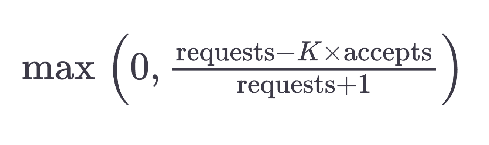
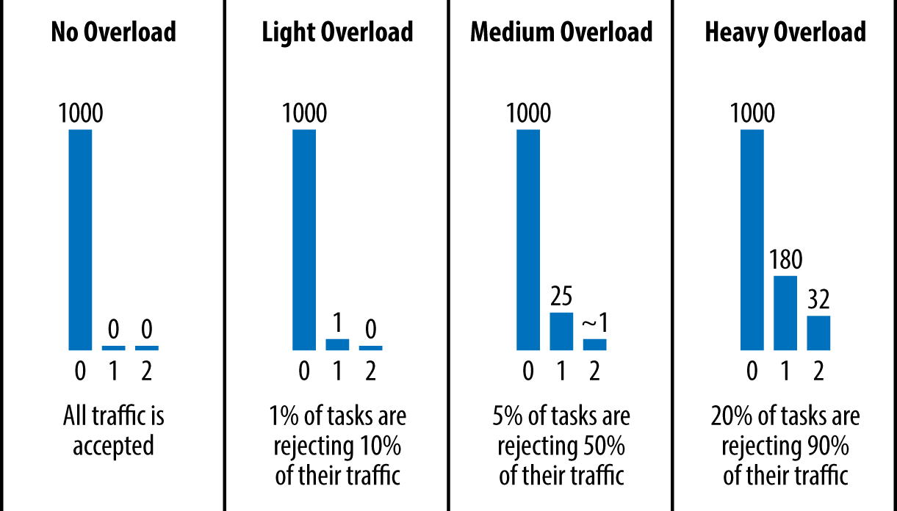
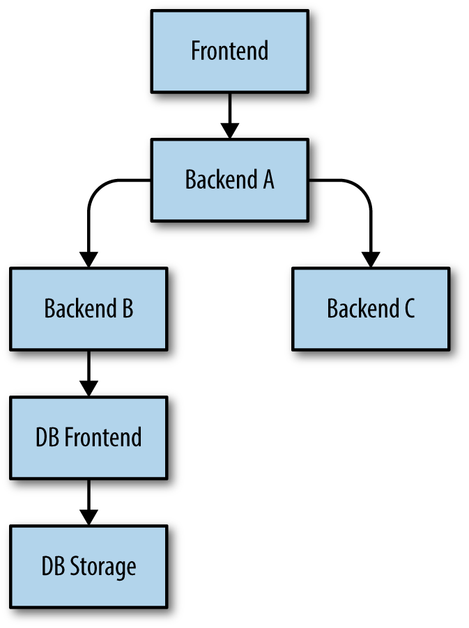

# CHAPTER 21. Handling Overload

<small><i>과부하 처리하기</i></small>

과부하 상태를 얼마나 잘 처리하는지는 시스템의 신뢰성을 확보하기 위한 기초임.

과부하를 처리하는 방법 중 하나는 경감된 응답을 리턴하는 것임.

- 검색 쿼리에 대한 최상의 결과를 제공하기 위해 전체 데이터를 검색하는 대신 작은 규모의 후보군만 검색하는 방식
- 가장 최신의 데이터가 아닐 수 있지만, 로컬 복사본을 기준으로 검색하는 것
  - 원본 데이터 저장소를 대상으로 검색하는 것보다는 훨씬 저렴한 비용으로 작업을 수행할 수 있음

경감된 응답조차도 서비스할 수 없을 정도로 과부하가 극심한 경우에는 에러를 리턴하는 것이 필요함.

예를 들어 100개의 백엔드 태스크를 실행 중이고 초당 500개의 요청을 처리할 수 있다면, 로드밸런싱 알고리즘은 초당 50,000 쿼리 이상의 요청을 보내면 안 됨.

 

## The Pitfalls of “Queries per Second”

<small><i>'초당 쿼리 수'의 함정</i></small>

사용 가능한 자원에 대해 직접적인 수용량을 측정하는 것이 중요함.

예를 들어, 어느 데이터 센터의 특정 서비스가 총 500개의 CPU 코어와 1TB의 메모리를 사용할 수 있다고 가정할 때, 데이터 센터의 수용량을 모델링할 때 이러한 숫자들을 직접 사용하는 것이 좋음.

종종 서비스가 소비하는 CPU 시간에 대한 평균 측정값을 요청의 비용이라고 표현하기도 함.

대부분의 경우 CPU 사용량이 프로비저닝(자원 증설) 신호로 사용될 수 있음.

- 가비지 컬렉션이 있는 플랫폼에서는 메모리 압박이 자연스럽게 CPU 소비 증가로 이어짐
- 다른 플랫폼에서는 남아있는 자원을 CPU가 소진되기 전에 고갈되지 않도록 할당하는 것이 가능함

만약 CPU 외의 자원이 비싸서 과한 프로비저닝이 부담된다면, 이러한 자원을 별도로 취급하면 됨.

 

## Per-Customer Limits

<small><i>사용자 별 제한</i></small>

전체적인 과부하가 발생할 때 서비스가 엉뚱한 행동을 하는 고객에게만 에러 응답을 리턴하고, 나머지 고객들은 영향받지 않도록 하는 것이 중요함.

예를 들어 (여러 데이터 센터에 걸쳐) 전 세계에 보유하고 있는 전체 백엔드 서비스에 10,000개의 CPU가 할당되어 있다면, 다음과 같이 사용자 별 사용량을 제한할 수 있음.

- 지메일에는 초당 4,000 CPU 초를 허용
- 달력 서비스에는 초당 4,000 CPU 초를 허용
- 안드로이드(Android) 기기에는 초당 3,000 CPU 초를 허용
- 구글플러스 서비스에는 초당 2,000 CPU 초를 허용
- 다른 모든 사용자들에게는 초당 500 CPU 초를 허용

이 숫자들을 모두 더하면 10,000 CPU 보다 큰 값을 백엔드 서비스에 할당할 수 있음을 유념해야 함. 서비스 소유자는 모든 고객들이 자신의 자원을 지속적으로 한계치까지 사용하지 않는다는 사실에 기초해 이같은 계획을 수립한 것임.

구글은 전역적인 사용량 정보를 모든 백엔드 태스크로부터 실시간으로 수집하고, 이 데이터를 이용하여 개별 백엔드 태스크들의 한계치를 효율적으로 제한함.

가장 흥미로운 부분은 각 개별 요청이 소비하는 자원(특히 CPU)의 양을 실시간으로 계산하는 것임. 요청 별 스레드 모델(Thread-per-Request 모델)을 구현하지 않은 서버의 경우에는 이 계산을 수행하기가 특히 까다로움. 논블로킹 API들을 사용하기 때문에 비동기적이고 비선형적인 방식으로 요청이 처리되는 경우, 각 요청에 대한 리소스 소비를 정확하게 추적하는 것이 복잡할 수 있음.

 

## Client-Side Throttling

<small><i>클라이언트 측에서의 사용량 제한</i></small>

클라이언트 요청이 할당량을 넘으면 백엔드는 신속히 이후 요청을 거부해야 함.

→ 최소한의 자원으로 에러를 리턴해야 함

→ 하지만, 특정 태스크(RAM 조회 등)는 오류 리턴과 별반 다르지 않으며, 요청의 거부에도 리소스가 필요함.

 

**해결책**: 클라이언트 측에서 사용량을 제한함.

[Github: Youtube, Doorman](https://github.com/youtube/doorman)

클라이언트가 최근 들어 많은 요청이 '할당량 초과' 에러로 인해 거부되는 것을 인지하면, 자체 조정을 통해 외부로 발신되는 트래픽을 제한하는 것임. 즉, 네트워크를 타기 전 자체적으로 실패를 처리하는 것임.

구글은 **adaptive throttling**(적응형 사용량 제한) 기법을 이용해 클라이언트 측 사용량 제한을 구현함. 특히 각 클라이언트 태스크는 다음과 같은 정보를 최근 2분에 대하여 추적함:

- `requests`: 애플리케이션 계층에서 클라이언트가 시도했던 요청의 수
- `accepts`: 백엔드가 받아들인 요청의 수

일반적인 경우라면 두 값은 동일하겠으나, 백엔드가 트래픽을 거부하기 시작하면 받아들인 요청의 수는 전체 요청 수에 비해 줄어들기 시작함.

클라이언트는 전체 요청 수가 받아들여진 요청 수의 배가 될 때까지는 계속해서 백엔드에 요청을 발신할 수 있음. 그러나 어느 경계를 넘으면 클라이언트는 자체 조정을 수행하고, 새로운 요청은 내부적으로 (즉, 클라이언트 내에서) 확률적으로 거부된 것으로 처리함.

 

**클라이언트 요청의 자체 거부 확률:**

 

클라이언트 자체가 요청을 거부하기 시작하면, 
`requests`가 `accepts` 수를 지속적으로 초과하게 됨.

내부적으로 거부된 요청이 실제로 백엔드로 전달되지 않기 때문에 이는 직관적이지 않을 수 있지만, 의도된 동작임.

애플리케이션이 클라이언트에 요청을 시도하는 속도가 백엔드가 이를 수락하는 속도에 비해 증가함에 따라, 새로운 요청을 버릴 확률을 높이고자 함.

결과적으로 성공적인 결과를 얻을 수 있음.

전체적으로 요청에 대한 안정적인 비율을 이끌어냄.

기록 비율이 요청 거부 비용과 유사한 서비스의 경우,
클라이언트가 자체적으로 요청을 거부하는 비율 `K`를 조정할 수 있음.

- 비율이 감소하면 더 적극적인 적응형 사용량 제한을 적용하게 됨
- 비율이 증가하면 더 여유 있는 적응형 사용량 제한을 적용하게 됨

현재 클라이언트가 `requests = 2 * accepts`일 때 요청에 대한 자체 처리를 수행한다면, 이를 `requests = 1.1 * accepts`일 때 처리하도록 조정할 수 있음.

일반적으로 이 배율은 2를 선호함.

한 가지 더 고려해야 할 사항은 클라이언트 측 사용량 제한은 클라이언트가 산발적으로 백엔드에 요청을 보낼 때는 제대로 동작하지 않을 수 있다는 점임. 
이러한 경우 각 클라이언트가 백엔드의 상태를 파악해야 하는 빈도가 매우 적기 때문에, 이를 더 자주 확인하려고 하면 더 높은 비용을 지불하게 됨.

 

## Criticality

<small><i>중요도</i></small>

서비스 전반에 걸친 할당량의 수립 및 제한에 있어 중요도 (criticality) 역시 큰 영향을 미침

- `CRITICAL_PLUS`
  - 가장 중요한 요청을 위한 값. 이 값을 가진 요청들은 실패 시 사용자에게 직접적인 영향을 미침
- `CRITICAL`
    - 프로덕션 환경에서 전달되는 모든 요청들이 기본적으로 사용하는 값
    - 이 값을 가진 요청들은 사용자에게 영향을 미치지만 그 영향도가 CRITICAL_PLUS 등급을 가진 요청의 영향도보다 낮음 
    - 서비스들은 예상되는 CRITICAL 및 CRITICAL_PLUS 등급의 요청들을 모두 처리하기에 충분한 사용량을 준비해야 함
- `SHEDDABLE_PLUS`
  - 어느 정도 실패가 발생하는 것을 용인할 수 있는 트래픽을 위한 값
  - 실패 시 몇 분이나 몇 시간 후에 다시 재시도하게 되는 일괄 작업을 위한 기본값
- `SHEDDABLE`
  - 부분적 실패가 자주 발생하거나 간혹 아예 사용이 불가능할 것으로 예상되는 작업들을 위한 값

네 가지 중요도 -> 모든 서비스에 적용할만한 견고한 모델 수립에 충분

스템이 과부하 상황에 올바르게 대처할 수 있도록 다양한 제어 메커니즘에 중요도를 결합

요청의 중요도는 지연응답 요구사항에 정비례하므로 사용하는 기반 네트워크의 서비스 품질(Qualiy of Service, Qos) 과도 정비례

RPC 시스템 향상: 중요도를 자동으로 전파
- `요청 A`를 수신 시, 요청 처리 과정에서 `요청 B`와 `요청 C`를 발신했다면, `요청 B`와 `요청 C`는 `요청 A` 와 동일한 중요도를 가짐

 

## Utilization Signals

<small><i>활용도에 대한 신호들</i></small>

구글의 과부하 보호 기법은 활용도 (utilization) 의 개념에 그 기반을 둠

활용도가 설정된 한계치에 다다르면 요청의 중요도에 따라 이에 대한 처리를 거부하기 시작

중요도가 높은 요청에는 더 높은 한계값을 적용

가장 일반적으로 사용되는 신호는 프로세스의 '부하'이며 , 이것은 **실행자 부하 평균** (executor load average) 이라고 부르는 시스템에 의해 결정되는 수치

지수 감소(exponential decay)의 법칙을 이용하여 이 값을 다듬은 후 활성화된 스레드의 개수가 태스크를 실행할 수 있는 프로세서의 수를 넘어서면 요청을 거부하기 시작

 

## Handling Overload Errors

<small><i>과부하 오류 처리하기</i></small>

과부하 오류가 발생하면 다음 두 가지 상황을 구분하여 인지해야 함.

1. **대량의 백엔드 태스크에 과부하**
- 데이터센터 간 로드 밸런싱 시스템이 완벽하게 동작한다면 이 상황은 발생하지 않음.
- 가령, 상태를 전파하고 그에 따라 즉각적으로 트래픽을 이동시킬 수 있는 경우.
- 요청을 재시도해서는 안 됨.

2. **일부 백엔드 태스크에 과부하**
- 데이터센터 내 로드 밸런싱이 완벽하지 않기 때문에 발생함.
- 가령, 특정 태스크가 최근에 매우 비싼 요청을 수신한 경우. 보통 다른 백엔드가 충분히 요청을 처리할 자원을 가짐.
- 일부 태스크에만 과부하가 발생한 경우, 해당 요청을 즉시 재시도하는 것이 바람직함.
  
**재시도가 항상 바람직하진 않음**
- 재시도 중인 요청을 실제로 다른 태스크에 전달해도, 얻을 수 있는 장점보다 복잡도가 증가.
- 클라이언트에게도 더 나은 결과를 제공할 수 있음. 남는 자원이 있는 다른 백엔드 태스크에 할당될 수 있기 때문.

 

### Deciding to Retry

<small><i>재시도 여부 결정하기</i></small>

상당 수의 태스크에 과부하 발생 시, 재시도 방지 메커니즘: 

1. 재시도 허용 수준(per-request retry budget)을 최대 3회로 제한.
2. 클라이언트별 재시도 비율(percent retry budget) 한계 정의.
   - 각 클라이언트는 요청의 재시도 비율을 추적하며, 이 비율이 10% 이내인 경우에만 재시도를 수행.
3. 클라이언트가 요청의 메타데이터에 해당 요청 처리 시도 횟수를 기록함.

  

여러 조건에서 시도된 요청의 기록.
  

거부된 요청에 대한 재시도는 해당 요청이 거부된 계층 바로 위의 계층에서 이루어짐.

이 요청을 더 이상 처리할 수 없으며, 
요청을 더 이상 재시도하지 않기로 결정하면 "과부하 발생: 재시도 중지" 오류를 반환하여 재시도 요청이 폭증하는 현상을 방지할 수 있음.

**예시**: 현재 과부하 상태인 DB 프런트엔드가 요청을 거부.

  

1. **백엔드 B**가 **DB 프런트엔드**에 대한 요청 실패 → 가이드라인에 따라 요청 재시도
2. **백엔드 B**가 재시도 처리 불가를 인지 (가령, 세 번 이상 재시도 거부)
   - → **백엔드 B**는 **백엔드 A**에게 `과부하 발생: 재시도 중지` 오류 등 응답을 생성하여 반환.
3. **백엔드 A**는 **프런트엔드**로부터 요청에 대한 응답을 받을 때 **백엔드 B**와 동일한 방식으로 처리할 수 있음.

✔️ **핵심**: **DB 프런트엔드**의 실패한 요청은 바로 위 계층에 있는 **백엔드 B**만이 재시도할 수 있다는 점.

 

## Load from Connections

<small><i>연결에 대한 부하</i></small>

연결 부하는 모니터링이 필요한 중요한 요소 중 하나.

 

> Example. **RPC 프로토콜**
> 
> RPC 프로토콜은 정기적인 상태 점검 수행.
> 
> 헬스 체크를 위한 상태 점검을 위한 UDP 연결. 
> 하지만, 연결 상태 점검이 실제 요청을 처리하기 위해 필요한 자원보다 더 많은 자원을 소비할 수 있기 때문에 문제가 될 수 있음.

 

대량의 요청을 처리하는 것도 중요한 문제임. 

대량의 일괄 작업이 동시에 많은 워커 클라이언트 태스크를 생성하면, 
과도한 수의 새 연결을 동시에 관리해야 하므로 백엔드 그룹에 과부하가 발생할 수 있음.

 

**과부하를 완화할 수 있는 전략:**

1. 데이터센터 간 로드 밸런싱 알고리즘을 활용한 부하 관리
   - 클러스터의 사용량을 반영한 로드 밸런싱을 적용하여 부하를 효과적으로 분산.
2. 일괄 프록시 사용
   - 일괄 클라이언트는 요청을 백엔드로 직접 전달하는 대신, 요청을 중개하는 별도의 일괄 프록시 백엔드를 활용함. 
     - 즉, '일괄 클라이언트 → 백엔드' 대신 '일괄 클라이언트 → 일괄 프록시 → 백엔드' 경로를 따름.
   - 일괄 프록시는 부하를 완화하는 완충 역할을 수행 → 일종의 퓨즈(fuse)처럼 수행.

 

## Conclusions

개별 태스크를 과부하로부터 보호하는 것이 중요함.

견고한 로드 밸런싱 정책이 적용된다면, 백엔드는 처리할 수 있는 수준의 요청만을 수신해야 하며, 나머지는 적절하게 거부해야 함.
