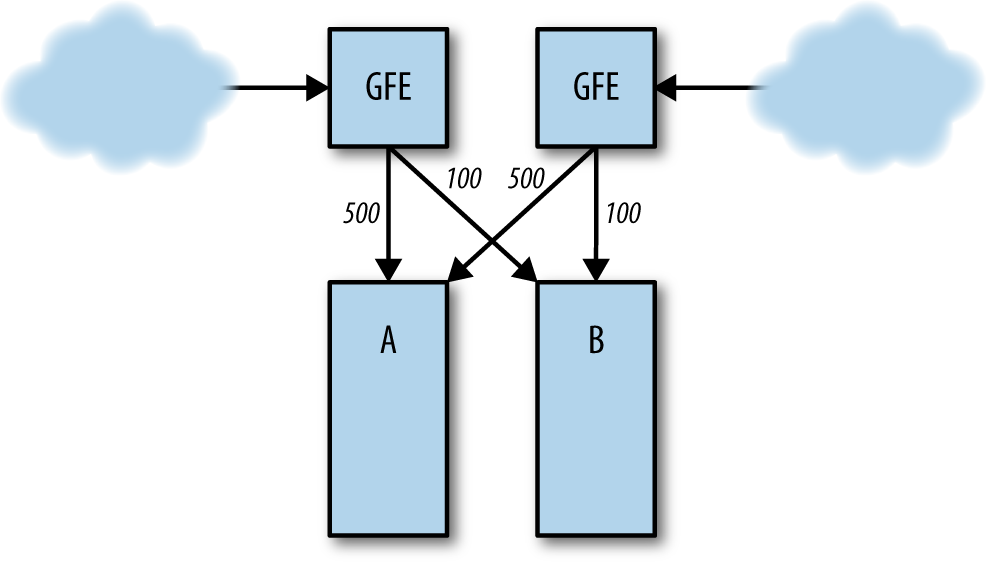
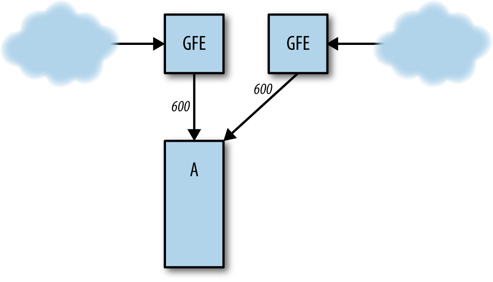

# CHAPTER 22. Addressing Cascading Failures

연속적 장애 다루기


📌 **Cascading Failure**
: 연속적 장애. 정상적인 것처럼 보여지는 응답 때문에 시간이 지나면서 장애가 계속해서 가중되는 현상

<br />
<br /><small><b>Example production configuration for the Shakespeare search service</b></small><br />

## Causes of Cascading Failures and Designing to Avoid Them

<small><i>연속적 장애의 원인과 그 대책</i></small>

연속적 장애를 유발할 수 있는 상황:

### Server Overload

<small><i>서버 과부하</i></small>

연속적 장애를 유발하는 가장 일반적인 원인.

#### Example.

클러스터 A 의 프런트엔드가 초당 1,000 개의 요청 (Query Per Second, QPS) 을 처리한다고 가정

<br />
<br /><small><b>Normal server load distribution between clusters A and B</b></small><br />

만일 클러스터 B 에서 장애가 발생하면(아래) 클러스터 A 에 전달되는 요청은 1,200 QPS 로 증가

<br />
<br /><small><b>Cluster B fails, sending all traffic to cluster A</b></small><br />

- 클러스터 A 의 프런트엔드는 1,200 QPS 의 요청을 처리할 수 없으므로 자원이 부족하게 되어 충돌이 발생하거나 지연응답 혹은 오동작이 발생
- 그 결과 성공 처리된 요청 건 수는 1,000 QPS 이하로 감소

실패 작업의 수가 증가하면 그 여파는 다른 시스템으로 퍼져 전체 시스템에 영향을 미칠 수 있음. 

로드밸런서와 태스크 스케줄링 시스템은 매우 빠르게 동작하기 때문에 장애 전파는 빠르게 확산될 수 있음.

<br/>

### Resource Exhaustion

<small><i>자원의 부족</i></small>

- 자원의 부족은 지연 응답과 에러율의 증가 혹은 낮은 품질의 응답을 야기할 수 있음.
- 서버의 어떤 자원이 부족해지는지, 그리고 서버가 어떻게 구성되어 있는지에 따라 로드밸런서는 즉시 다른 서버들로 퍼져나가게 함.
- 성공 처리율이 빠르게 감소하고, 연속적 장애가 전파될 수 있음.

<br/>

#### ✔️ CPU

요청을 처리하는 데 CPU가 부족한 경우, 보통 요청 처리 전체 작업이 느려짐

**그 원인은 다양함**:

- **In creased number of in-flight requests**
    - 최대 처리 가능 수까지, 처리 중인 요청 수의 증가
    - 메모리, 활성 스레드 수, 파일 서술자(descriptor)의 수 및 백엔드 자원 등 대부분의 다른 자원에 영향을 줌

- **Excessively long queue lengths**
    - 비정상적으로 큐의 크기 증가
    - 큐에 요청들이 쌓이게 되어, 지연 응답이 증가하고 큐가 더 많은 메모리를 소비하게 됨

- **Thread starvation**
    - 스레드 기아; 스레드가 Lock을 기다리느라 스레드는 더 이상 처리되지 않고, 헬스 체크가 실패할 수 있음

- **CPU or request starvation**
    - 서버 내부의 와치독이 서버가 더 이상 처리를 못 하고 있다는 것을 탐지
    - CPU 기아 현상으로 인해 서버에서 충돌이 발생
    - 요청 큐를 통해 처리되는 경우, 요청 기아가 발생하기도 함

- **Missed RPC deadlines**
    - RPC 시간 초과; 서버에 과부하가 발생하면 클라이언트에 대한 RPC 응답이 늦어지게 되어 클라이언트에서 시간 초과 발생
    - 서버가 수행했던 작업은 아무런 소용이 없어지고 클라이언트는 RPC 요청을 재시도하여 더 많은 과부하가 발생할 수 있음

- **Reduced CPU caching benefits**
    - 더 많은 코어에서 누수가 발생할 가능성이 커짐
    - 결론적으로, 로컬 캐시 및 CPU의 효율성이 떨어질 수 있음

<br/>

<pre>
와치독: 주로 마지막으로 검사한 시간 이후로 작업이 완료되었는지를 확인하기 위해 정기적으로 실행되는 스레드의 형태로 구현됨.
- 주로 서버가 멈춰있는지를 확인하기 위해 사용됨. 
- 서버가 멈춰있는지를 확인하기 위해 주기적으로 작업을 확인하고, 작업이 완료되지 않았다면 서버가 멈춰있다고 가정하고 서버를 종료시킴. 
- 예를 들어, 알려진 유형의 요청이 정기적으로 서버로 전송되고, 예상 시간에 요청이 수신되거나 처리되지 않았다면, 이는 서버, 요청을 보내는 시스템 또는 중간 네트워크의 실패를 나타낼 수 있음.
</pre>

<br/>

#### ✔️ Memory

실행 중인 요청은 요청, 응답, RPC 객체 등을 할당하기 위해 더 많은 RAM을 소비함.

메모리 기아(memory starvation)는 다음과 같은 현상을 유발함.

- **Dying tasks**
    - 가용한 자원의 한계 혹은 애플리케이션 충돌로 인해 태스크를 거부 시, 해당 태스크는 강제로 종료됨.

- **Increased rate of garbage collection (GC) in Java**, resulting in increased CPU usage
  - 자바의 가비지 컬렉션 수행률 증가로 인한 CPU 사용률 증가
  - **GC death spiral**(죽음의 GC 소용돌이): 가비지 컬렉션이 비정상적으로 동작하면 가용한 CPU 자원이 줄어들고 이로 인해 요청의 처리가 느려지면서 RAM 사용량이 증가. 그 결과 GC 작업이 더 빈번하게 수행되면 CPU 자원이 더 모자라게 되는 악순환 발생.

- **Reduction in cache hit rates**
    - 가용한 RAM이 부족해지면 애플리케이션 수준의 캐시 활용률이 감소하고, 그 결과 더 많은 RPC 요청이 백엔드로 전달되어 백엔드에 과부하를 초래함.

<br/>

#### ✔️ Threads

- 스레드 기아는 직접적으로 에러를 발생시키거나 헬스 체크의 실패를 야기함.
- 스레드 과부하로 인해 너무 많은 RAM을 소비함.
- 극단적인 경우, 스레드 기아로 인해 프로세스 ID가 모두 소진될 수 있음.

<br/>

#### ✔️ File descriptors

파일 서술자(file descriptor)가 부족해지면 네트워크 연결의 초기화가 불가능해져 헬스 체크가 실패하게 됨.

<br/>

#### ✔️ Dependencies among resources

중요한 것은 자원의 부족이 또 다른 자원에 영향을 미친다는 점임.

**예시**:
1. Java 프런트엔드가 잘못 조정된 가비지 컬렉션(GC) 매개변수를 가짐
2. 높은(지만 예상된)로드 하에서 프런트엔드가 GC로 인해 CPU 부족
3. CPU 고갈로 요청 완료가 느려짐
4. 진행 중인 요청 수의 증가로 인해 요청 처리에 더 많은 RAM 사용
5. 요청에 의한 메모리 압력과 프런트엔드 프로세스 전체에 대한 고정 메모리 할당의 조합으로 인해 캐싱에 사용 가능한 RAM이 줄어듦
6. 캐시 크기의 감소는 캐시의 항목 수가 줄어들고 더 낮은 히트율을 의미
7. 캐시 미스의 증가는 더 많은 요청이 백엔드로 전달되도록 하고
8. 백엔드는 CPU 또는 스레드가 부족
9. 마지막으로, CPU 부족으로 기본 헬스 체크가 실패하면서 연쇄적인 실패가 시작

위 처럼 복잡한 상황에서는 장애가발생한동안 그 인과관계를 정확하게파악하기가 어려움

<br/>

### Service Unavailability 

<small><i>서비스 이용 불가</i></small>

**자원의 부족에서의 서비스 이용 불가**

자원의 부족은 서버의 충돌을 유발할 수 있음.

- 일부 서버에서 충돌이 발생하기 시작하면 나머지 서버의 부하가 증가하고, 결국 이들 역시 충돌함.
- 이 문제는 눈덩이처럼 불어나는 경향이 있어서 금세 모든 서버에서 충돌이 발생할 수 있음.

<pre>
가령, 어떤 서비스가 <b>10,000 QPS</b>에서 정상 동작했는데, 
<b>11,000 QPS</b> 상황에서 충돌이 발생하여 연속적 장애가 발생했다면, 
처리 능력을 <b>9,000 QPS</b> 수준으로 떨어뜨린다고 해도 충돌을 피하기 어려움.

→ 서비스가 증가한 요청을 더 낮은 수준의 수용력으로 처리해야 하기 때문임.
</pre>

결국 일부 서버들만이 요청을 처리할 수 있게 됨.

<br/>

**로드밸런싱**

마찬가지로, 로드밸런싱 계층에서 서버의 헬스 체크가 좋지 않게 나타나면 로드밸런싱 수용량이 감소하게 되고 서버들은 '레임덕' 상태가 되거나 충돌은 없지만 헬스 체크에 실패하게 됨.

결국 극히 일부의 서버들만 요청을 처리할 수 있는 상태로 살아남게 됨.

<br/>

## Preventing Server Overload

<small><i>서버 과부하 방지</i></small>

**서버 과부하를 방지하기 위한 전략 우선순위**:

1. **Load test the server’s capacity limits, and test the failure mode for overload**
    - 서버 수용량 한계에 대한 **부하 테스트** 및 **과부하 상태에서의 실패에 대한 테스트**
    - 서버의 과부하를 방지하기 위해 반드시 수행해야 할 가장 중요하고도 중요한 사안
    - 실제 환경에서 테스트하지 않으면 정확히 어떤 자원이 부족해지는지, 그리고 자원의 부족이 어떤 영향을 미치는지를 예측하기가 매우 어려움

<br/>

2. **Serve degraded results**
    - 품질은 낮지만 더 수월하게 연산할 수 있는 결과를 사용자에게 제공
    - 이 전략은 서비스마다 다르게 적용될 수 있음
    - [🔗 Ref. Testing for Cascading Failures](#testing-for-cascading-failures)

<br/>

3. **Instrument the server to reject requests when overloaded**
    - 과부하 상태에서 요청을 거부하도록 서비스 구현
    - 프런트엔드나 백엔드에 과부하가 발생하면 최대한 빠르면서도 비용이 적게 드는 방법으로 실패를 처리해야 함
        - [🔗 Ref. Load Shedding and Graceful Degradation](#load-shedding-and-graceful-degradation)

<br/>

4. **Instrument higher-level systems to reject requests, rather than overloading servers**
    - 고수준의 시스템들이 서버에 과부하를 유발하지 않고 요청을 거부하도록 구현하기
    - 장애가 시작되면 멈출 방법이 없을 수도 있음
    - 게다가 비율 제한을 너무 간단하게 구현하면 여분의 수용량을 제대로 활용하지 못하는 경우도 있음

**Rate Limiting**은 여러 부분에서 구현될 수 있음:

- **Reverse Proxy**: 요청의 양(Volume) 제한 - IP 주소와 같은 기준으로 DDos 공격과 악의적인 클라이언트를 완화
- **Load Balancer**: 서비스가 전역 과부하에 직면했을 때 요청 드롭. 서비스의 성격과 복잡성에 따라서, 이 비율 제한은 무차별적일 수도 있고, 더 선택적일 수도 있음
    - **예시**
        - 무차별적 요청 삭제: 서비스와 최근 상호작용한 사용자의 요청을 모두 드롭
        - 선택적 요청 삭제: 유저와 세션은 유지하고, 백그라운드 동기화와 같은 낮은 우선순위 작업을 삭제
- **Individual Tasks**: 로드밸런서가 보내오는 요청의 변화에 의해 서버에 갑작스럽게 많은 요청이 몰리지 않도록 제한

<br/>

5. **Perform capacity planning**

- 수용량 계획을 제대로 실행하면 연속적 장애의 가능성을 줄일 수 있음.
- 수용량 계획은 서비스가 어느 수준의 부하에서 장애가 발생하는지를 판단하기 위해 반드시 성능 테스트와 병행되어야 함.
  - 예를 들어 모든 클러스터에서 5,000 QPS 시 장애가 발생한다면, 이 부하가 전체 클러스터에 균등하게 분배된다고 가정할 때, 서비스의 최대 부하가 19,000 QPS 라면 `N+2` 공식에 따라 서비스를 운영하는 데 필요한 클러스터는 대략 6개라는 결론이 나옴.
- 수용량 계획을 잘 수립해도 로드밸런싱 문제, 네트워크 파티션, 혹은 예측하지 못한 트래픽의 증가로 인해 더 큰 부하가 몰려들 수 있음.
- 하지만, 수용량 계획은 반드시 필요함.

<br/>

## Queue Management

대부분의 서버는 각 요청을 개별 스레드에서 처리하기 위해 스레드풀 앞에 큐를 배치함.

요청이 들어오면 큐에 적재되고, 스레드가 큐에서 요청을 꺼내어 처리함

보통, 큐가 가득 차면 서버는 새로운 요청을 거부함

요청률과 지연 응답 수준이 일정하다면, 
- 큐에 두지 않고 일정 수의 스레드를 전유할 수 있음
- 서버가 처리할 수 있는 요청 비율을 초과하는 경우에만 큐에 적재할 수도 있지만,
- 결국에는 스레드 풀과 큐가 모두 포화 상태에 이름

**트래픽 변화가 크지 않은 시스템의 경우**:
- 스레드 풀 크기에 비해 짧은 길이(약 50% 혹은 그 이하)의 큐를 사용하는 것이 좋음
- 이렇게 하면 서버가 감당할 수 없는 수준의 요청이 유입될 때 최대한 이른 시점에 이를 거부할 수 있음
    - 예: 지메일은 큐가 없는 서버를 사용하고, 스레드가 가득 차면 작업을 다른 서버 태스크로 이관함

- **트래픽 변화가 큰 시스템의 경우**:
  - 큐의 크기를 서버의 현재 사용 중인 스레드 수, 각 요청의 처리 시간, 과부하의 크기와 빈도 등에 기초하여 결정해야 함

<br />

### Load Shedding and Graceful Degradation

서버가 과부하 상태에 도달하게 되면 부하 제한(load shedding)을 통해 유입되는 트래픽을 감소시켜 어느 정도의 부하를 덜어낼 수 있음.

1. **부하를 배분하는 가장 직관적인 방법**:
    - CPU, 메모리 혹은 큐의 길이에 따라 태스크별로 제한을 두는 것
    - 선입선출(First-in, First-out, FIFO)로 동작하는 큐를 후입선출(Last-in, First-out, LIFO)이나 유사한 방식으로 버릴 요청들을 제거함

2. **더 깔끔한 방법**:
    - 처리를 거부할 작업과 더 중요하고 우선순위가 높은 요청을 선택할 때 해당 요청의 클라이언트를 함께 고려하는 방법
    - 이 방법은 여러 클라이언트가 공유하는 서비스에 더 적합함

**적절한 퇴보**(graceful degradation): 부하 제한의 개념에서 한 걸음 더 나아가 실행해야 할 작업의 양을 감소시키는 방법

예를 들어 검색 애플리케이션은 디스크상의 전체 데이터베이스가 아닌 메모리 캐싱에 저장된 일부 데이터에 대해서만 검색을 수행하거나, 과부하시 정확도는 떨어지지만 더 빠른 순위 알고리즘을 적용할 수 있음.

**고려할 내용**:

- 적절한 퇴보는 잦게 발생하지 않도록 피함
  - 주로 수용량 계획 실패나 예상하지 못한 부하 이동 시 적용함
  - 시스템 사용률이 낮더라도 시스템을 간결하고 이해하기 쉽게 유지해야 함
- 어떤 코드 경로가 한 번도 사용된 적이 없다면(대부분의 경우), 사용되지 않는 코드 경로는 동작하지 않을 가능성이 높음
  - 안정적 운영 시 퇴보 모드가 사용될 일이 없지만, 이는 퇴보 모드에서의 운영 경험이 부족해질 수 있음
  - 퇴보 모드의 동작성을 유지하려면 정기적으로 일부 서버를 과부하 상태에 가까운 환경에서 운영해보는 것이 좋음
- 퇴보 모드에서 동작하는 서버 수를 적절히 모니터링하고 경고를 발송해야 함
- 부하 제한과 퇴보 로직이 복잡하면 문제가 발생할 수 있음
  - 너무 복잡하면 불필요한 상황에서 퇴보 모드로 동작하거나 예기치 못한 시점에 피드백 주기에 진입할 수 있음
  - 복잡한 퇴보 로직을 신속하게 끄거나 매개변수를 조정할 수 있도록 디자인해야 함
  - 변경 사항을 모니터링할 수 있는 일관된 시스템에 설정을 저장하면 배포 속도를 높일 수 있지만, 동기화 실패 위험도 따르게 됨

<br />

### Retries

- 백엔드로 재시도를 요청하는 프런트엔드 코드가 있다고 가정.
- 재시도는 어떤 요청이 실패했을 때 이루어지며 논리 요청당 백엔드 RPC는 10번으로 제한되어 있음. 
- Go 언어 기반 + gRPC 이용.


```Go
func exampleRpcCall(client pb.ExampleClient, request pb.Request) *pb.Response {

    // Set RPC timeout to 5 seconds.
    opts := grpc.WithTimeout(5 * time.Second)

    // Try up to 10 times to make the RPC call.
    attempts := 10
    for attempts > 0 {
        conn, err := grpc.Dial(*serverAddr, opts...)
        if err != nil {
            // Something went wrong in setting up the connection.  Try again.
            attempts--
            continue
        }
        defer conn.Close()

        // Create a client stub and make the RPC call.
        client := pb.NewBackendClient(conn)
        response, err := client.MakeRequest(context.Background, request)
        if err != nil {
            // Something went wrong in making the call. Try again.
            attempts--
            continue
        }

        return response
    }

    grpclog.Fatalf("ran out of attempts")
}
```

위 시스템은 다음과 같은 과정을 거쳐 연속적인 장애를 일으킬 수 있음:

1. 백엔드의 한계가 태스크당 10,000 QPS이며, 적절한 퇴보가 적용되면 그 이후의 모든 요청은 거부된다고 가정함.
2. 프런트엔드가 `MakeRequest` 함수를 10,100 QPS의 비율로 일정하게 호출할 경우 백엔드에 100 QPS의 과부하가 발생하여 백엔드가 요청을 거부하게 됨.
3. `MakeRequest` 함수는 실패한 100 QPS의 요청을 매 1,000 밀리초 마다 재시도하고 이들이 성공적으로 처리됨. 그러나 재시도로 인해 백엔드에 추가 요청이 전달되어 백엔드는 이제 10,200 OPS의 요청을 수신하게 되고 200 QPS의 추가 과부하가 생김.
4. 결과적으로 재시도 비율이 증가함: 처음 100 QPS의 재시도가 200 QPS, 이어서 300 QPS 등으로 계속 증가함. 따라서 처음 시도에 비해 더 적은 수의 요청이 실제로 처리되어 결국 백엔드에 전달된 요청의 일부만이 처리됨.
5. 백엔드 태스크가 파일 서술기, 메모리, CPU 시간 소비 등으로 인해 더 이상 요청을 처리할 수 없게 되면 계속되는 요청과 재시도로 인해 충돌이 발생함. 이 충돌로 인해 처리되지 못한 요청들은 나머지 백엔드 태스크에 부하를 가중시켜 이 태스크들 역시 과부하 상태에 놓이게 됨.

이 시나리오에는 몇 가지 가정이 뒷받침되지만, 중요한 점은 재시도 때문에 시스템이 불안정해질 수 있다는 것임.

일시적인 부하 증가는 물론 점진적인 증가 역시 동일한 결과를 초래할 수 있음을 명심해야 함.


- 백엔드가 요청을 처리하는 데 상당한 양의 자원을 소모한다면, 결국 과부하로 인해 요청 처리에 실패하게 되고 재시도 요청 때문에 백엔드는 지속적으로 과부하 상태에 놓이게 됨.
- 백엔드 서버 자체가 안정적이지 않을 수 있음.
    - [서버 과부하](#server-overload) 참고

<br/>

자동 재시도를 수행할 때는 다음과 같은 사항들을 고려해야 함.

- [서버 과부하 방지하기](#preventing-server-overload)에 언급한 내용들 (시스템 테스트, 적절한 퇴보 등)
- 재시도를 실행할 때는 항상 임의의 값을 이용해 지수적으로 간격 두기.
    - AWS 아키텍처 블로그의 [지수 백오프 및 지터](https://aws.amazon.com/ko/blogs/architecture/exponential-backoff-and-jitter/)를 참고
- 요청당 재시도 횟수 제한
- 서버 수준에서 재시도에 대한 계수치 책정
    - e.g. 한 프로세스 내에서 분당 60개의 재시도만 허용하고, 재시도 한계 수치를 넘어서게 되면 재시도를 수행하지 않고 요청을 실패 처리
- 특정 수준의 재시도가 정말로 필요한 것인지를 결정
    - e.g. 데이터베이스가 과부하로 인해 서비스를 제공하지 못하면 백엔드, 프런트엔드, 그리고 자바스크립트 계층에서 모두 3개의 재시도(총 4번의 재시도)가 발생하고, 그 결과 하나의 사용자 동작으로 인해 데이터베이스에서는 64번(4^3)의 시도가 이루어질 수 있음
- 명확한 응답 코드를 사용하고 각기 다른 실패 모드를 어떻게 처리할 것인지를 고려

<br/>

### Latency and Deadlines

- 프런트엔드는 백엔드 서버로 RPC 요청을 보낼 때 그 응답을 기다리기 위해 자원을 소비함.
- 프런트엔드가 응답 대기 기간을 정의해서, 백엔드 때문에 프런트엔드 자원이 소비되지 않게 제한을 두기 위함.

<br/>

#### ✔️ Picking a deadline

대부분 마감기한을 설정하는 것이 바람직함.

- 데드라인이 없거나 너무 높으면 서버가 재시작할 때까지 오랫동안 지속되는 단기적인 문제가 발생할 수 있음.
- 높은 데드라인은 하위 스택에서 문제가 발생할 때 상위 스택까지 자원을 소비하게 할 수 있음.
- 짧은 마감기한은 일부 무거운 요청들을 지속적으로 실패하게 할 수 있음.
- 이러한 제약을 균형 있게 조정하여 적절한 마감기한을 선택하는 것이 중요.

<br/>

#### ✔️ Missing deadlines

- 많은 연쇄적 장애들의 문제 중 하나는 서버가 클라이언트의 마감기한을 넘긴 요청들을 계속 처리하느라 자원을 소비하고 있는 현상.
- 결과적으로, 아무것도 진행되지 않는 동안 자원이 소비되는 것임.
- 가령, 클라이언트가 RPC 요청 데드라인을 10초로 설정했을 때, 서버 과부하로 처리에 11초가 걸린다면, 이미 클라이언트는 해당 요청에 대한 응답을 포기한 상태.

<br/>

#### ✔️ Deadline propagation

<small><i>데드라인 전파</i></small>

백엔드에 RPC를 보낼 때 설정할 적절한 마감기한을 찾아내는 것보다는 서버들이 직접 마감기한을 전파하고 작업의 취소를 전파해야 함.

가령, RPC 트리는 최초의 요청에서 시작해서 모두가 동일한 절대 데드라인을 갖게 됨.

<pre><b>Example.</b> 
서버 A가 데드라인을 30초로 지정하고, 서버 B로 RPC 요청을 보내기 전까지 7초 동안 요청을 처리함. 
그럼, 서버 A에서 서버 B로 전달된 RPC는 23초의 데드라인을 가짐.
서버 B가 4초 동안 요청을 처리하고 서버 C로 RPC 요청을 보냈다면, 서버 B에서 서버 C로 전달된 RPC는 19초의 데드라인을 갖게 됨.
이상적인 경우라면 요청 트리의 각 서버들이 이처럼 데드라인 전파를 제대로 구현해야 함.
</pre>

**데드라인 '전파'가 없다면?**

1. 서버 A가 10초의 마감기한으로 서버 B에 RPC 요청을 보냄.
2. 서버 B가 요청을 받기까지 8초가 소요된 후 서버 C로 RPC 요청을 보냄.
3. 서버 B가 마감기한을 2초로 설정해야 하지만, 하드코드된 20초를 적용해 서버 C에 요청함.
4. 서버 C는 5초 후 요청을 큐에서 가져옴.

만약 서버 B가 올바르게 마감기한을 전파했다면, 서버 C는 마감기한인 2초를 초과했으므로 요청을 포기했어야 함. 

하지만 서버 C는 15초의 여유가 있다고 착각하고 처리를 시작함. 

이로 인해 서버 A의 요청은 이미 기한을 초과하여 유용하지 않음.

**예외적인 경우:**

특정 상황에서 서버는 마감기한이 지나도 요청을 처리해야 할 수 있음. 

예를 들어, 서버가 비싼 만회 작업을 수행한 후, 작업이 완료되기 전에 진척도를 표시해야 하는 경우.

<br/> 

#### ✔️ Cancellation propagation

<small><i>취소 전파</i></small>

취소 전파는 RPC 호출 스택 내의 서버들에게 더 이상 요청 처리가 필요 없음을 전달하여, 불필요하거나 실패한 작업을 최소화하는 방법임.

- **Hedged Requests**:
  - 일부 시스템은 지연을 줄이기 위해 'hedged requests'를 사용함.
  - 주 서버에 RPC를 보낸 다음, 일정 시간 후 동일한 서비스의 다른 인스턴스에 동일한 요청을 보냄.
  - 주 서버가 응답이 지연될 경우를 대비함.
- **응답 수신 후 요청 취소**:
  - 클라이언트가 응답을 받은 후 필요 없는 요청을 취소하기 위해 다른 서버에 메시지를 전송함.
  - 이러한 요청이 많은 서버로 전파되므로, 취소는 전체 스택에 걸쳐 전파되어야 함.
- **리소스 누수 방지**:
  - 초기 RPC가 긴 기한을 가지는 경우, 잠재적인 리소스 누수를 방지함.
  - 예를 들어, 중요한 RPC가 재시도를 성공할 수 없는 오류를 받거나, 짧은 데드라인으로 인해 시간 초과될 때 취소 전파가 유용함.
  - 단순 기한 전파만 사용할 경우, 초기 호출은 실패할 것이 분명함에도 리소스를 계속 사용하다가 시간 초과됨.
- **치명적인 오류 및 시간 초과 처리**:
  - 치명적인 오류나 시간 초과를 스택 위로 전달함.
  - 호출 트리 내 다른 RPC들을 취소하여 불필요한 작업을 방지함

<br />

<pre>
<b>Hedged requests</b>
: 동일한 요청을 여러 서버로 동시에 보내고, 가장 빠르게 응답을 제공하는 서버의 결과를 사용

특정 서버에서 지연이 발생하거나 실패해도 다른 서버의 응답을 통해 빠르게 결과를 얻을 수 있음. 
고가용성 시스템에서 성능 최적화, 지연 최소화, 평균 응답 시간 감소, 시스템 신뢰성 향상

<b>Hedged?</b>
"Hedged"라는 용어는 금융 분야에서 파생된 개념으로, 위험을 분산시키기 위해 여러 옵션을 동시에 활용하는 전략을 의미
→ 시스템의 신뢰성과 성능을 최적화하기 위해 동일한 요청을 여러 서버에 동시에 보내는 방식으로 사용
</pre>

<br />

#### ✔️ Bimodal latency

**아래의 장애 상황을 가정**

**프런트엔드:**
- 총 10대의 서버로 구성, 각 서버는 100개의 워커 스레드를 실행할 수 있음
- 즉, 총 수용량 1,000 스레드

`가정 1.` 운영 프런트엔드에서 **1,000QPS 작업의 요청 처리 시간이 100 밀리초** 일 때?

→ 총 100개의 워커 스레드를 차지 (1,000 QPS * 0.1초)

`가정 2.` 만약 '5%의 요청이 무한정 실행' 하는 장애가 발생한다면?

전체의 95% 요청은 100밀리초 내에 처리됐지만, 5%는 데드라인에 걸림

`가정 3.` 데드라인이 100초라면?

- 5%의 요청은 5,000 스레드(50 QPS * 100초)를 차지 `수용량 초과`
- 95%의 요청은 95개의 스레드 차지 (950 QPS * 0.1초)

**총 필요한 스레드 수**: 5,000 + 95 = 5,095개

=> 19.6%의 요청 처리 (1,000 스레드 / (5,000 + 95) 스레드)

**처리 가능한 요청 비율**:

프론트엔드가 실제로 처리할 수 있는 요청의 비율 = 가용한 스레드 수 / 총 필요한 스레드 수.

- **계산**: ( 1,000 / 5,095 ≈ 0.196 ), 즉 **약 `19.6%`**
- **오류율**: `80.4%`

그래서 5%의 요청이에러를수신하는 것이 아니라, 대부분의 요청들이 에러를 수신하게 됨

**도움이 되는 가이드라인:**

- **사전에 인지하기 어려운 문제**:
  - 일시적인 지연 응답 현상이 발생할 때, 원인을 파악하기 힘듦.
  - 지연 응답이 증가하면 평균값과 더불어 분포도 함께 살펴보아야 함.
- **일찌감치 에러를 리턴하기**:
  - 마감기한까지 기다리지 않고 일찍 에러를 리턴하면 문제를 피할 수 있음.
  - 백엔드를 사용할 수 없는 경우 즉시 에러를 리턴하는 것이 자원 소비를 줄이는 최선책.
  - RPC 계층이 이 옵션을 지원한다면 사용을 적극 권장.
- **지나치게 긴 마감기한 설정은 피하기**:
  - 마감기한이 통상적인 지연 응답의 몇 배라면, 스레드 기아를 유발할 수 있음.
  - 짧고 적절한 마감기한 설정이 중요.
- **공유 자원의 고갈 방지**:
  - 일부 키 공간에 의해 공유 자원이 고갈될 수 있음.
  - 요청을 키 공간으로 제한하거나 잘못된 사용을 추적하는 방법 고려.
  - 각 클라이언트가 25%의 스레드만 점유할 수 있도록 설정하면 특정 클라이언트의 오동작으로 인한 과부하를 완화할 수 있음.

<br />

## Slow Startup and Cold Caching

어떤 프로세스든지 막 시작된 직후에는 상대적으로 느린 경향이 있음

**원인이 되는 요소**:

- **초기화가 필요한 경우**
  - 첫 번째 요청을 받을 때 필요한 백엔드와의 연결을 설정해야 하는 경우
- **런타임 성능 향상을 위한 추가 작업이 실행되는 경우** (일부 언어, 특히 자바)
  - JIT(Just-In-Time) 컴파일, 핫스팟 (hotspot) 최적화 및 지연된 클래스 로딩 등이 수행되는 경우

- 캐시가 완전히 비어있으면(Cold Cache) 100% 만큼의 자원을 소모
- 만일 서비스가 콜드 캐시 상태에서는 요청을 처리하지 않는다면 심각한 장애의 위험에 놓인 것이며, 조치가 필요

<br />

**콜드 캐시를 갖게 되는 경우**
- 새로운 클러스터를 켜는 경우
- 유지보수 작업 후 클러스터를 서비스에 제공하는 경우
- 서비스 재시작
  - 캐시를 다시 채우는 데 어느 정도의 시간 필요
  - 이때 서버가 아니라 캐시 (memcache) 같은 별도의 바이너리로 캐시를 이
  동한다면 추가적인 RPC 요청이나 약간의 지연응답이 더해지기는 하겠지만 다른 서버들과
  캐시를 공유할 수 있다는 장점을 얻을 수 있다.

만일 캐시가 서비스에 중요한 영향을 미친다면 , 다음의 전략 중 하나 혹은 그 이상을 채택할 수 있을 것

- 서비스를 오버프로비전 (overprovision)
  - 지연응답 캐시와 용량 캐시를 구분하는 것이 중요
    - **지연응답 캐시**: 캐시가 비어 있어도 필요한 부하를 감당할 수 있음 
    - **용량 캐시**: 캐시가 비어있는 경우, 필요한 부하를 감당할 수 없을 수도 있음
  - 간혹 서비스의 성능 향상을 위해 투입한 캐시 때문에 의존성 관리만 어려워지기도 함
- 일반적인 연속적 장애 방지 기법 적용. 
  - 서버 과부하가 발생하거나 혹은 적절한 퇴보 모드에 진입하면 유입되는 요청들의 처리를 거부해야 함 
  - 대량의 서버를 재시작하는 등의 일이 발생할 때의 서비스 동작을 위한 테스트가 필요.
- 클러스터에 부하를 위임할 때는 부하의 크기를 천천히 늘려야 함. 
  - 최초 유입 요청들은 낮은 비율로 유지하면서, 캐시가 채워질 시간적 여유를 가져야 함
    - 캐시가 채워진 후에는 더 많은 트래픽을 처리하도록 구성.
  - 모든 클러스터들이 예정된 수준의 부하를 감당하며, 항상 캐시가 준비되어 있도록 확인하는 것이 좋음.

<br />

### Always Go Downward in the Stack

<small><i>항상 스택의 아래쪽을 살펴보자</i></small>

백엔드가 또 다른 백엔드들과 상호 통신

예를 들어 백엔드가 사용자 계정의 소유자를 변경하기 위해 다른 백엔드로 요청을 전달하는데, 마침 저장소 계층이 요청을 처리할 수 없는 상태일 수 있음

**백엔드 간의 상호통신 특징**:

- **분산 데드락 (tistributed deadlock) 의 영향을 받기가 쉬움**
- 부하 증가 시 **계층 내부(intra-layer) 통신이 급격히 증가할 수 있음**
  - 장애(failure)나 높은 부하 조건이 발생하면 계층 내부에서 통신량이 급증할 수 있음.
  - e.g. **Primary-Secondary 백엔드**:  
    - **Primary 백엔드**: 기본 요청을 처리.
    - **Secondary 백엔드**: 다른 클러스터에 위치. Primary에서 장애가 발생하거나 부하가 높을 때 요청을 넘겨받음.
    - **문제점**:
      - Primary는 요청 처리와 Secondary로 프록시까지 해야 하므로, 오히려 부하가 가중됨.
      - 요청을 해석하고 응답을 기다리는 추가 비용까지 발생하여 시스템 성능이 더 저하될 수 있음.
- **계층 간(cross-layer) 통신이 복잡해질 위험**
  - 시스템 부트스트래핑, 특히 부하나 장애 대응이 자동화되어 있다면 트래픽이 급증할 가능성이 있음.
  - 클라이언트가 직접 올바른 백엔드에 요청하도록 유도

<br />

## Triggering Conditions for Cascading Failures

<small><i>연속적 장애의 발생 요인</i></small>

서비스가 연쇄적 장애를 받으면, 도미노처럼 발생하는 연쇄효과로 인해 타격을 받기 쉬움

**연쇄적 장애가 시작되는 요인 5가지:**

1. **Process Death**: 프로세스 중단
   - 일부 서버 태스크들이 중단되어서 가용한 용량이 줄어드는 경우도 있음
2. **Process Updates**: 프로세스 업데이트
3. **New Rollouts**: 새로운 배포
   - 가장 최근에 변경이 있었던 부분부터 확인해서 이들을 이전 상태로 복원해보는 것이 좋음
4. **Organic Growth**: 유기적 성장
   - 사용량이 증가하는데, 그에 맞게 수용량을 조정하지 않는 경우
5. **Planned Changes, Drains, or Turndowns**
   - 계획에 의한 변경, 자원의 감소 혹은 서버의 종료
   - **요청 프로파일의 변화**
     - e.g. 사진 저장 서비스의 사용자당 이미지의 크기와 수는 시간이 지나면서 계속해서 증가
   - **자원의 제한**
     - 일부 클러스터 운영 시스템은 자원의 과다투입을 허용하기도 함
     - 잉여 CPU에 의존하는 것은 굉장히 위험

<br />

## Testing for Cascading Failures

<small><i>연속적 장애 테스트하기</i></small>

과부하가 발생한 상태에서의 서비스가 어떻게 동작하는지는 반드시 테스트해야 함

<br />

### Test Until Failure and Beyond

<small><i>장애가 발생할 때까지 테스트하고 조치하기</i></small>

과부하 상태에서 서비스가 어떻게 동작하는지 이해하는 것

컴포넌트에 장애가 생길 때까지 부하 테스트 실행

이상적인 컴포넌트는 이 시점에서 성공적으로 처리하는 요청의 양이 크게 줄지 않으면서도
부하의 한계를 넘어선 요청에 대해서는 에러 혹은 경감된 결과를 리턴


**부하의 갑작스러운 증가와 점진적 증가를 모두 테스트해야 함**

캐시의 효과로 인해 부하를 점진적으로 증가시키면 부하를 갑자기 증가시키는 경우와는 다른 결과를 보이기도 함

컴포넌트들에서 장애가 발생하는 지점은 각자 다르기 때문에 각 컴포넌트마다 별도로 부하 테스트를 진행해야 함

실제 트래픽을 테스트할 때는 
자동화된 보호 장치가 동작하지 않을 경우를 대비해 충분한 여분의 수용량을 확보해야 하며, 수동으로 장애 조치를 수행해야 함

<br />

### Test Popular Clients

<small><i>사용량이 높은 클라이언트 테스트하기</i></small>

대용량 클라이언트가 서비스를 사용하는 방법에

용량 클라이언트와 통신하는 저장소 시스템에 장애를 발생시켜 시스템이 어떻게 반응하는지 살펴봐야 함

### Test Noncritical Backends

<small><i>상대적으로 덜 중요한 백엔드의 테스트</i></small>

서비스의 중요한 컴포넌트들이 그에 따른 간섭을 받지 않는지 확인해야 함

<br />

## Immediate Steps to Address Cascading Failures

<small><i>연속적 장애를 처리하기 위한 즉각적인 대처</i></small>

<br />

### Increase Resources

<small><i>자원의 추가 투입</i></small>

시스템의 가용성이 줄었는데, 여분의 자원이 있다면, 장애에 대한 조치로서 여분의 자원을 추가하는 것이 가장 적절한 방법

서비스가 죽음의 소용돌이에 휘말렸다면 예외

<br />

### Stop Health Check Failures/Deaths

<small><i>건강 상태 점검의 중지</i></small>

보그 같은 클러스터 스케줄링 시스템은 태스크의 건강 상태를 점검하고 필요하다면 태스크 재시작

**프로세스의 헬스 체크과 서비스의 헬스 체크는 개념적으로 다른 작업**
- 프로세스 헬스 체크: "바이너리가 전혀 응답이 없는가?"
- 서비스 헬스 체크: "바이너리가 현재 특정 종류의 요청에 응답하고 있는가?"

<br />

### Restart Servers

<small><i>서버의 재시작</i></small>

재시작하는 것이 도움이 되는 상황:

- 자바 서버에서 죽음의 GC 소용돌이 발생
- 일부 요청이 데드라인없이 자원 소비 중이라 스레드 차단이 발생한 경우
- 서버에서 데드락

<br />

### Drop Traffic

<small><i>트래픽의 경감</i></small>

- 실제 연속적 장애가 사람의 실수로 인해 발생했고 이를 처리할 다른 방법이 없는 경우에 유용
- 사용자는 장애를 경험할 수밖에 없음
- 만일 상대적으로 덜 중요한 트래픽을 경감시키는 메커니즘이 있다면 우선 활용

<br />

### Enter Degraded Modes

<small><i>퇴보 모드로 들어가기</i></small>

실행할 작업의 양을 줄이거나 중요하지 않은 트래픽을 거부하는 적절한 퇴보 모드를 사용

<br />

### Eliminate Batch Load

<small><i>일괄 작업 부하(batch load) 배제하기</i></small>

중요하지만 결정적이지는 않은 부하를 가진 서비스들을 과감히 배제하는 것을 고려

<br />

### Eliminate Bad Traffic

<small><i>문제가 있는 트래픽 배제하기</i></small>

일부 쿼리가 너무 많은 부하나 충돌을 유발한다면 이들에 대한 처리를 차단하거나 배제

<br />

### Closing Remarks

<small><i>퇴보 모드로 들어가기</i></small>

<br />

## Closing Remarks

서비스가 장애가 발생할 수 있는 수준에 도달하면, 
- 모든 요청을 완벽히 처리하기 보다는 에러를 리턴하거나, 평소 대비 낮은 품질의 결과를 리턴
- 가장 중요한 것은 장애의 발생 지점을 이해하고 **장애 발생 시 시스템이 어떻게 동작하는지를 이해하는 것**
- 변경 사항을 적용할 때는 충분히 주의를 기울여서 한 번 발생한 장애가 다른 곳으로 퍼져나가지 않도록 유의해야 함
 
<br />
