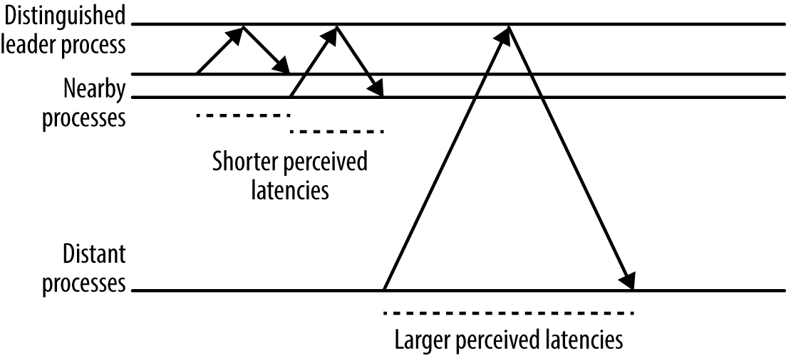

# CHAPTER 23. Managing Critical State: Distributed Consensus for Reliability

신뢰할 수 있는 고가용성 시스템을 효과적으로 구축하기 위해 분산에 대한 합의가 필요

분산 시스템의 여러 프로세스들은 중요한 설정을 일관되게 확인할 수 있어야 함

  

분산 환경에서 합의 시스템은 충분히 테스트되고 증명된 시스템을 권장

 

**저장소**
- 시스템, 소프트웨어 저장소: ACID 기반
  - Atomicity, Consistency, Isolation, Durability
  - 원자성, 영속성, 격리성, 내구성
- 분산 데이터 저장소: BASE 기반
  - Basically Available, Soft state, Eventual consistency
  - 기본적인 가용성, 유연한 상태, 궁극적 일관성
  - 보통 멀티마스터 복제(multimaster replication) 지원: 여러 프로세스에서 쓰기 작업을 동시에 수행할 수 있음

 

## Motivating the Use of Consensus: Distributed Systems Coordination Failure

<small><i>합의는 왜 필요할까: 분산 시스템 간 협업의 실패</i></small>

### Case Study 1: The Split-Brain Problem

<small><i>사례 연구 1: 스플릿 브레인 문제</i></small>

- 살펴볼 서비스: 여러 사용자들이 협업할 수 있는 콘텐츠 저장소
- 신뢰성을 위해, **서로 다른 랙에 배치된 두 개의 복제된 파일 서버** 사용
- 한 쌍의 파일 서버 중 하나는 **리더**(leader), 다른 하나는 **수행 서버**(follower) 역할 수행
- 장애 발생 시 **STONITH**를 통해 리더십 확보

<pre><b>STONITH</b>
Shoot The Other Node in the Head.
상대 서버를 강제로 종료.
</pre>

#### 💥 **문제점**
- 네트워크 지연이나 패킷 손실 발생 시, 서버들이 서로를 인식하지 못하고 동시에 **STONITH** 명령을 실행할 가능성 존재
- 일부 명령이 네트워크 문제로 전달되지 않아, 두 서버가 동시에 활성 상태이거나 둘 다 종료될 수 있음
  - 데이터 손상(동시 쓰기) 또는 가용성 문제(둘 다 종료됨) 발생하게 됨
- 단순한 타임아웃을 통한 리더 선출 방식은 본질적으로 분산 비동기 합의 문제를 해결할 수 없음

 

### Case Study 2: Failover Requires Human Intervention

<small><i>사례 연구 2: 인간 개입이 필요한 장애 조치</i></small>

- 다중 샤드 데이터베이스 시스템에서 각 샤드의 주(primary) 노드는 다른 데이터센터의 보조(secondary) 노드로 동기 복제 수행
- 외부 시스템이 기본 노드 상태를 점검하고, 문제가 발생하면 보조 노드를 승격
- 기본 노드가 보조 노드 상태를 확인할 수 없을 경우, 스스로 비활성화하고 인간 개입 요청

#### 💥 **문제점**
- 데이터 손실 위험은 없으나, **가용성이 안좋음**
  - 시스템 운영 엔지니어의 업무 증가
  - 확장성 부족
- 네트워크의 심각한 문제로 리더를 선출하지 못하면, 인간 개입이 더 나은 것도 아님

 

### Case Study 3: Faulty Group-Membership Algorithms

<small><i>사례 연구 3: 잘못된 그룹-멤버십 알고리즘</i></small>

- 인덱싱을 수행하고 검색 서비스를 제공하는 시스템 운영
- 노드들은 시작 시 **가십 프로토콜(gossip protocol)** 을 사용해 서로를 인식하고 클러스터에 가입
- 클러스터 내에서 리더를 선출하고 조정 역할 수행

#### 💥 **문제점**
- 네트워크 문제 시, 클러스터가 분리되고, **스플릿 브레인 상태**가 발생하여 데이터 손상 초래
- 그룹 멤버십을 일관되게 유지하는 문제 역시 분산 합의 문제의 한 형태

분산에 대한 합의 알고리즘은 정확성이 입증됨, 그 구현의 **포괄적으로 테스트된 분산에 대한 합의 알고리즘을 통해서만** 해결될 수 있음

 

## How Distributed Consensus Works

<small><i>분산 합의 동작 방식</i></small>

**분산 합의 알고리즘 방식** 
- **충돌-실패** (crash-fail): 충돌이 발생한 노드를 시스템에서 영구 제외 
- **충돌-복구** (crash-recover)

**분산 합의 구분**
- **Asynchronous distributed consensus (비동기 분산 합의)**
- **Synchronous distributed consensus (동기 분산 합의)**

**분산 합의 알고리즘 방식**
- **Crash-Fail (충돌-실패)**
  - 장애가 발생한 노드는 영구 제외
- **Crash-Recover (충돌-복구)**
  - 장애 발생 후 복구 가능
  - 실무에서 더 유용함 (네트워크 지연, 재시작 등의 일시적 문제 대응 가능)

**장애 종류**
- **Byzantine Failure (비잔틴 장애)**
  - 악의적이거나 버그로 인해 잘못된 메시지를 전달하는 경우
  - 처리 비용이 높고 발생 빈도가 높지 않음
- **Non-Byzantine Failure (비비잔틴 장애)**
  - 단순한 충돌이나 네트워크 지연 등의 문제

**분산 합의 알고리즘**
- **Paxos (Lamport, 1998)**
- **Raft (2014)**
- **Zab (2011)**
- **Mencius (2008)**

 

### Paxos Overview: An Example Protocol

<small><i>Paxos 살펴보기 : 예제 프로토콜</i></small>

- Paxos는 대부분의 프로세스가 제안을 수용할 수 있는지 여부에 따라 제안 시퀀스로 작동.
  - 다수의 프로세스가 제안을 수용하는지 확인하는 프로토콜.
  - 제안이 수용되지 않으면 실패함.
  - 각 제안은 순서를 갖는 고유한 시퀀스 번호를 가짐.

**동작 과정**

1. **Prepare**
- 제안자(Proposer)가 순서 번호를 선택하여 수락자(Acceptor)에게 전달
- 수락자는 더 높은 순서 번호를 가진 제안을 본 적이 없다면 동의
2. **Promise**
- 수락자가 과거에 본 적 없는 높은 번호의 제안에만 동의
- 제안자가 과반수의 동의를 얻으면 다음 단계로 진행 가능
3. **Accept**
- 다수의 수락자가 승인하면 제안자는 해당 값을 커밋
- 수락자는 동의한 제안을 **저널(로그)** 에 기록하여 장애 후에도 일관성 유지

**장점**
- 시퀀싱으로 메시지 순서 문제 해결.
- 과반수 동의로 제안에 대해 두 개의 값 커밋 방지.
- 수락자는 제안 수락 시 저널을 작성하여 재시작 시에도 보증 유지.

**단점**
- Paxos는 한 번의 값과 제안 번호 합의만 가능.
- 특정 노드는 합의된 값의 전체 세트를 보지 못할 수 있음.

 

## System Architecture Patterns for Distributed Consensus

<small><i>분산 합의를 위한 시스템 아키텍처 패턴</i></small>

- **분산 합의 알고리즘**
  - 저수준(ow-leve) & 원시적(primitive)
 
- 노드 집합이 값에 단 한 번 동의하게 함.
  - 높은 수준의 시스템 구성 요소를 추가하여 실용적인 시스템 기능 제공해야함.
    - → 설계 복잡성 감소 및 합의 알고리즘의 교체 용이.

- **합의 알고리즘을 구현하는 서비스:**
    - Zookeeper, Consul, etcd와 같은 서비스가 많이 사용됨
    - Zookeeper와 비슷하게 구글의 Chubby가 있음
    - 합의에 대한 근본 기능를 서비스로 제공하면, 엔지니어가 고가용성 서비스와의 호환성을 유지해야 하는 부담 감소.

 
    
### Reliable Replicated State Machines

<small><i>신뢰할 수 있는 복제된 상태 머신</i></small>

- **RSM**
  - Replicated state machine.
  - **여러 프로세스**에서 **동일한 작업**을 **동일한 순서**로 실행.
  - 합의 알고리즘을 통해 전역적으로 순서가 정해짐.
  - 상태 동기화를 위해 **슬라이딩 윈도우 프로토콜(sliding-window protocol)** 사용 가능.

 

합의 알고리즘과 복제된 상태 머신 사이의 관계
 

 

### Reliable Replicated Datastores and Configuration Stores

<small><i>신뢰할 수 있는 복제된 데이터와 설정 저장소</i></small>

**Reliable replicated datastores**
- 복제된 상태 머신 애플리케이션
- 중요한 작업 시, 합의 알고리즘 사용
  - 디자인 단계에서 성능, 처리량, 확장성 고려가 중요.
- 비분산 합의 기반 시스템은 단순히 리턴되는 데이터의 수명을 제한하기 위해 타임스탬프(timestamp)에 의존
  - 해결: **Spanner**
    - 타임스탬프에 의존하는 시스템의 문제 해결 가능.
    - 불확실성을 해결할 필요가 있는 프로세스의 실행을 최대한 늦춤

 

### Highly Available Processing Using Leader Election

<small><i>리더 선출을 통한 고가용성 처리</i></small>

- 분산 시스템에서 리더 선출은 분산 합의와 유사
- **리더 선출:**
- 단일 리더를 사용하여 특정 작업 수행.

 

마스터 선출을 위해 복제된 서비스를 사용하는 고가용성 시스템
 

- 리더가 작업자(Worker) 풀을 관리하는 작업 수행.
  - 중요한 작업에 합의 알고리즘을 사용하지 않아, 일반적으로 처리량을 중요하게 생각하진 않음.

 

### Distributed Coordination and Locking Services

<small><i>분산 조정 및 잠금 서비스</i></small>

- **Barrier (장벽):**
  - 특정 조건이 충족될 때까지 프로세스 그룹을 차단.
    - e.g. MapReduce: Map 단계가 완료되기 전까지 Reduce 연산을 막음
  - Zookeeper의 구현 원리임.

 

맵리듀스 계산을 위한 프로세스 조율이 장벽
 

- **Locks (잠금):**
  - 워커 프로세스의 원자적 작업 보장.
  - 갱신 가능한 Lease System 사용 권장.
    - 일정 시간 후 잠금을 다시 임대하게 함.
    - 무기한 잠금 방지
  - 분산 잠금은 저수준 시스템에서는 유의해서 도입해야할 기본적인 개념.
  - 대부분의 애플리케이션은 분산 트랜잭션을 제공하는 고수준의 시스템을 이용해야 함.

 

### Reliable Distributed Queuing and Messaging

<small><i>신뢰할 수 있는 분산 큐잉 및 메시징</i></small>

- **Queues**:
  - 주로 여러 작업자 프로세스간의 분산 작업을 위해 사용
  - Lease System 사용 권장.

- **Queuing-based systems**
  - 큐 손실 시 전체 시스템이 동작하지 않을 수 있어서, RSM으로 구현하여 위험 최소화.
  
- **Atomic broadcast** (원자적 브로드캐스트)
  - **메시지의 안정적이면서 동일한 순서 전달** 보장.
  - Publish-Subscribe (발행-구독 시스템)을 활용할 수 있음

  

신뢰할 수 있는 합의 기반 큐 컴포넌트를 사용하는 큐 지향 작업 분산 시스템  

**Queuing-as-work-distribution pattern**
- 로드밸런싱 장치에서 큐를 사용하는 기법.
- 종단간(point-to-point) 메시징에 유용.
- Publish-Subscribe 제공: 채널 또는 주제에 구독하는 다수의 클라이언트에게 메시지 제공.
- 큐에서 태스크를 받아가야 하는 시스템에서 지연 응답이 높아지면, 각 태스크의 처리 시간 비율이 급격히 증가해서 문제가 발생할 수 있음.

 

## Distributed Consensus Performance

<small><i>분산 합의의 성능</i></small>

- **일반 통념:**
  - 많은 시스템에서 합의 알고리즘은 느리고 비용이 많이 든다고 여겨짐.
  - 하지만 여러 가지 방법으로 성능을 향상시킬 수 있음.
  - 구글의 중요한 시스템에서 합의 알고리즘이 매우 효과적으로 사용됨.

- **성능에 영향을 미치는 요소:**
  - **작업 부하:**
    - 처리량: 최대 부하 시, 단위 시간당 제안 수.
    - 요청 종류: 상태를 변경하는 작업 비율.
    - 읽기 작업에 필요한 일관성.
    - 요청 크기: 데이터 페이로드 크기의 다양성.
  - **배포 전략:**
    - 로컬 영역 또는 전역 영역 배포 여부.
    - 사용된 쿼럼 알고리즘 및 대부분의 프로세스 위치.
    - 샤딩, 파이프라이닝, 배칭 (sharding, pipelining, batching) 사용 여부.

- **리더 프로세스 사용:**
    - 모든 요청을 리더 노드로 보내야 하므로, 지리적 위치에 따라 성능 차이 발생.

 

서버 프로세스로 부터의 거리에 따른 클라이언트의 지연 응답의 변화
  

### Multi-Paxos: Detailed Message Flow

<small><i>Multi-Paxos: 메시지 흐름</i></small>

- Multi-Paxos 프로토콜은 Strong Leader Process (강한 리더 프로세스) 사용
  - : 단 한 번의 라운드 트립만 허용.

  

Multi-Paxos 프로토콜의 기본적인 메시지 흐름
  

1. **Prepare** 단계:
- 제안자(Proposer)는 고유 번호를 가진 준비 메시지(Prepare)를 보냄
- 수락자(Acceptor)는 받은 준비 메시지를 기록하고, 그 고유 번호가 자신이 이전에 기록한 어떤 제안보다 큰 경우, 응답 메시지(Promise)를 보냄.
  - 이때, 수락자는 동일한 제안자에 대한 나중 제안을 거부할 것이라고 약속함.
- **Promise** 단계:
  - 수락자(Acceptor)는 제안자(Proposer)에게 Promise 응답 메시지를 보냅니다. 이는 프로포저에게 자신이 준비 메시지를 받아들였다는 것을 알려줍니다.
- **Propose** 단계:
  - 제안자가 수락자 중 다수에게서 Promise를 받으면, 제안자는 최종 제안(Accept)을 만들어 보냄.
  - 이 때 제안(Accept)은 준비된 값 및 고유 번호를 포함함.
- **Accept** 요청:
  - 제안자는 제안된 값을 수락해 달라는 요청인 `Accept` 메시지를 보냄.
  - 수락자는 이미 보낸 약속(Promise)에 따라 값을 수락하거나 거부.
- **Learn** 단계:
  - 수락자들이 다수 결정을 내리면, 합의된 값을 제안자 및 학습자에게 전달.
  - 학습자는 값을 받아 이해하고 외부 시스템에 전달.

제안자가 변경될 경우 추가 왕복 단계가 필요하며 성능 저하 가능.

- **충돌 방지:**
  - 충돌 방지를 위해 프로세서 할당 또는 회전하는 제안자 시스템 사용.

**라이브록(livelock)**
- 제안이 계속 서로 방해해서 어떤 제안도 수락될 수 없다면 제안자가 둘이 되는 상황이 만들어질 수 있음

  

Multi-Paxos 프로토콜의 이중 제안자 현상
 

**해결법**  
- 모든 합의 시스템 아래 방법 중 하나 선택
  - 제안 프로세스를 선출: 시스템 내의 모든 제안을 담당하는 제안 프로세스를 선출
  - 제안자 회전 방식: 각 프로세스들이 제안을 할 수 있는 특정 슬롯을 할당하는 제안자 회전(rotating) 방식.

- **리더 프로세스 주의점**: 리더가 없을 때 불균형이 발생할 수 있으며, 이중 제안자 현상이 나타날 우려가 있음.
- 적절한 타임아웃과 백오프 (backoff) 전략을 구현하는 것이 중요.
- Raft는 리더 선출 프로세스에 대해 숙고하고 구현한 방법을 제공함.

 

### Scaling Read-Heavy Workloads

<small><i>읽기 작업 부하의 확장</i></small>

- 읽기 부하 확장은 중요. 많은 작업이 읽기 중심(read-heavy)이기 때문.
- 많은 작업이 읽기 중심일 경우, 복제 서버에서 데이터 읽기 가능.

**일관성 있는 읽기 필요 시**
- 읽기 전용 합의 작업 수행.
- 가장 최신의 데이터를 보장하는 복제 서버로 부터 데이터 읽기
  - 가령, 안정적인 리더 복제본에서 읽기를 수행
- Quorum Leases(과반수 임대) 사용.
  - 일부 복제 서버가 시스템의 전체 혹은 일부 데이터에 대한 임대하고 약간의 쓰기 성능을 희생해서 읽기 작업에 대한 강력한 일관성을 제공하는것

 

### Quorum Leases

<small><i>정족수 임대</i></small>

- 분산 합의 성능 최적화 기법. 
  - 읽기 작업에 대한 지연용답을 최소화하고 처리량을 증가시키는 것을 목표.
- 일정(짧은) 기간 동안 데이터 상태에 대해 읽기 리스를 쿼럼에 부여.
- 데이터 상태 변경 작업은 모두 복제 서버들의 동의가 필요.
- 일부 복제본 사용 불가 시, 리스가 만료될 때까지 데이터 수정 불가.
- 읽기 중심 작업에 유용.

 

### Distributed Consensus Performance and Network Latency

<small><i>분산 합의 성능과 네트워크 지연 응답</i></small>

- **네트워크 지연:**
  - 네트워크 왕복 시간 및 지속 저장소 쓰기 시간에 성능이 크게 영향을 받음.
  - 네트워크 정체와 물리적 거리 모두 성능에 영향.
  - TCP/IP 통신을 사용하는 합의 시스템 일반적.
    - TCP/IP는 핸드셰이크와 연결 유지 비용이 비교적 크게 듦
- 지역 네트워크 내 합의 시스템 성능은 데이터베이스의 비동기 리더-팔로워 복제 시스템만큼 우수.
  - 하지만, 가용성을 위한 분산 합의 시스템은 장애 격리를 위해 '멀리 떨어진' 복제 서버를 필요로 함.

  

클라이언트의 지역 간 TCP/IP 연결에 대한 수요를 줄이기 위해 프록시를 사용하는 방법
  

- 영속적 TCP/IP 연결을 가지고 있는 지역 별 프록시 풀 사용
  - 프록시를 사용해 클라이언트가 원거리 TCP/IP 연결 오버헤드를 줄일 수 있음

 

### Reasoning About Performance: Fast Paxos

<small><i>Fast Paxos</i></small>

- **Fast Paxos 프로토콜:**
  - 클라이언트가 직접 모든 수락자에게 제안 메시지를 보냄.
  - 지연 시간이 긴 경우 Multi-Paxos보다 느릴 수 있음.
  - 작업 처리를 병렬로 보내 성능 최적화 가능.

 

### Stable Leaders

<small><i>안정적인 리더</i></small>

- **안정적 리더를 선출하는 프로토콜**: Multi-Paxos, Zab, Raft
  - 모든 상태 변경 작업이 리더를 통해 전달.
- **안정적인 리더 적용:**
  - 리더의 네트워크 대역폭이 병목 현상 유발 가능.
    - 리더의 수락 메시지는 제안과 관련된 모든 데이터를 갖고 있기 때문.
  - 리더의 성능 문제는 곧 시스템 전체 처리량 감소.

- **리더 시스템:**
  - 안정적인 리더 패턴 또는 회전 리더십 시스템 사용.
    - 회전 리더십 시스템: Mencius, Egalitarian Paxos
- 넓은 네트워크에서 클라이언트가 가까운 복제본과 통신이 RTT를 줄여 리더 선출에 지연응답을 낮춤.

 

### Batching

<small><i>일괄 처리</i></small>

복제 서버들은 자신들이 보낸 메시지에 대한 응답을 기다리는 동안 아무것도 하지 않는 상태로 남음
놀고 있는 복제 서버들로 인한 비효율성은 동시에 여러 개의 제안을 처리할 수 있는 파이프라이닝을 통해 해결될
프로토콜이 슬라이딩 윈도우 (aliding-window) 방식을 이용해서 ' 파이프를 계속 가득 차게 유지하는 ' TCP/IP 의 경우와 매우 유사

- **배칭:**
  - 복제 서버들은 일괄 배치로 처리량을 향상시키지만, 그만큼 여유 시간이 많아짐
  - 이런 여유 시간 동안, 레플리카 비효율성을 해결하는 **파이프라이닝과 조합해서 여러 개의 제안 처리**
    - TCP/IP의 슬라이딩 윈도우 (sliding-window) 방식과 매우 유사.
  - 파이프라인에서 요청을 순서대로 전송하여 글로벌 순서 보장.

 

### Disk Access

- 디스크 쓰기는 프로세스에서 중요 결정을 내릴 때마다 수행되어야 함
- 가령, Multi-Paxos 쓰기 지점:
  1. 수락자가 제안에 대해 Accepted 메시지를 보내기 전
  2. 제안자가 Accept 메시지를 보내기 전 
    - Accept 가 암묵적으로 Accepted로 동작하기 때문

- 합의 알고리즘 로그와 RSM 트랜잭션 로그를 하나의 로그로 결합하여 디스크 간 전환 시간을 절감할 수 있음
  - IO 작업의 오버헤드와 탐색 시간 절약.
  - 디스크가 초당 더 많은 작업을 수행 가능하므로 전체 시스템 처리량 증가.

- **향상:**
  - 상태 변경은 메모리 캐시에 저장 처리 후, 나중에 디스크 쓸 수 있음.
  - 배치 처리: 다중 클라이언트 작업을 하나의 작업으로 묶음.
    - [Photon: Fault-tolerant and Scalable Joining of Continuous Data Streams](https://research.google/pubs/photon-fault-tolerant-and-scalable-joining-of-continuous-data-streams/)
    - [Paxos Replicated State Machines as the Basis of a High-Performance Data Store](https://www.usenix.org/legacy/event/nsdi11/tech/full_papers/Bolosky.pdf)
    - [Paxos Made Live – An Engineering Perspective](https://research.google.com/archive/paxos_made_live.html)
    - etc
  - 고정 비용(디스크 로그 및 네트워크 지연)을 분산시켜 처리량 증가.

 

## Deploying Distributed Consensus-Based Systems

<small><i>분산 합의 기반 시스템의 배포</i></small>

### Number of Replicas

<small><i>복제 서버의 수</i></small>

#### 레플리카 수 결정

- 보통, 합의 기반 시스템 (consensus-based systems)은 과반수 (Majority Quorums)를 기반으로 동작
  - `2f+1` 개의 복제 서버 구성 시, `f`개의 장애 허용 가능
- **Byzantine fault tolerance**: `f`개의 장애를 견디기 위해 최소 `3f+1`의 레플리카 필요
- **Non-Byzantine failures**: `f`개의 장애를 견디기 위해 최소 `2f+1`의 레플리카 필요
- 계획된 유지보수 중 비정상적 장애 발생 시 시스템 다운타임 발생 가능
- 시스템 운영을 위해 5개의 레플리카 운영 권장
  - 최대 두 곳에서 장애 발생 시에도 시스템 정상 동작하도록
- 복제 서버들의 상당수 장애 → 쿼럼 형성 실패 → 이론적으로 재구성 불가 상태가 될 수 있음
- 로그의 일관성 유지가 중요. Raft 참고

- **복제 서버의 수 결정**: 신뢰성를 위한 수요, 시스템을 위한 유지 계획 빈도, 리스크, 성능, 비용

 
<table>
<tr>
  <th></th>
  <th>Non-Byzantine failures</th>
  <th>Byzantine fault tolerance</th>
</tr>
<tr>
  <th>영향</th>
  <td>노드가 멈추거나 응답하지 않음</td>
  <td>노드가 잘못된 데이터를 보낼 수도 있음</td>
</tr>
<tr>
  <th>개념</th>
  <td>
  : 노드가 단순히 멈추거나(crash) 응답하지 않는 경우. 
  노드가 오작동하더라도 잘못된 데이터를 보내지는 않음.
  </td>
  <td>
  : 노드가 임의의 행동을 할 수 있는 경우. 
  노드가 멈추는 것뿐만 아니라 잘못된 데이터를 보내거나, 
  서로 다른 노드에 다른 데이터를 보내는 등 악의적인 행위까지 포함됨.
  </td>
</tr>
<tr>
  <th>예시</th>
  <td>
  - 서버가 다운되거나 네트워크 연결이 끊겨서 응답을 못 하는 경우.  
  - 특정 프로세스가 비정상 종료되는 경우.
  </td>
  <td>
  - 해커가 서버를 장악해서 잘못된 데이터를 응답하는 경우. 
  - 버그나 하드웨어 오류로 인해 노드가 랜덤한 값을 반환하는 경우. 
  - 네트워크 장애로 인해 일부 노드에만 특정 데이터가 전달되는 경우.
  </td>
</tr>
<tr>
  <th>특징</th>
  <td>
  - 장애가 발생한 노드는 그냥 사라진 것처럼 행동함.  
  - 정상적인 노드는 여전히 올바르게 동작하므로 과반수(majority)를 유지하면 시스템이 정상 작동 가능.
  </td>
  <td>
  - 장애 노드는 올바른 것처럼 보이면서도 거짓 데이터를 보낼 수 있음. 
  - 다수결을 사용해도 비잔틴 노드가 많으면 잘못된 데이터가 퍼질 위험이 있음.
  </td>
</tr>
<tr>
  <th>✅ 해결 방법</th>
  <td>
  최소 <code>2f + 1</code>개의 노드를 사용하면 <code>f</code>개의 노드가 장애를 겪어도 합의를 유지할 수 있음.
  </td>
  <td>
  최소 <code>3f + 1</code>개의 노드를 사용하면 <code>f</code>개의 노드가 비잔틴 장애를 겪어도 올바른 합의를 유지할 수 있음.
  </td>
</tr>
</table>

 

### Location of Replicas

<small><i>복제 서버의 위치</i></small>

- 장애 도메인(Failure domain)과 지연 시간 간의 트레이드 오프 고려
- 장애 도메인 예시: 물리적 머신, 단일 전원 공급 장치를 사용하는 데이터센터의 랙(Rack) 등
- 레이턴시 및 처리량에 따라 배치 전략 다름
- 재해 복구를 고려하여 레플리카 위치를 결정

- 성능의 가장 중요한 지표: 클라이언트의 인지 여부
  - 이상적인 경우, 클라이언트로부터 합의 시스템의 복제 서버로의 네트워크 라운드 트립 시간은 최소화

 

### Capacity and Load Balancing

<small><i>수용량과 로드밸런싱</i></small>

- **샤드에 대한 배포**(Sharded deployments) 시, 샤드 수 조정으로 수용량 조정 가능
- **합의 그룹은**에서 멤버로부터 데이터를 읽을 때, 더 많은 복제 서버를 추가해서 읽기 수용량을 증가 시킬 수 있음

- 추가 레플리카가 시스템 가용성을 줄일 수 있음
- 클라이언트가 밀집된 지역에 레플리카 배포 권장
- 리더 프로세스가 네트워크 대역폭을 많이 사용하므로 데이터센터 간 균형 중요

 

과반수 시스템에 복제 서버를 추가하는 것은 잠재적으로 시스템의 가용성을 감소시킬 수 있음

- 다섯 개의 복제 서버 
  - 과반수: 세 개의 복제 서버
  - 장애 허용 비율 40%
- 여섯 개의 복제 서버
  - 과반수: 네 개의 복제 서버
  - 장애 허용 비율 33%

 

지역에 추가 복제 서버를 투입하면 시스템의 가용성이 오히려 떨어질 수 있음 

  

리더 프로세스의 위치에 따라 대역폭을 골고루 활용하지 못하게 될 수도 있음 

   

- 리더가 있는 데이터센터에 장애가 발생하면 큰 변화가 생김.
  - 데이터센터 간 트래픽 급증 가능. 네트워크 성능 야기.

- 자동화된 리더 선출 방식에서 발생할 수 있는 예상치 못한 문제로 알게된 점
  - 리더와 클라이언트와의 거리가 중요함
  - 머신 성능 기반의 분산을 고려해야 함
  - 리더 선출 프로세스가 오래걸릴 수 있음

 

#### Quorum composition

<small><i>과반수 조합</i></small>

- 합의 그룹 내 복제본 배치 시 **지리적 위치(네트워크 지연 시간, RTT)** 가 성능에 영향을 줌.
  - 복제 서버 간 **RTT가 최대한 균일하게 배치**.

  

- **트래픽 균등 분배를 위한 복제본 배치 예시**
  - 가령, 미국 중앙 2개, 동부 1개, 유럽 2개 복제본 배치.
  - 동부 복제본이 두 개의 합의 그룹을 연결하는 핵심 역할을 수행.

  

- 동부 복제본이 손실되면 네트워크 지연 시간이 급격히 증가.
  - 기존: **미국 중앙 ↔ 동부, 유럽 ↔ 동부 간 RTT**
  - 장애: **미국 중앙 ↔ 유럽 간 RTT(기존보다 50% 증가)** 가 전체 합의에 영향을 줌.
- 이처럼 중요한 복제본이 손실되면 **최소 합의 그룹(quorum) 간 거리 증가**로 성능 저하 발생.

  

- **대응 방안: 계층적 합의(quorum) 구조**
  - 가령, 9개의 복제본을 3개 그룹(각 3개 복제본)으로 나눔.
  - 과반수 그룹이 동의하면 합의 성립, 각 그룹 내에서 과반수가 동의하면 해당 그룹이 유효.
  - 따라서, **미국 중앙 그룹에서 복제본 하나를 잃어도 나머지 두 개가 투표 가능**하여 성능 저하 최소화.

- 운영 비용 부담? 합의 그룹 수를 줄이고 각 그룹당 복제본을 늘리는 방식.
  - 전체 시스템의 프로세스 수를 증가시키지 않고 비용을 절감할 수 있음.

 

## Monitoring Distributed Consensus Systems

<small><i>분산 합의 시스템 모니터링</i></small>

**분산 합의 시스템에서 특히 주의할 내용**
- 합의 그룹 멤버 수와 프로세스 상태 모니터링
- 지속적으로 지연이 발생하는 복제 서버
- 리더(leader) 존재 여부 확인
  - 리더 기반 알고리즘(e.g. Multi-Paxo)에서는 리더가 없으면 완전히 비가용 상태.
- 리더 변경 횟수 모니터링
  - **리더 변경이 너무 잦으면 성능 저하** 발생.
  - **조회 횟수 (term 혹은 view number)** 으로 추적.
    - 증가 시, 네트워크 연결 문제 등 의심
    - 감소 시, 심각한 버그 등 의심.
- 합의 트랜잭션 숫자(consensus transaction number)
  - 합의 트랜잭션 번호가 지속적으로 증가하는지 확인.
- 제안된(proposed) 및 합의된(agreed upon) 트랜잭션 수
  - 시스템이 올바르게 작동하는지 확인하는 주요 지표.
- 처리량(throughput) 및 지연 시간(latency)

 

## Conclusion

<small><i>결론</i></small>

- 분산 합의 시스템과 관련된 기술은 빠르게 변화하므로, 기본 원칙을 이해하는 것이 중요.
- 분산 합의는 리더 선출, 공유 상태 관리, 분산 락 등을 해결하기 위한 핵심 기법
- 리더 선출, 공유 상태 관리, 분산 락을 봤다면 반드시 분산 합의를 고려해야 함

 