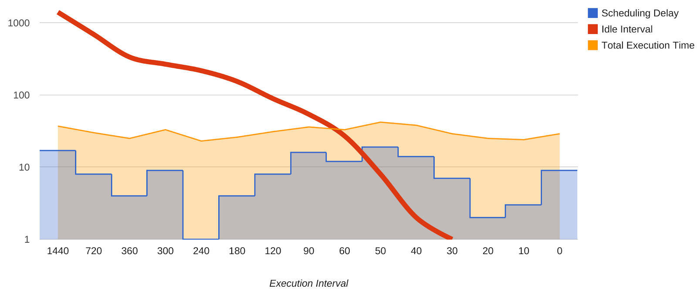
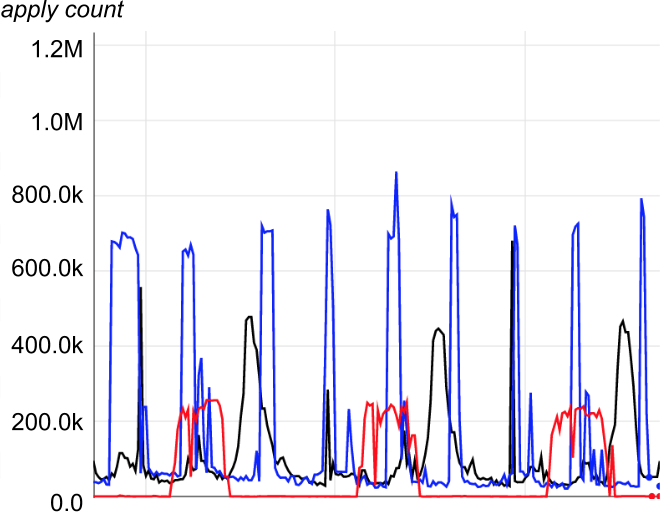
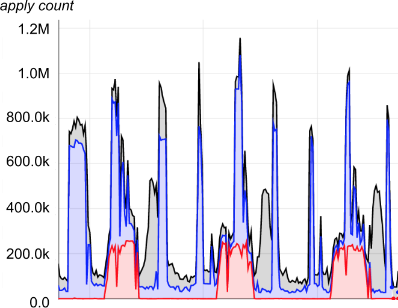

# CHAPTER 25. Data Processing Pipelines

<small><i>데이터 처리 파이프라인</i></small>

## Origin of the Pipeline Design Pattern

<small><i>파이프라인 디자인 패턴의 기원</i></small>

- **'데이터 파이프라인'** 디자인 패턴:
  - 데이터 처리를 위한 전통적인 접근 방식.
  - 데이터를 읽고, 원하는 방식으로 변환한 후 새로운 데이터를 출력하는 프로그램을 작성하는 것.
  - e.g. `cron`

 

## Initial Effect of Big Data on the Simple Pipeline Pattern

<small><i>단순한 파이프라인 패턴을 적용한 빅데이터의 초기 효과</i></small>

- **Simple, one-phase pipelines** (단순한 단일 단계 파이프라인):
  - 주기적 또는 지속적인 빅데이터 변환을 수행하는 프로그램
- **Multiphase pipelines** (복합 단계 파이프라인):
  - 빅데이터의 규모와 처리 복잡성 때문에 프로그램은 보통 일련의 프로그램 체인으로 구성됨.
  - 함께 연결된 프로그램의 수 = 깊이 (depth)

 

## Challenges with the Periodic Pipeline Pattern

<small><i>정기적 파이프라인 패턴의 과제</i></small>

- **정기적 파이프라인**: 데이터 양에 충분한 작업자가 있고, 처리 수요를 연산 능력으로 감당할 수 있을 때 안정적.
  - 장애가 발생하기 쉬움: 파이프라인의 증가와 변화가 시스템을 스트레스를 주기 시작 → 문제 발생
    - e.g. 데드라인을 맞추지 못하거나, 청크 처리 중단으로 관련 작업에 부하를 증가 시키는 현상

 

## Trouble Caused By Uneven Work Distribution

<small><i>작업의 불균형 분산으로 인해 발생하는 문제</i></small>

- 빅데이터의 핵심은 **무조건적 병렬("embarrassingly parallel") 알고리즘**을 이용해 대용량 부하를 개별 머신이 처리 할 수 있을 정도의 청크(chunk)로 나누어 애플리케이션에 전달하는 기법
- 하지만, 이는 불균등한 자원을 요구할 수 있음.
  - 일부 청크는 다른 청크에 비해 더 많은 부하가 필요할 수 있음.
  - 오류를 유발하고 파이프라인 완료 시간을 지연시킬 수 있음.

 

## Drawbacks of Periodic Pipelines in Distributed Environments

<small><i>분산 환경에서 정기적 파이프라인의 단점</i></small>

- 빅데이터 정기적 파이프라인은 구글에서 널리 사용되었고, 구글의 클러스터 관리 솔루션에는 이러한 파이프라인을 위한 대체 스케줄링 메커니즘이 포함됨.
- 정기적 파이프라인은 종종 낮은 우선순위의 배치 작업으로 실행됨.
- 실행 비용과 리소스 소비에 따라 특정 행동이 발생할 수 있음.
  - 과사용 시 클러스터의 부하가 높아지고, 그로 인해 다른 사용자의 일괄 처리자원이 부족해져 작업선점의 위험에 노출.
  - 현재 실행중인 작업과 거의 완료 되어가는 작업이 다음 예약 작업을 시작하면서 강제로 종료될 수도 있음.
- 해결 방법은 정상적인 동작을 위한 서버의 충분한 수용량을 확보하는 것.

 

### Monitoring Problems in Periodic Pipelines

<small><i>정기적 파이프라인의 문제점 모니터링하기</i></small>

- 실행 기간이 긴 파이프라인의 경우, 실시간 성능 메트릭을 아는 것이 전체 메트릭을 아는 것보다 중요.
- 정기적 파이프라인은 일반적으로 작업 완료 시 메트릭을 보고하기 때문에, 실행 중 실패하면 통계가 제공되지 않음.
  - 연속적 파이프라인에서는 이 문제가 발생하지 않음.
  - 작업들이 지속적으로 실행되며 그에 대한 측정은 반복적으로 이루어지기 때문.

 

### "Thundering Herd" Problems

<small><i>'천둥 소리' 문제</i></small>

- 대규모 주기적 파이프라인에서는 각 주기마다 수천 개의 작업자가 한꺼번에 작업을 시작하는 "천둥 소리" 문제가 발생할 수 있음.
- 이는 클러스터 인프라 및 네트워킹 인프라를 과부하시키고, 재시도 로직이 잘못 구현되면 상황을 악화시킬 수 있음.

 

### Moiré Load Pattern

<small><i>Moiré 부하 패턴</i></small>

- 고립된 상태에서는 '천둥 소리' 문제가 명백하지 않을 수 있음.
- Moiré 부하 패턴: 서로 다른 두 개 이상의 파이프라인이 동시에 실행될 때 공통 공유 자원을 동시에 소비하면서 발생.
- 이는 계속 실행 중인 파이프라인에서도 발생할 수 있지만, 부하가 더 고르게 도착할 때는 덜 흔함.

아래는 세 개의 정기적 파이프라인의 자원 활용도

 
<table>
<tr>
<th>개별 인프라스트럭처에서 발생하는 모이어 부하 패턴</th>
<th>공유 인프라스트럭처에서 발생하는 모이어 부하 패턴</th>
</tr>
<tr>
<td></td>
<td>

부하가 1.2M 에 도달하면 긴급 대응을 해야 할 정도의 영향을 끼치는 것을 볼 수 있음

</td>
</tr>
</table>
 
