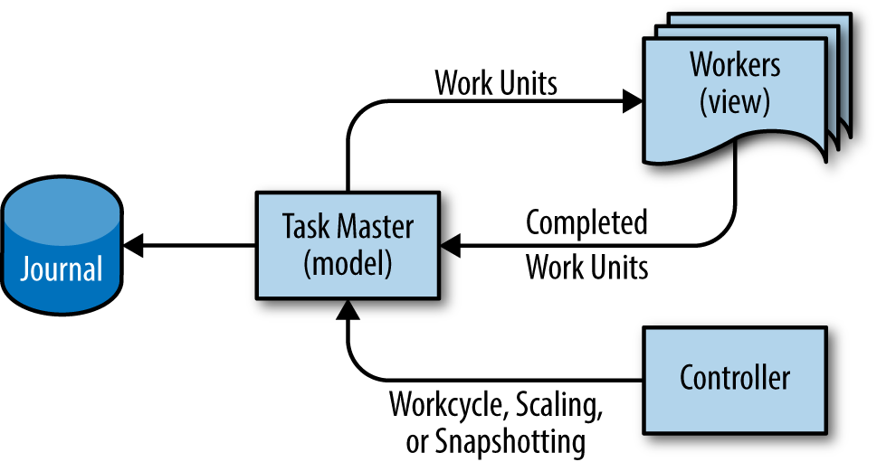

# CHAPTER 25. Data Processing Pipelines

<small><i>데이터 처리 파이프라인</i></small>

## Origin of the Pipeline Design Pattern

<small><i>파이프라인 디자인 패턴의 기원</i></small>

- **'데이터 파이프라인'** 디자인 패턴:
  - 데이터 처리를 위한 전통적인 접근 방식.
  - 데이터를 읽고, 원하는 방식으로 변환한 후 새로운 데이터를 출력하는 프로그램을 작성하는 것.
  - e.g. `cron`

 

## Initial Effect of Big Data on the Simple Pipeline Pattern

<small><i>단순한 파이프라인 패턴을 적용한 빅데이터의 초기 효과</i></small>

- **Simple, one-phase pipelines** (단순한 단일 단계 파이프라인):
  - 주기적 또는 지속적인 빅데이터 변환을 수행하는 프로그램
- **Multiphase pipelines** (복합 단계 파이프라인):
  - 빅데이터의 규모와 처리 복잡성 때문에 프로그램은 보통 일련의 프로그램 체인으로 구성됨.
  - 함께 연결된 프로그램의 수 = 깊이 (depth)

 

## Challenges with the Periodic Pipeline Pattern

<small><i>정기적 파이프라인 패턴의 과제</i></small>

- **정기적 파이프라인**: 데이터 양에 충분한 작업자가 있고, 처리 수요를 연산 능력으로 감당할 수 있을 때 안정적.
  - 장애가 발생하기 쉬움: 파이프라인의 증가와 변화가 시스템을 스트레스를 주기 시작 → 문제 발생
    - e.g. 데드라인을 맞추지 못하거나, 청크 처리 중단으로 관련 작업에 부하를 증가 시키는 현상

 

## Trouble Caused By Uneven Work Distribution

<small><i>작업의 불균형 분산으로 인해 발생하는 문제</i></small>

- 빅데이터의 핵심은 **무조건적 병렬("embarrassingly parallel") 알고리즘**을 이용해 대용량 부하를 개별 머신이 처리 할 수 있을 정도의 청크(chunk)로 나누어 애플리케이션에 전달하는 기법
- 하지만, 이는 불균등한 자원을 요구할 수 있음.
  - 일부 청크는 다른 청크에 비해 더 많은 부하가 필요할 수 있음.
  - 오류를 유발하고 파이프라인 완료 시간을 지연시킬 수 있음.

 

## Drawbacks of Periodic Pipelines in Distributed Environments

<small><i>분산 환경에서 정기적 파이프라인의 단점</i></small>

- 빅데이터 정기적 파이프라인은 구글에서 널리 사용되었고, 구글의 클러스터 관리 솔루션에는 이러한 파이프라인을 위한 대체 스케줄링 메커니즘이 포함됨.
- 정기적 파이프라인은 종종 낮은 우선순위의 배치 작업으로 실행됨.
- 실행 비용과 리소스 소비에 따라 특정 행동이 발생할 수 있음.
  - 과사용 시 클러스터의 부하가 높아지고, 그로 인해 다른 사용자의 일괄 처리자원이 부족해져 작업선점의 위험에 노출.
  - 현재 실행중인 작업과 거의 완료 되어가는 작업이 다음 예약 작업을 시작하면서 강제로 종료될 수도 있음.
- 해결 방법은 정상적인 동작을 위한 서버의 충분한 수용량을 확보하는 것.

  

 

### Monitoring Problems in Periodic Pipelines

<small><i>정기적 파이프라인의 문제점 모니터링하기</i></small>

- 실행 기간이 긴 파이프라인의 경우, 실시간 성능 메트릭을 아는 것이 전체 메트릭을 아는 것보다 중요.
- 정기적 파이프라인은 일반적으로 작업 완료 시 메트릭을 보고하기 때문에, 실행 중 실패하면 통계가 제공되지 않음.
  - 연속적 파이프라인에서는 이 문제가 발생하지 않음.
  - 작업들이 지속적으로 실행되며 그에 대한 측정은 반복적으로 이루어지기 때문.

 

### "Thundering Herd" Problems

<small><i>'천둥 소리' 문제</i></small>

- 대규모 주기적 파이프라인에서는 각 주기마다 수천 개의 작업자가 한꺼번에 작업을 시작하는 "천둥 소리" 문제가 발생할 수 있음.
- 이는 클러스터 인프라 및 네트워킹 인프라를 과부하시키고, 재시도 로직이 잘못 구현되면 상황을 악화시킬 수 있음.

 

### Moiré Load Pattern

<small><i>Moiré 부하 패턴</i></small>

- 고립된 상태에서는 '천둥 소리' 문제가 명백하지 않을 수 있음.
- Moiré 부하 패턴: 서로 다른 두 개 이상의 파이프라인이 동시에 실행될 때 공통 공유 자원을 동시에 소비하면서 발생.
- 이는 계속 실행 중인 파이프라인에서도 발생할 수 있지만, 부하가 더 고르게 도착할 때는 덜 흔함.

아래는 세 개의 정기적 파이프라인의 자원 활용도

 
<table>
<tr>
<th>개별 인프라스트럭처에서 발생하는 모이어 부하 패턴</th>
<th>공유 인프라스트럭처에서 발생하는 모이어 부하 패턴</th>
</tr>
<tr>
<td></td>
<td>

부하가 1.2M 에 도달하면 긴급 대응을 해야 할 정도의 영향을 끼치는 것을 볼 수 있음

</td>
</tr>
</table>
 

## Introduction to Google Workflow

<small><i>구글 워크플로우 소개</i></small>

**구글의 '워크플로우 (Workflow)'**
- 연속적 프로세싱을 확장할 수 있도록 지원하는 시스템
- '**리더-팔로워(작업자) 분산 시스템**'과 '**시스템 프리발런스(system prevalence)**' 디자인 패턴 사용
  - 이 조합으로 정확성 보장(exactly-once semantics): 대용량 트랜잭션 데이터 파이프라인에서 한 번의 작업만을 정확히 수행

 

### Workflow as Model-View-Controller Pattern

<small><i>모델-뷰-컨트롤러 패턴에의 응용</i></small>

- 워크플로우를 사용자 인터페이스 개발 분야에서 모델-뷰-컨트롤러 패턴의 분산 시스템 버전처럼 생각할 수 있음.
- 이 디자인 패턴은 소프트웨어 응용 프로그램을 세 개의 상호 연결된 부분으로 나누어 정보를 내부적으로 표현하는 방식과 사용자에게 제공되거나 수용되는 방식을 분리.

  

- 모델: "태스크 마스터(Task Master)" 서버에 있음
  - 태스크 마스터: 작업 상태를 메모리에 저장하고 동기식 저널링 (journaling) 을 이용해 영속 디스크에 저장.
  - 모든 파이프라인 데이터는 태스크 마스터에 저장되지만 태스크 마스터는 작업에 대한 포인터만 저장하고, 실제 입력과 출력 데이터는 공용 파일 시스템이나 다른 저장소에 저장할 때 최상의 성능을 발휘.
- 뷰: 시스템의 상태를 트랜잭션 단위로 갱신하는 작업자 프로세스.
  - 작업자들은 완전히 상태가 없는 (stateless) 프로세스 ← 언제든지 작업을 취소할 수 있음
- 컨트롤러: 파이프라인의 런타임 확장, 스냅샷 찍기, 작업 사이클 상태 제어, 파이프라인 상태 롤백 등 여러 보조 시스템 활동을 효과적으로 지원하기 위해 추가됨.

  

 

## Stages of Execution in Workflow

<small><i>워크플로우의 실행 단계들</i></small>

- 워크플로우 내부에서 처리 단계를 태스크 그룹으로 나누어 파이프라인의 깊이를 원하는 수준까지 구성할 수 있음.
- 각 태스크 그룹은 데이터 일부에 대해 임의의 작업을 수행할 수 있음.
- 시스템 내에서는 **모든 작업이 최소한 한 번씩은 실행되거나, 최소한 영속적인 상태에 반영되었음을 보장하기 것을 보장**.

 

### Workflow Correctness Guarantees

<small><i>워크플로우 정확성 보장</i></small>

- 태스크 마스터는 모든 파이프라인 상태를 저장하기에는 RAM 크기에 한계가 있음. 
- 각 작업 장치는 고유한 리스 처리를 받고, 작업자는 유효한 리스를 소유해야만 작업을 커밋할 수 있음.
  - 이중 정확성 보장은 계속 유지됨.
- 워크플로우는 리스 변경 시 새로운 고유 작업을 생성하여 이전 작업을 대체.
- 이러한 방법으로 세 가지 정확성 보장: '설정', '임대 소유권', '파일 이름의 유일성' 보장.

**워크플로우가 보장하는 네 가지 정확성**

- 설정 작업을 통한 작업자의 출력은 작업을 예측하기 위한 영역 생성.
- 작업자가 작업을 완료하기 위해서는 반드시 유효한 임대 기록을 보유하고 있어야 함.
- 출력 파일은 작업자마다 고유한 이름의 파일에 기록됨.
- 클라이언트와 서버는 모든 작업마다 서버 토큰을 검사하여 태스크 마스터에 대한 유효성을 판단.

 

## Ensuring Business Continuity

<small><i>비즈니스의 지속성 보장하기</i></small>

- 빅데이터 파이프라인은 모든 유형의 실패에도 처리를 계속해야 함.
- 워크플로우는 전 세계적으로 일관된 스피너에 저널을 저장함으로써 이 문제를 해결.
- 각 태스크 마스터는 분산 잠금 서비스인 Chubby를 사용하여 기록을 통해 쓰기 작업을 수행할 마스터를 선출.
- 로컬 워크플로우는 독립적인 클러스터에 있는 두 개 이상의 로컬 워크플로우로 전 세계적으로 분산되어 있음.

  

- 장애 조치의 자동화를 위해 각 지역 워크플로우는 위 그림의 '단계 1' 에 표시된 것과 같이 헬퍼 바이너리 (helper binary) 를 실행
- 헬퍼 바이너리는 MVC 패턴의 '컨트롤러' 처럼 동작
- 참조 태스크의 생성은 물론 전역 워크플로우의 특별한 건강 상태 검사 태스크의 갱신을 책임
- 건강 상태 검사 태스크가 일정 시간 동안 갱신되지 않으면 원격 워크플로우의 헬퍼 바이너리가 참조 태스크에 기술된 대로 실행 중인 태스크를 위임받아 어떤 환경이 동작하지 않더라도 파이프라인은 계속해서 동작

 

## Summary and Concluding Remarks

<small><i>요약</i></small>

- 정기적 파이프라인은 그 자체로 가치가 충분. 
  - 그러나, 데이터 처리 문제가 지속적이거나 지속적으로 성장할 것으로 예상되면 주기적 파이프라인을 사용하면 안됨.
- 워크플로우와 유사한 특성을 가진 기술을 사용하는 것이 좋음.
- 워크플로우가 제공하는 강력한 보증을 통한 지속적인 데이터 처리는 분산 클러스터 인프라에서 잘 작동하고 확장되며, 안정적이고 신뢰할 수 있는 시스템.

 
