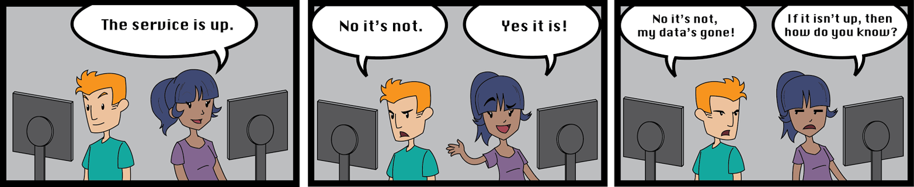
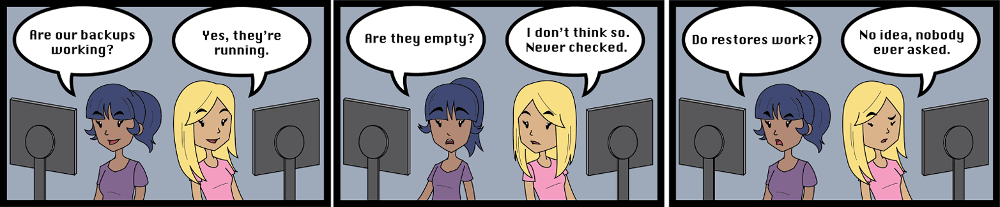
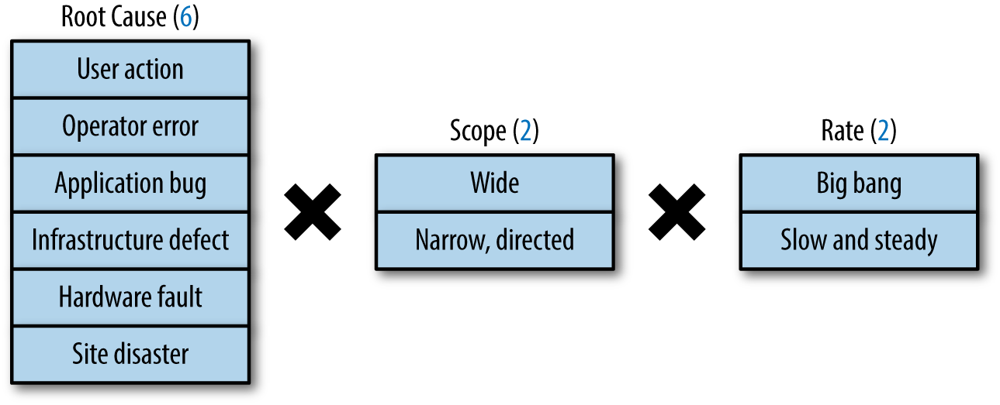
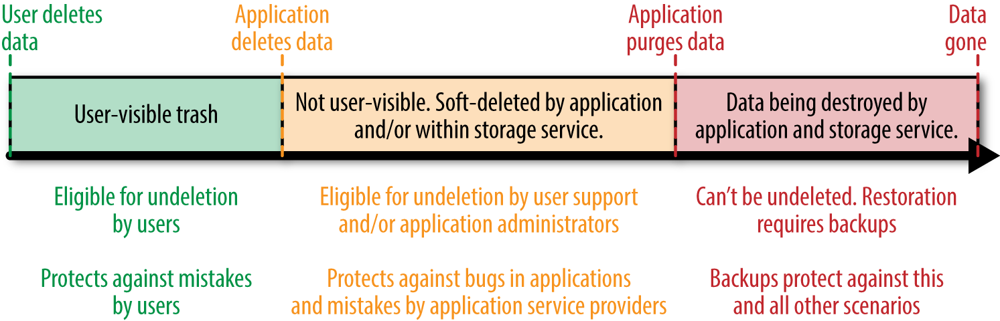

# CHAPTER 26. Data Integrity: What You Read Is What You Wrote
    
- **데이터 무결성**? 사용자가 충분히 만족할 수 있는 수준의 서비스를 제공하기 위한 데이터 저장소의 접근성과 정확성의 척도
  - 예를 들어, Gmail 사용자 인터페이스에서 너무 오랫동안 빈 메일함이 표시되면 사용자는 데이터가 손실되었다고 생각할 수 있음. 
    - 실제로 데이터가 손실되지 않았더라도, Google의 데이터 관리를 의심할 것이며, 클라우드 컴퓨팅의 신뢰성 저하.
- 데이터가 사용할 수 없게 되는 "너무 오래"의 기준은? Gmail 사고는 4일, 구글 앱스는 24시간.
- 데이터 손실이나 데이터 손상, 장기간의 데이터 사용 불가 상태는 사용자에게 거의 구별되지 않음.
- 사용자는 제품 사이에 명확한 구분을 두지 않음: 구글 제품인지 클라우드 기반인지의 구분 등.
  - → **데이터 무결성은 모든 서비스의 모든 유형의 데이터에 적용됨.**

## Data Integrity’s Strict Requirements

- 시스템 신뢰성 고려 시, 가동 시간(서비스 가용성)이 데이터 무결성보다 더 중요하게 보일 수 있음. 
  - 가령, 4일 동안 메일 복구되는 것보다 한 시간 동안 이메일이 다운되는 것은 더 예민함.
- 사용자는 각 서비스마다 가용성과 데이터 무결성의 요구사항을 가짐
- 데이터 손실을 피하는 가장 확실한 방법은 사전 검출과 신속한 수리.

  

### Choosing a Strategy for Superior Data Integrity

- 신속한 데이터 손실 감지, 수리 및 복구를 위한 여러 전략이 존재.
- 각 전략은 영향을 받는 사용자에 대한 **가동 시간**과 **데이터 무결성** 간 트레이드 오프 고려.
- 클라우드 컴퓨팅 애플리케이션의 최적화 노력을 위한 고려 사항: **uptime, latency, scale, velocity, privacy**. (업타임, 지연응답, 규모, 속도, 개인정보 보호)
  - ACID와 BASE API를 기반으로 위 다섯가지 요소를 고려한 데이터 무결성 전략을 선택.
  - BASE: Basically Available, Soft state, Eventually consistent (기본적으로 사용 가능한 상태, 유연한 상태, 최종적 일관성)
  - BASE는 데이터의 일부가 갱신되지 않을 때에만 그 값이 결과적으로 저장소의 모든 위치에 일관되게 저장하는 것을 의미.

### Backups Versus Archives

  

- 회사는 데이터 손실을 방지하기 위해 백업 전략에 투자.
- 진정한 목적은 백업과 구분되는 **데이터 '복구'**
- 백업과 보관의 차이점은 데이터 **복구 가능성**.
- 아카이브는 장기 보관을 위해 데이터를 안전하게 유지하지만, 복구는 서비스 가동 시간 요구 사항을 충족해야 함.

### Requirements of the Cloud Environment in Perspective

- 클라우드 환경에서는 사용자의 요구를 충족시키기 위해 복잡한 데이터 무결성 요구 사항을 충족해야 함.
- 데이터 무결성을 보장하는 것은 사용자가 데이터를 항상 접근할 수 있도록 하는 것.

 

## Google SRE Objectives in Maintaining Data Integrity and Availability

### Data Integrity Is the Means; Data Availability Is the Goal

<small><i>데이터 무결성은 수단이며, 데이터 가용성은 목표</i></small>

- 데이터 무결성은 데이터의 정확성과 일관성을 의미
- 데이터의 정확성과 일관성을 보장하는 것만으로는 충분하지 않음
- **사용자가 데이터에 접근할 수 없으면 무결성이 보장되어도 의미가 없어짐**

 

### Delivering a Recovery System, Rather Than a Backup System

<small><i>백업 시스템이 아닌 복구 시스템 제공</i></small>

- 데이터 백업은 간과되기 쉬운 작업
- 백업보다는 **복구 시스템에 집중하여 데이터를 보장하는 것이 더 중요**
- 다양한 실패에 따른 **1️⃣ 데이터 가용성 목표(SLO)를 정의**하고 이를 충족하도록 **2️⃣ 팀 단위로 연습하고 입증해야함**

 

### Types of Failures That Lead to Data Loss

<small><i>데이터 유실을 초래하는 장애 유형</i></small>

- 데이터 무결성 실패 모드의 요소인 **근본 원인**, **범위**, **비율**을 고려하여 설계
  - **근본 원인**: 복구 불가능한 데이터의 유실은 사용자 행위, 운영자 실수, 버그, 인프라 결함 등으로 나타날 수 있음
  - **범위**: 장애에 따라  광범위하거나 한정적인 영향을 끼침
  - **비율**: 장애에 따라 영향력이 매우 크거나 매우 작을 수 있음

  

- 여러 가지 오류 조합을 고려한 효과적인 복구 계획 필요
- Google의 연구에 따르면 데이터 손실은 주로 소프트웨어 버그로 인한 데이터 삭제 또는 참조 무결성 손실
- Point-in-time recovery: 시점 기반 복구. (time-travel in Google). 데이터 유실에 영향을 받은 산출물들을 특정 시점으로 복구할 때
- 업타임, 지연응답, 규모, 속도, 개인정보 보호 만족 + 비용 목표 만족 + 시점 기반 복구 => 망상

 

### Challenges of Maintaining Data Integrity Deep and Wide

<small><i>더 깊고 넓은 데이터 무결성 관리의 어려움</i></small>

- 복제 (Replication)와 다중화 (Redundancy)는 회복성(Recovarability)가 아님

#### 확장성 이슈: 전체, 증분 백업과 복구의 상충하는 힘

- 복제만으로는 데이터 손실을 방지할 수 없음
- 데이터 보호를 위해 데이터베이스를 파일로 자주 내보내는 방법을 사용할 수 있음
- 특정 계층의 장애로 부터 데이터를 보호하기 위해서, 계층별 데이터 보호를 위해 다양한 구성 요소로 데이터를 저장해야 함
- **데이터 신선도**와 **복구 완료 시간**은 서로 상충하는 요소

✔️ **데이터 보존**

- 데이터 보유 기간(데이터를 얼마나 오래 유지하는지)도 데이터 복구 계획에 중요한 요소
- 데이터 손실 상황에 따라 오래된 스냅샷에서 데이터를 복원해 현재 상태와 병합해야 함

 

## How Google SRE Faces the Challenges of Data Integrity

<small><i>Google SRE가 데이터 무결성 문제를 해결하는 방법</i></small>

- Google의 기초 시스템이 고장이 날 수 있듯이, 보호 메커니즘도 고장이 날 수 있다고 가정
- 대규모 데이터 무결성을 보장하기 위해 여러 보완적인 독립적인 조치를 병행

 

### The 24 Combinations of Data Integrity Failure Modes

<small><i>데이터 무결성 장애가 발생할 수 있는 24가지 조합</i></small>

- 다양한 데이터 손실 시나리오에 대해 방어를 중첩하여 다층 방어
- 데이터 소프트 삭제부터 실제 데이터 파기까지의 경로와 복구 전략을 계층별로 제시
- 첫 번째 방어 계층: 소프트 삭제 (=지연 삭제. lazy deletion)
- 두 번째 방어 계층: 백업 및 관련 복구 방법
- 세 번째 방어 계층: 정기적인 데이터 검증

  

 

### First Layer: Soft Deletion

<small><i>첫번째 계층: 소프트 삭제</i></small>

- 소프트 삭제는 잘못된 데이터 삭제 시나리오에 효과적
  - 애플리케이션 버그로 인한 데이터 삭제
  - 사용자 및 개발자 실수로 인한 데이터 삭제
  - 계정 해킹으로 인한 데이터 삭제
- 삭제된 데이터는 일정한 시간 후 파괴되며, 조직의 정책과 법률, 저장소 리소스 및 비용, 제품 가격에 따라 그 기간 설정
- Google은 60일 정도 저장: 보통 60일 이내 대부분의 계정 탈퇴 및 데이터 무결성 이슈를 인지함
- 개발자 실수 방지를 위해 클라우드 컴퓨팅 제공 시 소프트 삭제 기능을 포함한 API 제공 장려

 

### Second Layer: Backups and Their Related Recovery Methods

<small><i>두 번째 계층: 백업 및 관련 복구 방법들</i></small>

- 중요한 원칙: 백업이 아닌 **복구**가 중요
- 복구 시나리오에 따라 1️⃣ 사용할 백업 및 복구 방법, 2️⃣ 복구 지점의 생성 빈도, 3️⃣ 백업 저장 위치, 4️⃣ 백업 보유 기간 결정 고려
- Google은 응용 프로그램 코드 내 저급 데이터 변형/삭제 버그가 발견되면 데이터 많이 복구 가능하도록 백업하여 방어

- 단계적 백업 전략이 필요. 
  - 첫 번째 단계는 운영 중인 데이터 저장소에서 가까운 곳에 자주 백업을 저장해서 신속한 복구를 지원하는 것
  - 두 번째 단계는 특정 지역의 임의 접근 분산 파일시스템에 10일 혹은 15일 미만의 기간에 대한, 더 적은 수의 백업을 보관
  - 이후의 단계들은 전용 테이프 라이브러리와 백업 미디어의 외부 저장소 (테이프 혹은 디스크 드라이브) 같은 니어 라인 저장소의 장점 활용

 

### Overarching Layer: Replication

<small><i>가장 중요한 단계: 복제</i></small>

- 이상적으로는, 모든 저장 인스턴스를 포함한 인스턴스를 복제
- 데이터 양 증가에 따라 모든 저장 인스턴스 복제는 비현실적일 수 있음
- 백업을 다른 사이트로 분산하고 RAID, Reed-Solomon 자유 오류 수정 코드 또는 [GFS 스타일](https://en.wikipedia.org/wiki/Reed%E2%80%93Solomon_error_correction) 복제 사용
- 자주 사용되지 않는 복제 방식보다 많은 사용자들이 공통으로 계속 사용하는 복제 방식을 선택

 

### 1T Versus 1E: Not “Just” a Bigger Backup

<small><i>1T 대 1E: '단순히' 더 큰 백업이 아니다</i></small>

- 테라바이트(`T`, Terabytes) 단위 데이터에 적용된 프로세스와 관행은 엑사바이트(`E`, Exabytes) 단위 데이터에 잘 확장되지 않음
- 테라바이트 단위 데이터 검증 및 복사 작업은 몇 기가바이트 단위 데이터보다 훨씬 더 복잡
- 대용량 데이터를 백업하는데 가장 자주 사용되며 효과적인 기법은 데이터에 대한 '신뢰 지점 (trust points)'을 수립하는 것
  - 신뢰 지점: 저장된 데이터 중 시간의 추이에 따라 더 이상의 변경이 발생하지 않은 후로 검증이 완료된 부분
- 백업이 아니라 복구가 중요
- 복사 및 검증 작업 시간을 줄이는 방법 - 부하의 수평적 분산과 시간에 의해 수직적으로 분할된 데이터를 처리하도록 작업을 제한

 

### Third Layer: Early Detection

<small><i>세 번째 계층: 조기 감지</i></small>

- "잘못된" 데이터는 스스로 복제되고 전파됨
- 데이터 손실을 조기에 감지할수록 복구가 용이
- 데이터 무결성 문제를 감지하기 위해 시스템 간의 out-of-band 데이터 검증이 필요

### Knowing That Data Recovery Will Work

<small><i>세 번째 계층: 조기 감지</i></small>

- 다양한 데이터 무결성 문제에 대해 응용 프로그램의 데이터 저장소 내에서 검증 파이프라인 추가
- 데이터 검증 파이프라인의 구현은 많은 Engineering 리소스를 요구하지만, 긴 시간 동안 유효
- Gmail 등 주요 서비스의 경우, 일일 데이터 검증 파이프라인을 통해 데이터 무결성 문제를 조기에 감지

### Out-of-band data validation

<small><i>대역 외 데이터 검증</i></small>

- 데이터의 변조나 유실을 복구가 불가능해지기 전에 미리 발견하려면 애플리케이션 저장소 내부는 물론 애플리케이션과 저장소 사이에 대역 외 (out of band) 검사 및 균형이 필요
- 이런 데이터 검증 파이프라인은 대체로 맵 리듀스 혹은 하둡 작업의 집합으로 구현됨
- 복구 종속성이 언제든 고장 날 수 있으므로, 이는 중요한 테스트 요소
- 데이터 복구 프로세스를 정상 운영의 일부로 지속적으로 테스트
- 복구 프로세스를 수동 단계가 아닌 자동화하여 지속적으로 테스트하고 모니터링 필요
- 백업의 유효성과 완전성, 복구 자원의 충분성, 복구 시간, 진행 상태 모니터링, 외부 리소스 의존성 확인
- 실제 데이터 손실 상황 전에 문제를 발견하고 해결하여 주요 서비스의 장기적인 견고성 보장

 

## Case Studies

<small><i>사례 연구</i></small>

인생은 예술을 모방하며(이 경우 과학), 우리가 예측한 대로 현실 세계에서 운영되는 데이터 복구 시스템과 프로세스를 실제 압박 상황에서 테스트할 수 있는 불가피한 기회를 제공해옴

### Gmail—February, 2011: Restore from GTape

<small><i>Gmail—2011년 2월: GTape를 통한 복구</i></small>

데이터 손실을 유발한 여러 실패가 겹친 점과 GTape 오프라인 백업 시스템을 대규모로 사용한 처음의 경우.

**2011년 2월 27일, 일요일 늦은 저녁**

- Gmail 백업 시스템 호출기가 작동하여 컨퍼런스 콜에 참여할 전화번호를 표시
- Gmail이 상당한 양의 사용자 데이터를 손실하여 백업 시스템의 존재 이유에 부합하는 사건 발생
- 시스템의 많은 보호장치와 내부 검사, 중복성에도 불구하고 데이터가 Gmail에서 사라짐

이 사건은 GTape, 전 세계적으로 운영되는 Gmail의 오프라인 백업 시스템을 사용하여 실제 고객 데이터를 복구한 첫 번째 대규모 사례였음.

다행히도, 이와 유사한 상황이 이전에 여러 번 시뮬레이션되었기 때문에 우리는 다음과 같은 작업을 수행할 수 있었음.

- 영향을 받은 사용자 계정을 복원하는 데 필요한 시간의 추정치를 제공
- 초기 추정 시간 내에 모든 계정을 복원
- 추정 완료 시간 전에 99% 이상의 데이터 복구

이러한 추정치를 형성할 수 있었던 것은 운 때문? 아님.

성공은 계획, 최선의 관행 준수, 노력, 협력의 결실.

Google은 `깊이에 방어(Defense in Depth)`와 `비상 대비(Emergency Preparedness)` 최선의 관행에 따라 설계된 계획을 실행하여 적시에 데이터 손실을 복구할 수 있었음.

`깊이에 방어(Defense in Depth)` 원칙은 단일 보호 메커니즘의 고장이나 손상에 대비하여 여러 보호 계층을 제공함을 지시함.

Gmail과 같은 온라인 시스템을 백업하는 것은 두 가지 계층에서 방어를 제공:

- 내부 지메일 이중화 및 백업 서브 시스템의 장애
- 기본 저장 매체(디스크)에 영향을 미치는 장치 드라이버나 파일 시스템의 광범위한 고장 또는 제로 데이 취약성

위 사례는 첫 번째 시나리오에서 발생했음. 

 

### Google Music—March 2012: Runaway Deletion Detection

<small><i>Google Music—2012년 3월: 무작위 삭제 감지</i></small>

두 번째 사례는 복구 대상 데이터 저장소의 규모와 관련된 물류적 문제를 다룸. 

예를 들어, 5,000개 이상의 테이프를 어디에 저장하고, 
오프라인 미디어에서 그 많은 데이터를 어떻게 효율적으로(또는 현실적으로) 합리적인 시간 내에 읽어들일 수 있을까?

- **2012년 3월 6일 화요일 오후**
  - 문제 발견
    - 한 Google Music 사용자가 무리 없이 재생되던 트랙이 건너뛰어진다는 보고
    - 사용자와 인터페이스하는 팀이 Google Music 엔지니어들에게 알림
    - 미디어 스트리밍 문제로 조사 시작
  - 3월 7일, 조사 중인 엔지니어가 재생 불가 트랙의 메타데이터가 실제 오디오 데이터를 가리키는 참조가 없음을 발견
    - 근본적인 원인을 파악하기 위해 더 깊이 조사

- **손상 평가**
  - Google의 개인정보보호 정책에 따라 Google Music에서는 사용자가 삭제한 음악 파일 및 메타데이터를 합리적인 시간 내에 삭제
  - Google Music의 인기가 급상승하면서 데이터 삭제 파이프라인을 더 효율적으로 개선
  - 2월 6일, 새로운 데이터 삭제 파이프라인이 처음 실행되어 관련 메타데이터를 삭제
    - 이후 오디오 데이터도 삭제

- **문제 해결**
  - 병렬 버그 식별 및 복구 작업
    - 문제의 근본 원인 파악과 동시에 복구 작업 진행
    - 오디오 트랙 백업을 테이프에 저장
    - 엔지니어들은 두 그룹으로 나뉨: 복구 작업 진행팀, 데이터 삭제 코드 분석 및 버그 수정팀
  - **첫 번째 복구 파동**
    - 첫 번째 복구 작업은 3월 8일 시작
    - 5,475개의 복구 작업으로 나뉘어 진행
    - 테이프 시스템에서 데이터를 추출하고 복구 작업 진행
    - 3월 10일 아침까지 76%의 오디오 파일 복구 완료
    - 나머지 테이프 복구 작업 계속 진행
  - **두 번째 복구 파동**
    - 복구 작업 후 남은 161,000개의 오디오 파일 복구 진행
    - 상점에서 구입한 트랙은 빠르게 복구
    - 사용자가 직접 업로드한 파일에 대해 사용자에게 재업로드 요청
    - 전체 복구 작업 완료

- **근본 원인 해결**
  - 데이터 삭제 파이프라인의 문제를 분석하고 수정
  - 데이터의 병렬 처리로 인해 발생하는 경합 조건 문제 해결
  - 데이터 삭제 파이프라인을 재설계하여 경합 조건 제거
  - 대규모 무작위 삭제 문제를 감지하기 위해 모니터링 및 경고 시스템 개선

이와 같은 복잡한 데이터 복구 작업을 통해 Google Music은 데이터 복구에 성공, 유사한 문제 발생을 방지하기 위한 시스템 개선함

 

## General Principles of SRE as Applied to Data Integrity

<small><i>데이터 무결성에 적용되는 SRE 일반 원칙</i></small>

SRE의 일반 원칙은 데이터 무결성 및 클라우드 컴퓨팅의 구체적인 사항에 적용될 수 있습니다.

 

### Beginner’s Mind

<small><i>초심자의 마음가짐</i></small>

- 대규모, 복잡한 서비스는 완전히 이해할 수 없는 고유한 버그를 갖고 있음.
- 복잡한 시스템을 완전히 이해했다고 생각하지 말 것.
- 신뢰하지만 확인하라. 깊이에 방어를 적용하라.
- (참고: "초심자의 마음"은 새로운 직원을 데이터 삭제 파이프라인의 책임자로 두라는 의미가 아님)

 

### Trust but Verify

<small><i>신뢰하되 확인</i></small>

- 의존하는 모든 API는 항상 완벽하게 작동하지 않음.
- 엔지니어링 품질이나 테스트의 엄격함에 상관없이, API는 결함을 가질 것임.
- API의 의미가 반드시 필요하지 않다고 하더라도, out-of-band 데이터 검증기를 사용해 데이터의 가장 중요한 요소들을 확인하라.
- 완벽한 알고리즘이 완벽한 구현을 의미하지 않음.

 

### Hope Is Not a Strategy

<small><i>희망은 전략이 아니다</i></small>

- 지속적으로 사용되지 않는 시스템 구성 요소는 필요한 순간에 고장 남.
- 데이터 복구가 작동한다는 것을 자주 입증하라, 그렇지 않으면 데이터 복구는 작동하지 않음.
- 사람은 시스템 구성 요소를 지속적으로 실행할 만큼의 훈련이 부족하므로 자동화가 필요함.
- 하지만, 엔지니어들이 경쟁 우선순위를 가진 채로 이러한 자동화 작업을 하면 임시적인 해결책으로 이어질 수 있음.

 

### Defense in Depth

<small><i>깊이에 방어</i></small>

- 가장 견고한 시스템도 버그와 운영자 오류에 취약함.
- 데이터 무결성 문제를 해결하려면 서비스를 통해 빠르게 문제를 감지해야 함.
- 변화하는 환경에서 모든 전략은 결국 실패함.
- 최선의 데이터 무결성 전략은 다중 계층적이며, 합리적인 비용으로 다양한 시나리오를 함께 해결할 수 있는 여러 전략을 포함함.

 

### 재검토 및 재점검

- 어제 데이터가 안전했다고 해서 오늘이나 내일도 안전하다는 보장이 없음.
- 시스템 및 인프라는 변화하며, 진행 상황에 맞춰 가정 및 프로세스가 여전히 유효한지 입증해야 함.
- 다음을 고려해보라:
  - 사용자가 점점 늘고 있는 Shakespeare 서비스에 실질적인 데이터 무결성 검토가 없었음.
  - 이제 사용자 주석 기능을 추가하게 됨으로써 데이터 세트를 재현하기 어려워졌고, 사용자 데이터의 중요성이 높아짐.
  - 따라서 복제 옵션을 다시 고려하고, 복제뿐 아니라 데이터 무결성을 위해 백업 및 복구 절차를 만들고 테스트해야 함.
  - 이 절차는 SLO에서 설정한 시간 내에 사용자의 주석을 백업에서 복구할 수 있도록 주기적으로 테스트됨.

 

## Conclusion

<small><i>결론</i></small>

- 데이터 가용성은 어떤 데이터 중심 시스템에서도 최우선이 되어야 함.
- Google SRE는 시스템이 예측된 최대 다운타임 내에서 데이터 가용성을 유지할 수 있음을 입증하여, 테스트 주도 개발로부터 한 페이지를 차용하는 데 유용함.
- 이 목표를 달성하기 위해 사용하는 수단과 메커니즘은 필요한 악임.
- 목표를 주시함으로써 "작업은 성공적이었으나 시스템이 죽었다"는 함정에 빠지지 않게 됨.

- 모든 것이 잘못될 수 있다는 것을 인식하는 것은 실질적인 비상 상황에 대한 준비로의 중요한 단계임.
- 각 재난 시나리오에 대해 모든 가능한 조합의 재난 대처 계획을 세우면 적어도 한밤은 편히 잘 수 있으며, 복구 계획을 현재화하고 실행하면 나머지 364일을 안심하고 잘 수 있음.

- 합리적인 시간 N 내에 모든 고장으로부터 복구하는 능력이 향상됨에 따라, 더 빠르고 세밀한 손실 감지를 통해 N=0에 접근하는 방법을 찾아야 함.
- 그런 식으로 복구 계획에서 예방 계획으로 전환하여, 모든 데이터를 모든 시간에 사용할 수 있게 하는 궁극적인 목표를 달성하는 것을 목표로 삼아라.
- 이 목표를 달성하면, 웰빙한 휴가에서 해변에서 편히 쉴 수 있음.

