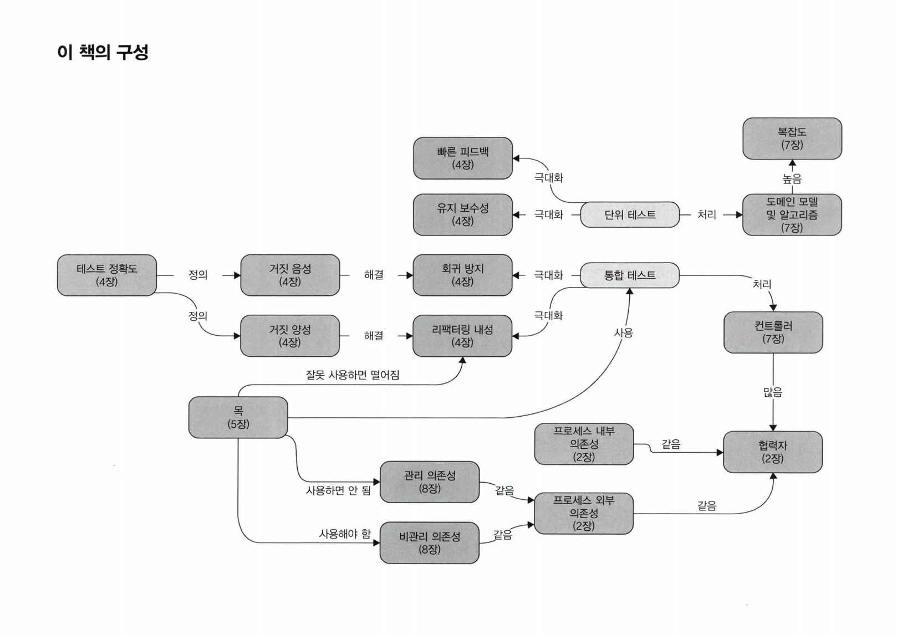

## Unit Testing

**Unit Testing:Principles, Practices and Patterns, Vladimir Khorikov**

<small><i>2023-08-02 ~ 2023-10-04 (9주)</i></small>

  

 

<b>Overview</b>

 

 

### _Part 1:_

<b>CHAPTER 01. 단위 테스트의 목표</b>

 
<a href="https://github.com/2mz1/theory/tree/gngsn/unit-testing/gngsn/chapter01"> 🔗 link </a>
 

**TL;DR**
- **성공적인 테스트 스위트**
    - 1#. 개발 주기에 통합되어 있음
    - 2#. 코드베이스에서 가장 중요한 부분 - _비즈니스 로직 (도메인 모델)_ - 만을 대상으로 함
    - 3#. 최소 유지비로 최대 가치를 끌어냄 (가치 있는 테스트를 식별하고, 작성하라)
- **비용 편익 분석**을 배우고 **안티 패턴**을 피하는 방법을 배워라.
    - **비용 편익 분석 (cost-benefit analysis)**: 여러 가지 대안에 대해 비용과 이익을 분석해서 가장 효과적인 대안을 찾는 방법론.
    - **안티 패턴(anti-pattern)**: 처음에는 괜찮은 것 같지만 미래에 문제를 야기하는 패턴
- 테스트의 장점
    - **소프트웨어 엔트로피(software entropy)** 를 막을 수 있음
        - 지속적인 정리와 리팩터링 등 적절한 관리를 하지 않고 방치하면 시스템이 점점 더 복잡해지고 무질서해짐.
        - 소프트웨어 품질을 떨어뜨리는 코드의 형태.
    - **회귀(regression)에 대한 보험을 제공**
        - **소프트웨어 버그**와 **회귀**는 동의어
          **테스트의 가치와 유지 비용을 모두 고려해야 함**
    - 기반 코드를 리팩터링할 때 **테스트도 리팩터링**하라
    - 각 **코드 변경 시 테스트를 실행**하라
    - **테스트가 잘못된 경고를 발생시킬 경우 처리**하라
    - 기반 코드의 동작을 이해하려고 할 때는 **테스트를 읽는 데 시간을 투자**하라
- 테스트도 **애플리케이션의 정확성을 보장**을 목표하는 **코드베이스**의 일부로 봐야 함
- $`코드\ 커버리지\ (테스트\ 커버리지) = \frac{제품\ 코드\ 라인\ 수}{전체\ 라인\ 수}`$
- $`분기\ 커버리지 = \frac{통과\ 분기}{전체\ 분기\ 수}`$
- **커버리지 지표에 관한 문제점**
    - 1#. 가능한 모든 결과를 검증한다고 보증할 수 없음
    - 2#. 외부 라이브러리 코드 경로를 고려할 수 없음
- **시스템의 핵심 부분은 커버리지를 높게 두는 것이 좋지만, 이 높은 수준을 요구 사항으로 삼는 것은 좋지 않음.**

 

<b>CHAPTER 02. 단위 테스트란 무엇인가</b>

 
<a href="https://github.com/2mz1/theory/tree/gngsn/unit-testing/gngsn/chapter02"> 🔗 link </a>
 

**TL;DR**
- **단위 테스트**
    - ① 단일 동작 단위를 검증 / ② 빠르게 수행  / ③ 다른 테스트와 격리하여 처리
- **런던파** _London School_
    - **테스트 대상 시스템에서 협력자를 격리**
    - **코드**나 **SUT(단일 클래스)** 단위의 테스트
- **고전파** _Classic School_
    - **단위 테스트끼리 격리**
    - **동작** 단위의 테스트
- **테스트 대역**: 테스트를 목적으로 객체를 특정 형태로 대체
- **AAA Pattern**: Assert, Act, Assert Pattern. 준비-실행-검증 패턴.
- **SUT vs MUT**
    - **SUT**: System Under Test. 테스트 검증 시스템, <b>클래스의 전체</b>를 가리킴
    - **MUT**: Method Under Test. 테스트 대상 메서드. 테스트에서 호출한 SUT의 <b>메서드</b>를 가리킴
- **테스트 대역 vs Mock**
    - **테스트 대역**: 실행과 관련 없이 모든 종류의 가짜 의존성을 설명하는 포괄적인 용어
    - **Mock**: 테스트 대상 시스템과 협력자 간의 상호 작용을 검사할 수 있는 특별한 테스트 대역
- **의존성**
    - **공유 의존성** _shared dependecy_: 동일 프로세스 내 영향을 미칠 수 있는 의존성. (ex. `static mutable field`, 데이터베이스)
    - **비공개 의존성** _private dependency_: 공유하지 않는 의존성
    - **프로세스 외부 의존성** _out-of-process dependency_: 애플리케이션 실행 프로세스 외부에서 실행되는 의존성
    - **싱글턴 의존성** _singleton_: **보통은 공유 의존성**. 하지만, 각 테스트 별 새 인스턴스 만들 수 있으면 **공유 의존성이 아님**
    - **설정 클래스** _configuration class_: 일반적으로 한 개인 공유 클래스. 하지만, 다른 모든 의존성이 SUT에 주입되면 새 인스턴스 생성 가능
    - **휘발성 의존성** _volatile dependency_: 런타임 환경의 설정 및 구성 요구 or 비결정적 동작 (각 호출에 대해 다른 결과를 제공) 포함
- <table><tr><th>런던파 이점</th><th>고전파를 선호하는 필자의 견해</th></tr><tr><td>세밀한 테스트로 입자성이 좋음</td><td>테스트는 단위가 아닌 동작 단위를 검증해야 함</td></tr><tr><td>연결된 클래스 그래프가 커져도 테스트가 쉬움 (테스트 대역으로 대체됨)</td><td>애초에 상호 연결된 클래스의 크고 복잡한 그래프를 갖지 않아야 함</td></tr><tr><td>테스트 실패 시 어떤 기능이 실패했는지 알 수 있음</td><td>큰 이점은 아님. 마지막 수정한 부분이 버그의 원인일 것</td></tr></table>
- **테스트 주도 개발**: TDD는 테스트에 의존해 프로젝트 개발을 추진하는 소프트웨어 개발 프로세스
    1. 추가할 기능과 예상 동작의 실패 테스트 작성
    2. 테스트를 통과할 코드 작성. 코드가 깨끗하거나 명쾌할 필요는 없음
    3. 코드 리팩터링. 통과 테스트 보호하에 코드를 안전하게 정리
- **통합 테스트**: 단위 테스트 기준 중 하나 이상을 충족하지 못하는 테스트
- **엔드 투 엔드 테스트**: 애플리케이션과 함께 작동하는 프로세스 외부 의존성의 전부 또는 대부분에 직접 접근

 

<b>CHAPTER 03. 단위테스트의 구조</b>

 
<a href="https://github.com/2mz1/theory/tree/gngsn/unit-testing/gngsn/chapter03"> 🔗 link </a>
 

**TL;DR**
- **AAA 패턴**: Arrange, Act, Assert Pattern. _준비 · 실행 · 검증_
  - **① 준비 구절**: SUT과 해당 의존성을 원하는 상태로 만듦
  - **② 실행 구절**: SUT에서 메서드를 호출 · 준비된 의존성을 전달하며 · 출력 값 캡처
  - **③ 검증 구정**: 결과 검증
  - ‘준비 or 실행 or 검증’ 중 여러 번 실행해야 한다면: **여러 동작 단위를 검증한다는 표시** → 여러 개로 분리
  - **구절 표기 주석 제거**: 준비 및 검증 구절에 빈 줄을 추가해야 할 때라면 주석을 유지하고, 아니라면 주석 제거
- AAA 패턴 코드의 크기: **준비 구절 ≥ 실행 구절 + 검증 구절**
  - 준비 구절이 너무 크면 `private method` 나 `factory method`로 도출 가능
- **`if` 문이 있는 단위 테스트**는 안티 패턴
- 실행 구절이 **한 줄 이상인 경우**를 경계하라
  - **불변 위반** invatiant violation: ex. 각기 다른 메서드를 실행하는데 서로의 결과에 의존해 이상한 결과값을 도출되는 것 → 단일한 공개 메서드여야 하는 메서드
  - **캡슐화**: 잠재적인 불변 위반으로부터 코드를 보호하는 것
- SUT의 이름을 <b>`sut`</b>로 지정해 구별해라
- **Test Fixture 재사용 방법**
  1. 안티 패턴: 생성자에서 Test Fixture 초기화
  2. 테스트 클래스에 비공개 팩토리 메서드 _private factory method_ 를 두는 것
- **읽기 쉬운 테스트 이름**: 간단하고 쉬운 영어 명명
  - 엄격한 테스트 명명 정책을 피해라
  - 도메인 전문가에게 시나리오를 설명하는 것처럼 지어라
  - 단어를 밑줄(`_`)로 구분하라
  - 테스트 명 내 테스트 대상 메서드 이름을 포함하지 마라
  - *`should be`* 는 또 다른 안티 패턴 네이밍
- 매개변수화된 테스트 _parameterized test_ 를 통해 유사한 사실을 단일한 메서드로 묶을 수 있음
  - **긍정 케이스 vs. 부정 케이스를 분리**하되, 동작이 너무 복잡하면 사용 금지
- **검증문 라이브러리** 사용: Java에는 `assertJ` 가 대표적

 

 

### _Part 2:_

<b>CHAPTER 04. 좋은 단위 테스트의 4대 요소</b>

 
<a href="https://github.com/2mz1/theory/tree/gngsn/unit-testing/gngsn/chapter04"> 🔗 link </a>
 

**TL;DR**
- **회귀**: 소프트웨어 버그, 코드를 수정한 후 (일반적으로 새 기능을 출시한 후) 기능이 의도한 대로 작동하지 않는 경우
- **리팩터링**
  - 식별할 수 있는 동작을 수정하지 않고 기존 코드를 변경하는 것
  - 의도: 코드의 비기능적 특징 개선. 가독성을 높이고 복잡도를 낮추는 것
  - 리팩터링 내성을 높이는 방법: SUT 구현 세부 사항과 테스트 간의 결합도를 낮추는 것뿐
- **코드 정확도**와 **테스트 결과**
  - **참 음성**: True negatives. 기능이 의도 대로 작동할 떄, 테스트가 통과하도록 올바른 추론한 경우
  - **참 양성**: True positives. 기능이 제대로 작동하지 않을 때, 테스트가 실패하도록 올바른 추론한 경우 ← 단위 테스트의 핵심
  - **거짓 음성**: False negatives. 기능이 제대로 작동하지 않을 때, 테스트가 통과하도록 잘못된 추론한 경우
  - **거짓 양성**: False positives. 기능이 의도 대로 작동할 때, 테스트가 실패하도록 잘못된 추론한 경우 ← 허위 경보. 리팩터링 내성을 통해 방지 가능
- **정확도 지표**
  - $`테스트\ 정확도 = \frac{신호(발견된\ 버그\ 수)}{소음(허위\ 경보\ 발생\ 수)}`$
  - 테스트의 정확도를 높이는 방법: ① 신호를 증가시키거나, ② 소음을 줄이는 것
- 좋은 단위 테스트의 4대 특성: 아래 네 가지 특성의 곱
  - **회귀 방지** / **리팩터링 내성** / **빠른 피드백** / **유지 보수성**
  - 곱셈 법칙에 의해 어떤 특성이라도 `0`이 되면 전체가 `0`이 됨
- 좋은 단위 테스트의 특성 - **회귀 방지** / **리팩터링 내성** / **빠른 피드백** - 은 **상호 배타적**
  - **리팩터링 내성을 최대한 많이 갖는 것을 목표** + 테스트가 얼마나 버그를 잘 찾아내는지와 얼마나 빠른지 사이의 절충안
- 최소 필수값에 대해 상당히 높은 임계치를 설정하고 이 임계치를 충족하는 테스트만 테스트 스위트에 남겨라
- **테스트 피라미드**
  - 1층: 단위 테스트 > 2층: 통합 테스트 > 3층: 엔드 투 엔드 테스트
- 화이트박스 테스트 대신 **블랙박스 테스트를 기본적으로 선택**하라
  - **블랙박스 테스트**: 시스템의 내부 구조를 몰라도 시스템의 기능을 검사할 수 있는 소프트웨어 테스트 방법
  - **화이트박스 테스트**: 내부 작업 검증

 

<b>CHAPTER 05. 목과 테스트 취약성</b>

 
<a href="https://github.com/2mz1/theory/tree/gngsn/unit-testing/gngsn/chapter05"> 🔗 link </a>
 

**TL;DR**
- **테스트 대역**: 모든 유형의 비운영용 가짜 의존성
  - **Mock**: 외부로 나가는 상호 작용을 모방하고 검사하는 데 도움
    - <b>mock</b> : 목 프레임워크의 도움과 함께 함
    - <b>spy</b> : 수동 작성. '직접 작성한 목 handwritten mocks'이라고도 함
  - **Stub**: 내부로 들어오는 상호 작용을 모방하는 데 도움
    - <b>dummy</b> : 널이 값이나 가짜 문자열과 같이 단순하고 하드코딩된 값
    - <b>stub</b> : dummy 보다 정교, 시나리오마다 다른 값을 반환하게끔 구성할 수 있도록 필요한 것을 다 갖춘 완전한 의존성
    - <b>fake</b> : 대다수의 목적에 부합하는 스텁과 같지만, 생성의 차이. 페이크는 보통 아직 존재하지 않는 의존성을 대체하고자 구현
- **도구로서의 Mock**: mock(테스트 대역)이나 stub을 만드는 데 사용할 수 있는 Mock Library 클래스
- **CQS 원칙**: _Command Query Separation_. 모든 메서드는 명령이거나 조회
  - **명령**: 사이드 이펙트를 일으키고 어떤 값도 반환하지 않는 메서드(void 반환)
    - 명령을 대체하는 테스트 대역 👉🏻 목
  - **조회**: 사이드 이펙트가 없고 값을 반환
    - 조회를 대체하는 테스트 대역 👉🏻 스텁
- **육각형 아키텍처**
  - Domain: 애플리케이션의 중심부
  - Application: 애플리케이션의 필수 기능, 비즈니스 로직 포함
- **육각형 아키텍처의 주요 관점 세 가지**
  1. **도메인과 애플리케이션 서비스 계층 간의 관심사 분리**
    - 도메인 계층의 관심사: 오직 비즈니스 로직에 대한 책임
    - 애플리케이션 서비스 계층의 관심사: 도메인 계층과 외부 애플리케이션 간의 작업 조정
  2. **애플리케이션 내부 통신**
    - 애플리케이션 서비스 계층에서 도메인 계층으로 흐르는 단방향 의존성 흐름
  3. **애플리케이션 간의 통신**
    - 애플리케이션 서비스 계층이 유지하는 공통 인터페이스를 통해 연결, 도메인 계층에 직접 접근 불가
- **애플리케이션의 통신**
  - **시스템 내부** _inter-system_ **통신**
    - 애플리케이션 내 클래스 간의 통신 / 구현 세부 사항 / 도메인 클래스 간의 협력
    - 테스트가 inter-system 통신과 결합되면 취약해짐
  - **시스템 간** _intra-system_ **통신**
    - 다른 애플리케이션과의 통신 / 시스템 내 식별할 수 있는 동작
    - 목을 사용하면 시스템과 외부 애플리케이션 간의 통신 패턴을 확인할 때 좋음

 

<b>CHAPTER 06. 단위 테스트 스타일</b>

 
<a href="https://github.com/2mz1/theory/tree/gngsn/unit-testing/gngsn/chapter06"> 🔗 link </a>
 

**TL;DR**
- **출력 기반 테스트** _Output-based testing_: SUT에 입력을 주고 **출력을 확인**
  - 테스트 품질이 가장 좋음
    - 구현 세부 사항에 거의 결합되지 않음 → 리팩터링 내성 ↑
    - 작고 간결 → 유지 보수하기 쉬움
- **상태 기반 테스트** _State-based testing_: **작업 완료 후의 시스템 상태를 확인**
  - 안정성을 위해 주의해서 채택해야 함 (비공개 상태를 노출하지 않도록 해야 함)
  - 크기가 큰 편이므로 유지 보수가 쉽지 않음
- **통신 기반 테스트** _Communication-based testing_: Mock을 통해 **테스트 대상 시스템과 협력자 간의 통신 검증**
  - 애플리케이션 경계를 넘어서 **외부 환경에 사이드 이펙트가 보이는 통신에서만** 사용
- **'출력 vs. 상태 vs. 통신' 비교** → 항상 **출력 기반**을 선호하라
  - 리팩터링 내성 위험 : **출력 기반** < 상태 기반 ≈ 통신 기반
  - 유지비 : **출력 기반** < 상태 기반 < 통신 기반
- **고전파 vs 런던파** : 두 분파 모두 출력 기반 테스트를 사용
  - 고전파: 통신 기반 스타일보다 **상태 기반 스타일** 선호
  - 런던파: 상태 기반 스타일보다 **통신 기반 스타일** 선호
- **함수형 프로그래밍**: mathematical function (pure function).
  - 모든 입출력은 메서드 이름, 인수, 반환 타입으로 구성된 메서드 시그니처 _method sighature_ 에 명시해야 함
  - 명시적이기 때문에 테스트 용이성 높임: 숨은 입력과 숨은 출력 완화
    - **숨은 출력**: 사이드 이펙트, 예외
    - **숨은 입력**: 내부 상태 또는 외부 상태에 대한 참조
  - 함수형 아키텍처는 사이드 이펙트를 비즈니스 연산의 가장자리로 밀어내 분리를 이루는 데 도움이 됨
- **함수형 프로그래밍의 목표**: 비즈니스 로직과 사이드 이펙트를 분리하는 것
  - **결정을 내리는 코드** = **functional core** (함수형 코어)
    - Side Effect가 없기 때문에 Mathematical Function을 작성할 수 있음
  - **해당 결정에 작용하는 코드** = **mutable shell** (가변 셸)
    - 입력 데이터를 함수형 코어에 공급, 코어가 내린 결정을 사이드 이펙트로 변환
- **함수형 아키텍처 vs 육각형 아키텍처** : Side Effect 처리
  - **함수형 아키텍처**: 모든 사이드 이펙트를 도메인 계층 밖으로 밀어냄
  - **육각형 아키텍처**: 도메인 계층에 제한하는 하기 때문에, 도메인 계층으로 인한 부작용도 문제 없음
- 함수형 방식에서 순수성에 많은 비용이 든다면 순수성을 따르지 마라
  - **항상 시스템의 복잡도와 중요성을 고려해 함수형 아키텍처를 전략적으로 적용**하라

 

<b>CHAPTER 07. 가치 있는 단위 테스트를 위한 리팩터링</b>

 
<a href="https://github.com/2mz1/theory/tree/gngsn/unit-testing/gngsn/chapter07"> 🔗 link </a>
 

**TL;DR**

- **코드 복잡도**: 코드에서 의사 결정 지점 수에 따라 명시적으로(코드) 그리고 암시적으로(코드가 사용하는 라이브러리) 정의
- **도메인 유의성**: 프로젝트의 문제 도메인에 대해 코드가 얼마나 중요한지를 줌
  - 복잡한 코드는 종종 도메인 유의성이 높고 그 반대의 경우도 있음
- **복잡한 코드**와 **도메인 유의성**을 갖는 코드는 해당 테스트의 회귀 방지가 뛰어나기 때문에 단위 테스트에서 가장 이로움
- 협력자가 많은 코드를 다루는 단위 테스트는 유지비가 많이 듦
  - 협력자를 예상 상태로 만들고 나서 상태나 상호 작용을 확인하고자 공간을 많이 필요로 함
- 복잡도 또는 도메인 유의성과 협력자 수에 따른 네 가지 유형의 코드
  - <table style="text-align: center;">
      <tr><td></td><td colspan="2"><b>협력자 수</b> </td></tr>
      <tr>
          <td rowspan="2"><b>복잡도 및 도메인 유의성</b></td>
          <td><b>도메인 모델 및 알고리즘</b> - 단위 테스트 - 복잡도 또는 도메인 유의성이 높음 - 협력자가 거의 없음</td>
          <td><b>지나치게 복잡한 코드</b> - 테스트 X - 복잡도 또는 도메인 유의성이 높음 - 협력자가 많음</td>
      </tr>
      <tr>
          <td><b>간단한 코드</b> - 테스트 X - 복잡도와 도메인 유의성이 낮음: 테스트 가치 전혀 없음 - 협력자가 거의 없음</td>
          <td><b>컨트롤러</b> - 통합 테스트 - 복잡하며 비즈니스에 중요한 작업은 아님 - 협력자가 많음 </td>
      </tr>
    </table>
- 코드가 중요하거나 복잡할수록 협력자가 적어야 한다.
- **험블 객체 패턴** _Humble Object Pattern_
  - **코드에서 비즈니스 로직을 별도의 클래스로 추출**: 지나치게 복잡한 코드에서 로직을 추출해 코드를 테스트할 필요가 없도록 간단하게 만듦
  - **험블 래퍼** _Humble Wrapper_: 비즈니스 로직에서 분리한 나머지 코드 (컨트롤러)
- **육각형 아키텍처**와 **함수형 아키텍처**는 험블 객체 패턴을 구현
  - **육각형 아키텍처**: 비즈니스 로직과 프로세스 외부 의존성과의 통신을 분리
  - **함수형 아키텍처**: 프로세스 외부 의존성뿐만 아니라 모든 협력자와의 통신과 비즈니스 로직을 분리
- **코드의 깊이와 너비**: 코드는 깊을 수도 있고(복잡하거나 중요함), 넓을 수도 있지만(협력자가 많음), 둘 다는 아님
  - 도메인 유의성이 있으면 전제 조건을 테스트하고, 그 외의 경우에는 테스트하지 않음
- 비즈니스 로직과 오케스트레이션을 분리할 때의 세 가지 중요한 특성
  1. **도메인 모델 테스트 유의성**: 도메인 클래스 내 협력자 수와 유형에 대한 함수
  2. **컨트롤러 단순성**: 컨트롤러에 의사 결정 지점이 있는지에 따라 다름
  3. **성능**: 프로세스 외부 의존성에 대한 호출 수로 정의
- 항상 세 가지 특성 중 최대 두 가지를 가질 수 있음
  1. **외부에 대한 모든 읽기와 쓰기를 비즈니스 연산 가장자리로 밀어내기** : 컨트롤러를 단순하게 유지하고 도메인 모델 데스트 유의성을 지키지만, 성능이 저하된다.
  2. **도메인 모델에 프로세스 외부 의존성을 주입하기**: 성능을 유지하고 컨트롤러를 단순 하게 하지만, 도메인 모델의 테스트 유의성이 떨어진다.
  3. **의사 결정 프로세스 단계를 더 세분화하기**: 성능과 도메인 모델 테스트 유의성을 지 키지만, 컨트롤러의 단순함을 포기한다.
-  컨트롤러 복잡도 증가를 완화할 수 있는 **두 가지 패턴**
1. **CanExecute/Execute 패턴**
   - `Do()` 전에 `canDo()`를 호출하여 컨트롤러의 의사 결정을 제거
   - 도메인 이벤트는 도메인 모델의 중요한 변경 사항을 추적하고 해당 변경 사항을 프로세스 외부 의존성에 대한 호출로 변환함
   - 이 패턴으로 컨트롤러에서 추적에 대한 책임이 없어짐
2. **도메인 이벤트**
   - 구현 관점에서, <b>외부 시스템에 통보하는 데 필요한 데이터가 포함된 클래스</b>
   - 프로세스 외부 의존성 호출 위의 추상화
   - 도메인 클래스의 변경은 데이터 저장소의 향후 수정에 대한 추상화에 해당
- 추상화할 것을 테스트하기보다는 추상화를 테스트하는 것이 더 쉬움

 

 

### _Part 3:_

<b>CHAPTER 08. 통합 테스트를 하는 이유</b>

 
<a href="https://github.com/2mz1/theory/tree/gngsn/unit-testing/gngsn/chapter08"> 🔗 link </a>
 

**TL;DR**

- **단위 테스트와 통합 테스트**
  - **단위 테스트**: 가능한 한 많이 비즈니스 시나리오의 예외 상황을 확인
    - 주요 흐름 happy path: 시나리오의 성공적인 실행
  - **통합 테스트**: 주요 흐름 happy path 과 단위 테스트가 다루지 못하는 기타 예외 상황 edge case을 다룸
    - 예외 상황 edge case: 비즈니스 시나리오 수행 중 오류 발생의 경우
- **빠른 실패 원칙** _Fast Fail principle_: 예기치 않은 오류가 발생하자마자 현재 연산을 중단하는 것
- **관리 의존성**
  - 전반적인 제어가 가능한 프로세스 외부 의존성 (ex. 데이터베이스)
  - 실제 인스턴스로 테스트
- **비관리 의존성**
  - 전반적인 제어가 불가능한 프로세스 외부 의존성 (ex. SMTP 서버)
  - Mock으로 테스트
    -> 관리 포인트가 많아지는 것보다, API(동기식 통신) 나 메시지 버스(비동기식 통신) 를 사용하는 것이 더 나음
- 데이터베이스를 그대로 테스트할 수 없으면 통합 테스트를 아예 작성하지 말고 도메인 모델의 단위 테스트에만 집중
- 통합 테스트를 작성하기 전, 프로세스 외부 의존성을 두 가지로 분류해서 **실제 인스턴스를 사용 할 대상**과 **목**으로 대체할 대상을 결정해야 함
  - **데이터베이스: 실제 인스턴스 사용**
  - **메시지 버스**: 메시지 버스의 목적은 다른 시스템과의 통신을 가능하게 하는 것, 목으로 대체하고 컨트롤러와 목 간의 상호작용을 검증
- **YAGNI** _You aren't gonna need it_: 현재 필요하지 않은 기능에 시간을 들이지 말아라
  - **기회 비용**: 당장 필요하지 않은 기능을 개발하는데 시간을 보내는 것은, 지금 당장 필요한 기능을 제치고 시간을 허비하는 것
  - **적은 코드**: 불필요한 코드 베이스를 줄이자
- 항상 도메인 모델을 코드베이스에서 명시적이고 잘 알려진 위치에 두도록 하라
- 도메인 모델은 프로젝트가 해결하고자 하는 문제에 대한 도메인 지식의 모음
- **순환 의존성** _circular dependency 또는 cyclic dependency_ : 둘 이상의 클래스가 제대로 작동하고자 직·간접적으로 서로 의존하는 것
- **로깅 유형**
  - 지원 로깅 _support logging_: 지원 담당자나 시스템 관리자가 추적할 수 있는 메시지를 생성
    - 지원 로깅 → 비즈니스 요구사항, 테스트 당연 필요
  - 진단 로깅 _diagnostic logging_: 개발자가 애플리케이션 내부 상황을 파악할 수 있도록 도움
    - 진단 로깅 → 과도하게 사용 X

 

<b>CHAPTER 09. 목 처리에 대한 모범 사례</b>

 
<a href="https://github.com/2mz1/theory/tree/gngsn/unit-testing/gngsn/chapter09"> 🔗 link </a>
 

**TL;DR**
- 시스템 끝에서 비관리 의존성과의 상호작용을 검증하라
  - **회귀 방지** 향상: 통합테스트로 검증된 코드가 더 많기 때문
  - **리팩터링 내성** 향상: 코드의 구현 세부 사항에서 목을 분리하기 때문
- **Spy**: Mock과 같은 목적으로 수동 작성하는 테스트 대역
  - vs Mock: Mock은 Mock 프레임워크의 도움을 받아 생성
  - 검증 단계에서 코드 재사용으로 테스트 사이즈가 줄고 가독성이 개선됨
- assertion 작성 시, 제품 코드에 의존하지 말고, 테스트에서 별도의 리터럴과 상수 집합을 사용하라
- **목을 처리 모범 사례**
  - 비관리 의존성에만 Mock 적용하기
  - 시스템 끝에 있는 의존성에 대해 상호 작용 검증
  - 통합 테스트에서만 목을 사용, 단위 테스트에서는 금지
  - 항상 Mock 호출 수 확인
  - 직접 제작한 타입으로 Mock 처리

 

<b>CHAPTER 10. 데이터베이스 테스트</b>

**TL;DR**
- 데이터베이스 스키마를 소스 코드와 같이 형상 관리 시스템에 저장하라
- **참조 데이터**
  - 애플리케이션이 제대로 작동 하도록 미리 채워져야 하는 데이터
  - 데이터베이스 스키마에 해당
  - vs **일반 데이터**: 애플리케이션에서 해당 데이터를 **수정 가능**하면 **일반 데이터**, **수정 불가**하면 **참조 데이터**
- 개발자마다 데이터베이스 인스턴스를 별도로 두게 하라
  - 더 좋은 방법은 개발자 장비에 인스턴스를 호스팅하는 것 (테스트 실행 속도를 극대화)
- **데이터베이스 배포 방식**
  1. **상태 기반**: 상태를 명시적으로 만들고 비교 도구가 마이그레이션을 암묵적으로 제어할 수 있음
  2. **마이그레이션 기반 방식**: 데이터 베이스를 특정 상태에서 다른 상태로 전환하게끔 명시적 마이그레이션 사용
  - 데이터베이스 상태가 명확하면 병합 충돌을 좀 더 쉽게 처리할 수 있는 데 반해, 명시적 마이그레이션은 데이터 모션 문제를 해결하는 데 도움이 된다.
  - 상태 기반 방식보다는 마이그레이션 기반 방식을 선호: 데이터 모션 처리가 병합 충돌보다 훨씬 중요하기 때문
- 데이터베이스 트랜잭션 매커니즘에 의존하여, 비즈니스 연산 데이터를 원자적으로 업데이트하라
- 작업 단위 패턴 사용을 지향하라
  - 작업 단위는 데이터베이스 트랜잭션에 의존하며, 비즈니스 연산 종료 시점까지 업데이트를 모두 지연시켜서 성능을 향상시킴
- 테스트 구절마다 데이터베이스 트랜잭션이나 작업 단위를 재사용하지 말라
  - 준비, 실행, 검증 구절에 각각 고유의 트랜잭션이나 작업 단위가 있어야 함
- 통합 테스트는 순차적으로 실행: 병렬 실행은 공수가 어렵고, 보통 그럴 가치가 없음
- 테스트 시작 시점에 남은 데이터를 정리하라
  - 빠르고 일관싱 없는 동작을 일으키지 않으며, 정리 단계를 실수로 건너뛰지 않음
  - 별도의 종료 단계도 둘 필요 없음
- 인메모리 데이터베이스는 사용 X
  - 운영 환경과 달라 보호 수준이 떨어짐. 테스트에서도 같이 동 일한 DBMS를 사용하라
- 필수가 아닌 부분을 **비공개 메서드** 또는 **헬퍼 클래스**로 추출해 테스트를 단축하라
- **코드 재사용**
  - **준비 구절**: 테스트 데이터 빌더 대신 오브젝트 마더를 선택
  - **실행 구절**: 데코레이터 메서드 작성
  - **검증 구절**: 플루언트 인터페이스 도입
- **읽기 테스트**: 가장 복잡하거나 중요한 읽기 작업만 테스트하고, 나머지는 무시하라
- **리포지터리 테스트**: 직접 테스트 X. 통합 테스트 스위트로 취급하라

 

 

### _Part 4:_

<b>CHAPTER 11. 단위 테스트 안티 패턴</b>

**TL;DR**
- 비공개 메서드의 단위 테스트는 세부 구현에 결합되고, 결국 리팩터링 내성이 떨어짐
- 비공개 메서드를 직접 테스트하는 대신, 식별할 수 있는 동작을 통해 간접적으로 테스트하라
- 두 가지 불필요한 비공개 메서드 커버리지
  - **죽은 코드**
    - 코드가 어디에도 사용되지 않는다면 삭제
  - **추상화 누락**
    - 비공개 메서드가 복잡해서 공개 API를 통해 테스트하기 어렵다면, 추상화가 누락됐다는 징후
    - 공개로 변경 하지 말고, **해당 코드를 추상화를 통해 별도 클래스로 추출하라**
- 단위 테스트를 위해 비공개 메서드를 공개로 변경하지 마라
- **비공개 메서드를 절대 테스트하지 말라는 규칙**에도 **예외가 존재**
  - ORM: 공개 생성자가 필요없음, 비공개 생성자로 잘 작동
- 테스트를 작성할 때 **특정 구현을 암시하지 말라**
  - **블랙박스 관점**에서 제품 코드를 검증하라
  - **도메인 지식을 테스트에 유출하지 않도록 하라**
- **코드 오염**: 테스트를 위한 제품 코드를 추가하는 것 → 안티 패턴
  - 테스트 코드와 제품 코드가 섞임
  - 제품 코드 유지비 증가
- 구체 클래스를 목으로 처리해야 하면, 이는 단일 책임 원칙을 위반 하는 결과
  - **해당 클래스를 두 가지 클래스로 분리**: 도메인 로직이 있는 클래스와 프로세스 외부 의존성과 통신하는 클래스
- 현재 시간을 ambient context로 하면 제품 코드가 오염되고 테스트하기가 더 어려워짐
  - 서비스나 일반 값의 명시적인 의존성으로 시간을 주입하라

 

