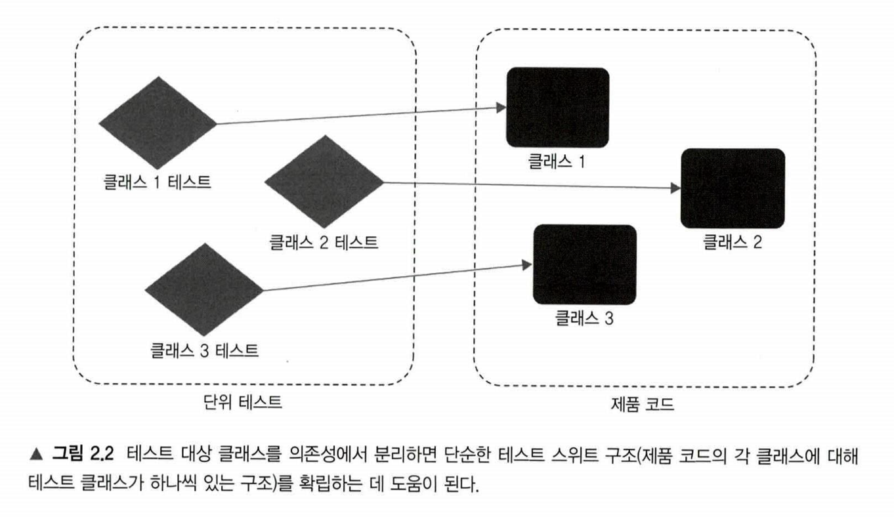
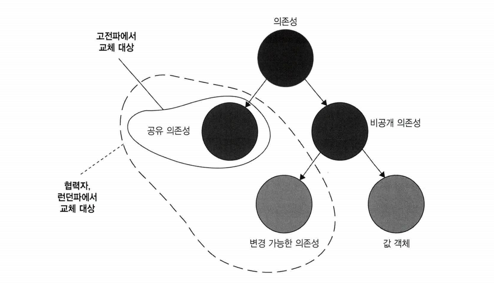
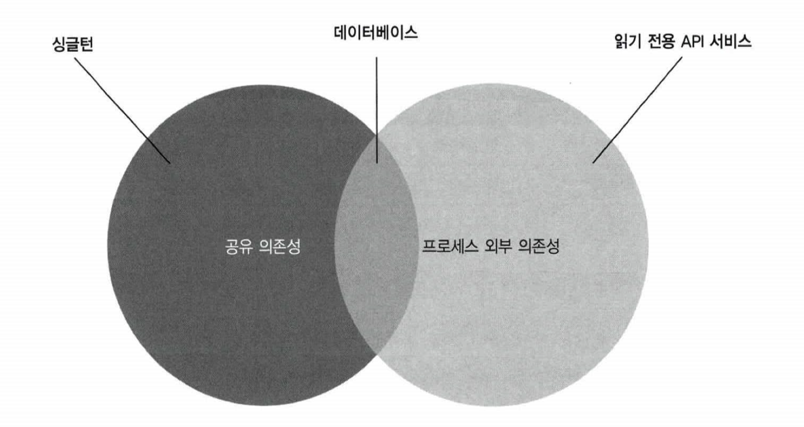

# CHAPTER 2. 단위 테스트란 무엇인가

**TL;DR**
- **단위 테스트**
  - ① 단일 동작 단위를 검증 / ② 빠르게 수행  / ③ 다른 테스트와 격리하여 처리
- **런던파** _London School_
  - **테스트 대상 시스템에서 협력자를 격리**
  - **코드**나 **SUT(단일 클래스)** 단위의 테스트 
- **고전파** _Classic School_
  - **단위 테스트끼리 격리**
  - **동작** 단위의 테스트
- **테스트 대역**: 테스트를 목적으로 객체를 특정 형태로 대체
- **AAA Pattern**: Assert, Act, Assert Pattern. 준비-실행-검증 패턴.
- **SUT vs MUT**
    - **SUT**: System Under Test. 테스트 검증 시스템, <b>클래스의 전체</b>를 가리킴
    - **MUT**: Method Under Test. 테스트 대상 메서드. 테스트에서 호출한 SUT의 <b>메서드</b>를 가리킴
- **테스트 대역 vs Mock**
    - **테스트 대역**: 실행과 관련 없이 모든 종류의 가짜 의존성을 설명하는 포괄적인 용어
    - **Mock**: 테스트 대상 시스템과 협력자 간의 상호 작용을 검사할 수 있는 특별한 테스트 대역
- **의존성** 
  - **공유 의존성** _shared dependency_: 동일 프로세스 내 영향을 미칠 수 있는 의존성. (ex. `static mutable field`, 데이터베이스)
  - **비공개 의존성** _private dependency_: 공유하지 않는 의존성
  - **프로세스 외부 의존성** _out-of-process dependency_: 애플리케이션 실행 프로세스 외부에서 실행되는 의존성
  - **싱글턴 의존성** _singleton_: **보통은 공유 의존성**. 하지만, 각 테스트 별 새 인스턴스 만들 수 있으면 **공유 의존성이 아님**
  - **설정 클래스** _configuration class_: 일반적으로 한 개인 공유 클래스. 하지만, 다른 모든 의존성이 SUT에 주입되면 새 인스턴스 생성 가능
  - **휘발성 의존성** _volatile dependency_: 런타임 환경의 설정 및 구성 요구 or 비결정적 동작 (각 호출에 대해 다른 결과를 제공) 포함
- <table><tr><th>런던파 이점</th><th>고전파를 선호하는 필자의 견해</th></tr><tr><td>세밀한 테스트로 입자성이 좋음</td><td>테스트는 단위가 아닌 동작 단위를 검증해야 함</td></tr><tr><td>연결된 클래스 그래프가 커져도 테스트가 쉬움 (테스트 대역으로 대체됨)</td><td>애초에 상호 연결된 클래스의 크고 복잡한 그래프를 갖지 않아야 함</td></tr><tr><td>테스트 실패 시 어떤 기능이 실패했는지 알 수 있음</td><td>큰 이점은 아님. 마지막 수정한 부분이 버그의 원인일 것</td></tr></table>
- **테스트 주도 개발**: TDD는 테스트에 의존해 프로젝트 개발을 추진하는 소프트웨어 개발 프로세스
  1. 추가할 기능과 예상 동작의 실패 테스트 작성
  2. 테스트를 통과할 코드 작성. 코드가 깨끗하거나 명쾌할 필요는 없음
  3. 코드 리팩터링. 통과 테스트 보호하에 코드를 안전하게 정리
- **통합 테스트**: 단위 테스트 기준 중 하나 이상을 충족하지 못하는 테스트
- **엔드 투 엔드 테스트**: 애플리케이션과 함께 작동하는 프로세스 외부 의존성의 전부 또는 대부분에 직접 접근

<br/><br/>

---

<br/>

단위 테스트의 조건 중, '격리된 테스트' 라는 개념에 접근하는 방법: 고전파, 런던파

|              | 고전파 Classic School                                                                     | 런던파 London School                         |
|--------------|----------------------------------------------------------------------------------------|-------------------------------------------|
| 유래           | _= 디트로이트(Detroit) = 고전주의적 (Classicist) 접근법_.<br/>모든 사람이 단위 테스트와 테스트 주도 개발에 원론적으로 접근하는 방식 | = _목 추종자 (mockist)_. 런던의 프로그래밍 커뮤니티에서 시작. |
| 격리 방식        |  단위 테스트끼리 격리하는 것                                                                       | 테스트 대상 시스템에서 협력자를 격리하는 것                   |
| 격리 주체        |  단위 테스트                                                                                | 단위 (코드 or SUT)                            |
| 단위 크기        | 단일 클래스 또는 클래스 세트                                                                       | 단일 클래스                                    |
| 테스트 대역 사용 대상 | 공유 의존성                                                                         | 불변 의존성 외 모든 의존성                           |

<br/>

## 2.1 '단위 테스트'의 정의

**단위 테스트의 공통된 중요 속성**

- 작은 코드 조각 (단위) 검증
- 빠르게 수행
- 격리된 방식
- 자동화된 테스트

<small>'작은 코드 조각'은 '단위'와 동일하며, 이하부터 '단위'로 기술합니다.</small>

<br/>

### 2.1.1 격리 문제에 대한 런던파의 접근

<small>런던파의 '격리된 방식의 단위 테스트' 접근법</small>

✔️ **개념**: 테스트 대상 시스템을 협력자(collaborator) 에게서 격리

✔️ **코드**: **클래스의 모든 의존성을 테스트 대역(test double)으로 대체**

<br/>
<table><tr><td>

📌 <b>테스트 대역</b>

> Test Double is a generic term for any case where you replace a production object for testing purposes. 
>
> _- Martin Fowler_

테스트를 목적으로 객체를 특정 형태로 대체한 객체. 테스트 대상 객체가 객체 의존성으로 엮여 사용하기 힘들 때 대체할 수 있는 주변 객체.

<small><i>Types: Dummy, Stub, Spy, Mock, Fake</i></small>

<b>장점</b>
- 클래스의 직접적인 의존성 대체 가능
- 의존성의 의존성을 다룰 필요 없음
- 단위 테스트에서 준비를 크게 줄일 수 있음
</td></tr></table>

<br/>

**단위 테스트 시 격리의 장점**

- 테스트가 실패하면 코드베이스의 어느 부분이 고장 났는지 확실히 알 수 있음
- 객체 그래프 (object graph, 같은 문제를 해결하는 클래스의 통신망)를 분할할 수 있음

<br/>

**✅ 클래스에 해당하는 단위 테스트 클래스를 생성하라**

<br/><br/>

- 테스트 대상 클래스를 의존성에서 분리하면, 단순한 테스트 스위트 구조 형성하는 데 도움이 됨
- 단순한 테스트 스위트 구조: 제품 코드의 각 클래스에 대해 테스트 클래스가 하나있는 구조

<br/>

- **AAA Pattern**: Arrange, Act, Assert Pattern. 준비-실행-검증 패턴.

<table> 
<tr><th></th><th>Classic School</th><th>London School</th></tr>
<tr>
    <th>Success</th>
    <td>
        <pre><code lang="c">public void Purchase_succeeds_when_enough_inventory()
{
    // 준비
    var store = new Store();
    store.AddInventory(Product.Shampoo, 10);
    var customer = new Customer();

    // 실행
    bool success = customer.Purchase(store, Product.Shampoo, 5);

    // 검증
    Assert.True(success);
    Assert.Equal(5, store.GetInventory(Product.Shampoo));
}</code></pre>
    </td>
    <td>
        <pre><code lang="c">public void Purchase_succeeds_when_enough_inventory()
{
    // 준비
    <b>var storeMock = new Mock&lt;IStore&gt;();</b>
    storeMock
        .Setup(x => x.HasEnoughInventory(Product.Shampoo, 5))
        .Returns(true);
    var customer = new Customer();

    // 실행
    bool success = customer.Purchase(
        stockMock.Object, Product.Shampoo, 5);

    // 검증
    Assert.True(success);
    storeMock.Verify(
        x => x.RemoveInventory(Product.Shampoo, 5),
        Times.Once);
}</code></pre>
    </td>
</tr>
<tr>
    <th>Fail</th>
    <td>
<pre><code lang="c">public void Purchase_fails_when_not_enough_inventory()
{
    // 준비
    var store = new Store();
    store.AddInventory(Product.Shampoo, 10);
    var customer = new Customer();

    // 실행
    bool success = customer.Purchase(store, Product.Shampoo, 15);

    // 검증
    Assert.True(success);
    Assert.Equal(10, store.GetInventory(Product.Shampoo));  // 제품 수 변화 없음
}</code></pre></td>
    <td><pre><code lang="csharp">public void Purchase_fails_when_not_enough_inventory()
{
    // 준비
    <b>var storeMock = new Mock&lt;IStore&gt;();</b>

    storeMock
        .Setup(x => x.HasEnoughInventory(Product.Shampoo, 5))
        .Returns(true);
    var customer = new Customer();

    // 실행
    bool success = customer.Purchase(
        stockMock.Object, Product.Shampoo, 5);

    // 검증
    Assert.True(success);
    storeMock.Verify(
        x => x.RemoveInventory(Product.Shampoo, 5),
        Times.Never);
    }</code></pre>
</td>
</tr><tr>
    <th>Desc</th>
    <td>

- `Store` 상태를 검증
- Customer이 SUT, Story이 협력자에 해당
- Customer가 올바르게 작동하더라도 Customer에 영향을 미치는 Store 내부에 버그가 있으면 단위테스트에 실패할 수 있음.
    - 👉🏻 두 클래스는 서로 격리돼 있지 않음

  </td>
  <td>

    - `Customer` 와 `Store` 간의 상호 작용을 검사
        - ➕ `Customer`이 호출해야 하는 `Store`의 메서드 (`x.RemoveInventory`) 까지 검증
        - ➕ 호출 회수까지 검증
    - `Store` 실제 인스턴스를 생성하지 않고 **목 객체** (`Mock<T>`) 사용
    - `Store` **클래스**를 사용하지 않고 `IStore` **인터페이스**를 사용
        - 클래스를 사용할 수 있지만 **안티 패턴**임 <small><i>Ref. Chapter 11</i></small>

  </td>

</tr>
</table>

<br/>

<pre>
📌 <b>SUT와 MUT는 흔히 동의어로 사용되지만 다름</b>

- <b>SUT</b>: System Under Test. 테스트 검증 시스템, <b>클래스의 전체</b>를 가리킴
- <b>MUT</b>: Method Under Test. 테스트 대상 메서드. 테스트에서 호출한 SUT의 <b>메서드</b>를 가리킴
</pre>

<pre>
📌 <b>테스트 vs Mock</b>

- <b>테스트 대역</b>: 실행과 관련 없이 모든 종류의 가짜 의존성을 설명하는 포괄적인 용어
- <b>Mock</b>: 테스트 대상 시스템과 협력자 간의 상호 작용을 검사할 수 있는 특별한 테스트 대역
</pre>

<br/>

### 2.1.2 격리 문제에 대한 고전파의 접근

- 각각의 모든 클래스를 격리해야 한다면 테스트 대상 코드 조각은 당연히 단일 클래스이거나 해당 클래스 내의 메서드이어야 함

**공유 상태**

- 단위 테스트는 반드시 격리되어야 하지만, 코드를 반드시 격리해야하는 것은 아님
- 여러 클래스가 모두 메모리에 상주하고 공유 상태에 도달하지 않는 한, 여러 클래스를 한 번에 테스트해도 됨
    - 테스트가 서로 소통하고 실행 컨텍스트에 영향을 줄 수 있음
    - 대표 예시: Database, 파일 시스템 등의 외부 의존성

**특징**

- 테스트를 가장 적합한 특정 순서(병렬이나 순차 등)로 실행할 수 있으며, 서로의 결과에 영향을 미치지 않음

<br/>

<pre>
📌 <b>공유 의존성 vs 비공개 의존성 vs 프로세스 외부 의존성</b>

- <b>공유 의존성</b> <i>shared dependecy</i>
    - 테스트 간에 공유되고 서로의 결과에 영향을 미칠 수 있는 수단을 제공하는 의존성
    - 동일 프로세스 내 실행되는 모든 단위 테스트에서 조회 및 사용 가능
    - ex. <code>static mutable field</code>, 데이터베이스
 
- <b>비공개 의존성</b> <i>private dependency</i>
    - 공유하지 않는 의존성

- <b>프로세스 외부 의존성</b> <i>out-of-process dependency</i>
    - 애플리케이션 실행 프로세스 외부에서 실행되는 의존성
    - 아직 메모리에 없는 데이터에 대한 프록시 (Proxy)
    
'프로세스 외부 의존성' 는 대부분 '공유 의존성', 하지만 전부는 아님

EX. <b>데이터 베이스</b>
- 외부 의존성 & 공유 의존성
- 실행 전 Docker DB 세팅이 된 후라면? 외부 의존성 but not 공유 의존성 
</pre>

- 비공개 의존성은 실행 프로세스가 외부에 있는 공유 의존성에 비해 실행 속도가 빠름

**테스트 스위트 전체에서 단일 인스턴스를 유지할 필요는 없음**

- **싱글턴 의존성 singleton**: **보통은 공유 의존성**. 하지만, 각 테스트 별 새 인스턴스 만들 수 있으면 **공유 의존성이 아님**
- **설정 클래스 configuration class**: 일반적으로 한 개인 공유 클래스. 하지만, 다른 모든 의존성이 SUT에 주입되면 새 인스턴스 생성 가능

<pre>
📌 <b>공유 의존성 vs 휘발성 의존성</b>

<b>휘발성 의존성 (volatile dependency)</b>
: 아래 속성 중 하나를 나타내는 의존성

1. <b>런타임 환경의 설정 및 구성 요구</b>
    - 추가 설정 필요
    - ex. Database
2. <b>비결정적 동작 (nondeterministic behavior) 포함</b>
    - 각 호출에 대해 다른 결과를 제공
    - ex. 난수 생성기 혹은 현재 날짜와 시간을 반환하는 클래스

<b>공유 의존성과 휘발성 의존성은 겹치는 부분 존재</b>
- 데이터베이스: 공유 의존성 ⭕, 휘발성 의존성  ⭕️
- 파일 시스템: 공유 의존성 ⭕, 휘발성 의존성 ❌
- 난수 생성기: 공유 의존성 ❌, 휘발성 의존성 ⭕  
</pre>

<br/>

## 2.2 단위 테스트의 런던파와 고전파

런던파: 테스트 대상 시스템에서 협력자를 격리하는 것
고전파: 단위 테스트끼리 격리하는 것

<table> 
<tr>
    <th>파벌 \ 의견차</th>
    <th>격리 주체 <br/><small>격리 요구 사항</small></th>
    <th>단위 크기 <br/><small>테스트 단위 구성 요소</small></th>
    <th>테스트 대역 사용 대상<br/><small>의존성 처리</small></th>
</tr>
<tr>
    <th>런던파</th>
    <td>단위</td>
    <td>단일 클래스</td>
    <td>불변 의존성 외 모든 의존성</td>
</tr>
<tr>
    <th>고전파</th>
    <td>단위 테스트</td>
    <td>단일 클래스 또는 클래스 세트</td>
    <td>공유 의존성</td>
</tr>
</table>

런던파의 의존성 변경 가능 여부는 정확히 구분됨 <small>(리트머스 시험지)</small>
    - 절대 변하지 않는 객체, 즉 불변 객체는 교체하지 않아도 됨

<br/>

### 2.2.1 고전파와 런던파가 의존성을 다루는 방법


```csharp
public void Purchase_fails_when_not_enough_inventory()
{
    // 준비
    var storeMock = new Mock<IStore>();  // ①
    storeMock
        .Setup(x => x.HasEnoughInventory(Product.Shampoo, 5)) // ②
        .Returns(true);
    var customer = new Customer();
    
    // 실행
    bool success = customer.Purchase(
        stockMock.Object, Product.Shampoo, 5); // ②
        
    // 검증
    Assert.True(success);
    storeMock.Verify(
        x => x.RemoveInventory(Product.Shampoo, 5), // ②
        Times.Never);
    }
```

- ① Store : 변경 가능한 비공개 의존성 
- ② Product: 불변의 비공개 의존성 - Value Object

<br/>

<pre>
📌 <b>협력자 vs 의존성</b>

- <b>협력자</b>: collaborator. 공유하거나 변경 가능한 의존성

<code>customer.Purchase(① <b>store</b>, ② <b>Product.Shampoo</b>, ③ <b>5</b>)</code>
① (<code>Store</code>): 협력자 - 시간에 따라 변할 수 있음.
②, ③ (<code>Product</code>, <code>5</code>) : 값 객체는 의존성이지만 협력자는 아님. 

</pre>

<br/>

**불변 객체**: 
- **값 객체** _Value Object_ 또는 **값** _Value_
- 각각의 정체성 없이 내용에 의해서만 식별됨

<br/>

<br/><br/>

<br/><br/>

<br/>

## 2.3 고전파와 런던파의 비교

**런던파의 이점**
- 세밀한(fine-grained) 테스트로 입자성(granularity)이 좋음
- 연결된 클래스 그래프가 커져도 테스트하기 쉬움 (테스트 대역으로 대체되기 때문)
- 테스트 실패 시 어떤 기능이 실패했는지 알 수 있음


<br/>

### 2.3.1 한 번에 한 클래스만 테스트하기

- 좋은 코드 입자성을 목표로 하는 것을 도움이 되지 않음
- 테스트가 단일 동작 단위를 검증하는 한 좋은 테스트임
- 너무 작으면 오히려 이해가 어려워짐

Tip. 테스트는 코드의 단위로 테스트 하지 마라. 동작의 단위 (문제 영역)에 의미 잇는 것, 이상적으로는 비즈니스 담당자가 유용하다고 인식할 수 있는 것을 검증

<br/>

### 2.3.2 상호 연결된 클래스의 큰 그래프를 단위 테스트하기

- 테스트 대역을 사용하면 단위 테스트에서 준비해야 할 작업량을 크게 줄여줌
- 실질적으로, 상호 연결된 클래스의 크고 복잡한 그래프를 테스트할 방법을 찾기 보단, 그런 그래프를 갖지 않아야 함

<br/>

### 2.3.3 버그 위치 정확히 찾아내기

- 런던 방식은 SUT 범위로 버그를 찾을 수 있지만, 고전 방식은 전체 시스템에 걸침
- 큰 문제는 아님: 테스트를 정기적으로 실행하면 발견할 수 있기 때문

<br/>

### 2.3.3 고전파와 런던파 사이의 다른 차이점

- 테스트 주도 개발 TDD를 통한 시스템 설계 방식
- 과도한 명세 *over-specification* 문제

<br/>
<pre>
📌 <b>테스트 주도 개발</b>
: TDD는 테스트에 의존해 프로젝트 개발을 추진하는 소프트웨어 개발 프로세스
세 단계로 구성되며, 각 테스트 케이스마다 반복해서 적용

1. 추가할 기능과 예상 동작의 실패 테스트 작성
2. 테스트를 통과할 코드 작성. 코드가 깨끗하거나 명쾌할 필요는 없음
3. 코드 리팩터링. 통과 테스트 보호하에 코드를 안전하게 정리
</pre>

- 런던 스타일은 하향식 TDD
- 고전파는 지침을 똑같이 두지 않고, 일반적으로 상향식

<br/>

## 2.4 두 분파의 통합 테스트

- **통합 테스트**: 단위 테스트 기준 중 하나 이상을 충족하지 못하는 테스트

<br/>

### 2.4.1 통합 테스트의 일부인 엔드 투 엔드 테스트

- **엔드 투 엔드 테스트**: 애플리케이션과 함께 작동하는 프로세스 외부 의존성의 전부 또는 대부분에 직접 접근

<br/><br/>