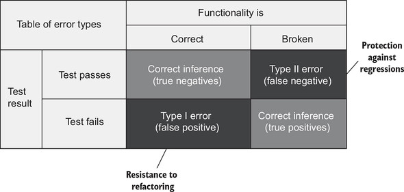
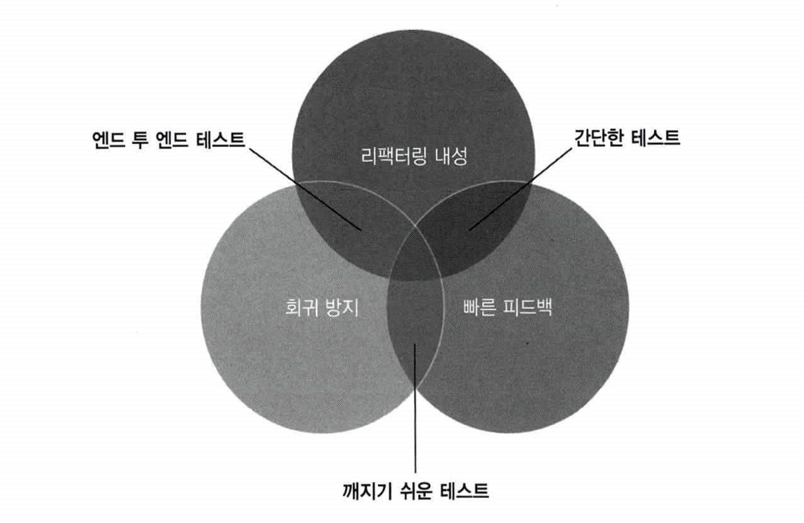
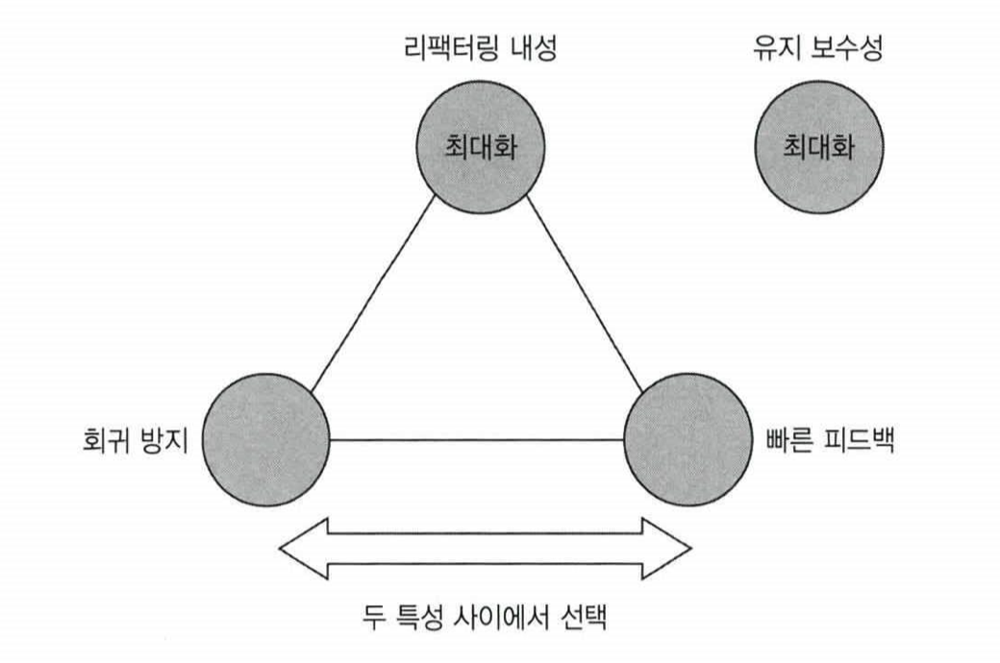

# CHAPTER 4. 좋은 단위 테스트의 4대 요소

**TL;DR**
- **회귀**: 소프트웨어 버그, 코드를 수정한 후 (일반적으로 새 기능을 출시한 후) 기능이 의도한 대로 작동하지 않는 경우
- **리팩터링**
  - 식별할 수 있는 동작을 수정하지 않고 기존 코드를 변경하는 것
  - 의도: 코드의 비기능적 특징 개선. 가독성을 높이고 복잡도를 낮추는 것
  - 리팩터링 내성을 높이는 방법: SUT 구현 세부 사항과 테스트 간의 결합도를 낮추는 것뿐
- **코드 정확도**와 **테스트 결과**
  - **참 음성**: True negatives. 기능이 의도 대로 작동할 떄, 테스트가 통과하도록 올바른 추론한 경우
  - **참 양성**: True positives. 기능이 제대로 작동하지 않을 때, 테스트가 실패하도록 올바른 추론한 경우 ← 단위 테스트의 핵심
  - **거짓 음성**: False negatives. 기능이 제대로 작동하지 않을 때, 테스트가 통과하도록 잘못된 추론한 경우
  - **거짓 양성**: False positives. 기능이 의도 대로 작동할 때, 테스트가 실패하도록 잘못된 추론한 경우 ← 허위 경보. 리팩터링 내성을 통해 방지 가능
- **정확도 지표**
  - $`테스트\ 정확도 = \frac{신호(발견된\ 버그\ 수)}{소음(허위\ 경보\ 발생\ 수)}`$
  - 테스트의 정확도를 높이는 방법: ① 신호를 증가시키거나, ② 소음을 줄이는 것
- 좋은 단위 테스트의 4대 특성: 아래 네 가지 특성의 곱
  - **회귀 방지** / **리팩터링 내성** / **빠른 피드백** / **유지 보수성**
  - 곱셈 법칙에 의해 어떤 특성이라도 `0`이 되면 전체가 `0`이 됨
- 좋은 단위 테스트의 특성 - **회귀 방지** / **리팩터링 내성** / **빠른 피드백** - 은 **상호 배타적**
  - **리팩터링 내성을 최대한 많이 갖는 것을 목표** + 테스트가 얼마나 버그를 잘 찾아내는지와 얼마나 빠른지 사이의 절충안
- 최소 필수값에 대해 상당히 높은 임계치를 설정하고 이 임계치를 충족하는 테스트만 테스트 스위트에 남겨라
- **테스트 피라미드**
  - 1층: 단위 테스트 > 2층: 통합 테스트 > 3층: 엔드 투 엔드 테스트
- 화이트박스 테스트 대신 **블랙박스 테스트를 기본적으로 선택**하라
  - **블랙박스 테스트**: 시스템의 내부 구조를 몰라도 시스템의 기능을 검사할 수 있는 소프트웨어 테스트 방법
  - **화이트박스 테스트**: 내부 작업 검증

<br/><br/>

---

<br/>

### 1. 좋은 테스트의 4대 요소

#### 1.1 회귀 방지

회귀: 소프트웨어 버그, 코드를 수정한 후 (일반적으로 새 기능을 출시한 후) 기능이 의도한 대로 작동하지 않는 경우

- 코드는 자산이 아니라 책임이며, 잠재적인 버그에 더 많이 노출됨 
- 회귀를 방지해야 프로젝트가 오래 성장할 수 있고 버그의 누적을 막을 수 있음

<br/>

**회귀 방지를 위해 고려할 점**
- 테스트 실행 코드의 양
- 코드 복잡도
  - 복잡한 비즈니스 로직을 나타내는 코드가 boilerplate 보다 훨씬 중요
  - 중요한 비즈니스 코드에서 발생한 코드가 가장 치명적
- 코드의 도메인 유의성
- 본인이 작성한 코드 외의 기반 코드
  - 가령 라이브러리, 프레임워크, 외부 시스템 등

회귀 방지 지표를 극대화하려면 테스트가 가능한 많은 코드를 실행하는 것을 목표로 해야함

<br/>

#### 1.2 리팩터링 내성

- 테스트를 실패로 바꾸지 않고 기본 애플리케이션 코드를 리팩터링할 수 있는지에 대한 척도

<pre>
<b>리팩터링</b>
: 식별할 수 있는 동작을 수정하지 않고 기존 코드를 변경하는 것
- 의도: 코드의 비기능적 특징 개선. 가독성을 높이고 복잡도를 낮추는 것,
ex. 메서드 이름을 바꾸는 것, 코드 조각을 새로운 클래스로 추출하는 것
</pre>

거짓 양성: false positive. 허위 경보. 실제로 기능이 의도한 대로 작동하지만 테스트는 실패를 나타냄

**거짓 양성의 영향**
- 단위 테스트의 목표: 프로젝트 성장을 지속 가능하게 하는 것

| 리팩터링 장점                                                                               | 거짓 양성의 단점                                                                                               |
|---------------------------------------------------------------------------------------|---------------------------------------------------------------------------------------------------------|
| - 기존 기능 고장 시 테스트가 조기 경고를 제공<br/>- 코드 변경 시 회귀에 대한 보장<br/>  - 확신이 없다면 리팩터링을 하는 데 주저하게 됨 | - 테스트가 타당한 이유 없이 실패하면, 코드 문제 대응 능력과 의지가 희석됨<br/>- 거짓 양성이 빈번하면 테스트 스위트에 대한 신뢰가 서서히 떨어짐<br/>  - 리팩터링이 줄어듬 |

<br/>

#### 1.3 무엇이 거짓 양성의 원인인가

- 거짓 양성의 가능성을 줄이는 방법은 해당 구현 세부 사항에서 테스트를 분리하는 것 뿐
- 테스트를 통해 SUT가 제공하는 최종 결과를 검증하는지 확인해야 함
- 테스트는 최종 사용자의 관점에서 SUT를 검증해야 하고 최종 사용자에게 의미 있는 결과만 확인해야 함

_코드 참고 - MessageRendererV1Test_


<br/>

#### 1.4 구현 세부 사항 대신 최종 결과를 목표로 하기

- 리팩터링 내성을 높이는 방법: SUT 구현 세부 사항과 테스트 간의 결합도를 낮추는 것뿐

<table>
<tr>
<td>


``` java
    @Test
    void Passed_MessageRenderer_uses_correct_sub_renderers() {
        var sut = new MessageRenderer();

        List<IRenderer> renderers = sut.SubRenderers;

        assert 3 == renderers.size();
        assert renderers.get(0) instanceof HeaderRenderer;
        assert renderers.get(1) instanceof BodyRenderer;
        assert renderers.get(2) instanceof FooterRenderer;
    }
```

- MessageRenderer 클래스에서 아주 작은 부분이라도 수정하면 실패
- 좋지 않은 테스트: '이 모든 단계가 올바른가?'

</td>
<td>

```java
    @Test
    void Passed_Rendering_a_message() {
        var sut = new MessageRenderer();
        var message = new Message(
            /* Header */ "h",
                /* Body */ "b",
                  /* Footer */ "f"
        );

        String html = sut.render(message);
        System.out.println(html);

        assert "<header>h</header><body>b</body><footer>f</footer>".equals(html);
    }
```

- 좋은 테스트: '최종 결과가 올바른가?'

</td>
</tr>
</table>

- 왼쪽 테스트: 구현 세부 사항이 아닌 SUT의 식별할 수 있는 동작과 결합 → 거짓 양성이 거의 발생하지 않음

<br/>

### 2. 첫 번째 특성과 두 번째 특성 간의 본질적인 관계

- 회귀 방지와 리팩터링 내성 사이에는 본질적인 관계가 있음


#### 2.1 테스트 정확도 극대화

코드 정확도와 테스트 결과에 대한 결과

<br/><br/>

_거짓 양성과 거짓 음성의 중요성_

- **참 음성**: True negatives. 기능이 의도한 대로 잘 작동하는 상황을 테스트가 통과하도록 올바른 추론한 경우
- **참 양성**: True positives. 기능이 제대로 작동하지 않는 상황을 테스트가 실패하도록 올바른 추론한 경우 ← 단위 테스트의 핵심
- **거짓 음성**: False negatives. 기능이 제대로 작동하지 않는 상황을 테스트가 통과하도록 잘못된 추론한 경우
- **거짓 양성**: False positives. 기능이 의도한 대로 잘 작동하는 상황을 실패하도록 잘못된 추론한 경우 ← 허위 경보. 리팩터링 내성을 통해 방지 가능

<br/>

**ex. 독감 검사**

- _긍정 판정: 독감 판정_
- _부정 판정: 독감이 아님을 판정_

<br/>

**정확도 지표**

- 테스트가 버그 존재를 얼마나 잘 나타내는가 (거짓 음성(회귀 방지 영역) 제외)
- 테스트가 버그 부재를 얼마나 잘 나타내는가 (거짓 양성(리팩터링 내성 영역) 제외)

$$테스트\ 정확도 = \frac{신호(발견된\ 버그\ 수)}{소음(허위\ 경보\ 발생\ 수)}$$

테스트의 정확도를 높이는 방법: ① 신호를 증가시키거나, ② 소음을 줄이는 것

<br/>

### 2.2 거짓 양성과 거짓 음성의 중요성: 역학 관계

단기적으로, <b>거짓 양성 _false positives_</b>은 <b>거짓 부정 _false negatives_</b>만큼 나쁘지 않음

- 잘못된 경고를 받는 것은 경고를 전혀 받지 않아 버그가 운영 환경에 들어갈 위험을 감수하는 것에 비해 별일 아님
- 단, 프로젝트가 커질수록 '거짓 양성'은 더 큰 영향을 미치게 됨

존재하지 않는 버그에 대해 경고를 계속 받으면
- 신뢰를 빠르게 잃고
- 신뢰할 수 있는 피드백의 자료로 여기지 않게 됨

<br/>

### 2.3 빠른 피드백과 유지 보수성

**빠른 피드백** 
- 단위 테스트의 필수 속성 
- 버그에 대해 경고하기 시작할 정도로 피드백 루프를 대폭 줄여서, 버그를 수정하는 비용을 거의 0까지 줄일 수 있음

**유지 보수성**
- 테스트가 얼마나 이해하기 어려운가
  - 테스트는 코드 라인이 적을수록 더 읽기 쉬움
  - 작은 테스트는 필요할 때 변경하는 것도 쉬움
- 얼마나 실행하기 어려운가
  - 외부 종송성으로 인한 시간 필요

<br/>

## 4. 이상적인 테스트

좋은 단위 테스트의 4대 특성: 아래 네 가지 특성의 곱

- 회귀 방지
- 리팩터링 내성
- 빠른 피드백
- 유지 보수성

_곱셈 법칙에 의해 어떤 특성이라도 0이 되면 전체가 0이 됨_

→ 모든 코드는 책임. 최소 필수값에 대해 상당히 높은 임계치를 설정하고 이 임계치를 충족하는 테스트만 테스트 스위트에 남겨라

<br/>

### 4.1 이상적인 테스트 

처음 세 가지 (회귀 방지 · 리팩터링 내성 · 빠른 피드백)는 상호 배타적: 셋 중 하나를 희생해야 나머지 둘을 최대로 할 수 있음


<br/><br/>

<br/>

### 4.2 극단적 예시 1: 엔드 투 엔드 테스트

엔드 투 엔드 테스트: 최종 사용자의 관점에서 시스템을 살펴봄

어떻게 구현이 동작하는지만 볼 수 있음

- 회귀 방지 👍🏻
- 거짓 양성에 면역 → 리팩터링 내성 👍🏻
- but, 느린 속도

<br/>

### 4.3 극단적 예시 2: 간단한 테스트

- 매우 빠르게 실행되고 빠른 피드백을 제공
- 거짓 양성이 생길 가능성이 상당히 낮음

<br/>

### 4.4 극단적 예시 3: 깨지기 쉬운 테스트

- 빠른 속도 👍🏻
- 회귀 방지 👍🏻
- but, 거짓 양성이 많은 테스트

**👉🏻 SUT의 내부 구현 세부 사항에 결합**

```csharp
public class UserRepository
{
    public User GetById(int id)
    {
        /* ... */
    }

    public string LastExecutedSqlStatement { get; set; }
}

[Fact]
public void GetById_executes_correct_SQL_code()
{
    var sut = new UserRepository();

    User user = sut.GetById(5);

    Assert.Equal(
        "SELECT * FROM dbo.[User] WHERE UserID = 5",
        sut.LastExecutedSqlStatement);
}
```

- `UserRepository` 클래스가 올바른 SQL문을 생성하는지 확인

아래 형태로 변형해도 결과는 모두 동일

```sql
SELECT * FROM dbo.[User] WHERE UserID = 5
SELECT * FROM dbo.User WHERE UserID = 5
SELECT UserID, Name, Email FROM dbo.[User] WHERE UserID = 5
SELECT * FROM dbo.[User] WHERE UserID = @UserID
```

<br/>

### 4.5 결론

좋은 단위 테스트의 처음 세 가지 특성은 상호 배타적

<br/>

✔️ 세 가지 특성 모두를 양보할 만큼 서로 조금씩 인정하는 것

But, **리팩터링 내성을 최대한 많이 갖는 것을 목표** + 테스트가 얼마나 버그를 잘 찾아내는지와 얼마나 빠른지 사이의 절충안

<br/><br/>

<br/>

## 5. 대중적인 테스트 자동화 개념

### 5.1 테스트 피라미드 분해 

<br/><br/>

<pre>
📌 <b>테스트 피라미드</b>

테스트 스위트에서 테스트 유형 간의 일정한 비율
👉🏻 단위 테스트 / 통합 테스트 / 엔드 투 엔드 테스트

Width: Test count. 테스트 수
Height: Emulating user. 사용자 액션 모방 
</pre>

- 단위 테스트 조차도 리팩터링 내성을 양보해서는 안됨
- 엔드 투 엔드 테스트는 빠른 피드백의 지표에서 점수가 낮기 때문에 테스트 수가 적어야 함


<br/>

### 5.2 블랙박스 테스트 vs 화이트박스 테스트 

- 블랙박스 테스트: 시스템의 내부 구조를 몰라도 시스템의 기능을 검사할 수 있는 소프트웨어 테스트 방법
  - 외부 명세에만 의존 → 많은 오류를 놓칠 수 있음
- 화이트박스 테스트: 내부 작업 검증
  - 테스트 대상 코드의 특정 구현과 결합되어 깨지기 쉬움
  - 거짓 양성을 만들고 리팩터링 내성 지표가 부족

화이트박스 테스트 대신 블랙박스 테스트를 기본으로 선택하라


<br/><br/>