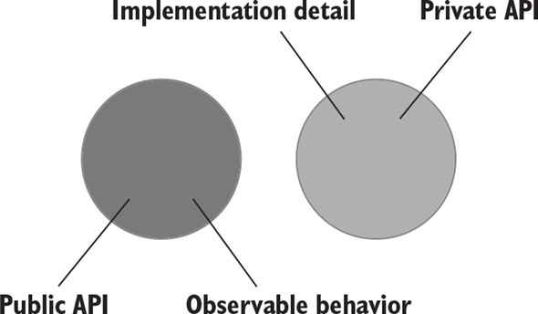
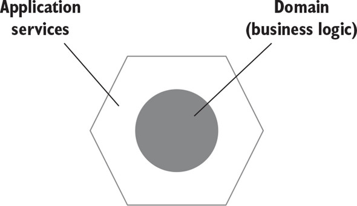
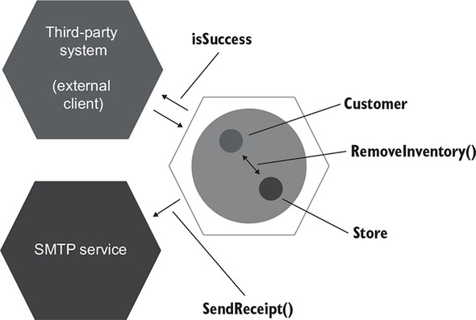

# CHAPTER 5. 목과 테스트 취약성

**TL;DR**
- **테스트 대역**: 모든 유형의 비운영용 가짜 의존성
  - **Mock**: 외부로 나가는 상호 작용을 모방하고 검사하는 데 도움
    - <b>mock</b> : 목 프레임워크의 도움과 함께 함
    - <b>spy</b> : 수동 작성. '직접 작성한 목 handwritten mocks'이라고도 함
  - **Stub**: 내부로 들어오는 상호 작용을 모방하는 데 도움
    - <b>dummy</b> : 널이 값이나 가짜 문자열과 같이 단순하고 하드코딩된 값
    - <b>stub</b> : dummy 보다 정교, 시나리오마다 다른 값을 반환하게끔 구성할 수 있도록 필요한 것을 다 갖춘 완전한 의존성
    - <b>fake</b> : 대다수의 목적에 부합하는 스텁과 같지만, 생성의 차이. 페이크는 보통 아직 존재하지 않는 의존성을 대체하고자 구현
 
- **도구로서의 Mock**: mock(테스트 대역)이나 stub을 만드는 데 사용할 수 있는 Mock Library 클래스
- **CQS 원칙**: _Command Query Separation_. 모든 메서드는 명령이거나 조회
  - **명령**: 사이드 이펙트를 일으키고 어떤 값도 반환하지 않는 메서드(void 반환)
    - 명령을 대체하는 테스트 대역 👉🏻 목
  - **조회**: 사이드 이펙트가 없고 값을 반환
    - 조회를 대체하는 테스트 대역 👉🏻 스텁
- **육각형 아키텍처**
  - Domain: 애플리케이션의 중심부
  - Application: 애플리케이션의 필수 기능, 비즈니스 로직 포함
- **육각형 아키텍처의 주요 관점 세 가지**
  1. **도메인과 애플리케이션 서비스 계층 간의 관심사 분리**
      - 도메인 계층의 관심사: 오직 비즈니스 로직에 대한 책임
      - 애플리케이션 서비스 계층의 관심사: 도메인 계층과 외부 애플리케이션 간의 작업 조정
  2. **애플리케이션 내부 통신**
      - 애플리케이션 서비스 계층에서 도메인 계층으로 흐르는 단방향 의존성 흐름
  3. **애플리케이션 간의 통신**
      - 애플리케이션 서비스 계층이 유지하는 공통 인터페이스를 통해 연결, 도메인 계층에 직접 접근 불가
- **애플리케이션의 통신**
  - **시스템 내부** _inter-system_ **통신**
      - 애플리케이션 내 클래스 간의 통신 / 구현 세부 사항 / 도메인 클래스 간의 협력
      - 테스트가 inter-system 통신과 결합되면 취약해짐
  - **시스템 간** _intra-system_ **통신**
      - 다른 애플리케이션과의 통신 / 시스템 내 식별할 수 있는 동작
      - 목을 사용하면 시스템과 외부 애플리케이션 간의 통신 패턴을 확인할 때 좋음

<br/><br/>

---

<br/>

## 1. 목과 스텁 구분

<br/>

### 1.1 테스트 대역 유형

<br/>

> **Test Doubles**
> 
> overarching term that describes all kinds of non-production-ready, fake dependencies in tests
>
> _테스트 대역: 모든 유형의 비운영용 가짜 의존성_

- dummy, stub, spy, mock, fake (더미, 스팀, 스파이, 목, 페이크)

#### 테스트 대역

<table>
<tr>
<td></td>
<td>목 mock</td>
<td>스텁 stub</td>
</tr>
<tr>
<td>종류</td>
<td>
✔️ <b>mock</b> : 목 프레임워크의 도움 <br/>
✔️ <b>spy</b> : 수동 작성. '직접 작성한 목handwriten mock'이라고 함
</td>
<td>
✔️ <b>dummy</b> : 널이 값이나 가짜 문자열과 같이 단순하고 하드코딩된 값. SUT의 메서드 시그니처를 만족시키기 위해 사용하고 최종 결과를 만드는 데 영향을 주지 않음<br/>
✔️ <b>stub</b> : dummy 보다 정교. 시나리오마다 다른 값을 반환하게끔 구성할 수 있도록 필요한 것을 다 갖춘 완전한 의존성<br/>
✔️ <b>fake</b> : 대다수의 목적에 부합하는 스텁과 같지만, 생성의 차이. 페이크는 보통 아직 존재하지 않는 의존성을 대체하고자 구현<br/>
</td>
</tr>
<tr>
<th>차이</th>
<td>
✔️ 외부로 나가는 상호 작용을 모방하고 검사<br/>
✔️ SUT와 관련 의존성 간의 상호 작용을 모방하고 검사
</td>
<td>
✔️ 내부로 들어오는 상호 작용을 모방<br/>
✔️ SUT와 관련 의존성 간의 상호 작용을 모방만 함
</td>
</tr>
<tr>
<th>특징</th>
<td>
✔️ SUT가 상태를 변경하기 위한 의존성을 호출하는 것에 해당
</td>
<td>
✔️ SUT가 입력 데이터를 얻기 위한 의존성을 호출하는 것에 해당 
</td>
</tr>
<tr>
<th>Ex</th>
<td>
✔️ 테스트 대상 시스템 -- [이메일 발송 (Mock)] --> SMTP 서버
</td>
<td>
✔️ 테스트 대상 시스템 <-- [데이터 검색 (Stub)] -- 데이터베이스 
</td>
</tr>
</table>

<br/>

### 1.2 도구로서의 목과 테스트 대역으로서의 목

- **목의 의미**: 테스트 대역의 목 & 목 라이브러리

- 도구로서의 목을 사용해 목과 스텁, 이 두가지 유형의 테스트 대역을 생성할 수 있음
  - **도구로서의 목**과 **테스트 대역으로서의 목**을 혼동하지 않는 것이 중요
  - (모든 모킹을 위한 라이브러리가 목 라이브러리라고 하니, Mock이라고 되어 있어도 테스트 대역 목이 아니며, 다른 테스트 대역(스텁)이 될 수 있다)

<br/>

- 목 라이브러리(Moq)에 있는 Mock 클래스를 사용 -> '클래스'는 테스트 대역(목)을 만들 수 있는 도구
  - `Mock Class`: **도구로서의 목** / `클래스 인스턴스 mock`은 **테스트 대역으로서의 목**

<table>
<tr>
<td>

```csharp
[Fact]
public void Sending_a_greetings_email()
{
    var mock = new Mock<IEmailGateway>();      1
    var sut = new Controller(mock.Object);

    sut.GreetUser("user@email.com");

    mock.Verify(                               2
        x => x.SendGreetingsEmail(             2
            "user@email.com"),                 2
        Times.Once);                           2
}
```

1: Mock(도구)으로 mock(목) 생성

2: 테스트 대역으로 하는 SUT의 호출을 검사

</td><td>

```csharp
[Fact]
public void Creating_a_report()
{
    var stub = new Mock<IDatabase>();         1
    stub.Setup(x => x.GetNumberOfUsers())     2
        .Returns(10);                         2
    var sut = new Controller(stub.Object);

    Report report = sut.CreateReport();

    Assert.Equal(10, report.NumberOfUsers);
}
```

1: Mock(도구)으로 stub(스텁) 생성

2: 준비한 응답 설정

</td>
</tr>
<tr>
<td>외부로 나가는 상호 작용, 목적: 사이드 이펙트를 일이키는 것 (이메일 발송)</td>
<td>내부로 들어오는 상호 작용, 즉 SUT에 입력 데이터를 제공하는 호출 모방</td>
</tr>
</table>

<br/>

### 1.3 스텁으로 상호 작용을 검증하지 마라

- **Mock**: SUT에서 관련 의존성으로 나가는 상호 작용을 모방하고 검사
- **Stub**: 내부로 들어오는 상호 작용만 모방하고 검사하지 않음

  - 스텁은 SUT가 출력을 생성하도록 입력을 제공
  - 스텁과의 상호 작용을 검증하지 마라 → 취약한 테스트를 야기하는 **안티 패턴**

<small>테스트에서 거짓 양성을 피하고 리팩터링 내성을 향상시키는 방법 -> 세부 사항이 아니라 최종 결과 검증</small>

<br/>

### 목과 스텁 함께 쓰기

<br/>

### 목과 스텁은 명령과 조회에 어떻게 관련돼 있는가?

- **CQS 원칙**: Command Query Separation. 모든 메서드는 명령이거나 조회. 이 둘을 혼용해서는 안 됨.

✔️ **명령**: 사이드 이펙트를 일으키고 어떤 값도 반환하지 않는 메서드(void 반환)

- 명령을 대체하는 테스트 대역 👉🏻 목

✔️ **조회**: 사이드 이펙트가 없고 값을 반환

- 조회를 대체하는 테스트 대역 👉🏻 스텁

<br/>

**특징**

- 메서드가 사이드 이펙트를 일으키면 해당 메서드의 반환 타입이 `void`인지 확인하라 
  - 예외 ex. stack.pop()
- 메서드가 값을 반환하면 사이드 이펙트가 없어야 함 
  - 사이드 이펙트 예: 객체 상태 변경, 파일 시스템 내 파일 변경 등 
- 시그니처만 봐도 메서드가 무엇을 하는지 알 수 있음

<br/>

<table>
<tr><th>Mock</th><th>Stub</th></tr>
<tr><td>

```csharp
var mock = new Mock<IEmailGateway>();
mock.Verify(x => x.SendGreetingsEmail("user@email.com"));
```

</td><td>

```csharp
var stub = new Mock<IDatabase>();
stub.Setup(x => x.GetNumberOfUsers()).Returns(10);
```

</td>
<tr>
<td>

- `SendGreetingsEmail()`은 이메일을 보내는 **사이드 이펙트가 있는 명령**
- 명령을 대체하는 테스트 대역이 **목**

</td>
<td>

- `GetNumberOfUsers()`는 값을 반환하고 데이터베이스 **상태를 변경하지 않는 조회**
- 테스트 대역은 스텁

</td>
</tr>
</table>

<br/>

## 2. 식별할 수 있는 동작과 구현 세부 사항

테스트는 '어떻게'가 아니라 '무엇에' 중점을 둬야 함

<br/>

### 2.1 식별할 수 있는 동작 != API

제품 코드는 2차원으로 분류: 각 차원의 범주는 겹치지 않음

<br/><br/>

- 공개 API or 비공개 API
- 식별할 수 있는 동작 or 구현 세부 사항

<br/>

- 식별할 수 있는 동작?
    - 클라이언트가 목표를 달성하는 데 도움이 되는 연산 operation을 노출하라.
    - 클라이언트가 목표를 달성하는 데 도움이 되는 상태 state를 노출하라.

구현 세부 사항을 노출하면 불변성 위반을 가져옴.

<br/>

## 3. 목과 테스트 취약성 간의 관계

### 3.1 육각형 아키텍처의 정의

<br/><br/><br/>

- Domain: 애플리케이션의 중심부
- Application: 애플리케이션의 필수 기능, 비즈니스 로직 포함

<br/>

**육각형 아키텍처의 주요 관점 세 가지**

1. 도메인과 애플리케이션 서비스 계층 간의 관심사 분리
    - _The separation of concerns between the domain and application services layers_
    - 도메인 계층의 관심사: 오직 비즈니스 로직에 대한 책임
    - 애플리케이션 서비스 계층의 관심사: 도메인 계층과 외부 애플리케이션 간의 작업 조정
    - 육각형: 애플리케이션 서비스 계층과 도메인 계층의 조합, 애플리케이션을 나타냄. 다른 애플리케이션과 소통할 수 있음
    - 도메인 계층을 애플리케이션의 도메인 지식(사용 방법) 모음으로, 애플리케이션 서비스 계층을 일련의 비즈니스 유스케이스(사용 대상)로 볼 수 있음
2. 애플리케이션 내부 통신
    - _Communications inside your application_
    - 도메인 계층은 외부 환경에서 완전히 격리
    - 애플리케이션 서비스 계층에서 도메인 계층으로 흐르는 단방향 의존성 흐름
3. 애플리케이션 간의 통신
    - _Communications between applications_
    - 도메인 계층에 직접 접근 불가
    - 애플리케이션 서비스 계층이 유지하는 공통 인터페이스를 통해 연결

설계된 AP의 원칙에는 프랙탈 fractal 특성 - 전체 계층만큼 크게도, 단일 클래스만큼 작게도 똑같이 적용

<br/>

### 3.2 시스템 내부 통신과 시스템 간 통신

**애플리케이션의 통신**

- 시스템 내부 _inter-system_ 통신
  - 애플리케이션 내 클래스 간의 통신
  - 구현 세부 사항
  - 도메인 클래스 간의 협력 - 즉, 테스트가 이와 결합되면 취약해짐
- 시스템 간 _intra-system_ 통신
  - 시스템 간 통신은 애플리케이션이 다른 애플리케이션과 통신
  - 시스템 내 식별할 수 있는 동작을 나타냄 (애플리케이션에 항상 있어야 하는 계약)
  - 목을 사용하면 시스템과 외부 애플리케이션 간의 통신 패턴을 확인할 때 좋음

<br/>

### 3.3 시스템 내부 통신과 시스템 간 통신의 예

```csharp
public class CustomerController {
    public bool Purchase(int customerId, int productId, int quantity) {
        Customer customer = customerRepository.GetById(customerId);
        Product product = productRepository.GetById(productId);

        bool isSuccess = customer.Purchase(mainStore, product, quantity);

        if (isSuccess) {
            emailGateway.SendReceipt(customer.Email, product.Name, quantity);
        }

        return isSuccess;
    }
}
```

<br/><br/>

- **시스템 간 통신**: CustomerController 애플리케이션 서비스와 두 개의 외부 시스템 - Third-party system (유스케이스를 시작하는 클라이언트이기도 함) & Email Gateway - 간의 통신
- **시스템 내부 통신**: customer와 store 도메인 클래스 간의 통신

<br/>

### 4.1 모든 프로세스 외부 의존성을 목으로 해야 하는 것은 아니다

<small>(2장 리마인드)</small>

- **공유 의존성**: _Shared dependency_. 테스트 간에 공유하는 의존성. 제품 코드 x
- **프로세스 외부 의존성**: _Out-of-process dependency_. 프로그램의 실행 프로세스 외에 다른 프로세스를 점유하는 의존성
  - ex. Database, Message bus, SMTP service 등
- **비공개 의존성**: _Private dependency_. 공유하지 않는 모든 의존성

<br/>

고전파에서는 공유 의존성을 피할 것을 권고
- 테스트가 실행 컨텍스트를 서로 방해 하고, 결국 병렬 처리를 할 수 없기 때문
- 테스트 격리: 테스트를 병렬적, 순차적 또는 임의의 순서로 실행할 수 있는 것

만약 공유 의존성이 프로세스 밖에 있는 것이 아니면, 각각의 테스트 실행 내에서 새로운 인스턴스를 제공하면 되기 때문에 재사용을 피하기 쉬워진다.

<small>(If a shared dependency is not out-of-process, then it’s easy to avoid reusing it in tests by providing a new instance of it on each test run.)</small>


공유 의존성이 프로세스 외부에 있으면, 테스트가 더 복잡해짐

- 각 테스트 실행 전, 데이터베이스를 인스턴스화하거나 메시지 버스를 새로 준비할 수가 없기 때문
- 이렇게 하면 테스트 스위트가 현저히 느려질 것

👉🏻일반적인 접근법은 이러한 의존성을 테스트 대역, 즉 목과 스텁으로 교체하는 것

<br/>

### 4.2 목을 사용한 동작 검증

- Mock을 이용해 동작 검증을 할 수 있다는 말은 대부분 사실이 아님 
  - Mock(목표를 달성하고자 각 개별 클래스가 이웃 클래스와 소통하는 방식)은 '식별할 수 있는 동작 (구현 세부 사항)'과는 아무런 관계가 없음. 
- 목을 통한 동작 검증의 경우
  - 애플리케이션의 경계를 넘나드는 상호 작용을 검증할 때
  - 혹은, 위 경우, 상호 작용의 사이드 이펙트가 외부 환경에서 보일 때

<br/><br/>
