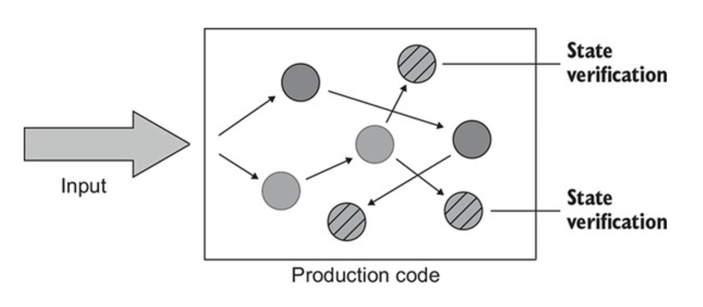
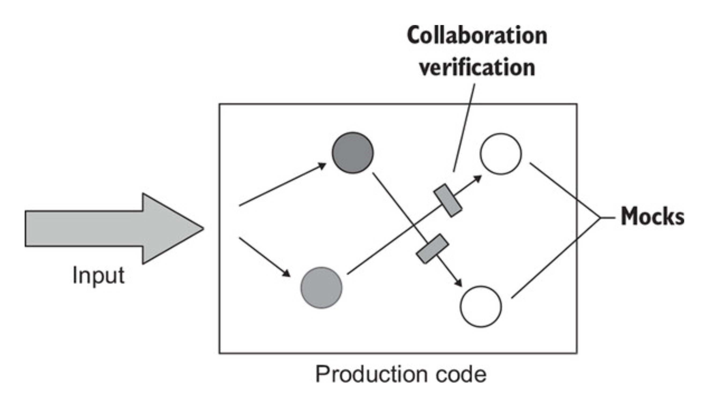
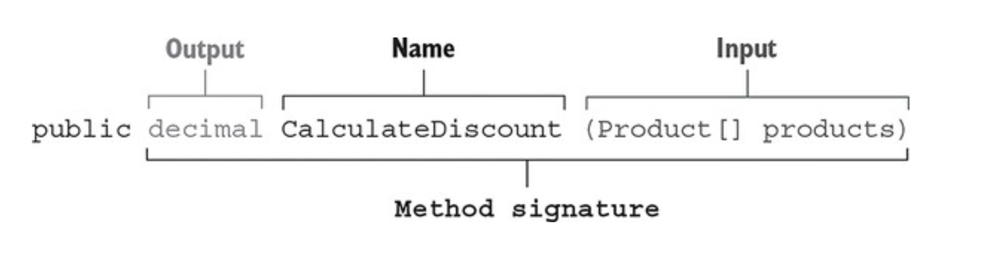
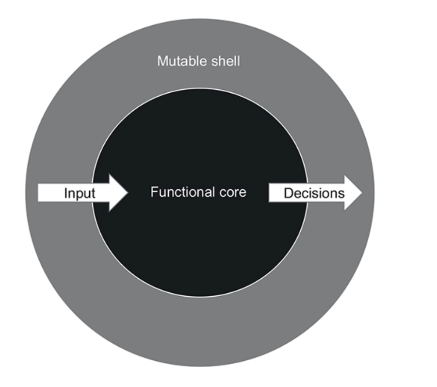
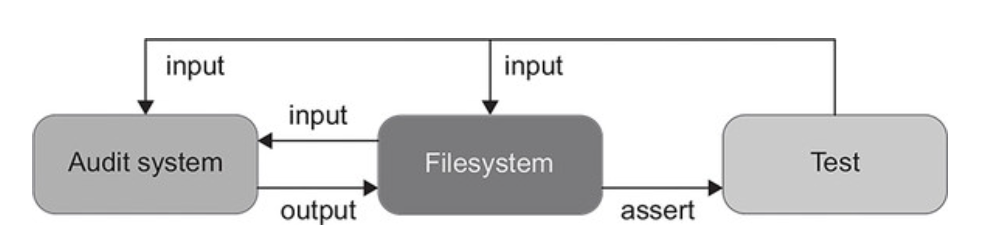
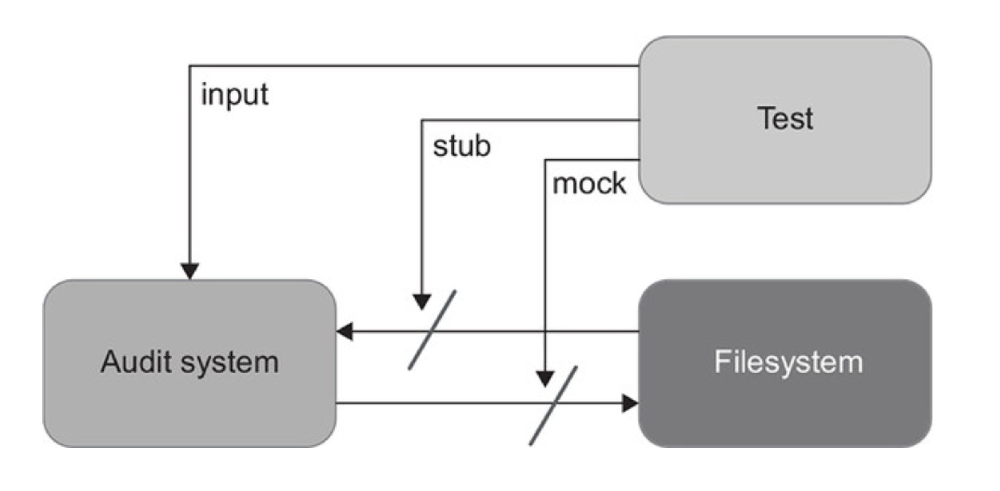

# CHAPTER 6. 단위 테스트 스타일

**TL;DR**

- **출력 기반 테스트** _Output-based testing_: SUT에 입력을 주고 **출력을 확인**
  - 테스트 품질이 가장 좋음
    - 구현 세부 사항에 거의 결합되지 않음 → 리팩터링 내성 ↑
    - 작고 간결 → 유지 보수하기 쉬움
- **상태 기반 테스트** _State-based testing_: **작업 완료 후의 시스템 상태를 확인**
  - 안정성을 위해 주의해서 채택해야 함 (비공개 상태를 노출하지 않도록 해야 함)
  - 크기가 큰 편이므로 유지 보수가 쉽지 않음
- **통신 기반 테스트** _Communication-based testing_: Mock을 통해 **테스트 대상 시스템과 협력자 간의 통신 검증**
  - 애플리케이션 경계를 넘어서 **외부 환경에 사이드 이펙트가 보이는 통신에서만** 사용
- **'출력 vs. 상태 vs. 통신' 비교** → 항상 **출력 기반**을 선호하라
  - 리팩터링 내성 위험 : **출력 기반** < 상태 기반 ≈ 통신 기반
  - 유지비 : **출력 기반** < 상태 기반 < 통신 기반
- **고전파 vs 런던파** : 두 분파 모두 출력 기반 테스트를 사용
  - 고전파: 통신 기반 스타일보다 **상태 기반 스타일** 선호
  - 런던파: 상태 기반 스타일보다 **통신 기반 스타일** 선호
- **함수형 프로그래밍**: mathematical function (pure function).
  - 모든 입출력은 메서드 이름, 인수, 반환 타입으로 구성된 메서드 시그니처 _method sighature_ 에 명시해야 함
  - 명시적이기 때문에 테스트 용이성 높임: 숨은 입력과 숨은 출력 완화
    - **숨은 출력**: 사이드 이펙트, 예외
    - **숨은 입력**: 내부 상태 또는 외부 상태에 대한 참조
  - 함수형 아키텍처는 사이드 이펙트를 비즈니스 연산의 가장자리로 밀어내 분리를 이루는 데 도움이 됨
- **함수형 프로그래밍의 목표**: 비즈니스 로직과 사이드 이펙트를 분리하는 것
  - **결정을 내리는 코드** = **functional core** (함수형 코어)
    - Side Effect가 없기 때문에 Mathematical Function을 작성할 수 있음
  - **해당 결정에 작용하는 코드** = **mutable shell** (가변 셸)
    - 입력 데이터를 함수형 코어에 공급, 코어가 내린 결정을 사이드 이펙트로 변환
- **함수형 아키텍처 vs 육각형 아키텍처** : Side Effect 처리
    - **함수형 아키텍처**: 모든 사이드 이펙트를 도메인 계층 밖으로 밀어냄
    - **육각형 아키텍처**: 도메인 계층에 제한하는 하기 때문에, 도메인 계층으로 인한 부작용도 문제 없음
- 함수형 방식에서 순수성에 많은 비용이 든다면 순수성을 따르지 마라
    - **항상 시스템의 복잡도와 중요성을 고려해 함수형 아키텍처를 전략적으로 적용**하라

<br/><br/>

---

<br/>

## 1. 단위 테스트의 세 가지 스타일

목표: 함수형 프로그래밍이 출력 기반 테스트와 어떻게 관련돼 있는지 이해할 수 있는 것

<table>
<tr>
<th> 출력 기반 테스트 <br/><small>Output-based testing</small></th>
<th> 상태 기반 테스트 <br/><small>State-based testing</small></th>
<th> 통신 기반 테스트 <br/><small>Communication-based testing</small></th>
</tr>
<tr>
<td>
&#x3A; 테스트 입력 후 <b>반환하는 출력을 검증</b>

<br/><br/>

- 전역 상태나 내부 상태를 변경하지 않는 코드에만 적용되므로 반환 값만 검증하면 됨
- 사이드 이펙트가 없고 SUT 작업 결과는 호출자에게 반환하는 값뿐
- 함수형 프로그래밍 functional programming 기반

</td>
<td>
&#x3A; 작업 완료 후 <b>시스템 상태 확인</b>

<br/><br/>

빗금이 그려진 원이 최종 상태

- 상태: SUT 협력자 중 하나, 또는 데이터베이스나 파일 시스템 등과 같은 프로세스 외부 의존성의 상태 등

</td>
<td>

&#x3A; Mock을 사용해 <b>테스트 대상 시스템과 협력자 간의 통신 검증</b>

<br/><br/>

- SUT 협력자를 목으로 대체하고 SUT가 협력자를 올바르게 호출하는지 검증

</td>
</tr>

<tr>
<td>

```csharp
//  상품 수에 1%를 곱하고 결과를 20%로 제한
public class PriceEngine {
    public decimal CalculateDiscount(params Product[] products) {
        decimal discount = products.Length * 0.01m;
        return Math.Min(discount, 0.2m);
    }
}

[Fact]
public void Discount_of_two_products() {
    var product1 = new Product("Hand wash");
    var product2 = new Product("Shampoo");
    var sut = new PriceEngine();

    decimal discount = sut.CalculateDiscount(product1, product2);

    Assert.Equal(0.02m, discount);
}
```

</td>
<td>

```csharp
public class Order {
    private readonly List<Product> _products = new List<Product>();
    public IReadOnlyList<Product> Products => _products.ToList();

    // AddProduct()의 결과는 주문 상태의 변경
    public void AddProduct(Product product) {
        _products.Add(product);
    }
}

[Fact]
public void Adding_a_product_to_an_order() {
    var product = new Product("Hand wash");
    var sut = new Order();

    sut.AddProduct(product);

    Assert.Equal(1, sut.Products.Count);
    Assert.Equal(product, sut.Products[0]);
}
```

</td>
<td>

```csharp
[Fact]
public void Sending_a_greetings_email() {
    var emailGatewayMock = new Mock<IEmailGateway>();
    var sut = new Controller(emailGatewayMock.Object);

    sut.GreetUser("user@email.com");

    emailGatewayMock.Verify(
        x => x.SendGreetingsEmail("user@email.com"),
        Times.Once);
}
```

Controller 와 IEmailGateway 사이의 (SendGreetingsEmail) 를 통한 협력 검증

</td>
</tr>
</table>

<br/>

## 2. 단위 테스트 스타일 비교

> <b>좋은 단위 테스트의 4대 요소</b> <br/>
> : 회귀 방지 / 리팩터링 내성 / 빠른 피드백 / 유지 보수성

<br/>

### ✔️ ≪회귀 방지 지표≫ 로 스타일 비교

- **회귀 방지 지표**를 결정하는 세 가지 특성
  - **테스트 중 실행되는 코드의 양** _amount of code executed during the test_
  - **코드 복잡도** _code’s complexity_
  - **도메인 유의성** _domain significance_
- 보통 위 세 특성에 대해, 어떤 스타일도 딱히 이점은 없음
- 예외: Communication-based style
  - 작은 부분의 코드 조각만을 검증하고, 모두 목을 사용하는 등 의미없는 _shallow_ 테스트가 될 수 있음
  - 다만, 모든 Communication-based style 를 단정짓는 특징이 아니라, 극단적인 케이스를 말하는 것
  - (not definitive feature, but rather is extreme case)

참고: 번역에서 말하는 '피상적인 테스트'는 shallowness를 의역. 얕은 의미의 테스트로, 역자는 이를 피상적, 즉 형식적인 테스트라고 번역

<br/>

### ✔️ ≪피드백 속도 지표≫ 로 스타일 비교

- 테스트 스타일과 테스트 피드백 속도 사이에는 상관관계가 거의 없음
  - 거의 모든 스타일이 테스트 실행 속도가 거의 동일

<br/>

### ✔️ ≪리팩터링 내성 지표≫ 로 스타일 비교

> 리패터링 내성: 리팩터링 중에 발생하는 거짓 양성(허위 경보) 수에 대한 척도

- 거짓 양성은 코드의 구현 세부 사항에 결합된 테스트의 결과

| <b>출력 기반 테스트 <br/><small>Output-based testing</small></b> | <b>상태 기반 테스트 <br/><small>State-based testing</small></b>                                                              | <b> 통신 기반 테스트 <br/><small>Communication-based testing</small></b>                                                                                               |
| ---------------------------------------------------------------- | ---------------------------------------------------------------------------------------------------------------------------- | ---------------------------------------------------------------------------------------------------------------------------------------------------------------------- |
| 대상 메서드에만 결합<br/>👉🏻 거짓 양성에 우수                     | 일반적으로 거짓 양성이 되기 쉬움<br/>상태 기반 테스트는 큰 API 노출 영역에 의존<br/>👉🏻 구현 세부 사항과 결합할 가능성도 높음 | 허위 경보에 가장 취약<br/>- 스텁과 상호 작용하는 경우를 나타냄 👉🏻상호작용 테스트 X<br/>- 애플리케이션 외부와의 상호 작용에 부작용이 보이는 경우에만 Mock을 사용할만 함 |

<br/>

### ✔️ ≪유지 보수성 지표≫ 로 스타일 비교하기

단위 테스트 유지비를 측정

- 테스트를 이해하기 얼마나 어려운가 👉🏻 테스트 사이즈
  - 테스트가 크면, 코드를 파악하기도 변경하기도 어려움 -> 유지 보수 어려움
- 테스트를 실행하기 얼마나 어려운가 👉🏻 테스트가 얼마나 많은 외부 의존성과 직접적으로 의존되는지
  - 외부 의존성은 외부 리소스 운영에 시간이 필요하기 때문에 유지보수 어려움

<br/>

<table>
<tr>
<th> 출력 기반 테스트 <br/><small>Output-based testing</small></th>
<th> 상태 기반 테스트 <br/><small>State-based testing</small></th>
<th> 통신 기반 테스트 <br/><small>Communication-based testing</small></th>
</tr>
<tr>
<td>

- 가장 유지 보수하기 용이
- 거의 항상 짧고 간결해서 유지보수하기 용이
- 외부 의존성을 거의 다루지 않음: 전역 상태나 내부 상태 변경이 없기 때문

</td>
<td>

- 상태 검증은 종종 출력 검증보다 더 많은 공간을 차지해서 유지보수가 출력보다 까다로움

```csharp
[Fact]
public void Adding_a_comment_to_an_article() {
    var sut = new Article();
    var text = "Comment text";
    var author = "John Doe";
    var now = new DateTime(2019, 4, 1);

    sut.AddComment(text, author, now);

    Assert.Equal(1, sut.Comments.Count);              ①
    Assert.Equal(text, sut.Comments[0].Text);         ①
    Assert.Equal(author, sut.Comments[0].Author);     ①
    Assert.Equal(now, sut.Comments[0].DateCreated);   ①
}
```

<small>글에 댓글 추가 기능 확인 테스트</small>

① : 글 상태 검증

- 단순한 테스트임에도 검증에 4줄이 필요
- 종종 검증문 라이브러리의 도움을 받을 수 있음
- 제한: 값 객체를 반환할 수 있을 때만 사용 가능

```csharp
sut.ShouldContainNumberOfComments(1).WithComment(text, author, now);
```

혹은

```csharp
sut.Comments.Should().BeEquivalentTo(comment);
```

</td>
<td>
유지 보수성 지표에서 가장 낮음

- 테스트 대역과 상호 작용 검증을 설정해야 하며, 공간을 많이 차지함
- mock chain
  (mocks or stubs returning other mocks, which also return mocks, and so on, several layers deep)

</td>
</tr>
</table>

<br/>

### 2.4 스타일 비교: 결론

|                    | <b>출력 기반 테스트 <br/><small>Output-based testing</small></b> | <b>상태 기반 테스트 <br/><small>State-based testing</small></b> | <b> 통신 기반 테스트 <br/><small>Communication-based testing</small></b> |
| ------------------ | ---------------------------------------------------------------- | --------------------------------------------------------------- | ------------------------------------------------------------------------ |
| 리팩터링 내성 위험 | 낮음                                                             | 중간                                                            | 중간                                                                     |
| 유지비             | 낮음                                                             | 중간                                                            | 높음                                                                     |

항상 출력 기반 테스트를 선호하라

<br/>

## 3. 함수형 아키텍처 이해

함수형 프로그래밍

- 스콧 블라신: https://fsharpforfunandprofit.com/books/

<br/>

### 3.1 함수형 프로그래밍이란?

함수형 프로그래밍: mathematical function (pure function) 을 사용한 프로그래밍

- 모든 입출력은 메서드 이름, 인수, 반환 타입으로 구성된 메서드 시그니처 _method sighature_ 에 명시해야 함

```csharp
public decimal CalculateDiscount(Product[] products) {
    decimal discount = products.Length * 0.01m;
    return Math.Min(discount, 0.2m);
}
```

위 메서드의 시그니처: 하나의 입력 + 하나의 출력

<br/><br/>

**메소드 시그니처를 통해 입출력을 명시할 때 장점**: 유지 보수성이 뛰어나고 거짓 양성 빈도가 낮음

**메소드 시그니처를 통해 입출력을 명시하지 않았을 때**:

- **Side effects**: 시그니처에 표시되지 않은 숨어있는 출력으로, 연산은 인스턴스의 상태를 변경할 때 Side Effect를 야기할 수 있음
- **Exceptions**: 메소드가 Exception 을 던질 때, 메소드의 시그니처에 설계된 계약(Contract) 을 우회 _bypass_ 하는 프로그램의 흐름을 만들어내기 때문에 시그니처에 명시하지 않은 output을 소개 추가
- **A reference to an internal or external state**: `DateTime.Now` 와 같은 정적 속성을 사용하는 현재 시간을 얻을 수 있음. 데이터베이스나 private mutable field 를 참조할 수 있음. 이 것들은 메소드 시그니처에 명시되지 않은 동작을 제공하는 숨어있는 input 임

<br/>

- 메소드의 pure function 여부를 판별하기 위해서는 ≪프로그램의 동작을 변경하지 않고 해당 메서드에 대한 호출을 반환 값으로 대체할 수 있는지 확인하는 것≫.
- **참조 투명성**: _referential transparency_. 메서드 호출을 특정 값으로 바꾸는 것.

```csharp
public Comment AddComment(string text) {
    var comment = new Comment(text);
    _comments.Add(comment);            // Side Effect
     return comment;
}
```

<br/>

### 3.2 함수형 아키텍처란?

**함수형 프로그래밍의 목표**

&#x3A; 부작용을 완전히 제거하는 것이 아니라 **business logic**과 **side effects** 코드를 분리하는 것

- **결정을 내리는 코드** _Code that makes a decision_:
  - Side Effect가 없기 때문에 Mathematical Function을 작성할 수 있음
  - = **functional core** (함수형 코어)
  - = immutable core (불변 코어)
- **해당 결정에 작용하는 코드** _Code that acts upon that decision_:
  - 모든 결정을 데이터베이스의 변경이나 메시지 버스에 의해 변환됨
  - = **mutable shell** (가변 셸)

<br/><br/>

<br/>

- **함수형 코어**와 **가변 셸**의 협력
  - 가변 셸은 모든 입력을 수집
  - 함수형 코어는 결정을 생성
  - 셸은 결정을 Side Effect 로 변환

<br/>

- 가변 셸이 의사 결정을 추가하지 않게 끔 결정을 나타내는 클래스에 정보가 충분히 있는지 확인
- 목표: 출력 기반 테스트로 함수형 코어를 두루 다루고 가변 셸을 훨씬 더 적은 수의 통합 테스트에 맡기는 것

<br/>

> Object-oriented programming makes code **understandable by encapsulating moving parts**.
> Functional programming makes code understandable by minimizing moving parts.
>
> 함수형 프로그래밍은 작동 부분을 최소화해 코드를 이해할 수 있게 한다.
> 객체지향 프로그래밍은 작동 부분을 캡슐화해 코드를 이해할 수 있게 한다.

불변 클래스를 사용하면 변경할 수 없는 것을 처음부터 변형할 수 없으므로 상태 변질에 대해 걱정할 필요가 없다.
결과적으로 함수형 프로그래밍에서 캡슐화할 필요가 없으며, 인스턴스를 만들 때 클래스의 상태를 한 번만 확인하면 됨

<br/>

### 3.3 함수형 아키텍처 vs 육각형 아키텍처

**유사점**

- 육각형 아키텍처에서 도메인 계층내 클래스는 서로에게만 의존해야 함
- 의존성 간의 단방향 흐름: 도메인 계층 내 클래스는 서로에게만 의존해야 함

**차이점**

- Side Effect 처리
  - 함수형 아키텍처: 모든 부작용을 불변 코어에서 비즈니스 연산 (가변 셸이 처리하는) 가장자리로 밀어냄
  - 육각형 아키텍처: 도메인 계층에 제한하는 한, 도메인 계층으로 인한 부작용도 문제 없음

<br/>

## 6.4 함수형 아키텍처와 출력 기반 테스트로의 전환

- 프로세스 외부 의존성에서 Mock으로 변경
- Mock에서 함수형 아키텍처로 변경

<br/>

### 4.1 감사 시스템 소개

- 샘플 프로젝트는 조직의 모든 방문자를 추적하는 감사 시스템

<br/><br/>

- 표시된 구조로 텍스트 파일을 기반 저장소로 사용
- 이 시스템은 가장 최근 파일의 마지막 줄에 방문자의 이름과 방문시간을 추가
- 파일 당 최대 항목 수에 도달하면 인덱스를 증가시켜 새 파일을 작성

<br/>

**AuditManager Version 1**

- 파일 시스템과 밀접하게 연결 → 병목 지점: 파일 시스템
- 테스트 전에 파일을 올바른 위치에 배치하고, 테스트가 끝나면 해당 파일을 읽고 내용을 확인한 후 삭제해야 함

<br/><br/>

|               | 초기버전 |
| ------------- | -------- |
| 회귀방지      | 좋음     |
| 리팩터링 내성 | 좋음     |
| 빠른 피드백   | 나쁨     |
| 유지보수성    | 나쁨     |

<br/>

### 4.2 테스트를 파일 시스템에서 분리하기 위한 Mock 사용

테스트가 밀접하게 결합된 문제는 일반적으로 파일 시스템을 목으로 처리해 해결

<br/><br/>

**AuditManager Version 2**

이제 Audithanager가 파일 시스템에서 분리되므로, 공유 의존성이 사라지고 테스트를 서로 독립적으로 실행할 수 있음

```java
public class AuditManagerTest {

   @Test
   public void newFileIsCreatedWhenTheCurrentFileOverflows() {
       IFileSystem fileSystemMock = mock(IFileSystem.class);                // ①
       fileSystemMock.getFiles("audits").thenReturn(new String[] {          // ①
               "audits/audit_1.txt",                                        // ①
               "audits/audit_2.txt"                                         // ①
       });                                                                  // ①
       fileSystemMock.readAllLines("audits/audit_2.txt")                    // ①
                .thenReturn(Arrays.asList(                                  // ①
                    "Peter;2019-04-06T16:30:00",                            // ①
                    "Jane;2019-04-06T16:40:00",                             // ①
                    "Jack;2019-04-06T17:00:00"                              // ①
                ));


       AuditManager sut = new AuditManager(3, "audits", fileSystemMock);
       sut.addRecord("Alice", LocalDateTime.parse("2019-04-06T18:00:00"));

       verify(fileSystemMock).writeAllText(                                 // ②
               "audits/audit_3.txt",                                        // ②
               "Alice;2019-04-06T18:00:00");                                // ②
   }
}
```

① File System → Audit System - Stub
② Audit System → File System - Mocking

- 목을 사용하기 적절한 유스케이스
- 파일 시스템에 접근하지 않기 때문에 더 빨리 실행됨

|               | Initial version | With mocks |
| ------------- | --------------- | ---------- |
| 회귀방지      | Good            | Good       |
| 리팩터링 내성 | Good            | Good       |
| 빠른 피드백   | Bad             | Good       |
| 유지보수성    | Bad             | Moderate   |

<br/>

### 4.3 함수형 아키텍처로 리팩터링

**AuditManager Version 3**

- AuditManager는 **디렉터리 경로** 대신 **FileContent 배열을 받음**
- 파일 시스템에 대해 알아야 할 모든 것을 포함
- 작업 디랙터리에서 내용을 읽고 AuditManager 에서 받은 업데이트 명령을 작업 디렉터리에 다시 수행하기만 하면 됨
- 복잡도는 AuditManager 에서만 존재

<br/>

✔️ Hexagonal Architecture (육각형 아키텍처)에서 **함수형 코어**와 **가변 셸**이 협력하기 위해선,
Application Service로 외부 클라이언트를 위한 시스템의 진입점을 제공해야 함

<br/>

| Hexagonal                 | Audit System                  |
| ------------------------- | ----------------------------- |
| Domain Model Layer        | AuditManager                  |
| Application Service Layer | ApplicationService, Persister |

<br/>

```csharp
[Fact]
public void A_new_file_is_created_when_the_current_file_overflows() {
    var sut = new AuditManager(3);
    var files = new FileContent[] {
        new FileContent("audit_1.txt", new string[0]),
        new FileContent("audit_2.txt", new string[] {
            "Peter; 2019-04-06T16:30:00",
            "Jane; 2019-04-06T16:40:00",
            "Jack; 2019-04-06T17:00:00"
        })
    };

    FileUpdate update = sut.AddRecord(
        files, "Alice", DateTime.Parse("2019-04-06T18:00:00"));

    Assert.Equal("audit_3.txt", update.FileName);
    Assert.Equal("Alice;2019-04-06T18:00:00", update.NewContent);
}
```

피드백 속도 향상 뿐 아니라, 유지 보수성 지표도 향상됨

|               | Initial version | With mocks | With mocks |
| ------------- | --------------- | ---------- | ---------- |
| 회귀방지      | Good            | Good       | Good       |
| 리팩터링 내성 | Good            | Good       | Good       |
| 빠른 피드백   | Bad             | Good       | Good       |
| 유지보수성    | Bad             | Moderate   | Good       |

<br/>

### 4.4 예상되는 추가 개발

추가적인 기능이 필요하게 되어도 함수형 아키텍처를 사용하면 메서드 시그니처에 단순히 명시함하여 확장할 수 있음

<br/>

## 5. 함수형 아키텍처의 단점 이해하기

### 5.1 함수형 아키텍처 적용 가능성

<pre lang="java">
public FileUpdate AddRecord(
    FileContent[] files, string visitorName,
    DateTime timeOfVisit, <b>IDatabase database</b>
)
</pre>

- IDatabase 라는 숨은 입력이 생길 수 있음

**두 가지 해결책**

- `Application Service` 전면에서 디렉터리 내용과 더불어 방문자 접근 레벨을 수집
  - 특징: AuditManager에 모든 의사결정 있음 - 비즈니스 로직과 외부 시스템과의 통신을 완전히 분리
  - 단점: 성능 저하 - 접근 레벨 필요 없어도 DB에 계속 질의
- `AuditManager`에 `IsAccessLevelCheckRequired()` 와 같은 메서드 생성. AddRecord() 호출 전 호출하고, true일 때 DB 접근 레벨을 가져온 후 `AddRecord()`에 전달
  - 특징: 성능을 위해 분리를 다소 완화
  - 단점: DB 호출의 결정 AuditManager 가 아닌 ApplicationService로 이동

✔️ 함수형 코어의 클래스는 협력자로 작동하면 안 되고, 작업의 결과인 값으로 작동해야 함

<br/>

### 5.3 코드베이스 크기 증가

- 항상 시스템의 복잡도와 중요성을 고려해 함수형 아키텍처를 전략적으로 적용하라
- 함수형 방식에서 순수성에 많은 비용이 든다면 순수성을 따르지 마라

<br/><br/>
