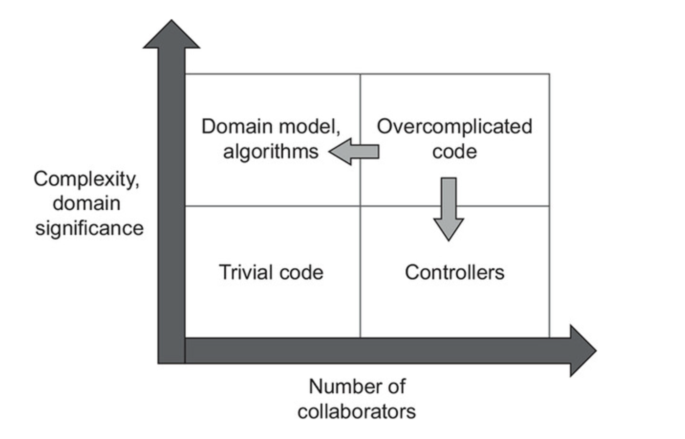
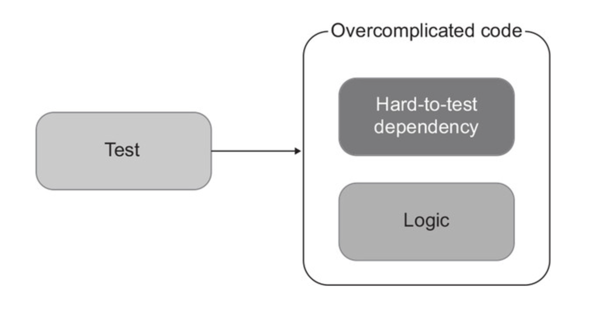
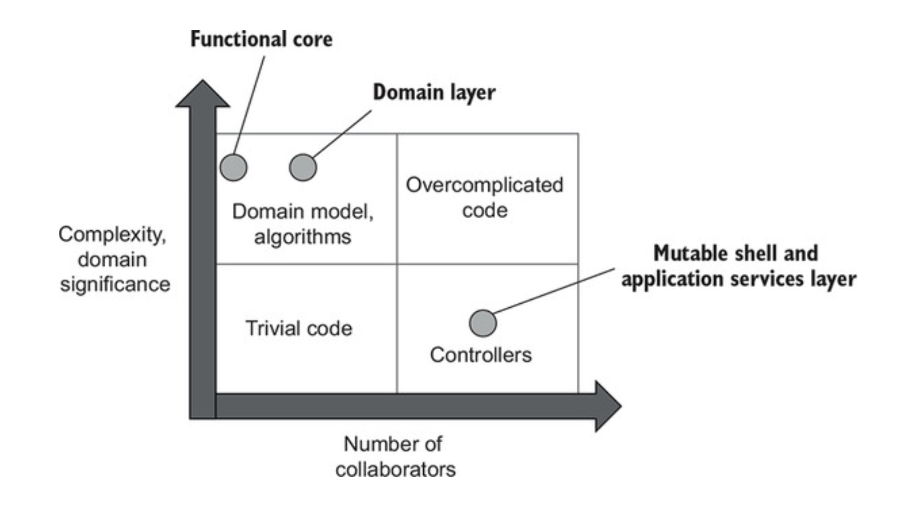
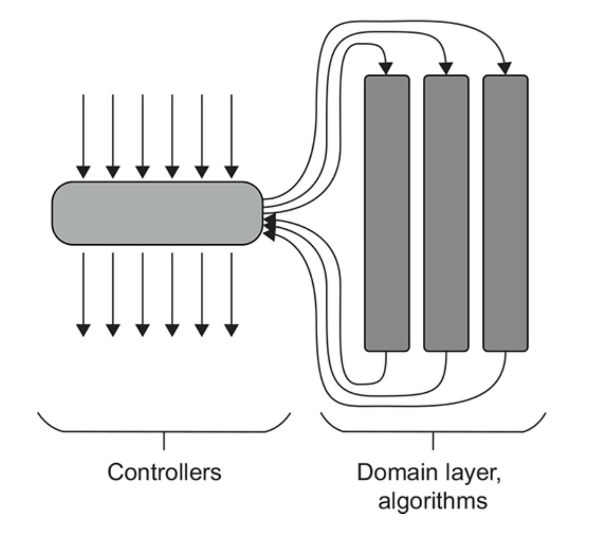
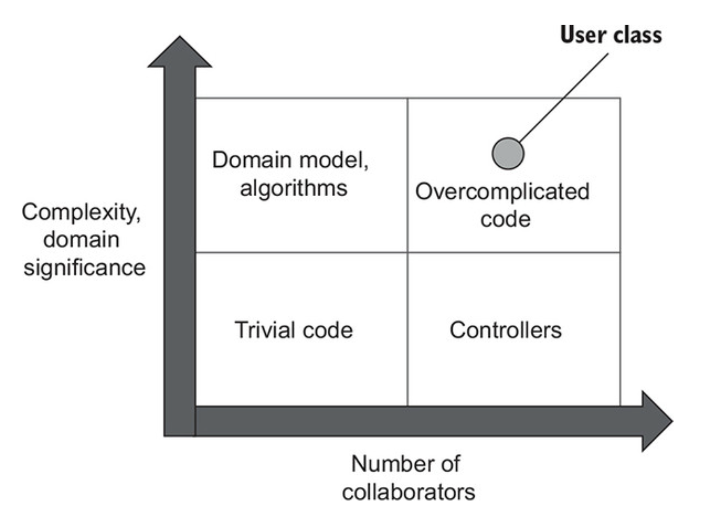
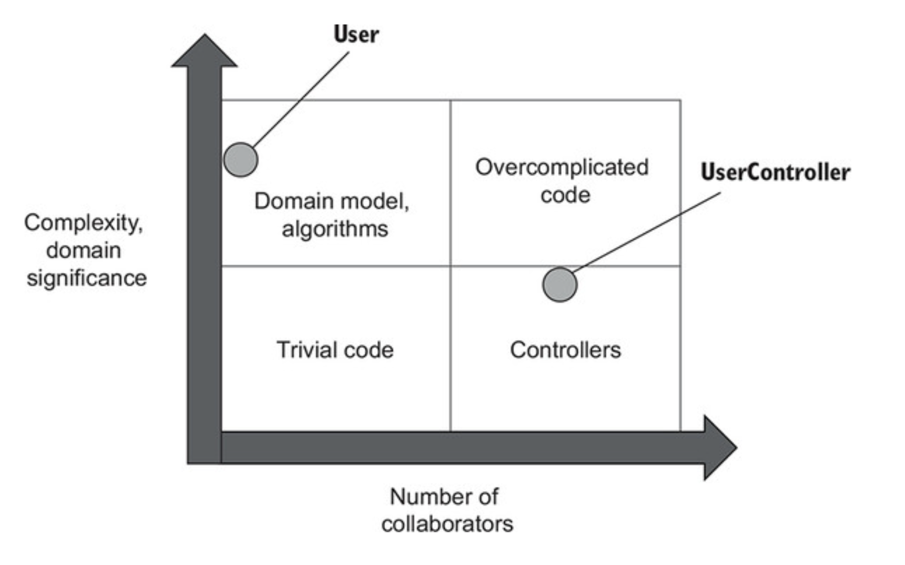
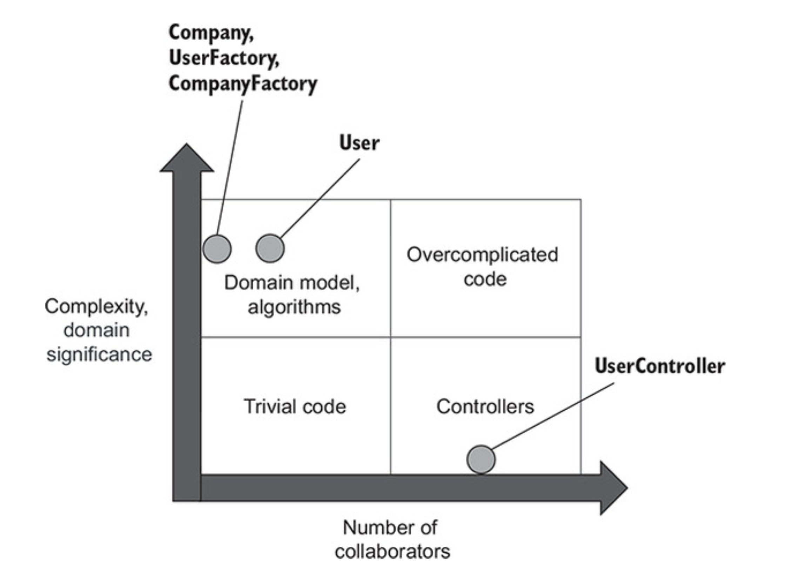
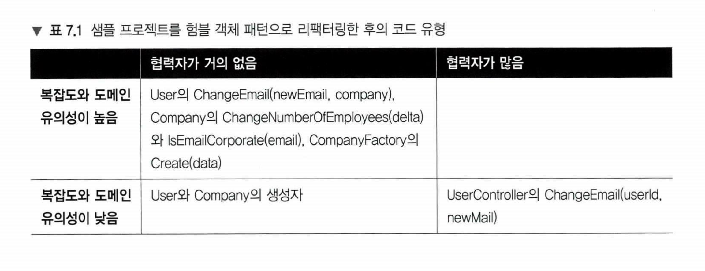
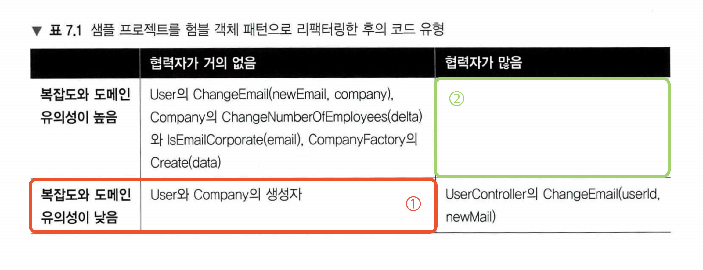

# CHAPTER 7. 가치 있는 단위 테스트를 위한 리팩터링


**TL;DR**

- **코드 복잡도**: 코드에서 의사 결정 지점 수에 따라 명시적으로(코드) 그리고 암시적으로(코드가 사용하는 라이브러리) 정의
- **도메인 유의성**: 프로젝트의 문제 도메인에 대해 코드가 얼마나 중요한지를 줌
  - 복잡한 코드는 종종 도메인 유의성이 높고 그 반대의 경우도 있음
- **복잡한 코드**와 **도메인 유의성**을 갖는 코드는 해당 테스트의 회귀 방지가 뛰어나기 때문에 단위 테스트에서 가장 이로움
- 협력자가 많은 코드를 다루는 단위 테스트는 유지비가 많이 듦
  - 협력자를 예상 상태로 만들고 나서 상태나 상호 작용을 확인하고자 공간을 많이 필요로 함
- 복잡도 또는 도메인 유의성과 협력자 수에 따른 네 가지 유형의 코드
  - <table style="text-align: center;">
      <tr><td></td><td colspan="2"><b>협력자 수</b><br/></td></tr>
      <tr>
          <td rowspan="2"><b>복잡도 및 도메인 유의성</b></td>
          <td><b>도메인 모델 및 알고리즘</b><br/>- 단위 테스트<br/>- 복잡도 또는 도메인 유의성이 높음<br/>- 협력자가 거의 없음</td>
          <td><b>지나치게 복잡한 코드</b><br/>- 테스트 X<br/>- 복잡도 또는 도메인 유의성이 높음<br/>- 협력자가 많음</td>
      </tr>
      <tr>
          <td><b>간단한 코드</b><br/>- 테스트 X<br/>- 복잡도와 도메인 유의성이 낮음: 테스트 가치 전혀 없음<br/>- 협력자가 거의 없음</td>
          <td><b>컨트롤러</b><br/>- 통합 테스트<br/>- 복잡하며 비즈니스에 중요한 작업은 아님<br/>- 협력자가 많음<br/></td>
      </tr>
    </table>
- 코드가 중요하거나 복잡할수록 협력자가 적어야 한다.
- **험블 객체 패턴** _Humble Object Pattern_
  - **코드에서 비즈니스 로직을 별도의 클래스로 추출**: 지나치게 복잡한 코드에서 로직을 추출해 코드를 테스트할 필요가 없도록 간단하게 만듦
  - **험블 래퍼** _Humble Wrapper_: 비즈니스 로직에서 분리한 나머지 코드 (컨트롤러)
- **육각형 아키텍처**와 **함수형 아키텍처**는 험블 객체 패턴을 구현
  - **육각형 아키텍처**: 비즈니스 로직과 프로세스 외부 의존성과의 통신을 분리
  - **함수형 아키텍처**: 프로세스 외부 의존성뿐만 아니라 모든 협력자와의 통신과 비즈니스 로직을 분리
- **코드의 깊이와 너비**: 코드는 깊을 수도 있고(복잡하거나 중요함), 넓을 수도 있지만(협력자가 많음), 둘 다는 아님
  - 도메인 유의성이 있으면 전제 조건을 테스트하고, 그 외의 경우에는 테스트하지 않음
- 비즈니스 로직과 오케스트레이션을 분리할 때의 세 가지 중요한 특성
  1. **도메인 모델 테스트 유의성**: 도메인 클래스 내 협력자 수와 유형에 대한 함수
  2. **컨트롤러 단순성**: 컨트롤러에 의사 결정 지점이 있는지에 따라 다름
  3. **성능**: 프로세스 외부 의존성에 대한 호출 수로 정의
- 항상 세 가지 특성 중 최대 두 가지를 가질 수 있음
  1. **외부에 대한 모든 읽기와 쓰기를 비즈니스 연산 가장자리로 밀어내기** : 컨트롤러를 단순하게 유지하고 도메인 모델 데스트 유의성을 지키지만, 성능이 저하된다.
  2. **도메인 모델에 프로세스 외부 의존성을 주입하기**: 성능을 유지하고 컨트롤러를 단순 하게 하지만, 도메인 모델의 테스트 유의성이 떨어진다.
  3. **의사 결정 프로세스 단계를 더 세분화하기**: 성능과 도메인 모델 테스트 유의성을 지 키지만, 컨트롤러의 단순함을 포기한다.
-  컨트롤러 복잡도 증가를 완화할 수 있는 **두 가지 패턴**
  1. **CanExecute/Execute 패턴**
     - `Do()` 전에 `canDo()`를 호출하여 컨트롤러의 의사 결정을 제거
     - 도메인 이벤트는 도메인 모델의 중요한 변경 사항을 추적하고 해당 변경 사항을 프로세스 외부 의존성에 대한 호출로 변환함
     - 이 패턴으로 컨트롤러에서 추적에 대한 책임이 없어짐
  2. **도메인 이벤트**
     - 구현 관점에서, <b>외부 시스템에 통보하는 데 필요한 데이터가 포함된 클래스</b>
     - 프로세스 외부 의존성 호출 위의 추상화
     - 도메인 클래스의 변경은 데이터 저장소의 향후 수정에 대한 추상화에 해당
- 추상화할 것을 테스트하기보다는 추상화를 테스트하는 것이 더 쉬움

<br/><br/>

---

<br/>

## 1. 리팩터링할 코드 식별

### 1.1 코드의 네 가지 유형

- **코드 복잡도** _code complexity_ 는 코드 내 의사 결정(분기) 지점 수로 정의
- 숫자가 클수록 복잡도는 더 높아짐

<br/>

<pre><b>✔️ <b>순환 복잡도 계산법</b>
<b>순환 복잡도</b> <i>cyclomatic complexity</i>: 컴퓨터 과학에서 코드 복잡도를 설명하는 용어

- 주어진 프로그램 또는 메서드의 분기 수
- 메서드에서 시작부터 끝으로 가는 데 독립적인 경로의 수 또는 100% 분기 커버리지를 얻는 데 필요한 테스트의 수
<pre>
1 + &lt;number of branching points&gt;
</pre>

>>>>>>> b6826f7 (Add summing Chapter 07 until 7.2.3)
- `if` 나 조건부 루프와 같은 <b>제어 흐름문이 없는 메서드</b>는 순환 복잡도가 <b>1 + 0 = 1</b>
- 분기점 수는 관련된 가장 간단한 조건(predicate) 수로 계산

Example.
`IF 조건1 AND 조건2 THEN` = `IF 조건1 THEN IF 조건2 THEN`
👉🏻 <b>1 + 2 = 3</b> </pre>

<br/>

**도메인 유의성** _domain significance_

&#x3A; 코드가 프로젝트의 문제 도메인으로써의 의미 지표

- 보통 도메인 계층 코드는 도메인 유의성이 높고, 유틸리티 코드는 그런 연관성이 없음
- **복잡한 코드**와 **도메인 유의성을 갖는 코드** → 해당 테스트가 회귀 방지에 뛰어나기 때문에 단위 테스트의 의미가 큼
- 이 두 요소는 서로 독립적: 가령, 주문 가격을 계산하는 메서드에 조건문이 없다면 순환 복잡도는 `1`

<br/>

**협력자 Controllers**

- **협력자의 수**
  - 많을수록 테스트도 커짐
  - 협력자를 예상되는 조건으로 두고 상태나 상호 작용을 확인하게끔 코드를 작성해야 함
- **유형**
  - 도메인 모델이라면 프로세스 외부 협력자를 사용하면 됨
  - 테스트에서 Mock 체계가 복잡하기 때문에 유지비가 더 든다.
  - 또한 리팩터링 내성을 잘 지키려면 아주 신중하게 목을 사용해야 하는데, 애플리케이션 경계를 넘는 상호 작용을 검증 하는 데만 사용해야 함 (5장 참조)

<br/>

**네 가지 코드 유형**

- **도메인 모델과 알고리즘**: 보통 복잡한 코드 / 복잡한 알고리즘
  - 해당 코드의 단위 테스트가 가장 가치 있고 저렴
  - 복잡하거나 중요한 로직을 수행해서 테스트의 회귀 방지가 향상되기 때문
  - 코드에 협력자가 거의 없어서 (이상적으로는 전혀 없음) 테스트 유지 비용을 낮추기 때문
- **간단한 코드**: 협력자가 있는 경우, 복잡도, 도메인 유의성이 거의 없음 (ex. 기본 생성자와 속성 등)
  - 테스트 필요 전혀 없음
- **컨트롤러**: 도메인 클래스와 외부 애플리케이션 같은 다른 구성 요소의 작업 조정. 복잡하거나 비즈니스에 중요한 작업은 아님.
  - 포팔적인 동합 테스트의 일부로서 간단히 테스트 해야 함
- **지나치게 복잡한 코드**: 협력자가 많으며 복잡하거나 중요. (ex. 덩치가 큰 컨트롤러: 복잡한 작업을 위임하지 않고 스스로 하는 컨트롤러)
  - 단위 테스트가 어려움 + 테스트없는 것은 너무 위험
  - 가장 문제가 되는 코드 유형: 단위 테스트로 어려움을 겪는 주요 원인 중 하나

<br/><br/><br/>

<pre>
✔️ 코드가 더 중요해지거나 복잡해질수록 협력자는 더 적어야 한다.
✔️ 좋지 않은 테스트를 작성하는 것보다는 테스트를 전혀 작성하지 않는 편이 낫다.
</pre>

<br/>

- **목표**: 지나치게 복잡한 코드를 피하고, **도메인 모델과 알고리즘**만 단위 테스트
  - 매우 가치 있고 유지 보수가 쉬움
  - 다른 테스트를 리팩터링 하거나 제거하라 테스트 스위트의 크기를 부풀리지 말라.

<br/>

### 1.2 험블 객체 패턴을 사용해 지나치게 복잡한 코드 분할하기

**험블 객체 패턴** _Humble Object Pattern_: 지나치게 복잡한 코드를 쪼개기 위한 도구

<small>Gerard Meszaros가 「xUnit Test Patterns(Addison-Wesley, 2007)⌟ 에서 코드 결합 해결 방법으로 소개</small>

<br/><br/><br/>

테스트 대상 코드의 로직을 테스트하려면, 테스트가 가능한 부분을 추출해야 함

👉🏻 **험블 래퍼** _Humble Wrapper_

- **험블 객체 패턴은 지나치게 복잡한 코드에서 로직을 추출해** 코드를 테스트할 필요가 없도록 간단하게 만듦
- 추출된 로직은 테스트하기 어려운 의존성에서 분리된 다른 클래스로 이동

<br/>

✔️ **육각형 아키텍처**와 **함수형 아키텍처** 가 정확히 이 패턴을 구현

- **육각형 아키텍처**: 비즈니스 로직과 외부 의존성과의 통신 분리. 도메인 계층 / 애플리케이션 서비스 계층이 각각 담당.
- **함수형 아키텍처**: 프로세스 외부 의존성뿐만 아니라 모든 협력자와의 커뮤니케어션에서 비즈니스 로직을 분리
  - 함수형 코어: 협력자 없음 + 모든 의존성 불변

<br/><br/><br/>

- **'Domain model, algorithms' (quadrant 2)**

  - 협력자가 거의 없고 복잡도와 도메인 유의성이 높음
  - **Functional core** (functional architecture, 협력자가 없기 때문에 세로축에 더 가까움)
  - **Domain layer** (hexagonal architecture)

- **'Controllers' (quadrant 4)**
  - Mutable shell (functional architecture)
  - Application services layer (hexagonal architecture)

<br/>

- **단일 책임 원칙** _Single Responsbility principle_
  - 험블 객체 패턴을 보는 또 다른 방법
  - 각 클래스가 단일한 책임만 가져야 한다는 원칙
- 비즈니스 로직을 거의 모든 것과 분리할 수 있음
- Example.
  - 비즈니스 로직 / 오케스트레이션 orchestration 분리
  - **MVP** (Model-View-Presenter) / **MVC** (Model-View-Controller) 패턴
  - **도메인 주도 설계** *Domain-Diven Design*의 **집계 패턴** _Aggregate pattern_

<br/>

✔️ #1. **비즈니스 로직**과 **오케스트레이션** 책임 간 분리

- 코드의 깊이와 코드의 너비 관점에서 이 두 가지 책임
- 컨트롤러는 많은 의존성을 조정하지만 복잡하지 않음 + 도메인은 그 반대

<br/><br/>

- 코드의 깊이: 복잡하거나 중요함
- 코드의 너비: 많은 협력자와 작동함

<br/>

✔️ #2. **MVP** *Model-View-Presenter*와 **MVC** _Model-View-Controller_ 패턴

- 비즈니스 로직 (Model), UI 관심사 (View), 모델과 뷰 사이의 조정 (Presenter 혹은 Controller)을 분리하는 데 도움이 됨

<br/>

✔️ 3. **도메인 주도 설계** _Domain-Diven Design_ 의 **집계 패턴** _Aggregate pattern_

- 클래스를 클러스터(집계)로 묶어서 클래스 간 연결을 줄이는 것
  - 클래스는 해당 클러스터 내부에 강결합돼 있지만, 클러스터 자체는 느슨하게 결합
  - 코드베이스의 총 통신 수를 줄임

<br />

## 2. 가치있는 단위 테스트를 위한 리팩터링

### 2.1 고객 관리 시스템 소개

**고객 관리 시스템 CAM, CustomerManagement System**
- 사용자 등록을 처리
- 모든 사용자가 데이터 베이스에 저장

세 가지 비즈니스 규칙

- 사용자 이메일이 회사 도메인에 속한 경우 해당 사용자는 직원으로 표시
  - 그렇지 않으면 고객으로 간주
- 시스템은 회사의 직원 수를 추적해야 한다. 사용자 유형이 직원에서 고객으로, 또는 그 반대로 변경되면 이 숫자도 변경해야 한다.
- 이메일이 변경되면 시스템은 메시지 버스로 메시지를 보내 외부 시스템에 알려야 함

<br/>

**Version 1.** Initial implementation of the CRM system

1. 데이터 베이스에서 사용자의 현재 이메일과 유형 검색
2. 데이터베이스에서 조직의 도메인 이름과 직원 수 검색
3. 새 이메일의 도메인 이름에 따라 사용자 유형 설정
4. 필요한 경우 조직의 직원 수 업데이트
5. 데이터베이스에 사용자 저장
6. 메시지 버스에 알림 전송

<br/><br/><br/>

- **복잡도 및 도메인 유의성** 측면
  - 애플리케이션의 핵심 비즈니스로직. 복잡도와 도메인 유의성 측면에서 점수가 높음
- **협력자 수** 측면
  - user 클래스에는 각각 두 개의 명시적, 암시적 의존성이 존재
  - **명시적 의존성**: `userId`, `newEmail`.
    - 값 👉🏻 클래스의 협력자 수에는 포함되지 않음
  - **암시적 의존성**: `Database`, `MessageBus`.
    - 프로세스 외부 협력자 👉🏻협력자 의존이 높음

따라서, **지나치게 복잡한 코드** _Overcomplicated code_ 에 해당

<br/>

**활성 레코드 패턴** _Active Record Pattern_
: 도메인 클래스가 스스로 데이터베이스를 검색하고 다시 저장하는 이러한 방식

- 단순한 프로젝트나 단기 프로젝트에서는 잘 작동하지만 코드베이스가 커지면 확장하지 못하는 경우가 많음
- **비즈니스 로직**과 **프로세스 외부 의존성과의 통신** 사이에 **분리가 없기 때문**

<br/>

### STEP 1. 암시적 의존성을 명시적으로 만들기

테스트 용이성을 개선하는 일반적인 방법은 암시적 의존성을 명시적으로 만드는 것

- 도메인 모델은 외부 시스템과의 통신을 책임지지 않아야 함

<br/>

### STEP 2. 애플리케이션 서비스 계층 도입

- **험블 컨트롤러** _humble controller_(육각형 아키텍처 분류상 애플리케이션 서비스)로 책임 이동
  - 도메인 모델이 외부 시스템과의 통신을 책임짐

**Version 2.** Application service, version 1

```java
public class UserController {
    
    // ① 프로세스 외부 의존성(Database와 MessageBus)이 직접 인스턴스화
    private final Database database = new Database();
    private final MessageBus messageBus = new MessageBus();

    public void changeEmail(int userId, String newEmail) throws Exception {
        Object[] data = database.getUserById(userId);
        String email = (String)data[1];
        UserType type = (UserType)data[2];
        
        // ② 컨트롤러가 데이터베이스 데이터를 User 인스턴스화
        User user = new User(userId, email, type);
        
        Object[] companyData = database.getCompany();
        String companyDomainName = (String) companyData[0];
        int numberOfEmployees = (int) companyData[1];

        // ③ 회사 직원수는 특정 사용자와 관련이 없음
        int newNumberOfEmployees = user.changeEmail(newEmail, companyDomainName, numberOfEmployees);

        // ④ 새로운 이메일이 전과 다른지 여부와 관계없이, 무조건 데이터를 수정해서 저장하고 메시지 버스에 알림을 보냄
        database.saveCompany(newNumberOfEmployees);
        database.saveUser(user);

        messageBus.sendEmailChangedMessage(userId, newEmail);
    }
}

```

외부 의존성과의 작업을 줄임, 하지만 아래의 문제점이 발생

<pre>
① 프로세스 외부 의존성(Database와 MessageBus)이 직접 인스턴스화 👉🏻 통합 테스트에서 문제가 될 것
② 컨트롤러가 데이터베이스 데이터를 User 인스턴스화
③ 회사 직원수는 특정 사용자와 관련이 없음
④ 컨트롤러는 새로운 이메일이 전과 다른지 여부와 관계없이, 무조건 데이터를 수정해서 저장하고 메시지 버스에 알림을 보낸다.
</pre>

- user 클래스는 더 이상 프로세스 외부 의존성과 통신할 필요가 없으므로 테스트하기가 매우 쉬워짐
- 실제로 프로세스 외부든 내부든 어떤 협력자도 없다. userel Changeemail 메 서드의 새로운 버전을 보면 다음과 같다.

<br/><br/><br/>

- User: 도메인 모델 사분면으로 들어와서 수직 축에 가까이 있게 됨
- UserController: 복잡한 로직이 있기 때문에 지나치게 복잡한 코드 사분면의 경계에 걸쳐 있음

<br/>

### STEP 3. 애플리케이션 서비스 복잡도 낮추기

**Version 3. UserFactory - 유틸리티 코드의 예**

- 다소 복잡하지만 도메인 유의성이 없음
- 즉, 사용자 이메일을 변경 하려는 클라이언트의 목표와 직접적인 관련이 없음

코드에서 사용하는 기본 라이브러리에는 숨은 분기점이 많을 수 있으므로 잘못될 가능성이 많음

👉🏻 UserFactory. Create() 메서드가 그 예시.

<br/>

### STEP 4. 새 Company 클래스

**Version 4.** The new Company class in the domain layer

<br/><br/><br/>

<br/>

## 3. 최적의 단위 테스트 커버리지 분석

<br/><br/><br/>

### 3.1 도메인 계층과 유틸리티 코드 테스트하기

- 좌측 상단 테스트 메서드
  - 최상의 비용 편익
  - 코드의 복잡도나 도메인 유의성이 높으면 회귀 방지가 뛰어나고 협력자가 거의 없어 유지비도 가장 낮음

<br />

**User 테스트**

```java
@Test
void changing_email_from_non_corporate_to_corporate() {
    Company company = new Company("mycorp.com", 1);
    User sut = new User(1, "user@gmail.com", UserType.CUSTOMER);
    sut.changeEmail("new@mycorp.com", company);

    assertEquals(2, company.getNumberOfEmployees());
    assertEquals("new@mycorp.com", sut.getEmail());
    assertEquals(UserType.EMPLOYEE, sut.getType());
}
```

전체 커버리지를 달성하려면, 다음과 같이 테스트 세 개가 더 필요

```java
public void changing_email_from_corporate_to_non_corporate()
public void changing_email_without_changing_user_type()
public void changing_email_to_the_same_one()
```

혹은, 아래와 같이 ParameterizedTest 로 실행 가능

```java
@ParameterizedTest
@CsvSource({
    "mycorp.com, email@mycorp.com, true",
    "mycorp.com, email@gmail.com, false"
})
public void differentiatesCorporateEmailFromNonCorporate(String domain, String email, boolean expectedResult) {
    Company sut = new Company(domain, 0);

    boolean isEmailCorporate = sut.isEmailCorporate(email);

    assertEquals(expectedResult, isEmailCorporate);
}
```

<br/>

### 3.2. 나머지 세 사분면에 대한 코드 테스트

<br/><br/><br/>

표의 좌측 하단에 ① 영역은 복잡하고 협력자가 거의 없는 코드

- 단순해서 노력을 들일 필요가 없고, 테스트는 회귀 방지가 떨어지는 코드

표의 우측 상단 ② 영역은 테스트할 것 없음

- 복잡도가 높고 협력자가 많은 모든 코드를 리팩터링으로 제거했으므로

<br/>

### 3.3. 전제 조건을 테스트해야 하는가?

<small>일반적으로 권장하는 지침</small>

**도메인 유의성이 있는 모든 전제조건을 테스트하라**

```java
public void changeNumberOfEmployees(int delta) {
    assert NumberOfEmployees + delta >= 0;
    NumberOfEmployees += delta;
}
```

- 특별한 종류의 분기점(전제조건)
- 회사의 직원 수가 음수가 돼서는 안된다는 전제 조건

<small>하지만, </small>

**도메인 유의성이 없는 전제조건을 테스트하는데 시간을 들이지 말라**

- 예를들어 UsenFactory의 Create 메서드

```java
public static User Create(Object[] data) {
    assert data.length >= 3;
    // ...
}
```

이 전제 조건에 도메인 의미가 없으므로 테스트 하기에 별 가치가 없음

<br/>

## 4. 컨트롤러에서 조건부 로직 처리

- '조건부 로직 처리 + 외부 협력자없이' 를 도메인 계층을 유지 보수하는 것은 절충이 있기 마련
- '비즈니스 로직 - 오케스트레이션' 분리는 비즈니스 연산이 아래 세 단계로 있을 때 가장 효과적
  - 저장소에서 데이터 검색
  - 비즈니스 로직 실행
  - 데이터를 다시 저장소에 저장

1. 외부에 대한 모든 읽기와 쓰기를 가장자리로 밀어냄
  - 이 방법은 '읽고-결정하고-실행하기' 구조를 유지하지만 성능 저하
  - 필요 없는 경우에도 컨트롤러가 프로세스 외부 의존성을 호출
  - 컨트롤러 단순 👍🏻 외부 의존성과 도메인 분리 👍🏻 성능 👎🏻
  - 대부분의 소프트웨어는 성능이 중요하기 때문에 고려 X
2. 도메인 모델에 프로세스 외부 의존성을 주입:
  - 비즈니스 로직이 해당 의존성을 호출할 시점을 직접 결정할 수 있게 함
  - 컨트롤러 단순 👍🏻 외부 의존성과 도메인 분리 👎🏻 성능 👍🏻
  - 지나치게 복잡한 코드
3. 의사 결정 프로세스 단계를 더 세분화:
  - 단계 별로 컨트롤러를 실행하도록 함
  - 컨트롤러 단순 👎🏻 외부 의존성과 도메인 분리 👍🏻 성능 👍🏻
  - 지나치게 복잡할 수 있지만, 복잡도를 관리할 수 있음

- **도메인 모델 테스트 유의성**: 도메인 클래스의 협력자 수와 유형에 따른 함수
- **컨트롤러 단순성**: 의사 결정(분기) 지점이 있는지에 따라 다름
- **성능**: 프로세스 외부 의존성에 대한 호출 수로 정

<br/><br/><br/>

### 4.1. CanExecute/Execute 패턴 사용

<small>컨트롤러 복잡도가 커지는 것을 완화하는 첫번째 방법</small>

**CanExecute/Execute 패턴**

- 비즈니스 로직이 도메인 모델에서 컨트롤러로 유출되는 것을 방지

Listing 7.10. Changing an email using the CanExecute/Execute pattern

```java
class User {
  boolean isEmailConfirmed;
  /* ... the rest of the field */

  public string canChangeEmail() {
      if (isEmailConfirmed)
          return "Can't change a confirmed email";

      return null;
  }

  public void changeEmail(string newEmail, Company company) {
      assert canChangeEmail() == null;

      /* ... the rest of the method */
  }
}
```

**위 패턴으로 도메인 계층의 모든 결정을 통합**

- 컨트롤러는 이메일 변경 프로세스를 알 필요가 없음
  - 컨트롤러로부터 모든 유효성 검사 캡슐화: 여러 가지 유효성 검사가 있어도 canChangeEmail() 메서드만 호출
- changeEmail() 의 추가적인 전제 조건으로 확인하지 않으면 이메일을 변경할 수 없도록 보장한다.

<br/>

### 4.2 도메인 이벤트를 사용해 도메인 모델 변경 사항 추적

**도메인 이벤트** _domain even_:

- 도메인 모델에서 중요한 변경 사항을 추적
- 비즈니스 연산 완료 후, 해당 변경 사항을 프로세스 외부 의존성 호출로 변환

<br/>

<pre>
📌 <b>도메인 이벤트</b>
- 구현 관점에서는 <b>외부 시스템에 통보하는 데 필요한 데이터가 포함된 클래스</b>
: 애플리케이션 내, 도메인 전문에게 중요한 이벤트
- 종종 시스템의 중요 변경 사항을 외부 애플리케이션에 알리는 데 사용됨
- 이미 일어난 일들을 나타내기 때문에 항상 과거 시제로 명명

도메인 전문가에게 <b>도메인 이벤트</b>와 <b>일반 이벤트</b>(ex. 버튼 클릭) 구별이 중요</pre>
<br/>

**CRM 추적 요구 사항**

- **메시지 버스**에 메시지를 보내서 외부 시스템에 **변경된 사용자 이메일**을 알려줘야 함

  - 현재 알림 기능 결함: 이메일이 변경되지 않은 경우에도 메시지를 보냄
  - User는 이메일이 변경될 때 새 요소를 추가할 수 있는 이벤트 컬렉션을 갖게 됨

<br/>

### 5. 결론

식별 할 수 있는 동작이 되려면 메서드는 다음 두 가지 기준 중 하나를 충족해야 함
- 클라이언트 목표 중 하나에 직접적인 연관이 있음
- 외부 애플리케이션에서 볼 수 있는 프로세스 외부 의존성에서 부작용이 발생 함

`ChangEmail()` 메서드는 식별할 수 있는 동작이며, 메시지 버스에 대한 호출도 마찬가지


<br/><br/>
