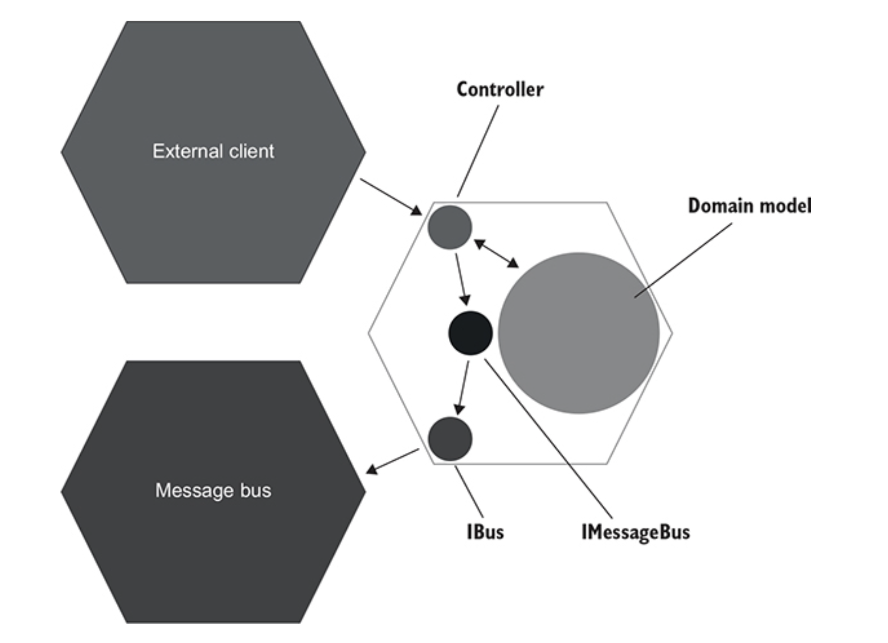

# CHAPTER 09. 목 처리에 대한 모범 사례

**TL;DR**
- 시스템 끝에서 비관리 의존성과의 상호작용을 검증하라
  - **회귀 방지** 향상: 통합테스트로 검증된 코드가 더 많기 때문
  - **리팩터링 내성** 향상: 코드의 구현 세부 사항에서 목을 분리하기 때문
- **Spy**: Mock과 같은 목적으로 수동 작성하는 테스트 대역
  - vs Mock: Mock은 Mock 프레임워크의 도움을 받아 생성
  - 검증 단계에서 코드 재사용으로 테스트 사이즈가 줄고 가독성이 개선됨
- assertion 작성 시, 제품 코드에 의존하지 말고, 테스트에서 별도의 리터럴과 상수 집합을 사용하라
- **목을 처리 모범 사례**
  - 비관리 의존성에만 Mock 적용하기
  - 시스템 끝에 있는 의존성에 대해 상호 작용 검증
  - 통합 테스트에서만 목을 사용, 단위 테스트에서는 금지
  - 항상 Mock 호출 수 확인
  - 직접 제작한 타입으로 Mock 처리

<br/><br/>

---

<br/>

**Mock**
- 테스트 대상 시스템과 의존성간의 상호작용을 모방하고 검사하는데 도움이 되는 테스트 대역 (5장 참고)
- 비관리 의존성 (외부 애플리케이션에서 식별할 수 있음) 에만 적용해야 함 (8장 참고)

<br/>

## 1. 목의 가치 극대화하기

CRM 유스케이스: 이메일 변경 

이제 진단 로깅은 없고, 지원 로깅 (IDomainLoger 인터페이스)만 남은 상태

<br/>

### 1.1 시스템 끝에서 상호 작용 검증하기

- 목을 사용할 땐, 시스템 끝에서 비관리 의존성과의 상호작용을 검증하라

- `MessageBus`, `IBus` 인터페이스: 둘 다 프로젝트 코드베이스에 속함
- `IBus`: 메시지 버스 SDK 라이브러리 위에 있는 래퍼 wrapper
  - 연결 자격 증명과 같이 꼭 필요하지 않은 기술 세부사항을 캡슐화
  - 임의의 텍스트 메시지를 메시지 버스로 보낼 수 있음

<br/>

<br/><br/>

- 육각형 아키텍처 관점에서 본 `IBus` 와 `IMessageBus`의 위치
- `IBus`는 컨트롤러와 메시지 버스 사이의 타입 사슬에서 마지막 고리이며, `IMesageaus`는 중간


```csharp
[Fact]
public void Changing_email_from_corporate_to_non_corporate() {
    var busMock = new Mock<IBus>();
    var messageBus = new MessageBus(busMock.Object);       // 인터페이스 대신 구체 클래스 사용
    var loggerMock = new Mock<IDomainLogger>();
    var sut = new UserController(db, messageBus, loggerMock.Object);

    /* ... */

    busMock.Verify(
        x => x.Send("Type: USER EMAIL CHANGED; Id: {user.UserId}; NewEmail: new@gmail.com"), // // 메시지 버스로 보낸 실제 메시지 검증                    
        Times.Once);
}
```

**이전 버전**
```csharp
messageBusMock.Verify(
    x => x.SendEmailChangedMessage(user.UserId, "new@gmail.com"),
    Times.Once);
```

- 사용자 정의 클래스에 대한 호출 검증 vs 외부 시스템에 전송한 실제 텍스트
  - 외부 시스템은 애플리케이션으로 부터 텍스트 메시지를 수신하고, MessageBus와 같은 클래스를 호출하지 않음

  - 이러한 메시지를 생성하는데 참여하는 클래스는 단지 구현 세부 사항일 뿐
- **시스템 끝에서 상호작용을 확인하면 회귀 방지가 좋아질 뿐만 아니라 리팩터링 내성도 향상됨**

- 비관리 의존성에 대한 호출은 애플리케이션을 떠나기 전에 몇 단계를 거치며, 마지막 단계를 선택하는 것이 좋음
  - 외부 시스템과의 하위 호환성을 보장하는 가장 좋은 방법이며, 하위 호환성은 목을 통해 달성할 수 있는 목표임

<br/>

### 1.2 Mock을 Spy로 대체하기 

- **Spy**: Mock과 같은 목적으로 수동 작성하는 테스트 대역
    - vs Mock: Mock은 Mock 프레임워크의 도움을 받아 생성

Example. IBus 위에서 작동하는 Spy

<table>
<tr><td>IBus</td><td>Spy</td><td>Test</td></tr>
<tr>
<td>

```csharp
public interface IBus {
    void Send(string message);
}
```

</td>
<td>

```csharp
public class BusSpy : IBus {
    private List<string> _sentMessages = new List<string>();

    public void Send(string message) {
        _sentMessages.Add(message);                // 전송된 모든 메시지를 로컬에 저장
    }

    public BusSpy ShouldSendNumberOfMessages(int number) {
        Assert.Equal(number, _sentMessages.Count);
        return this;
    }

    public BusSpy WithEmailChangedMessage(int userId, string newEmail) {
        string message = "Type: USER EMAIL CHANGED; " +
            $"Id: {userId}; " +
            $"NewEmail: {newEmail}";
        Assert.Contains(_sentMessages, x => x == message);    // 전송 메시지 검증

        return this;
    }
}
```

</td>
<td>

```csharp
[Fact]
public void Changing_email_from_corporate_to_non_corporate() {
    var busSpy = new BusSpy();
    var messageBus = new MessageBus(busSpy);
    var loggerMock = new Mock<IDomainLogger>();
    var sut = new UserController(db, messageBus, loggerMock.Object);

    /* ... */

    busSpy.ShouldSendNumberOfMessages(1)
        .WithEmailChangedMessage(user.UserId, "new@gmail.com");
}
```

</td>
</tr>
</table>
<br/><br/>


- `BusSpy` 와 `MessageBus`: 모두 `IBus` Wrapper
  - `BusSpy`: 테스트 코드
  - `MesageBus`: 제품 코드

<br/>

### 1.3  IDomainLogger는 어떤가?

`DomainLogger`는 `ILogger` 위의 래퍼

```csharp
// Bus 상호 작용 확인
busSpy.ShouldSendNumberOfMessages(1).WithEmailChangedMessage(user.UserId, "new@gmail.com");

loggerMock.Verify(
    // IDomainLogger 상호 작용 확인 
    x => x.UserTypeHasChanged(user.UserId, UserType.Employee, UserType.Customer),
    Times.Once);    
```

- 메시지 버스를 사용하면 외부 시스템이 이러한 변경에 어떻게 반응하는 지 알 수 없으므로 메시지 구조를 변경하지 않는 것이 중요
- 중요한 것은 로그가 있다는 사실과 로그에 있는 정보
- 따라서 `IDomainLogger` 만 목으로 처리해도 보호 수준은 충분

<br/>

## 2. 목을 처리의 두 가지 주요 모범 사례

**실펴본 것**
- 비관리 의존성에만 Mock 적용하기
- 시스템 끝에 있는 의존성에 대해 상호 작용 검증

**살펴볼 것**
- 통합 테스트에서만 목을 사용, 단위 테스트에서는 금지
- 항상 Mock 호출 수 확인
- 직접 제작한 타입으로 Mock 처리

<br/>

### 2.1 목은 통합 테스트만을 위한 것

- Mock은 컨트롤러와 같은 비관리 의존성에만 사용해야 하며, 통합 테스트에서 컨트롤러를 테스트할 때만 목을 적용해야 함

<br/>

### 2.2 테스트당 목이 하나일 필요는 없음

- 기존의 오해: 단위 테스트에서의 '단위'는 코드 단위를 나타내며, 이러한 모든 단위는 서로 격리해 테스트해야 한다는 것)
- BUT. **'단위'** 는 코드 단위가 아니라 **동작 단위**를 의미

- 동작 단위를 구현하는 데 필요한 코드의 양은 관계가 없음 👉🏻 단일 클래스부터 아주 작은 메서드일 수 있음

<br/>

### 2.3 호출 횟수 검증하기

- 비관리 의존성과의 통신에 관해서는 다음 두 가지 모두 확인하는 것이 중요

- 예상하는 호출이 있는가? 
- 예상치 못한 호출은 없는가?

<br/>

✔️ 호환성은 양방향이어야 함
- 애플리케이션은 외부 시스템이 **예상하는 메시지** / **예상치 못한 메시지**  생성해서는 안 됨 


<table>
<tr>
<th>메시지를 전송하는지 확인<br/><small>충분하지 않음</small></th>
<td>

```csharp
messageBusMock.Verify(
    x => x.SendEmailChangedMessage(user.UserId, "new@gmail.com"));
```

</td>
</tr>
<tr>
<th>정확히 한 번만 전송되는지 확인</th>
<td>

```csharp
messageBusMock.Verify(
  x => x. SendEmailChangedMessage(user.UserId, "new@gmail.com"), 
  Times.Once);  // 해당 메서드를 한 번만 호출하는지 확인
```

</td>
</tr>
<tr>
<th>다른 호출이 없는지 명시적으로 확인</th>
<td>

```csharp
messageBusMock.Verify(
  x => x.SendEmailChangedMessage(user.UserId, "new@gmail.com"), 
  Times.Once);
messageBusMock.VerifyNoOtherCalls(); // 추가 확인
```

</td></tr>
<tr>
<th>BusSpy</th>
<td>

```csharp
busSpy
    .ShouldSendNumberOfMessages(1)
    .WithEmailChangedMessage(user.UserId, "new@gmail.com");
```

</td></tr>
</table>

스파이에 있는 `ShouldsendNumberofMessages(1)` 이라는 확인은 목에서 `Times.once` 와 `VerifNoOtherCalls()` 검증 모두 포함

<br/>

### 2.4 직접 제작한 타입으로 Mock 처리

- 직접 생성한 타입만을 목으로 처리
- 서드파티 라이브러리 위에 항상 어댑터 _adapter_ 작성 
- → 서드 파트를 그대로 사용할 수 있도록 해당 어댑터를 Mock으로 처리해야 함

**이유** <small>⌜Growing Object-Oriented Software, Guided by Tests⌟ 에 소개</small>

> - 서드파티 코드의 작동 방식에 대해 깊이 이해하지 못하는 경우가 많음
> - 외부 코드가 내장 인터페이스를 가진다고 해도 그 인터페이스를 Mocking 한다고 하면, 그 동작이 정말로 실제와 동일한 동작을 하는지 확실하지 않기 때문에 위험 부담이 있음 
> - 서드파티 코드 세부 사항까지 꼭 알 필요는 없으므로, 애플리케이션은 어댑터를 추상화 해서 라이브러리와의 관계를 정의
> 
> _Steve Freeman & Nat Pryce (Addison-Wesley Professional, 2009)_


👉🏻 실제 어댑터는 코드와 외부 환경 사이의 손상 방지 계층 *anti-corruption leyer*으로 작동

**어댑터의 역할** <small>⌜Domain-Driven Design: Tackling Complexity in the Heart of Software⌟</small>

> - 기본 라이브러리의 복잡성 추상화
> - 라이브러리의 필요한 기능만 노출
> - 프로젝트 도메인 언어를 사용해 수행할 수 있음
> 
> _Eric Evans (Addison-Wesley, 2003)_


- 샘플 CRM 프로젝트의 **IBus** Interface 에 해당
- 기본 메시지 버스의 라이브러리가 IBus 인터페이스를 제공해도, 지정 래퍼를 그 위에 두는 것이 좋음
  - 라이브러리 업그레이드 시, 서드파티 코드 변경을 예측할 수 없음 
  - 추상 계층은 외부 변경에 의한 파급 효과를 하나의 클래스(어댑터 등) 내로 제한할 수 있음

'보유 타입을 목으로 처리하라' 는 프로세스 내부 의존성에 적용되지 않음

<br/><br/>