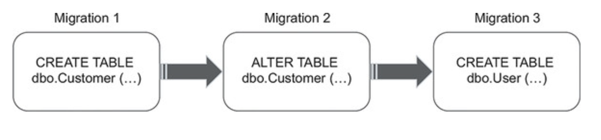
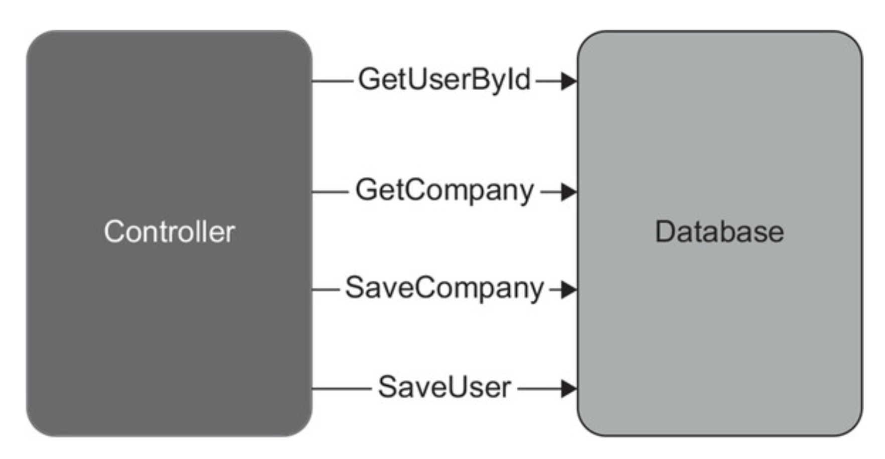
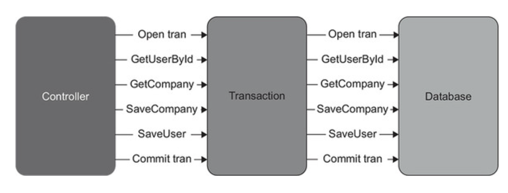
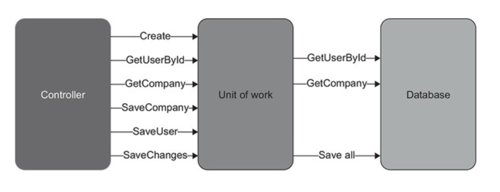
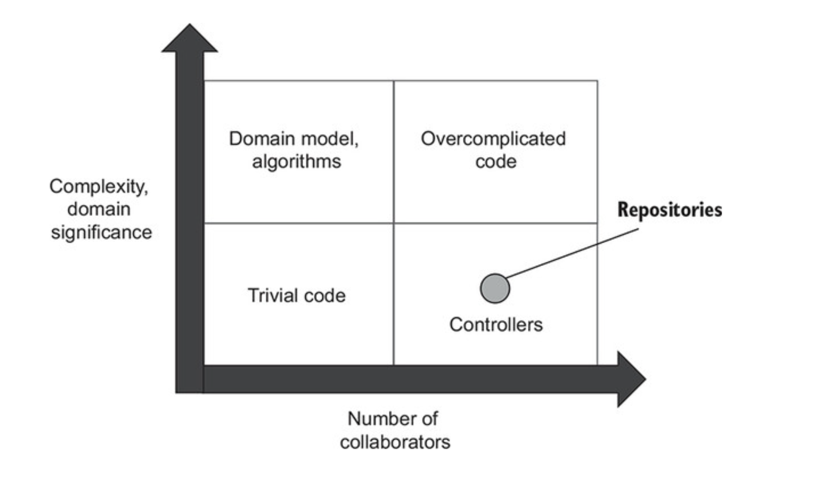

# CHAPTER 10. 데이터베이스 테스트

**TL;DR**
- 데이터베이스 스키마를 소스 코드와 같이 형상 관리 시스템에 저장하라
- **참조 데이터**
  - 애플리케이션이 제대로 작동 하도록 미리 채워져야 하는 데이터
  - 데이터베이스 스키마에 해당
  - vs **일반 데이터**: 애플리케이션에서 해당 데이터를 **수정 가능**하면 **일반 데이터**, **수정 불가**하면 **참조 데이터**
- 개발자마다 데이터베이스 인스턴스를 별도로 두게 하라
  - 더 좋은 방법은 개발자 장비에 인스턴스를 호스팅하는 것 (테스트 실행 속도를 극대화)
- **데이터베이스 배포 방식**
  1. **상태 기반**: 상태를 명시적으로 만들고 비교 도구가 마이그레이션을 암묵적으로 제어할 수 있음
  2. **마이그레이션 기반 방식**: 데이터 베이스를 특정 상태에서 다른 상태로 전환하게끔 명시적 마이그레이션 사용
  - 데이터베이스 상태가 명확하면 병합 충돌을 좀 더 쉽게 처리할 수 있는 데 반해, 명시적 마이그레이션은 데이터 모션 문제를 해결하는 데 도움이 된다.
  - 상태 기반 방식보다는 마이그레이션 기반 방식을 선호: 데이터 모션 처리가 병합 충돌보다 훨씬 중요하기 때문
- 데이터베이스 트랜잭션 매커니즘에 의존하여, 비즈니스 연산 데이터를 원자적으로 업데이트하라
- 작업 단위 패턴 사용을 지향하라
  - 작업 단위는 데이터베이스 트랜잭션에 의존하며, 비즈니스 연산 종료 시점까지 업데이트를 모두 지연시켜서 성능을 향상시킴
- 테스트 구절마다 데이터베이스 트랜잭션이나 작업 단위를 재사용하지 말라
  - 준비, 실행, 검증 구절에 각각 고유의 트랜잭션이나 작업 단위가 있어야 함
- 통합 테스트는 순차적으로 실행: 병렬 실행은 공수가 어렵고, 보통 그럴 가치가 없음
- 테스트 시작 시점에 남은 데이터를 정리하라
  - 빠르고 일관싱 없는 동작을 일으키지 않으며, 정리 단계를 실수로 건너뛰지 않음
  - 별도의 종료 단계도 둘 필요 없음
- 인메모리 데이터베이스는 사용 X
  - 운영 환경과 달라 보호 수준이 떨어짐. 테스트에서도 같이 동 일한 DBMS를 사용하라
- 필수가 아닌 부분을 **비공개 메서드** 또는 **헬퍼 클래스**로 추출해 테스트를 단축하라
- **코드 재사용**
  - **준비 구절**: 테스트 데이터 빌더 대신 오브젝트 마더를 선택
  - **실행 구절**: 데코레이터 메서드 작성
  - **검증 구절**: 플루언트 인터페이스 도입
- **읽기 테스트**: 가장 복잡하거나 중요한 읽기 작업만 테스트하고, 나머지는 무시하라
- **리포지터리 테스트**: 직접 테스트 X. 통합 테스트 스위트로 취급하라


<br/><br/>

---

<br/>

## 1. 데이터베이스 테스트를 위한 전제 조건

## 1.1 데이터베이스를 형상 관리 시스템에 유지

**데이터베이스를 테스트하는 첫 번째 단계**
&#x3A; 데이터베이스 스키마를 일반 코드로 취급하는 것

- 데이터베이스 스키마를 형상 관리 시스템 *source control system*에 저장
- 모델 데이터베이스 사용은 데이터베이스 스키마 유지에 좋지 못함
  - **이유 1. No change history** _변경 내역 부재_
    - 데이터 베이스 스키마를 과거 특정 시점으로 되돌릴 수 없음
    - **특정 시점 복귀는 운영 환경의 버그 재현 시 중요**
  - **이유 2. No single source of truth** _복수 원천 정보_
    - 어떤 코드가 해당 시점에 맞는 source 인지 알기 어려움 (_competing source of truth_)
    - Git + Model Database 의 두개의 소스로 관리 상 부담

<br/>

### 1.2 참조 데이터 또한 '데이터베이스 스키마'

- Database schema
  - Tables
  - Views
  - Indexes
  - Stored procedures
  - 구성 설정에 대한 blueprint 관련 내용
  - **\+ 참조 데이터** _reference data_

<br/>

<pre>
✔️ <b>참조 데이터</b> <i>reference data</i>
: 애플리케이션이 제대로 작동하도록 미리 채워야 하는 데이터

<i>vs. 일반 데이터</i>: 애플리케이션이 데이터 수정 가능. (참조 데이터는 불가능)

- 애플리케이션 필수 사항
- 테이블, 뷰, 그리고 다른 데이터베이스 스키마와 함께 SQL INSERT 문 형태로 형상 관리 시스템에 저장해야 함
- 참조/일반 데이터가 종종 동일한 테이블에 공존할 수도 있는데, 수정 가능/불가능 플래그를 두고 참조 데이터를 변경하지 못하게 해야 함
</pre>

<br/>

### 1.3 모든 개발자를 위한 별도의 데이터베이스 인스턴스

- 개발자 (머신) 별 데이터베이스 인스턴스를 사용해야 함
- 실제 데이터베이스로 테스트하는 것은 어려움, 특히 다른 개발자들과 공유해야 할 때
  - 서로 다른 개발자가 실행한 테스트는 서로 간섭됨
  - 하위 호환성이 없는 변경으로 다른 개발자의 작업을 막을 수 있음

<br/>

### 1.4 상태 기반 데이터베이스 배포와 마이그레이션 기반 데이터베이스 배포

<table>
<tr>
<td></td>
<td width="560px"><b>상태 기반</b><i>The state-based approach</i></td>
<td><b>마이그레이션 기반</b><i>The migration-based approach</i></td>
</tr>
<tr>
<th>Feature</th>
<td>

- 데이터베이스 생성: 형상 관리되는 SQL 스크립트 (모델 데이터베이스 X)
- 배포 중 비교 도구가 스크립트 생성 후 운영 데이터베이스를 모델 데이터베이스와 비교해 최신 상태로 유지
- 비교 도구: 불필요한 테이블 삭제 / 새 테이블 생성 / 컬럼 명 변경 등의 모델 데이터베이스와 동기화

</td>
<td>



- 특정 번전으로 전환하는 명시적인 마이그레이션
- 데이터 모션 _data motion_ 문제 해결
- ex. flyway

</td>
</tr>
<tr>
<th>형상 관리 대상</th>
<td>
데이터베이스를 작성하는 데 사용할 SQL 스크립트 <br/>
<small>개발 내내 유지 보수하는 모델 데이터베이스를 생성</small>
</td>
<td>
마이그레이션 SQL 스크립트 (데이터베이스 상태 X)
</td>
</tr>
<tr>
<th>데이터베이스 상태</th>
<td>✅ 명시적 Explicit</td>
<td>✅ 암묵적 Implicit</td>
</tr>
<tr>
<th>마이그레이션 메커니즘</th>
<td>✅ 암묵적 Implicit</td>
<td>✅ 명시적 Explicit</td>
</tr>
</table>

<pre>
<b>데이터 모션</b> <i>Data motion</i>
: 새로운 데이터베이스 스키마를 준수하도록 기존 데이터의 형태를 변경하는 과정
</pre>

<br/>

## 2. 데이터베이스 트랜잭션 관리

### 2.1 제품 코드에서 데이터 베이스 트랙잭션 관리

샘플 CRM 프로젝트:

- Database 클래스를 사용해 User 와 Company 관련 작업 수행
- Database는 각 메서드 호출에서 별도의 SQL 연결을 생성

```csharp
public class Database {
    private readonly string _connectionString;

    public Database(string connectionString) {
        _connectionString = connectionString;
    }

    public void SaveUser(User user) {
        bool isNewUser = user.UserId == 0;
        // 데이터 베이스 트랜잭션 사용
        using (var connection = new SqlConnection(_connectionString)) {
            /* Insert or update the user depending on isNewUser */
        }
    }

    public void SaveCompany(Company company) {
        // 데이터 베이스 트랜잭션 사용
        using (var connection = new SqlConnection(_connectionString)) {
            /* Update only; there's only one company */
        }
    }
}

```

<br/>

**User controller**는 단일 비즈니스 연산 간에 **총 네개의 데이터 베이스 트랜잭션 생성**

<pre><code lang="csharp">
public string ChangeEmail(int userId, string newEmail) {
     <b>object[] userData = _database.GetUserById(userId);</b>
     User user = UserFactory.Create(userData);

    string error = user.CanChangeEmail();
    if (error != null)
        return error;

    <b>object[] companyData = _database.GetCompany();
    Company company = CompanyFactory.Create(companyData);

    user.ChangeEmail(newEmail, company);

    _database.SaveCompany(company);
    _database.SaveUser(user);</b>
    _eventDispatcher.Dispatch(user.DomainEvents);

    return "OK";
}
</code></pre>

읽기 연산은 여러 트랜잭션을 열어도 되지만, 비즈니스 연산에 데이터 변경이 포함되면
해당 연산에 포함된 모든 업데이트 값이 원자적으로 실행되어야 함

<br/>

**데이터베이스 트랜잭션에서 데이터베이스 연결 분리**

- 잠재적인 모순 방지를 위한 결정해야할 두 가지 유형
  - 업데이트할 데이터
  - 업데이트 유지 또는 롤백 여부

<table>
<tr>
<th>기존의 UserController</th>
<td>명시적 트랜잭션 도입</td>
</tr>
<tr>
<td>

</td>
<td>

</td>
</tr>
</table>

- 트랜잭션은 컨트롤리와 데이터베이스 간의 상호작용 조정
- 네 개의 데이터베이스 호출은 모두 그대로지만, 이제 데이터 수정은 커밋되거나 완전히 롤백

```csharp
public class UserController {
    private readonly Transaction _transaction;
    private readonly UserRepository _userRepository;
    private readonly CompanyRepository _companyRepository;
    private readonly EventDispatcher _eventDispatcher;

    public UserController(
        Transaction transaction,    // 트랜잭션
        MessageBus messageBus,
        IDomainLogger domainLogger) {
        _transaction = transaction;
        _userRepository = new UserRepository(transaction);
        _companyRepository = new CompanyRepository(transaction);
        _eventDispatcher = new EventDispatcher(messageBus, domainLogger);
    }

    public string ChangeEmail(int userId, string newEmail) {
        object[] userData = _userRepository.GetUserById(userId);  // Repository 사용
        User user = UserFactory.Create(userData);

        string error = user.CanChangeEmail();
        if (error != null)
            return error;

        object[] companyData = _companyRepository.GetCompany();
        Company company = CompanyFactory.Create(companyData);

        user.ChangeEmail(newEmail, company);

        _companyRepository.SaveCompany(company);
        _userRepository.SaveUser(user);
        _eventDispatcher.Dispatch(user.DomainEvents);

        _transaction.Commit();    // 성공 시 트랜잭션 커밋
        return "OK";
    }
}

public class UserRepository {
    private readonly Transaction _transaction;

    // 레포지터리에 트랜잭션 주입
    public UserRepository(Transaction transaction) {
        _transaction = transaction;
    }

    /* ... */
}

public class Transaction : IDisposable {
    public void Commit() { /* ... */ }
    public void Dispose() { /* ... */ }
}
```

<br/>

**✔️ Transaction의 두 가지 메서드**

- `Commit()` : 트랜잭션 성공 표시
  - 비즈니스 연산이 성공하고 모든 데이터 수정을 저장할 준비가 된 경우에만 호출
- `Dispose()`: 트랜잭션을 종료함
  - 비즈니스 연산이 끝날 때 항상 호출
  - `Commit()` 이 호출된 경우 `Dispose()` 는 모든 데이터 업데이트를 저장하고, 그렇지 않으면 롤백

<br/>

**작업 단위로 트랜잭션 업그레이드**

- 작업 단위 _unit of work_ 는 비즈니스 연산 종료 시점에 모든 업데이트를 실행하므로 데이터베이스 트랜잭션의 기간을 단축하고 데이터 혼잡을 줄임
- 종종 데이터베이스 호출 수를 줄이는 데 도움



<pre>
<b>비관계형 데이베이스에서의 데이터 모순</b>
- 대부분의 비관계형 데이베이스는 트랜잭션이 없으며, 원자적 업데이트는 단일 노큐먼트 내에서만 보장됨
- 비즈니스 연산이 여러 문서에 영향을 주는 경우 모순이 생기기 쉬움
</pre>

<br/>

### 2.2 통합 테스트에서 데이터베이스 트랜잭션 관리

테스트 구절 간 데이터베이스 트랜잭션이나 작업 단위를 재사용하지 말라
아래 테스트의 문제점: 준비, 실행, 검증에서 모두 동일한 CrmContext 인스턴스를 사용
컨트롤러는 운영 환경에서 다른 환경을 만들기 때문에 문제가 발생

```csharp
[Fact]
public void Changing_email_from_corporate_to_non_corporate() {
    using (var context = new CrmContext(ConnectionString)) {    // Creates a context
        // Arrange
        var userRepository = new UserRepository(context);       // Uses the context in the arrange section
        var companyRepository = new CompanyRepository(context); //
        var user = new User(0, "user@mycorp.com", UserType.Employee, false);
        userRepository.SaveUser(user);
        var company = new Company("mycorp.com", 1);
        companyRepository.SaveCompany(company);
        context.SaveChanges();                                // Uses the context in the arrange section

        var busSpy = new BusSpy();
        var messageBus = new MessageBus(busSpy);
        var loggerMock = new Mock<IDomainLogger>();

        var sut = new UserController(context, messageBus, loggerMock.Object);  // ... in act ...

        // Act
        string result = sut.ChangeEmail(user.UserId, "new@gmail.com");

        // Assert
        Assert.Equal("OK", result);

        User userFromDb = userRepository.GetUserById(user.UserId);  // ... and in assert
        Assert.Equal("new@gmail.com", userFromDb.Email);
        Assert.Equal(UserType.Customer, userFromDb.Type);

        Company companyFromDb = companyRepository.GetCompany();     // ... and in assert
        Assert.Equal(0, companyFromDb.NumberOfEmployees);

        busSpy.ShouldSendNumberOfMessages(1)
            .WithEmailChangedMessage(user.UserId, "new@gmail.com");
        loggerMock.Verify(
            x => x.UserTypeHasChanged(
                user.UserId, UserType.Employee, UserType.Customer),
            Times.Once);
    }
}
```

운영 환경에서는 각 비즈니스 연산에 CrmContext의 전용 인스턴스가 있음
전용 인스턴스는 컨트롤러 메서드 호출 직전에 생성되고 직후 폐기

> ✅️ **통합 테스트에서는 적어도 세 개의 트랜잭션 (준비, 실행, 검증) 또는 작업 단위를 사용하라**

<br/>

## 3. 테스트 데이터 생명 주기

공유 데이터베이스를 사용할 때 문제 방지 법

- 통합 테스트를 **순차적으로 실행**하라
- 테스트 실행 간에 **남은 데이터를 제거**하라

<br/>

### 3.1. 병렬 테스트 실행과 순차적 테스트 실행

- 통합 테스트를 병렬로 실행하는 것은 어려움
- 데이터 고유성 체크 / 데이터베이스 제약 조건 위반은 아닌지 체크 / 다른 테스트가 실행되어 Input 데이터 오염되지 않은지 체크
- 단위 테스트 프레임워크는 별도의 테스트 모음으로 병렬 처리하고, **통합 테스트군은 병렬 처리하지 말아야 함**

**컨테이너를 통한 테스트**

- 모델 데이터 베이스를 도커 이미지로 생성
  - 각 통합 테스트를 위해 해당 이미지에서 새 컨테이너를 인스턴스화할 수 있음
- 실제로는 유지 보수 부담이 큼
- 통합 테스트 실행 시간 최소화를 위한 경우가 아니라면, 컨테이너를 사용하지 않는 것이 좋음
  - 도커 이미지 유지보수
  - 각 테스트마다 컨테이너 인스턴스 존재 확인
  - 통합 테스트를 일괄 처리 (모든 컨테이너 인스턴스를 한번에 만들 수 없기 때문)
  - 다 사용한 컨테이너는 폐기 해야 함

<br/>

### 3.2. 테스트 실행 간 데이터 정리

4가지의 테스트 실행 간 남은 데이터 정리법

1. **각 테스트 전에 데이터베이스 백업 복원**
  - 가장 느림
  - 컨테이너 인스턴스 제거하고 새로 생성하는 시간이 크기 때문에 전체 테스트 스위트 실행 시간이 빠르게 늘어남
2. **테스트 종료 시점에 데이터 정리**
  - 빠르지만 정리 단계를 건너뛰기 쉬움
  - 테스트 실행 도중 중단되면 입력 데이터는 남아있을 수 있음
3. **데이터베이스 트랜잭션에 각 테스트를 래핑하고 커밋하지 않기**
  - 테스트와 SUT에서 변경한 모든 내용이 자동으로 롤백됨
  - 추가 트랙잭션으로 인해 운영 환경과 다른 설정이 생성
4. **테스트 시작 시점에 데이터 정리**
  - 가장 좋은 방법
  - 빠르게 작동하고 일관성이 없는 동작을 일으키지 않고, 정리 단계를 실수로 건너뛰지 않음

> ✅️ **별도의 종료 단계는 필요 없다 준비 구절에 구현하라**

모든 통합 테스트의 기초 클래스를 두고, 기초 클래스에 삭제 스크립트를 작성하라

```csharp
public abstract class IntegrationTests {
    private const string ConnectionString = "...";

    protected IntegrationTests() {
        ClearDatabase();
    }

    private void ClearDatabase() {
        string query =
            "DELETE FROM dbo.[User];" +    // Deletion script
            "DELETE FROM dbo.Company;";    // Deletion script

        using (var connection = new SqlConnection(ConnectionString)) {
            var command = new SqlCommand(query, connection) {
                CommandType = CommandType.Text
            };

            connection.Open();
            command.ExecuteNonQuery();
        }
    }
}
```

> ✅️ **삭제 스크립트는 일반 데이터를 모두 제거해야 하지만 참조 데이터는 제거하지 말아야 함. 나머지 데이터베이스 스키마와 참조 데이터는 마이그레이션으로만 제어돼야 함**

<br/>

### 3.3. 인메모리 데이터베이스 피하기

통합 테스트 분리 방법 두 번째: 인메모리 데이터베이스

**인메모리 데이터베이스**

- 공유 의존성 X
- 컨테이너 접근 방식과 유사한 단위 테스트

**장점**

- 테스트 데이터 제거 필요 없음
- 작업 속도 향상
- 테스트 실행 때마다 인스턴스화 가능

**단점**

- 운영 환경 ≠ 테스트 환경
  - 일반 데이터베이스와 기능적으로 일관성이 없어 사용을 지양해야 함
  - 거짓 양성 또는 거짓 음성 발생하기 쉬움

<br/>

## 4. 테스트 구절에서 코드 재사용하기

통합 테스트는 가능한 짧게 + 서로 결합하거나 가독성에 영향을 주지 않게 생성

<br/>

### 4.1. 준비 구절에서 코드 재사용하기

통합 테스트는 가능한 짧게 + 서로 결합하거나 가독성에 영향을 주지 않게 생성

```
[Fact]
public void Changing_email_from_corporate_to_non_corporate() {
    // Arrange
    User user;
    using (var context = new CrmContext(ConnectionString)) {
        var userRepository = new UserRepository(context);
        var companyRepository = new CompanyRepository(context);
        user = new User(0, "user@mycorp.com", UserType.Employee, false);
        userRepository.SaveUser(user);
        var company = new Company("mycorp.com", 1);
        companyRepository.SaveCompany(company);

        context.SaveChanges();
    }

    var busSpy = new BusSpy();
    var messageBus = new MessageBus(busSpy);
    var loggerMock = new Mock<IDomainLogger>();

    string result;
    using (var context = new CrmContext(ConnectionString)) {
        var sut = new UserController(context, messageBus, loggerMock.Object);

        // Act
        result = sut.ChangeEmail(user.UserId, "new@gmail.com");
    }

    // Assert
    Assert.Equal("OK", result);

    using (var context = new CrmContext(ConnectionString)) {
        var userRepository = new UserRepository(context);
        var companyRepository = new CompanyRepository(context);

        User userFromDb = userRepository.GetUserById(user.UserId);
        Assert.Equal("new@gmail.com", userFromDb.Email);
        Assert.Equal(UserType.Customer, userFromDb.Type);

        Company companyFromDb = companyRepository.GetCompany();
        Assert.Equal(0, companyFromDb.NumberOfEmployees);

        busSpy.ShouldSendNumberOfMessages(1)
            .WithEmailChangedMessage(user.UserId, "new@gmail.com");
        loggerMock.Verify(
            x => x.UserTypeHasChanged(user.UserId, UserType.Employee, UserType.Customer),
            Times.Once);
    }
}
```

<br/>

#### ✔️ Priavte Factory Method

**Adding default values to the factory**

```csharp
private User CreateUser(string email = "user@mycorp.com", UserType type = UserType.Employee, bool isEmailConfirmed = false) {
    /* ... */
}
```

**Using the factory method**

```csharp
User user = CreateUser(email: "user@mycorp.com", type: UserType.Employee);
```

<pre>
<b>📌 Object Mother vs. Test Data Builder</b>

- <b>Object Mother</b>: 테스트 픽스처(테스트 실행 대상)를 만드는 데 도움이 되는 클래스 또는 메서드
- <b>Test Data Builder</b>: 오브젝트 마더와 유사하지만, 일반 메서드 대신 플루언트 인터페이스를 제공

<b>Test Data Builder Example.</b>
<code>
User user = new UserBuilder()
    .WithEmail("user@mycorp.com")
    .WithType(UserType.Employee)
    .Build();
</code>

- Test Data Builder는 가독성을 약간 향상시키지만, 상용구가 많이 필요
</pre>

<br/>

**팩토리 메서드를 배치할 위치**

- 팩토리 메서드는 동일한 클래스에 배치
- 코드 복제가 중요할 경우에만 별도의 헬퍼 클래스로 생성하라

<br/>

### 4.2. 실행 구절에서 코드 재사용

모든 통합 테스트의 실행 구절에서 데이터베이스 트랜잭션이나 작업 단위를 생성함

```csharp
string result;
using (var context = new CrmContext(ConnectionString)) {
    var sut = new UserController(context, messageBus, loggerMock.Object);

    // Act
    result = sut.ChangeEmail(user.UserId, "new@gmail.com");
}
```

호출할 컨트롤러의 대리자를 받아 메서드 실행시키는 함수

Decorator method

```csharp
private string Execute(
    Func<UserController, string> func,
    MessageBus messageBus,
    IDomainLogger logger)
{
    using (var context = new CrmContext(ConnectionString)) {
        var controller = new UserController(context, messageBus, logger);
        return func(controller);
    }
}
```

데코레이터 메서드를 사용하면 짧은 구문으로 실행

```csharp
string result = Execute(x => x.ChangeEmail(user.UserId, "new@gmail.com"), messageBus, loggerMock.Object);
```

<br/>

### 4.3. 검증 구절에서 코드 재사용

- Priavte Factory Method 와 동일하게 헬퍼 메서드 생성
- 기존 도메인 클래스 위에 플루언트 인터페이스를 확장 메서드로 구현

```csharp
User userFromDb = QueryUser(user.UserId);
Assert.Equal("new@gmail.com", userFromDb.Email);
Assert.Equal(UserType.Customer, userFromDb.Type);

Company companyFromDb = QueryCompany();
Assert.Equal(0, companyFromDb.NumberOfEmployees);
```

BusSpy와 같이 데이터 검증을 위한 플루언트 인터페이스 생성도 가능

```csharp
public static class UserExternsions {
    public static User ShouldExist(this User user) {
        Assert.NotNull(user);
        return user;
    }

    public static User WithEmail(this User user, string email) {
        Assert.Equal(email, user.Email);
        return user;
    }
}
```

<br/>

### 4.4. 테스트가 데이터베이스 트랜잭션을 너무 많이 생성하는가?

```csharp
public class UserControllerTests : IntegrationTests {
    [Fact]
    public void Changing_email_from_corporate_to_non_corporate() {
        // Arrange
        User user = CreateUser(email: "user@mycorp.com", type: UserType.Employee);
        CreateCompany("mycorp.com", 1);

        var busSpy = new BusSpy();
        var messageBus = new MessageBus(busSpy);
        var loggerMock = new Mock<IDomainLogger>();

        // Act
        string result = Execute(
            x => x.ChangeEmail(user.UserId, "new@gmail.com"),
            messageBus, loggerMock.Object);

        // Assert
        Assert.Equal("OK", result);

        User userFromDb = QueryUser(user.UserId);
        userFromDb
            .ShouldExist()
            .WithEmail("new@gmail.com")
            .WithType(UserType.Customer);

        Company companyFromDb = QueryCompany();
        companyFromDb
            .ShouldExist()
            .WithNumberOfEmployees(0);

        busSpy.ShouldSendNumberOfMessages(1)
            .WithEmailChangedMessage(user.UserId, "new@gmail.com");
        loggerMock.Verify(
            x => x.UserTypeHasChanged(
                user.UserId, UserType.Employee, UserType.Customer),
            Times.Once);
    }
}
```

트랜잭션이 많아져서 속도가 느려진다고 해도, 가치 있는 테스트에서 여러 측면을 절충할 필요가 있음

<br/>

## 5. 데이터베이스 테스트에 대한 일반적인 질문

### 5.1. 읽기 테스트를 해야 하는가?

- 읽기 작업의 버그에는 보통 해로운 문제가 없음
- 가장 복잡하거나 중요한 읽기 작업만 테스트하고, 나머지는 무시하라

- 읽기에 대한 도메인 모델도 필요하지 않음
  - 도메인 모델링의 주요 목표 중 하나는 캡슐화인데, 데이터 변경이 없으면 캡슐화의 의미가 없음
  - 불필요한 추상 계층을 피해 ORM 보다 일반 SQL을 사용하는 것이 좋음

<br/>

## 5.2. 레포지터리 테스트를 해야 하는가?

- ⭐️ **레포지토리는 직접 테스트하지 말고, 포괄적인 테스트 스위트의 일부로 취급하라**
- 레포지터리는 데이터베이스 위 추상화 제공

단점: 유지비가 높음, 회귀 방지가 떨어짐 > 테스트 스위트에 손실

<br/>

**✔️ 유지비가 높음**

- 레포지터리 테스트와 일반 통합 테스트는 부담 정도가 비슷함
- 레포지터리는 복잡도가 거의 없고 프로세스 외부 의존성과 통신하므로 코드 유형 다이어그램의 '컨트롤러'에 해당



<br/>

**✔️ 낮은 회기 방지**

- ORM 사용 시 데이터 매핑과 데이터베이스 상호 작용 간의 분리 불가능

<br/><br/>
